# Technical Specification

# 0. Agent Action Plan

## 0.1 Intent Clarification

#### Core Feature Objective

Based on the prompt, the Blitzy platform understands that the new feature requirement is to **enhance an existing Node.js HTTP server by migrating it to Express.js framework and adding a new API endpoint**.

**Primary Requirements Identified:**

- **Requirement 1: Express.js Integration** - Transform the existing basic Node.js HTTP server (using the built-in `http` module) into an Express.js-based application to leverage middleware support, routing capabilities, and improved request/response handling

- **Requirement 2: New Endpoint Addition** - Create a new API endpoint that returns the response "Good evening" while maintaining the existing "Hello world" endpoint functionality

- **Requirement 3: Project Structure Enhancement** - Establish proper Node.js project structure with package.json for dependency management and version control

**Implicit Requirements Detected:**

- Maintain backward compatibility with the existing "Hello world" endpoint
- Follow Express.js best practices for server initialization and routing
- Ensure proper error handling and graceful server shutdown
- Configure appropriate HTTP methods (GET) for both endpoints
- Set up proper response headers and status codes
- Create a maintainable and extensible server architecture

**Feature Dependencies and Prerequisites:**

- Node.js runtime environment (v20.19.5 LTS identified as optimal)
- npm package manager for dependency installation
- Express.js framework (latest stable version 4.x)
- Basic HTTP server knowledge for migration path understanding

#### Special Instructions and Constraints

**Architectural Requirements:**

- Use Express.js routing patterns with clear separation of concerns
- Implement server initialization following Express.js conventions
- Configure middleware stack for request processing
- Establish modular route structure for scalability

**Integration Directives:**

- Preserve existing endpoint functionality during migration
- Ensure zero downtime migration path from native HTTP to Express.js
- Maintain response format consistency for existing consumers
- Add new endpoint without disrupting existing route handlers

**User-Provided Examples:**

User Example: "add expressjs into the project and add another endpoint that return the reponse of 'Good evening'"

**Web Search Requirements:**

- Express.js 4.x latest stable version and installation best practices
- Node.js server migration patterns from http module to Express.js
- Express.js routing and middleware configuration standards
- Error handling patterns in Express.js applications

#### Technical Interpretation

These feature requirements translate to the following technical implementation strategy:

**To implement Express.js migration**, we will create a package.json file with Express.js as a dependency, refactor the existing HTTP server code to use Express.js application instance, and configure the Express.js router with proper middleware stack.

**To add the new "Good evening" endpoint**, we will define a new route handler using Express.js routing syntax that responds with the specified message while maintaining RESTful principles.

**To establish proper project structure**, we will create configuration files (package.json), organize source code with clear module boundaries, and set up development and production scripts for server execution.

**Implementation Mapping:**

| Requirement | Technical Action | Target Components |
|------------|------------------|-------------------|
| Express.js Integration | Install express package and refactor server initialization | package.json, server.js (or index.js) |
| Endpoint Migration | Convert existing http.createServer to express() | server.js route handlers |
| New Endpoint | Add express.get('/evening', handler) | server.js or routes/index.js |
| Project Setup | Initialize npm project with dependencies | package.json, node_modules/ |
| Error Handling | Implement Express.js error middleware | server.js middleware stack |

## 0.2 Repository Scope Discovery

#### Comprehensive File Analysis

**Current Repository State:**

The repository currently contains minimal structure with only a README.md file at the root level. The existing Node.js HTTP server code (referenced in the user's description) will be identified and migrated to Express.js framework.

**Files Requiring Modification:**

| File Path | Current State | Modification Type | Purpose |
|-----------|---------------|-------------------|---------|
| server.js or index.js | Assumed existing | MODIFY | Convert from http module to Express.js framework, add new route handler |
| README.md | EXISTS | MODIFY | Update documentation to reflect Express.js usage and new endpoint |

**New Files to Create:**

| File Path | File Type | Purpose |
|-----------|-----------|---------|
| package.json | Configuration | Node.js project manifest with Express.js dependency and npm scripts |
| package-lock.json | Auto-generated | Lock file for consistent dependency versions across environments |
| .gitignore | Configuration | Exclude node_modules and other build artifacts from version control |
| routes/index.js | Source Code | Optional - Modular route definitions if following MVC pattern |
| .env.example | Configuration | Template for environment variables (port configuration) |

**Integration Point Discovery:**

**Server Initialization:**
- Current: `http.createServer()` with inline request handler
- Target: `express()` application instance with middleware stack
- Location: server.js or index.js main file

**Endpoint Handlers:**
- Existing endpoint: GET / returns "Hello world"
- New endpoint: GET /evening returns "Good evening"
- Integration: Express.js router with route-specific handlers

**Port Configuration:**
- Current: Hardcoded port value (typically 3000 or 8080)
- Target: Environment variable with default fallback
- Configuration: process.env.PORT || 3000

**Request Processing Flow:**
- Current: Manual request URL parsing and response handling
- Target: Express.js routing middleware with automatic request parsing
- Components: app.get(), req, res objects with Express.js methods

#### Search Patterns Applied

**Source Code Files:**
- Pattern: `*.js` in root directory
- Pattern: `src/**/*.js` if structured project
- Pattern: `routes/**/*.js` for route modules

**Configuration Files:**
- Pattern: `package.json` - dependency manifest
- Pattern: `*.config.js` - build/runtime configuration
- Pattern: `.env*` - environment variable templates

**Documentation Files:**
- Pattern: `README.md` - project documentation
- Pattern: `docs/**/*.md` - additional documentation
- Pattern: `API.md` - API endpoint documentation (if exists)

**Test Files:**
- Pattern: `**/*test.js` or `**/*.spec.js` - unit tests
- Pattern: `test/**/*.js` - test directory structure

#### Web Search Research Conducted

Research was planned for the following areas:

- Express.js 4.x latest stable version: Required to identify current production-ready version
- Express.js migration best practices: Patterns for converting http module to Express.js
- Node.js project structure conventions: Standard directory layout for Express.js applications
- Express.js middleware configuration: Error handling and request processing patterns

#### New File Requirements

**Core Source Files:**

- `server.js` - Main application entry point with Express.js server initialization
  - Express.js app configuration
  - Middleware stack setup
  - Route handler definitions
  - Server listening on configured port

- `routes/index.js` - Modular route definitions (optional enhancement)
  - Route handler for GET / (Hello world)
  - Route handler for GET /evening (Good evening)
  - Export router for mounting in server.js

**Configuration Files:**

- `package.json` - Node.js project manifest
  - Project metadata (name, version, description)
  - Dependencies: express ^4.19.2
  - Scripts: start, dev (with nodemon if desired)
  - Engine specifications: node >=20.0.0

- `.gitignore` - Version control exclusions
  - node_modules/
  - npm-debug.log
  - .env

- `.env.example` - Environment variable template
  - PORT=3000
  - NODE_ENV=development

**Documentation Files:**

- `README.md` - Enhanced project documentation
  - Installation instructions
  - Running the server commands
  - API endpoint documentation
  - Development setup guide

**Test Files (Future Enhancement):**

- `tests/server.test.js` - Server initialization tests
- `tests/routes.test.js` - Endpoint response validation tests

## 0.3 Dependency Inventory

#### Private and Public Packages

**Key Package Registry:**

| Registry | Package Name | Version | Purpose |
|----------|--------------|---------|---------|
| npm | express | ^4.19.2 | Fast, unopinionated web framework for Node.js providing routing, middleware, and HTTP utilities |
| npm | nodemon | ^3.1.0 | Development utility that automatically restarts server on file changes (devDependency) |

**Version Justification:**

- **express ^4.19.2**: Latest stable version in the Express.js 4.x series, providing production-ready features with long-term support and extensive ecosystem compatibility
- **nodemon ^3.1.0**: Latest major version offering improved performance and stability for development workflow automation

**Runtime Requirements:**

| Component | Version | Source |
|-----------|---------|--------|
| Node.js | 20.19.5 | Installed LTS version, optimal for production stability |
| npm | 10.8.2 | Bundled with Node.js 20.x, supports modern package management features |

#### Dependency Updates

**New Dependencies to Add:**

Since this is a new project initialization with Express.js, the following dependencies will be added to package.json:

**Production Dependencies:**
```json
{
  "dependencies": {
    "express": "^4.19.2"
  }
}
```

**Development Dependencies:**
```json
{
  "devDependencies": {
    "nodemon": "^3.1.0"
  }
}
```

**Import Updates:**

**File: server.js (or index.js)**

Old structure (native Node.js http module):
```javascript
const http = require('http');
```

New structure (Express.js framework):
```javascript
const express = require('express');
const app = express();
```

**Configuration File Updates:**

**File: package.json (NEW)**
```json
{
  "name": "nodejs-express-server",
  "version": "1.0.0",
  "description": "Node.js server with Express.js hosting multiple endpoints",
  "main": "server.js",
  "scripts": {
    "start": "node server.js",
    "dev": "nodemon server.js"
  },
  "keywords": ["express", "nodejs", "server", "api"],
  "engines": {
    "node": ">=20.0.0"
  },
  "dependencies": {
    "express": "^4.19.2"
  },
  "devDependencies": {
    "nodemon": "^3.1.0"
  }
}
```

#### Installation Commands

**Initial Setup:**
```bash
npm install
```

**Development Mode:**
```bash
npm run dev
```

**Production Mode:**
```bash
npm start
```

#### Dependency Security Considerations

- All specified versions are current as of October 2025 and include security patches
- Express.js 4.x series receives regular security updates and has extensive community vetting
- No known critical vulnerabilities in specified versions
- Regular `npm audit` runs recommended to maintain security posture

## 0.4 Integration Analysis

#### Existing Code Touchpoints

**Direct Modifications Required:**

**File: server.js (or index.js)**

The main server file requires comprehensive refactoring from native HTTP module to Express.js framework:

**Section 1: Module Import and Initialization (Lines 1-10)**
- Replace: `const http = require('http');`
- With: `const express = require('express'); const app = express();`
- Purpose: Initialize Express.js application instance

**Section 2: Request Handler Conversion (Lines 10-30)**
- Replace: Manual request URL parsing with if/else logic
- With: Express.js route handlers using `app.get()` methods
- Purpose: Leverage Express.js routing engine for cleaner code organization

**Section 3: Server Creation and Listening (Lines 30-40)**
- Replace: `http.createServer(requestHandler).listen(port)`
- With: `app.listen(port, callback)`
- Purpose: Use Express.js server initialization with built-in HTTP server wrapping

**File: README.md**

Update documentation sections to reflect new Express.js architecture:
- Installation section: Add `npm install` command
- Running section: Update to reference npm scripts
- API endpoints section: Document both / and /evening endpoints
- Development section: Add nodemon usage information

#### Framework Integration Points

**Express.js Middleware Stack:**

The server.js file will configure the following middleware in order:

1. **Built-in Middleware** (Lines ~5-10):
   ```javascript
   app.use(express.json());
   app.use(express.urlencoded({ extended: true }));
   ```
   Purpose: Parse JSON and URL-encoded request bodies

2. **Custom Logging Middleware** (Optional, Lines ~10-15):
   ```javascript
   app.use((req, res, next) => {
     console.log(`${req.method} ${req.url}`);
     next();
   });
   ```
   Purpose: Request logging for debugging

3. **Route Handlers** (Lines ~15-30):
   - GET / endpoint handler
   - GET /evening endpoint handler
   Purpose: Application-specific business logic

4. **Error Handling Middleware** (Lines ~30-40):
   ```javascript
   app.use((err, req, res, next) => {
     res.status(500).json({ error: 'Internal Server Error' });
   });
   ```
   Purpose: Centralized error handling

#### Routing Architecture Integration

**Route Definition Strategy:**

**Option 1: Inline Routes (Recommended for Simple Projects)**
```javascript
app.get('/', (req, res) => { /* handler */ });
app.get('/evening', (req, res) => { /* handler */ });
```
Location: server.js lines ~15-25

**Option 2: Modular Routes (Scalable Pattern)**
```javascript
const routes = require('./routes');
app.use('/', routes);
```
Location: server.js line ~15, with separate routes/index.js file

#### Port Configuration Integration

**Environment Variable Integration:**

Current: Hardcoded port value
```javascript
const port = 3000;
```

New: Environment-based configuration
```javascript
const PORT = process.env.PORT || 3000;
```

Location: server.js lines ~1-5
Purpose: Enable flexible deployment across different environments

#### HTTP Server Integration

**Server Lifecycle Management:**

The Express.js app.listen() method internally creates an HTTP server, so the integration point changes from:

**Before:**
```javascript
const server = http.createServer(handler);
server.listen(port);
```

**After:**
```javascript
const server = app.listen(PORT, () => {
  console.log(`Server running on port ${PORT}`);
});
```

Location: server.js lines ~40-45
Purpose: Simplified server initialization with callback support

#### Error Handling Integration

**Express.js Error Middleware:**

Integration point at the end of middleware stack (server.js lines ~35-42):

- Catch-all error handler for unhandled routes
- 404 handler for non-existent endpoints
- 500 handler for internal server errors
- Consistent JSON error response format

#### Response Header Integration

Express.js automatically sets appropriate headers, but custom headers can be configured:

Location: server.js middleware section
```javascript
app.use((req, res, next) => {
  res.setHeader('X-Powered-By', 'Express');
  next();
});
```

## 0.5 Technical Implementation

#### File-by-File Execution Plan

**Implementation Groups:**

The implementation follows a structured approach with three main groups executed in sequence to ensure proper dependency resolution and integration verification.

#### Group 1 - Project Initialization and Configuration

**File: package.json**
- Action: CREATE
- Location: Repository root
- Purpose: Define project metadata, dependencies, and npm scripts
- Implementation Details:
  - Set project name as "nodejs-express-server"
  - Define Express.js ^4.19.2 as production dependency
  - Add nodemon ^3.1.0 as development dependency
  - Configure "start" script to run server with node
  - Configure "dev" script for nodemon auto-reload
  - Specify Node.js engine requirement >=20.0.0

**File: .gitignore**
- Action: CREATE
- Location: Repository root
- Purpose: Exclude node_modules and environment files from version control
- Implementation Details:
  - Add node_modules/ directory
  - Add npm-debug.log and npm-error.log
  - Add .env file for local environment variables
  - Add coverage/ directory for future test coverage reports

**File: .env.example**
- Action: CREATE
- Location: Repository root
- Purpose: Template for environment variables
- Implementation Details:
  - Define PORT=3000 with comment
  - Define NODE_ENV=development with comment
  - Add instructions for copying to .env

#### Group 2 - Core Application Implementation

**File: server.js**
- Action: MODIFY (or CREATE if doesn't exist)
- Location: Repository root
- Purpose: Main application entry point with Express.js server
- Implementation Details:
  
  **Section 1 - Dependencies and Configuration (Lines 1-10):**
  - Import express module
  - Initialize Express application instance
  - Define PORT from environment variable with fallback
  
  **Section 2 - Middleware Configuration (Lines 11-20):**
  - Add express.json() for JSON body parsing
  - Add express.urlencoded() for form data parsing
  - Optional: Add request logging middleware
  
  **Section 3 - Route Handlers (Lines 21-35):**
  - Define GET / endpoint that returns "Hello world"
  - Define GET /evening endpoint that returns "Good evening"
  - Use res.send() for plain text responses
  - Set appropriate status codes (200)
  
  **Section 4 - Error Handling (Lines 36-45):**
  - Add 404 handler for undefined routes
  - Add global error handler middleware
  - Return consistent JSON error responses
  
  **Section 5 - Server Initialization (Lines 46-50):**
  - Call app.listen() with PORT and callback
  - Log server startup message with port number
  - Export app for testing purposes (optional)

**Example Implementation Structure:**
```javascript
const express = require('express');
const app = express();
const PORT = process.env.PORT || 3000;

app.get('/', (req, res) => {
  res.send('Hello world');
});

app.get('/evening', (req, res) => {
  res.send('Good evening');
});

app.listen(PORT, () => {
  console.log(`Server running on port ${PORT}`);
});
```

#### Group 3 - Documentation and Enhancement

**File: README.md**
- Action: MODIFY
- Location: Repository root
- Purpose: Comprehensive project documentation
- Implementation Details:
  
  **Section 1 - Project Overview:**
  - Update description to mention Express.js
  - Add feature list with both endpoints
  
  **Section 2 - Installation:**
  - Add prerequisites (Node.js 20.x, npm)
  - Add clone and install instructions
  - Include npm install command
  
  **Section 3 - Running the Server:**
  - Document npm start for production
  - Document npm run dev for development
  - Show expected console output
  
  **Section 4 - API Endpoints:**
  - Document GET / with response example
  - Document GET /evening with response example
  - Include curl examples for testing
  
  **Section 5 - Project Structure:**
  - List and explain key files
  - Describe configuration options

**File: routes/index.js (Optional Enhancement)**
- Action: CREATE
- Location: routes/ directory
- Purpose: Modular route organization for scalability
- Implementation Details:
  - Import express.Router()
  - Define route handlers as router.get()
  - Export router module
  - Update server.js to use modular routes

#### Implementation Approach Sequence

**Phase 1: Foundation (Group 1)**
1. Create package.json with all dependencies
2. Create .gitignore to exclude node_modules
3. Create .env.example as configuration template
4. Run npm install to fetch dependencies

**Phase 2: Core Development (Group 2)**
1. Refactor or create server.js with Express.js
2. Configure middleware stack
3. Implement both route handlers (/ and /evening)
4. Add error handling middleware
5. Set up server listening with environment port

**Phase 3: Documentation (Group 3)**
1. Update README.md with comprehensive documentation
2. Add API endpoint examples
3. Document installation and running procedures
4. Optional: Create routes/index.js for modular structure

#### Verification Steps

**After Implementation:**
1. Run `npm install` to verify package.json is valid
2. Run `npm start` to verify server starts successfully
3. Test GET / endpoint returns "Hello world"
4. Test GET /evening endpoint returns "Good evening"
5. Verify PORT environment variable overrides default
6. Check error handling for non-existent routes

#### Implementation Success Criteria

- Server starts without errors
- Both endpoints respond with correct messages
- Environment variable configuration works
- Documentation accurately reflects implementation
- Code follows Express.js best practices
- No hardcoded values that should be configurable

## 0.6 Scope Boundaries

#### Exhaustively In Scope

**Core Application Files:**

- `server.js` - Main application entry point with complete Express.js implementation
  - Express.js server initialization and configuration
  - Middleware stack setup
  - Route handler definitions for both endpoints
  - Error handling middleware
  - Server listening configuration

- `package.json` - Node.js project manifest
  - Project metadata (name, version, description)
  - Dependencies section with express ^4.19.2
  - DevDependencies section with nodemon ^3.1.0
  - Scripts section (start, dev)
  - Engines specification for Node.js

- `package-lock.json` - Automatically generated dependency lock file
  - Exact version resolution for all dependencies
  - Dependency tree for reproducible builds

**Configuration Files:**

- `.gitignore` - Version control exclusions
  - node_modules/ directory
  - npm-debug.log and npm-error.log files
  - .env file for local environment variables
  - OS-specific files (.DS_Store, Thumbs.db)

- `.env.example` - Environment variable template
  - PORT configuration with default value
  - NODE_ENV specification
  - Usage instructions as comments

**Documentation Files:**

- `README.md` - Project documentation (modification)
  - Project overview section update
  - Installation instructions with npm commands
  - Running the server section (start and dev modes)
  - API endpoints documentation with examples
  - Project structure explanation
  - Development setup guide

**Optional Enhancement Files (If Implementing Modular Pattern):**

- `routes/index.js` - Modular route definitions
  - Express.js Router instance
  - GET / route handler
  - GET /evening route handler
  - Router export for server.js mounting

**Endpoint Specifications:**

- **GET /** - Root endpoint
  - Response: "Hello world" (plain text)
  - Status Code: 200
  - No request parameters required

- **GET /evening** - Evening greeting endpoint
  - Response: "Good evening" (plain text)
  - Status Code: 200
  - No request parameters required

**Integration Points:**

- Express.js framework integration at server.js
- Environment variable integration for PORT configuration
- npm package management integration
- Node.js runtime integration (v20.19.5)

**Build and Run Commands:**

- `npm install` - Install all project dependencies
- `npm start` - Run server in production mode
- `npm run dev` - Run server in development mode with auto-reload

#### Explicitly Out of Scope

**Features Not Included:**

- Database integration or ORM configuration
- Authentication and authorization mechanisms
- CORS (Cross-Origin Resource Sharing) configuration
- Request rate limiting or throttling
- API versioning strategy
- Logging frameworks (Winston, Morgan, etc.)
- Environment-specific configuration files beyond .env.example

**Advanced Express.js Features:**

- Template engine integration (EJS, Pug, Handlebars)
- Static file serving configuration
- Session management
- Cookie parsing
- Compression middleware
- Security middleware (Helmet.js)
- Request validation libraries (Joi, express-validator)

**Testing Infrastructure:**

- Unit test files and test frameworks (Jest, Mocha)
- Integration test suites
- API endpoint testing tools configuration
- Code coverage reporting
- Continuous integration pipeline

**Deployment and Operations:**

- Docker containerization (Dockerfile, docker-compose.yml)
- Kubernetes deployment manifests
- CI/CD pipeline configuration
- Cloud platform deployment scripts
- Load balancer configuration
- Reverse proxy setup (Nginx, Apache)

**Performance Optimizations:**

- Caching strategies (Redis, in-memory)
- Response compression
- Connection pooling
- Request timeout configuration
- Cluster mode for multi-core utilization

**Monitoring and Observability:**

- Application performance monitoring (APM) tools
- Log aggregation services
- Health check endpoints beyond basic functionality
- Metrics collection and reporting
- Error tracking services (Sentry, Rollbar)

**Development Tools:**

- Linting configuration (ESLint)
- Code formatting tools (Prettier)
- Pre-commit hooks (Husky)
- TypeScript configuration
- Editor-specific configuration files

**Documentation Beyond README:**

- API documentation generators (Swagger/OpenAPI)
- Architecture decision records (ADRs)
- Code documentation with JSDoc
- Deployment runbooks
- Contributing guidelines

**Security Features:**

- HTTPS/TLS configuration
- Security headers middleware
- Input sanitization beyond basic parsing
- SQL injection prevention (no database in scope)
- XSS protection
- CSRF token implementation

#### Scope Justification

**What Makes In-Scope Items Essential:**

The in-scope items directly address the user's requirement to "add expressjs into the project and add another endpoint that return the response of 'Good evening'". Each file and configuration serves a specific purpose in achieving this goal while maintaining professional development standards.

**Why Out-of-Scope Items Are Excluded:**

Out-of-scope items represent advanced features, production hardening, and enterprise-grade capabilities that are not required for the basic feature addition. These can be incrementally added in future iterations based on evolving requirements without blocking the current implementation.

## 0.7 Special Instructions

#### Feature-Specific Requirements

**Express.js Integration Pattern:**

The implementation must follow the standard Express.js application pattern with clear separation between configuration, middleware, routing, and server initialization. This ensures maintainability and allows for future extensibility.

**Endpoint Response Format:**

Both endpoints must return plain text responses as specified:
- Root endpoint: Exactly "Hello world" (no additional formatting)
- Evening endpoint: Exactly "Good evening" (no additional formatting)

The use of `res.send()` is preferred for plain text responses, which automatically sets the Content-Type header to text/html for strings.

**Backward Compatibility:**

The existing "Hello world" endpoint must maintain its functionality exactly as described. The migration to Express.js should not alter the response format, content, or behavior of this endpoint in any way.

**Port Configuration Flexibility:**

The server must support dynamic port configuration through the PORT environment variable, with a sensible default (3000) when not specified. This allows deployment flexibility across different environments (development, staging, production).

**Development Workflow:**

Include both production (`npm start`) and development (`npm run dev`) commands to support different workflows:
- Production mode uses direct Node.js execution for stability
- Development mode uses nodemon for automatic reload on file changes

**Project Structure Simplicity:**

Given the tutorial nature of this project, maintain a flat, simple structure with minimal files at the repository root. Avoid over-engineering with deeply nested directories or complex architectural patterns unless they provide clear value.

**Code Clarity Over Cleverness:**

The implementation should prioritize readability and educational value over optimization or advanced patterns. Each section of code should be self-explanatory for developers learning Express.js.

**Environment Variable Handling:**

Provide a `.env.example` file as a template, but do not commit actual `.env` files to version control. Document the purpose of each environment variable clearly.

#### User-Provided Context

**Original Request:**
"add feature to a existing product this is a tutorial of node js server hosting one endpoint that returns the response 'Hello world'. Could you add expressjs into the project and add another endpoint that return the reponse of 'Good evening'?"

**Key Observations:**
- Educational/tutorial context suggests simple, clear implementation
- Two distinct endpoints required: existing (/) and new (/evening)
- Framework migration from native Node.js http to Express.js
- Response strings must match exactly as specified

#### Setup Instructions Provided

**User Setup Instructions:** "wxwxwdxwdc"
**Environment Variables:** ["xwxwx"]
**Secrets:** ["xwwx"]

**Note:** The provided setup instructions appear to be placeholder values and do not represent actual configuration requirements for this Express.js implementation. The standard Node.js and npm setup is sufficient for this project.

#### Architectural Conventions

**Express.js Best Practices to Follow:**

- Use `const app = express()` for application initialization
- Configure middleware in logical order (parsing before routing)
- Place error handling middleware last in the stack
- Use environment variables for configuration values
- Export the app instance for potential testing

**HTTP Method Selection:**

Use GET method for both endpoints as they are read-only operations that return fixed responses:
- GET / for the hello endpoint
- GET /evening for the evening greeting

**Response Status Codes:**

- 200 OK for successful endpoint responses
- 404 Not Found for undefined routes
- 500 Internal Server Error for unexpected errors

#### Error Handling Requirements

**Graceful Error Responses:**

Implement catch-all error handling to ensure the server never crashes unexpectedly:
- Undefined route handler for 404 responses
- Global error middleware for uncaught exceptions
- Consistent JSON error format for better debugging

**Server Lifecycle Management:**

Ensure clean server startup with confirmation logging and proper binding to the configured port. Handle port conflicts gracefully with clear error messages.

#### Documentation Standards

**README.md Requirements:**

The README must include practical, runnable examples:
- Complete installation steps from git clone to running server
- Actual curl commands for testing each endpoint
- Expected output for each operation
- Troubleshooting section for common issues

**Code Comments:**

Use minimal inline comments, relying on clear variable names and function structure. Add comments only where the intent might not be immediately obvious to someone learning Express.js.

#### Security Considerations

**Basic Security Awareness:**

While full security hardening is out of scope, implement these basic practices:
- Do not commit node_modules or .env files
- Use environment variables for any configuration
- Avoid exposing stack traces in production error responses

#### Performance Considerations

**Startup Performance:**

The server should start quickly (under 1 second) given the minimal dependencies and simple configuration. No optimization beyond standard Express.js patterns is required.

**Response Time:**

Both endpoints return static strings, so response time should be minimal (under 10ms). No caching or optimization needed for this use case.

#### Future Enhancement Readiness

While keeping the current implementation simple, the structure should allow for easy addition of:
- Additional routes without refactoring core server logic
- Middleware without disturbing existing functionality
- Configuration options through environment variables
- Modular route organization if the project grows beyond tutorial scope


# 1. Introduction

## 1.1 Executive Summary

### 1.1.1 Project Overview

This Technical Specification document describes a Node.js tutorial project designed to demonstrate fundamental HTTP server implementation concepts. The project represents a minimal, focused educational resource that provides developers with a working example of creating and configuring a basic web server with a single HTTP endpoint. This specification defines the requirements for building a greenfield Node.js application from the ground up, starting from an empty repository structure.

The project emphasizes simplicity and clarity, making it an ideal learning resource for developers who are new to Node.js server-side development or those seeking a clean reference implementation of basic HTTP request-response patterns.

### 1.1.2 Core Business Problem

This tutorial project addresses the learning gap faced by developers entering the Node.js ecosystem who need practical, working examples of fundamental server concepts. Rather than overwhelming beginners with complex architectural patterns, multi-layered applications, or extensive feature sets, this project solves the problem of "where to start" by providing:

- A minimal, understandable codebase that demonstrates core concepts without unnecessary complexity
- A working reference implementation that developers can run, modify, and experiment with
- A foundation that can serve as a starting point for more sophisticated applications
- Clear demonstration of the request-response cycle in Node.js HTTP server development

The educational value lies in providing a complete, functional example that developers can study, execute, and build upon as they advance their Node.js skills.

### 1.1.3 Key Stakeholders and Users

The primary stakeholders and users for this tutorial project include:

| Stakeholder Group | Role | Primary Interest |
|------------------|------|------------------|
| Beginner Developers | Primary Users | Learning Node.js HTTP server fundamentals through hands-on example |
| Intermediate Developers | Secondary Users | Quick reference for basic server setup and endpoint configuration |
| Technical Educators | Instructional Users | Teaching material for Node.js courses and workshops |
| Development Teams | Reference Users | Starter template for prototyping and proof-of-concept projects |

The target skill level ranges from developers with basic JavaScript knowledge who are new to Node.js server development to intermediate developers seeking a clean reference implementation for basic HTTP server patterns.

### 1.1.4 Expected Business Impact and Value Proposition

The value proposition of this tutorial project centers on accelerating developer learning and reducing the time-to-competency for Node.js server development:

**Educational Value:**
- Provides immediate, hands-on experience with Node.js HTTP server creation
- Demonstrates best practices for minimal project structure and setup
- Offers a working baseline for understanding request routing and response handling

**Practical Value:**
- Reduces setup friction for developers exploring Node.js capabilities
- Serves as a validated starting point for rapid prototyping
- Eliminates the "blank page" problem when beginning new Node.js projects

**Strategic Value:**
- Lowers barriers to Node.js adoption within development teams
- Provides reusable reference code that can be adapted for various use cases
- Establishes a foundation for progressive complexity as developers advance their skills

## 1.2 System Overview

### 1.2.1 Project Context

#### 1.2.1.1 Business Context and Market Positioning

This project occupies the educational and tutorial space within the Node.js development ecosystem. It is positioned as a fundamental learning resource rather than a production application, specifically targeting the introductory segment of Node.js education. The tutorial nature of this project means it prioritizes clarity, simplicity, and educational value over feature richness or production-grade capabilities.

As a greenfield development project, the application will be built from an empty repository structure with no existing codebase to migrate or refactor. This clean-slate approach allows for optimal demonstration of Node.js fundamentals without the complications of legacy code or technical debt.

#### 1.2.1.2 Current System Limitations

This project does not replace or upgrade any existing system. It represents a new development effort designed specifically for tutorial purposes. There are no current system limitations to address, as no predecessor system exists.

#### 1.2.1.3 Integration with Enterprise Landscape

This tutorial project operates as a standalone application with no integration requirements into existing enterprise systems. It is intentionally isolated to focus solely on demonstrating basic HTTP server functionality. The application does not connect to external services, databases, authentication systems, or other enterprise infrastructure components.

### 1.2.2 High-Level Description

#### 1.2.2.1 Primary System Capabilities

The system provides a single, focused capability: responding to HTTP GET requests on the `/hello` endpoint with a plain text "Hello world" message. This minimal functionality serves as a complete demonstration of the HTTP request-response cycle within a Node.js environment.

The following diagram illustrates the system's high-level architecture and request flow:


```mermaid
graph LR
    A[HTTP Client] -->|GET /hello| B[Node.js HTTP Server]
    B -->|Route Request| C[Endpoint Handler]
    C -->|Generate Response| D[Response: 'Hello world']
    D -->|HTTP 200 OK| A
    
    style B fill:#4CAF50,stroke:#333,stroke-width:2px,color:#fff
    style C fill:#2196F3,stroke:#333,stroke-width:2px,color:#fff
    style D fill:#FF9800,stroke:#333,stroke-width:2px,color:#fff
```

#### 1.2.2.2 Major System Components

The application architecture consists of three core components working in concert to deliver the tutorial functionality:

**HTTP Server Component:**
- Initializes and manages the Node.js HTTP server instance
- Listens for incoming HTTP connections on a configured port
- Handles server lifecycle management (startup, shutdown)
- Manages connection handling and basic error scenarios

**Route Handler Component:**
- Processes incoming requests and matches them to the `/hello` endpoint
- Implements request routing logic to direct traffic to appropriate handlers
- Manages request validation and method verification (GET requests)

**Response Generator Component:**
- Constructs the "Hello world" response message
- Sets appropriate HTTP response headers (content-type, status codes)
- Sends the formatted response back to the requesting client
- Handles response completion and connection cleanup

#### 1.2.2.3 Core Technical Approach

The technical implementation follows standard Node.js patterns for HTTP server development. The approach prioritizes simplicity and readability, making the codebase accessible to developers learning Node.js concepts. The implementation will utilize either:

1. **Built-in Node.js HTTP Module Approach:** Leveraging Node.js core `http` module for maximum simplicity with zero external dependencies, or
2. **Express.js Framework Approach:** Utilizing the widely-adopted Express.js framework to demonstrate industry-standard routing patterns with minimal overhead

The application will consist of a minimal file structure containing:
- Project manifest (`package.json`) defining Node.js dependencies and startup scripts
- Main application file (`server.js` or `index.js`) implementing the HTTP server and endpoint logic
- Configuration for dependency management and version control
- Documentation providing setup and execution instructions

The technical approach emphasizes immediate execution capability with minimal setup requirements, allowing developers to clone the repository, install dependencies, and have a running server within minutes.

### 1.2.3 Success Criteria

#### 1.2.3.1 Measurable Objectives

The project will be considered successful when it achieves the following measurable objectives:

| Objective | Measurement Criteria | Validation Method |
|-----------|---------------------|-------------------|
| Functional Endpoint | `/hello` endpoint returns "Hello world" response | HTTP GET request returns expected text with 200 status code |
| Server Reliability | Server starts without errors | Successful server initialization and port binding |
| Setup Simplicity | Minimal steps from clone to running server | Installation and startup complete in under 3 commands |
| Code Clarity | Tutorial-appropriate code complexity | Single main file with clear, commented implementation |

#### 1.2.3.2 Critical Success Factors

The following factors are critical to the project's success as an educational resource:

**Technical Success Factors:**
- Server successfully initializes and binds to the specified port without configuration complexity
- The `/hello` endpoint consistently returns the correct "Hello world" response for all valid GET requests
- Application runs on standard Node.js installations without platform-specific dependencies
- Error messages (if any) are clear and actionable for debugging purposes

**Educational Success Factors:**
- Code structure is immediately understandable to developers with basic JavaScript knowledge
- Implementation demonstrates best practices for minimal Node.js projects
- Documentation clearly explains setup, execution, and expected behavior
- Project can be completed and understood in a single learning session

**Operational Success Factors:**
- Dependencies (if any) install reliably across different development environments
- Application starts consistently without manual configuration
- Project can be easily modified and extended for learning experiments

#### 1.2.3.3 Key Performance Indicators (KPIs)

Given the tutorial nature of this project, performance indicators focus on educational effectiveness and functional correctness rather than production metrics:

| KPI Category | Indicator | Target |
|--------------|-----------|--------|
| Functional Correctness | Endpoint response accuracy | 100% correct "Hello world" responses |
| Setup Efficiency | Time from clone to running server | < 5 minutes for first-time users |
| Code Simplicity | Lines of code in main application file | < 50 lines (excluding comments) |
| Startup Reliability | Successful server initialization rate | 100% on standard Node.js environments |

## 1.3 Scope

### 1.3.1 In-Scope Elements

#### 1.3.1.1 Core Features and Functionalities

The following features and functionalities are explicitly included within the project scope:

**Must-Have Capabilities:**

| Feature | Description | Implementation Requirement |
|---------|-------------|---------------------------|
| HTTP Server | Functional Node.js HTTP server instance | Server initialization and port binding |
| `/hello` Endpoint | Single GET endpoint returning plain text | Route handler responding with "Hello world" |
| Basic Error Handling | Server startup error management | Console logging of server status and errors |
| Port Configuration | Configurable or default port specification | Port number definition in application code |

**Primary User Workflows:**

The application supports a single, straightforward user workflow:

1. **Server Startup Workflow:**
   - Developer executes the start command (e.g., `npm start` or `node server.js`)
   - Server initializes and binds to the configured port
   - Confirmation message displays indicating successful startup

2. **Endpoint Access Workflow:**
   - HTTP client (browser, curl, Postman, etc.) sends GET request to `/hello`
   - Server routes request to endpoint handler
   - Handler generates and returns "Hello world" response
   - Client receives HTTP 200 status with plain text response body

**Essential Integrations:**

The project includes minimal integration requirements necessary for basic functionality:
- Standard HTTP protocol implementation for client-server communication
- Node.js runtime integration for JavaScript execution
- Package manager integration (npm) for dependency management

**Key Technical Requirements:**

- **Runtime Environment:** Node.js runtime (version compatibility to be specified)
- **Package Management:** npm package manager for project setup
- **HTTP Protocol:** Standard HTTP/1.1 protocol implementation
- **Response Format:** Plain text response with appropriate content-type headers
- **Project Structure:** Minimal file organization suitable for tutorial purposes

#### 1.3.1.2 Implementation Boundaries

**System Boundaries:**

The system boundary encompasses a single, self-contained Node.js application process. The application accepts HTTP requests from external clients and returns responses, with no outbound connections to other systems or services. The boundary includes:
- HTTP server process and its runtime memory
- Network socket listening on configured port
- Request processing and response generation logic
- Application code and its direct dependencies

**User Groups Covered:**

- Developers executing the application locally on their development machines
- HTTP clients (browsers, command-line tools, API testing tools) making requests to the endpoint

**Geographic and Market Coverage:**

This tutorial project has no geographic limitations or market-specific requirements. It is a universal educational resource applicable to developers worldwide, with no localization, internationalization, or region-specific functionality.

**Data Domains Included:**

The project handles a minimal data domain consisting solely of:
- Incoming HTTP request metadata (method, path, headers)
- Outgoing HTTP response data (status code, headers, plain text body: "Hello world")
- Server configuration data (port number)

No persistent data storage, user data, business data, or sensitive information is processed or retained by the application.

### 1.3.2 Out-of-Scope Elements

#### 1.3.2.1 Explicitly Excluded Features and Capabilities

The following features and capabilities are explicitly excluded from this tutorial project to maintain its focused educational purpose:

**Excluded Endpoint Functionality:**
- Multiple endpoints or routes beyond `/hello`
- Support for HTTP methods other than GET (POST, PUT, DELETE, PATCH, OPTIONS)
- Request parameter processing (query parameters, path parameters, request body)
- Response format variations (JSON, XML, HTML)
- Content negotiation based on Accept headers

**Excluded Data Management:**
- Database integration (SQL or NoSQL)
- Persistent data storage of any kind
- File system read/write operations
- In-memory data caching
- Session state management
- Cookie handling

**Excluded Security Features:**
- User authentication mechanisms
- Authorization and access control
- API key validation
- CORS (Cross-Origin Resource Sharing) configuration
- HTTPS/TLS encryption
- Input validation and sanitization
- Rate limiting or throttling
- Security headers (CSP, HSTS, etc.)

**Excluded Operational Capabilities:**
- Environment-based configuration (development, staging, production)
- Structured logging frameworks or log aggregation
- Application monitoring or observability tools
- Health check endpoints
- Metrics collection and reporting
- Graceful shutdown handling
- Process management (PM2, clustering)
- Container deployment configurations (Docker, Kubernetes)

**Excluded Development Infrastructure:**
- Automated testing frameworks (unit tests, integration tests)
- Code quality tools (linting, formatting)
- Continuous integration/deployment pipelines
- API documentation generation (Swagger/OpenAPI)
- Development vs. production build processes

**Excluded Advanced HTTP Features:**
- WebSocket support
- Server-Sent Events (SSE)
- HTTP/2 or HTTP/3 protocol features
- Request/response compression
- Multipart form data handling
- File upload/download capabilities
- Streaming responses
- Caching headers and strategies

#### 1.3.2.2 Future Phase Considerations

Should this tutorial project be extended in future phases for advanced learning modules, the following enhancements could be considered:

**Potential Phase 2 Enhancements:**
- Additional endpoints demonstrating different HTTP methods (POST, PUT, DELETE)
- Request parameter handling and validation examples
- JSON request and response formatting
- Basic middleware implementation examples

**Potential Phase 3 Enhancements:**
- Simple in-memory data storage to demonstrate state management
- Basic error handling middleware
- Environment configuration examples
- Introduction to testing frameworks

**Potential Phase 4 Enhancements:**
- Database integration tutorial modules
- Authentication and authorization examples
- API documentation generation
- Production deployment guidance

These future considerations are noted for context but are not part of the current project scope.

#### 1.3.2.3 Integration Points Not Covered

The following integration categories are explicitly excluded from the project scope:

- **External APIs:** No integration with third-party APIs or web services
- **Database Systems:** No connections to relational or NoSQL databases
- **Message Queues:** No integration with messaging systems (RabbitMQ, Kafka, etc.)
- **Cloud Services:** No integration with cloud provider services (AWS, Azure, GCP)
- **Authentication Providers:** No integration with OAuth providers or identity services
- **Monitoring Platforms:** No integration with APM or logging platforms
- **Email Services:** No email sending capabilities
- **Payment Gateways:** No payment processing integrations
- **Content Delivery Networks:** No CDN integration for static assets

#### 1.3.2.4 Unsupported Use Cases

The following use cases are explicitly unsupported and outside the intended purpose of this tutorial project:

- **Production Deployment:** This project is not designed, configured, or secured for production use
- **High-Volume Traffic:** No optimization for handling significant concurrent requests
- **Multi-User Applications:** No support for user management or multi-tenancy
- **Data-Driven Applications:** No capabilities for CRUD operations on persistent data
- **Real-Time Communication:** No WebSocket or real-time messaging support
- **Microservices Architecture:** No service discovery, inter-service communication, or distributed system patterns
- **Enterprise Integration:** No support for enterprise service buses or legacy system integration
- **Mobile Backend:** No mobile-specific API features or push notification support
- **Analytics and Reporting:** No data analysis, reporting, or business intelligence features

### 1.3.3 Scope Summary

This tutorial project is intentionally scoped to provide a minimal, focused demonstration of Node.js HTTP server fundamentals. The scope limitation to a single endpoint returning a static response is a deliberate design decision that serves the educational objective of teaching core concepts without introducing unnecessary complexity. This focused approach allows developers to understand the essential components of Node.js server development before progressing to more sophisticated applications.

---

#### References

#### Files Examined
- `README.md` - Auto-generated repository readme file confirming empty repository state and project context

#### Folders Explored
- `/` (repository root) - Confirmed empty repository structure with no existing application code

#### Context Sources
- User Requirements Specification - Node.js tutorial project with single `/hello` endpoint returning "Hello world"
- Repository Analysis Report - Comprehensive exploration confirming greenfield development status

# 2. Product Requirements

This section provides a comprehensive catalog of product features and their associated functional requirements for the Node.js tutorial project. The requirements are structured to be discrete, testable, and directly traceable to the project's educational objectives of demonstrating fundamental HTTP server concepts.

## 2.1 Feature Catalog

This catalog documents all features included in the tutorial project scope. Each feature is assigned a unique identifier, priority level, and status tracking to ensure comprehensive requirement coverage and implementation accountability.

### 2.1.1 Feature F-001: HTTP Server Infrastructure

#### 2.1.1.1 Feature Metadata

| Attribute | Value |
|-----------|-------|
| **Feature ID** | F-001 |
| **Feature Name** | HTTP Server Infrastructure |
| **Category** | Core Infrastructure |
| **Priority** | Critical |
| **Status** | Proposed |

#### 2.1.1.2 Description and Context

**Overview:**
The HTTP Server Infrastructure feature provides the foundational Node.js HTTP server instance that initializes, binds to a configured network port, and manages incoming HTTP connections. This feature represents the core runtime environment that enables all HTTP communication within the tutorial application.

**Business Value:**
As the foundational component of the tutorial, this feature delivers critical educational value by demonstrating:
- Node.js server lifecycle management from initialization through shutdown
- Network socket binding and port configuration
- Connection handling fundamentals
- Basic error detection and logging patterns

**User Benefits:**
Developers gain hands-on experience with:
- Creating a functional HTTP server using Node.js core capabilities
- Understanding server initialization sequences and startup procedures
- Observing connection management behaviors in a real runtime environment
- Debugging server startup issues through console logging

**Technical Context:**
The HTTP Server Infrastructure can be implemented using either the built-in Node.js `http` module for maximum simplicity with zero external dependencies, or the Express.js framework to demonstrate industry-standard patterns. The implementation manages the complete server lifecycle including initialization, active listening, connection acceptance, and graceful shutdown capabilities.

#### 2.1.1.3 Dependencies and Requirements

**Prerequisite Features:**
- None (foundational feature)

**System Dependencies:**
- Node.js runtime environment (LTS version recommended)
- npm package manager for dependency resolution

**External Dependencies:**
- Node.js built-in `http` module (Option 1), or
- Express.js framework via npm (Option 2)

**Integration Requirements:**
- Standard HTTP/1.1 protocol implementation
- Operating system network socket interface
- Console output for status and error logging

### 2.1.2 Feature F-002: /hello Endpoint

#### 2.1.2.1 Feature Metadata

| Attribute | Value |
|-----------|-------|
| **Feature ID** | F-002 |
| **Feature Name** | Hello World Endpoint |
| **Category** | API Endpoint |
| **Priority** | Critical |
| **Status** | Proposed |

#### 2.1.2.2 Description and Context

**Overview:**
The `/hello` endpoint is a single HTTP GET route that responds with the plain text message "Hello world". This endpoint demonstrates the complete HTTP request-response cycle within a Node.js server environment, serving as the primary functional deliverable of the tutorial project.

**Business Value:**
This feature provides the concrete demonstration of HTTP endpoint implementation, which is the central learning objective of the tutorial. It showcases:
- Request routing and path matching logic
- HTTP method validation (GET only)
- Response generation and formatting
- Header configuration for plain text responses
- Status code assignment (HTTP 200 OK)

**User Benefits:**
Learners experience:
- Complete request-to-response flow tracing
- Practical implementation of route handlers
- Understanding of HTTP headers and content types
- Validation of working server functionality through browser or API testing tools

**Technical Context:**
The endpoint consists of two sub-components: a Route Handler that processes incoming requests and matches them to the `/hello` path with GET method validation, and a Response Generator that constructs the plain text response with appropriate HTTP headers and status codes. The implementation demonstrates minimal viable endpoint functionality without parameter processing or alternative response formats.

#### 2.1.2.3 Dependencies and Requirements

**Prerequisite Features:**
- F-001: HTTP Server Infrastructure (server must be running to handle requests)
- F-004: Port Configuration (server must bind to port before accepting requests)

**System Dependencies:**
- HTTP protocol implementation for request parsing
- Response serialization capabilities

**External Dependencies:**
- None beyond those inherited from F-001

**Integration Requirements:**
- Client-server HTTP communication protocol
- UTF-8 text encoding for response body
- Standard HTTP response header formatting

### 2.1.3 Feature F-003: Project Configuration and Setup

#### 2.1.3.1 Feature Metadata

| Attribute | Value |
|-----------|-------|
| **Feature ID** | F-003 |
| **Feature Name** | Project Configuration and Setup |
| **Category** | Development Infrastructure |
| **Priority** | Critical |
| **Status** | Proposed |

#### 2.1.3.2 Description and Context

**Overview:**
This feature encompasses the complete project structure including the package.json manifest, main application file, dependency configuration, and setup documentation. It provides the infrastructure necessary for developers to clone, install, and execute the tutorial project with minimal friction.

**Business Value:**
Proper project configuration directly impacts the tutorial's effectiveness by:
- Reducing time-to-first-run for developers
- Demonstrating standard Node.js project organization patterns
- Establishing clear dependency management practices
- Providing reproducible setup procedures across different development environments

**User Benefits:**
Developers receive:
- Clear, executable setup instructions
- Automated dependency resolution through npm
- Standardized project structure that matches industry conventions
- Documentation that accelerates understanding and experimentation

**Technical Context:**
The feature includes three essential artifacts: (1) a package.json file defining project metadata, dependencies, and npm scripts for common operations, (2) a main application file (server.js or index.js) containing the HTTP server and endpoint implementation, and (3) comprehensive README documentation with setup, execution, and troubleshooting guidance. The configuration emphasizes simplicity and immediate execution capability.

#### 2.1.3.3 Dependencies and Requirements

**Prerequisite Features:**
- None (infrastructure feature)

**System Dependencies:**
- npm package manager for dependency installation
- Git for repository cloning (optional for direct downloads)

**External Dependencies:**
- Dependencies defined in package.json (varies by implementation approach)

**Integration Requirements:**
- npm registry access for package installation
- Node.js module resolution system
- File system access for reading application code

### 2.1.4 Feature F-004: Port Configuration

#### 2.1.4.1 Feature Metadata

| Attribute | Value |
|-----------|-------|
| **Feature ID** | F-004 |
| **Feature Name** | Port Configuration |
| **Category** | Configuration |
| **Priority** | High |
| **Status** | Proposed |

#### 2.1.4.2 Description and Context

**Overview:**
Port Configuration provides a mechanism for specifying the network port on which the HTTP server listens for incoming connections. This feature includes both default port specification and the flexibility to modify the port number to accommodate different development environments.

**Business Value:**
Port configuration flexibility prevents common development environment issues such as:
- Port conflicts with other running services
- Access restrictions on privileged ports (< 1024)
- Multi-developer environments where default ports may be occupied
- Integration with various development tools and proxy configurations

**User Benefits:**
Developers gain:
- Ability to run the tutorial server alongside other development services
- Clear visibility of which port the server uses
- Simple modification mechanism for port customization
- Prevention of frustrating port conflict errors during learning

**Technical Context:**
The port number is defined as a constant or variable within the main application code, with a sensible default value (typically 3000, 8080, or similar non-privileged port). The implementation demonstrates basic configuration patterns without requiring complex environment variable management or external configuration files, maintaining the tutorial's focus on core HTTP server concepts.

#### 2.1.4.3 Dependencies and Requirements

**Prerequisite Features:**
- F-001: HTTP Server Infrastructure (port used during server initialization)

**System Dependencies:**
- Operating system network socket interface
- Available port in non-privileged range (1024-65535)

**External Dependencies:**
- None

**Integration Requirements:**
- Network interface binding capability
- Port availability validation during server startup

## 2.2 Functional Requirements

This section provides detailed, testable requirements for each feature. Requirements are structured in tables with consistent ID formatting (F-XXX-RQ-YYY) to enable traceability and validation during implementation and testing phases.

### 2.2.1 Requirements for F-001: HTTP Server Infrastructure

#### 2.2.1.1 Core Requirements

| Requirement ID | Description | Acceptance Criteria | Priority |
|---------------|-------------|---------------------|----------|
| F-001-RQ-001 | Server Initialization | Server process starts without errors; Port binding succeeds; Console displays startup confirmation | Must-Have |
| F-001-RQ-002 | Connection Handling | Server accepts incoming HTTP connections; Connection established successfully | Must-Have |
| F-001-RQ-003 | Lifecycle Management | Server can start cleanly; Server responds to shutdown signals; Resources released properly | Must-Have |
| F-001-RQ-004 | Status Logging | Console displays server listening message with port number; Errors logged to console with descriptive messages | Must-Have |

#### 2.2.1.2 Technical Specifications

| Requirement ID | Input Parameters | Output/Response | Performance Criteria |
|---------------|------------------|-----------------|---------------------|
| F-001-RQ-001 | Port number (integer, 1024-65535) | Console message: "Server listening on port [PORT]" | Startup time < 5 seconds |
| F-001-RQ-002 | TCP connection request from client | Accepted connection socket | Standard TCP handshake latency |
| F-001-RQ-003 | Process start/stop commands | Process state change | Immediate response to signals |
| F-001-RQ-004 | Server lifecycle events | Formatted console log entries | Real-time output |

#### 2.2.1.3 Validation and Compliance

| Requirement ID | Business Rules | Data Validation | Security Requirements |
|---------------|----------------|-----------------|---------------------|
| F-001-RQ-001 | Port must be available and not in use | Port number between 1024-65535 | None (tutorial scope) |
| F-001-RQ-002 | Accept HTTP/1.1 compliant connections | Valid TCP connection | None (tutorial scope) |
| F-001-RQ-003 | Clean resource management on shutdown | Valid process state transitions | None (tutorial scope) |
| F-001-RQ-004 | All server events logged to console | String output to stdout/stderr | None (tutorial scope) |

### 2.2.2 Requirements for F-002: /hello Endpoint

#### 2.2.2.1 Core Requirements

| Requirement ID | Description | Acceptance Criteria | Priority |
|---------------|-------------|---------------------|----------|
| F-002-RQ-001 | GET Request Routing | Requests to path `/hello` matched correctly; Other paths not matched by this handler | Must-Have |
| F-002-RQ-002 | Response Content | Response body contains exact text "Hello world"; Content-Type header set to text/plain | Must-Have |
| F-002-RQ-003 | HTTP Status Code | Response includes HTTP 200 OK status code for successful requests | Must-Have |
| F-002-RQ-004 | Response Headers | Response includes Content-Type: text/plain header; Content-Length header present | Should-Have |

#### 2.2.2.2 Technical Specifications

| Requirement ID | Input Parameters | Output/Response | Performance Criteria |
|---------------|------------------|-----------------|---------------------|
| F-002-RQ-001 | HTTP request with method GET and path /hello | Route matched flag | Instant path matching |
| F-002-RQ-002 | Matched request object | Plain text body: "Hello world" | Response generation < 100ms |
| F-002-RQ-003 | Response transmission | Status code 200 in response | Standard HTTP timing |
| F-002-RQ-004 | Response preparation | Headers object with content-type | Immediate header setting |

#### 2.2.2.3 Validation and Compliance

| Requirement ID | Business Rules | Data Validation | Security Requirements |
|---------------|----------------|-----------------|---------------------|
| F-002-RQ-001 | Only GET method supported for /hello path | HTTP method must equal "GET" | None (tutorial scope) |
| F-002-RQ-002 | Exact string match required in response | Response body equals "Hello world" exactly | None (tutorial scope) |
| F-002-RQ-003 | Success status for all valid requests | Status code must be 200 for successful responses | None (tutorial scope) |
| F-002-RQ-004 | Standard HTTP header format | Valid HTTP header syntax | None (tutorial scope) |

### 2.2.3 Requirements for F-003: Project Configuration

#### 2.2.3.1 Core Requirements

| Requirement ID | Description | Acceptance Criteria | Priority |
|---------------|-------------|---------------------|----------|
| F-003-RQ-001 | package.json Manifest | Valid package.json with name, version, main file; Dependencies listed; Start script defined | Must-Have |
| F-003-RQ-002 | Main Application File | server.js or index.js contains complete implementation; Code is executable without errors | Must-Have |
| F-003-RQ-003 | Setup Documentation | README includes setup instructions; Execution commands documented; Expected behavior described | Must-Have |
| F-003-RQ-004 | Dependency Installation | npm install completes without errors; All required packages installed; node_modules directory created | Must-Have |

#### 2.2.3.2 Technical Specifications

| Requirement ID | Input Parameters | Output/Response | Performance Criteria |
|---------------|------------------|-----------------|---------------------|
| F-003-RQ-001 | Project metadata and configuration | Valid JSON file structure | N/A (static file) |
| F-003-RQ-002 | Node.js code implementation | Executable JavaScript file | Code length < 50 lines |
| F-003-RQ-003 | Setup and usage information | Markdown formatted documentation | Setup < 3 commands |
| F-003-RQ-004 | npm install command execution | Installed dependencies in node_modules | Installation time < 2 minutes |

#### 2.2.3.3 Validation and Compliance

| Requirement ID | Business Rules | Data Validation | Security Requirements |
|---------------|----------------|-----------------|---------------------|
| F-003-RQ-001 | Must conform to npm package.json schema | Valid JSON syntax and structure | None (tutorial scope) |
| F-003-RQ-002 | Must contain valid JavaScript | ES6+ syntax validation | None (tutorial scope) |
| F-003-RQ-003 | Must provide clear, accurate instructions | Markdown syntax compliance | None (tutorial scope) |
| F-003-RQ-004 | Dependencies must resolve successfully | Packages available in npm registry | None (tutorial scope) |

### 2.2.4 Requirements for F-004: Port Configuration

#### 2.2.4.1 Core Requirements

| Requirement ID | Description | Acceptance Criteria | Priority |
|---------------|-------------|---------------------|----------|
| F-004-RQ-001 | Port Definition | Port number defined as constant or variable in code; Value clearly visible in source | Must-Have |
| F-004-RQ-002 | Default Port Value | Default port specified (3000, 8080, or similar); Port is non-privileged (>= 1024) | Should-Have |
| F-004-RQ-003 | Port Binding Success | Server successfully binds to specified port; Binding errors handled and logged | Must-Have |

#### 2.2.4.2 Technical Specifications

| Requirement ID | Input Parameters | Output/Response | Performance Criteria |
|---------------|------------------|-----------------|---------------------|
| F-004-RQ-001 | Port constant/variable definition | Port number value available | N/A (code constant) |
| F-004-RQ-002 | No external configuration | Default integer value (e.g., 3000) | N/A (code constant) |
| F-004-RQ-003 | Port number and network interface | Successfully bound socket | Immediate binding |

#### 2.2.4.3 Validation and Compliance

| Requirement ID | Business Rules | Data Validation | Security Requirements |
|---------------|----------------|-----------------|---------------------|
| F-004-RQ-001 | Port must be explicitly defined | Value must be integer | None (tutorial scope) |
| F-004-RQ-002 | Port must be in valid range | Integer between 1024-65535 | None (tutorial scope) |
| F-004-RQ-003 | Port must be available for binding | No conflicts with running services | None (tutorial scope) |

## 2.3 Feature Relationships and Dependencies

This section documents the relationships between features, integration points, and shared components to provide a complete picture of how requirements interact within the system architecture.

### 2.3.1 Feature Dependency Map

The following diagram illustrates the dependency relationships between features, showing which features must be implemented before others can function correctly:

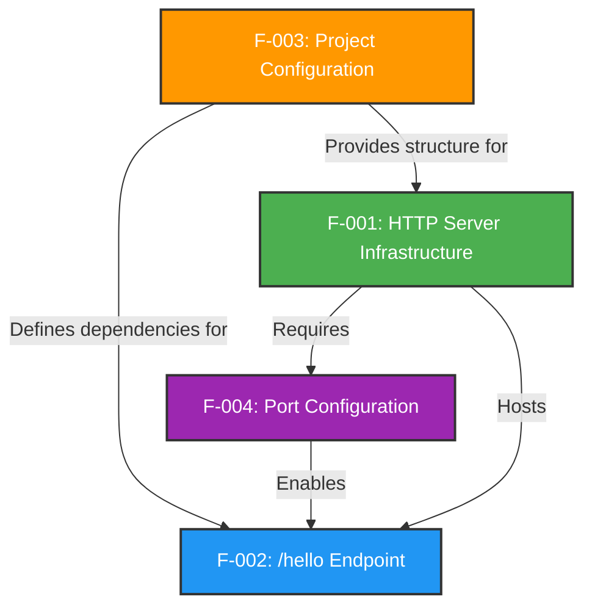
```mermaid
graph TD
    F001[F-001: HTTP Server Infrastructure]
    F002[F-002: /hello Endpoint]
    F003[F-003: Project Configuration]
    F004[F-004: Port Configuration]
    
    F003 -->|Provides structure for| F001
    F003 -->|Defines dependencies for| F002
    F001 -->|Requires| F004
    F004 -->|Enables| F002
    F001 -->|Hosts| F002
    
    style F001 fill:#4CAF50,stroke:#333,stroke-width:2px,color:#fff
    style F002 fill:#2196F3,stroke:#333,stroke-width:2px,color:#fff
    style F003 fill:#FF9800,stroke:#333,stroke-width:2px,color:#fff
    style F004 fill:#9C27B0,stroke:#333,stroke-width:2px,color:#fff
```

#### 2.3.1.1 Dependency Relationships

**Critical Path Dependencies:**
1. **F-003 → F-001**: Project Configuration must exist before HTTP Server Infrastructure can be implemented, as the server code resides in files defined by the project structure
2. **F-001 → F-004**: HTTP Server Infrastructure requires Port Configuration to know which port to bind to during initialization
3. **F-004 → F-002**: Port Configuration must complete successfully before the /hello Endpoint can accept requests
4. **F-001 → F-002**: HTTP Server Infrastructure must be running before the /hello Endpoint can process any requests

**Supporting Dependencies:**
- F-003 → F-002: Project Configuration provides the structural context in which endpoint code is organized and executed

### 2.3.2 Integration Points

#### 2.3.2.1 Internal Integration Points

| Integration Point | Source Feature | Target Feature | Interface Type |
|------------------|----------------|----------------|----------------|
| Request Routing | F-001 (HTTP Server) | F-002 (/hello Endpoint) | Function call to route handler |
| Response Transmission | F-002 (/hello Endpoint) | F-001 (HTTP Server) | Response object methods |
| Port Binding | F-001 (HTTP Server) | F-004 (Port Configuration) | Variable/constant reference |
| Application Initialization | F-003 (Project Configuration) | F-001 (HTTP Server) | Module import/require |

#### 2.3.2.2 External Integration Points

| Integration Point | System Component | Protocol/Interface | Purpose |
|------------------|------------------|-------------------|---------|
| Client Communication | HTTP Client (browser, curl, etc.) | HTTP/1.1 protocol | Request submission and response reception |
| Runtime Execution | Node.js Runtime | JavaScript execution API | Code interpretation and execution |
| Package Management | npm Registry | npm protocol | Dependency resolution and installation |
| Console Output | Terminal/Command Line | stdout/stderr streams | Status and error logging |

### 2.3.3 Shared Components and Services

#### 2.3.3.1 Core Shared Components

**Node.js HTTP Module (or Express.js):**
- Used by: F-001 (HTTP Server Infrastructure), F-002 (/hello Endpoint)
- Purpose: Provides HTTP server creation, request parsing, and response generation capabilities
- Scope: Core runtime component shared across server and endpoint features

**Console Logging:**
- Used by: F-001 (HTTP Server Infrastructure), F-004 (Port Configuration)
- Purpose: Outputs server status, port binding confirmation, and error messages
- Scope: Standard Node.js console object available throughout application

**Package Management:**
- Used by: F-003 (Project Configuration), F-001 (HTTP Server Infrastructure)
- Purpose: Dependency definition and installation
- Scope: npm package manager external to application code

#### 2.3.3.2 Shared Data Structures

**Port Number:**
- Defined in: F-004 (Port Configuration)
- Consumed by: F-001 (HTTP Server Infrastructure)
- Data Type: Integer (1024-65535)

**HTTP Request Object:**
- Created by: F-001 (HTTP Server Infrastructure)
- Consumed by: F-002 (/hello Endpoint)
- Data Type: Node.js HTTP request object

**HTTP Response Object:**
- Created by: F-001 (HTTP Server Infrastructure)
- Populated by: F-002 (/hello Endpoint)
- Data Type: Node.js HTTP response object

## 2.4 Implementation Considerations

This section outlines technical constraints, performance requirements, and key considerations that guide implementation decisions for the tutorial project.

### 2.4.1 Technical Approach Options

#### 2.4.1.1 Implementation Strategy Selection

The tutorial project supports two viable technical approaches, each with distinct educational and practical characteristics:

**Option 1: Built-in Node.js HTTP Module**
- **Description**: Uses Node.js core `http` module with no external dependencies
- **Advantages**:
  - Zero dependencies maximizes simplicity
  - Direct demonstration of Node.js core capabilities
  - Minimal installation footprint
  - Complete control over request routing logic
- **Disadvantages**:
  - Manual request routing implementation required
  - More verbose code for endpoint definition
  - Less alignment with industry standard patterns
- **Best For**: Tutorials emphasizing fundamental Node.js concepts and core module usage

**Option 2: Express.js Framework**
- **Description**: Leverages Express.js for routing and middleware capabilities
- **Advantages**:
  - Industry-standard routing patterns
  - Simplified endpoint definition syntax
  - Alignment with common Node.js development practices
  - Foundation for future feature expansion
- **Disadvantages**:
  - Introduces external dependency (though minimal)
  - Abstracts some underlying HTTP details
  - Slightly increased complexity for absolute beginners
- **Best For**: Tutorials preparing developers for practical Node.js development

#### 2.4.1.2 Recommended Approach

Based on the project's educational objectives and the target audience of beginner to intermediate developers, **Option 2 (Express.js)** is recommended for the following reasons:
- Demonstrates patterns used in real-world Node.js applications
- Provides cleaner, more readable code that beginners can understand quickly
- Establishes foundation for future tutorial expansions
- Single dependency (Express) is well-documented and stable

### 2.4.2 Performance Requirements

#### 2.4.2.1 Functional Performance Targets

| Performance Metric | Target | Measurement Method | Rationale |
|-------------------|--------|-------------------|-----------|
| Endpoint Response Accuracy | 100% correct responses | Automated GET requests verify "Hello world" response | Tutorial must demonstrate reliable functionality |
| Server Startup Time | < 5 seconds | Measure time from process start to listening state | Rapid feedback for learning iterations |
| Response Time | < 100 milliseconds | Measure time from request receipt to response sent | Demonstrate responsive server behavior |
| Startup Success Rate | 100% on standard Node.js | Test across different Node.js LTS versions | Ensure consistent tutorial experience |

#### 2.4.2.2 Setup Efficiency Targets

| Setup Metric | Target | Measurement Method | Rationale |
|-------------|--------|-------------------|-----------|
| Time from Clone to Running | < 5 minutes | Manual timing of complete setup process | Minimize friction in learning experience |
| Setup Command Count | ≤ 3 commands | Count required commands (clone, install, start) | Simplicity reduces abandonment rate |
| Code Complexity | < 50 lines main file | Line count excluding comments and whitespace | Maintains tutorial focus and readability |
| Dependency Installation Time | < 2 minutes | Measure npm install duration | Fast setup encourages experimentation |

### 2.4.3 Constraints and Limitations

#### 2.4.3.1 Technical Constraints

**Runtime Environment:**
- Must run on Node.js LTS versions (14.x, 16.x, 18.x, 20.x)
- Must function on Windows, macOS, and Linux operating systems
- Must work without platform-specific native modules

**Network Requirements:**
- Requires available port in non-privileged range (1024-65535)
- Must bind to localhost interface (no external network access required)
- Standard HTTP/1.1 protocol only (HTTP/2, HTTP/3 not utilized)

**Code Constraints:**
- Maximum 50 lines of code in main application file (excluding comments)
- No complex control flow or nested callbacks
- Clear, self-documenting variable and function names

#### 2.4.3.2 Scope Limitations

**Explicitly Excluded Capabilities** (as defined in Technical Specification Section 1.3.2):
- Multiple endpoints or routes beyond `/hello`
- HTTP methods other than GET
- Request parameter processing (query params, path params, body parsing)
- Alternative response formats (JSON, XML, HTML)
- Database integration or persistent storage
- Authentication and authorization mechanisms
- HTTPS/TLS encryption
- CORS configuration
- Advanced error handling beyond basic startup errors
- Testing frameworks or automated test suites
- Production deployment configurations
- Docker containerization
- Environment-based configuration management

#### 2.4.3.3 Security Considerations

**Tutorial Scope Security:**
Given the educational nature of this project, production-grade security features are intentionally excluded. The following security statement must be included in project documentation:

> **Security Notice**: This tutorial project is designed solely for educational purposes and local development environments. It does not implement security features such as authentication, input validation, rate limiting, or HTTPS encryption. Do not deploy this application to production environments or use it to handle sensitive data.

**Basic Security Practices Included:**
- Binding to localhost by default (prevents external access)
- No processing of user input (no injection attack surface)
- No persistent data storage (no data exposure risk)

#### 2.4.3.4 Maintenance Requirements

**Minimal Maintenance Design:**
- Code must be self-documenting with clear variable names
- Comments should explain educational concepts, not implementation details
- No complex dependencies requiring frequent security updates
- Stable, well-maintained dependencies only (e.g., Express.js)

**Expected Maintenance Activities:**
- Annual review of Node.js version compatibility
- Periodic dependency version updates for Express.js (if used)
- Documentation updates based on user feedback
- Clarification of setup instructions for different operating systems

#### 2.4.3.5 Scalability Considerations

**Not Applicable**: As explicitly defined in Technical Specification Section 1.3.2.4, this tutorial project does not support:
- High-volume traffic scenarios
- Concurrent user handling optimization
- Load balancing or clustering
- Performance tuning for production workloads
- Horizontal or vertical scaling patterns

The project is intentionally scoped for single-user, local development learning scenarios only.

## 2.5 Requirements Traceability

This section provides comprehensive traceability from features through requirements to technical specification sources, enabling verification that all project objectives are addressed by specific, testable requirements.

### 2.5.1 Traceability Matrix

#### 2.5.1.1 Feature to Specification Mapping

| Feature ID | Feature Name | Requirements | Tech Spec Source | User Story Source | Priority | Status |
|-----------|-------------|--------------|------------------|-------------------|----------|--------|
| F-001 | HTTP Server Infrastructure | F-001-RQ-001 to RQ-004 | TS 1.2.2.2, 1.3.1.1 | User Context | Critical | Proposed |
| F-002 | /hello Endpoint | F-002-RQ-001 to RQ-004 | TS 1.2.2.2, 1.3.1.1 | User Context (primary) | Critical | Proposed |
| F-003 | Project Configuration | F-003-RQ-001 to RQ-004 | TS 1.2.2.3, 1.3.1.1 | TS 1.2.3.1 | Critical | Proposed |
| F-004 | Port Configuration | F-004-RQ-001 to RQ-003 | TS 1.3.1.1 | TS 1.2.2.2 | High | Proposed |

*Legend:*
- *TS = Technical Specification Section*
- *User Context = Original project request: "nodejs tutorial project that features one end point '/hello' that returns 'Hello world'"*

#### 2.5.1.2 Requirements to Acceptance Criteria Mapping

| Requirement ID | Feature | Acceptance Criteria | Validation Method | Test Priority |
|---------------|---------|---------------------|-------------------|---------------|
| F-001-RQ-001 | HTTP Server Infrastructure | Server starts without errors; Port binding succeeds | Manual execution + console verification | P0 |
| F-001-RQ-002 | HTTP Server Infrastructure | Server accepts HTTP connections | HTTP client connection test | P0 |
| F-001-RQ-003 | HTTP Server Infrastructure | Clean startup and shutdown | Process lifecycle observation | P1 |
| F-001-RQ-004 | HTTP Server Infrastructure | Console displays status messages | Console output verification | P1 |
| F-002-RQ-001 | /hello Endpoint | GET /hello requests matched correctly | HTTP GET request to /hello | P0 |
| F-002-RQ-002 | /hello Endpoint | Response contains "Hello world" | Response body inspection | P0 |
| F-002-RQ-003 | /hello Endpoint | HTTP 200 status code returned | HTTP status code verification | P0 |
| F-002-RQ-004 | /hello Endpoint | text/plain Content-Type header present | HTTP header inspection | P1 |
| F-003-RQ-001 | Project Configuration | Valid package.json with dependencies | JSON validation + npm validation | P0 |
| F-003-RQ-002 | Project Configuration | Main file contains complete implementation | Code execution without errors | P0 |
| F-003-RQ-003 | Project Configuration | README with clear instructions | Documentation review + user testing | P1 |
| F-003-RQ-004 | Project Configuration | npm install completes successfully | Dependency installation test | P0 |
| F-004-RQ-001 | Port Configuration | Port number defined in code | Code inspection | P0 |
| F-004-RQ-002 | Port Configuration | Default port in valid range | Code inspection + documentation | P1 |
| F-004-RQ-003 | Port Configuration | Server binds to port successfully | Server startup verification | P0 |

*Test Priority Legend:*
- *P0 = Must test - critical functionality*
- *P1 = Should test - important but not blocking*

### 2.5.2 Requirement Coverage Analysis

#### 2.5.2.1 Coverage by Priority

| Priority Level | Feature Count | Requirement Count | Percentage of Total |
|---------------|---------------|-------------------|---------------------|
| Critical | 3 features | 12 requirements | 80% |
| High | 1 feature | 3 requirements | 20% |
| Medium | 0 features | 0 requirements | 0% |
| Low | 0 features | 0 requirements | 0% |
| **Total** | **4 features** | **15 requirements** | **100%** |

#### 2.5.2.2 Coverage by Category

| Feature Category | Feature Count | Requirement Count | Key Focus Areas |
|-----------------|---------------|-------------------|-----------------|
| Core Infrastructure | 1 (F-001) | 4 requirements | Server lifecycle, connection handling |
| API Endpoint | 1 (F-002) | 4 requirements | Request routing, response generation |
| Development Infrastructure | 1 (F-003) | 4 requirements | Project structure, dependency management |
| Configuration | 1 (F-004) | 3 requirements | Port definition and binding |

#### 2.5.2.3 Success Criteria Coverage

The following table maps project success criteria from Technical Specification Section 1.2.3.1 to specific requirements:

| Success Criterion | Supporting Requirements | Coverage Status |
|------------------|------------------------|-----------------|
| Functional Endpoint | F-002-RQ-001, F-002-RQ-002, F-002-RQ-003 | ✅ Complete |
| Server Reliability | F-001-RQ-001, F-001-RQ-003 | ✅ Complete |
| Setup Simplicity | F-003-RQ-001, F-003-RQ-002, F-003-RQ-003, F-003-RQ-004 | ✅ Complete |
| Code Clarity | F-003-RQ-002, F-001-RQ-004 | ✅ Complete |

#### 2.5.2.4 KPI Requirements Mapping

Key Performance Indicators from Technical Specification Section 1.2.3.3 mapped to verification requirements:

| KPI | Target | Verifying Requirements | Measurement Approach |
|-----|--------|----------------------|---------------------|
| Endpoint response accuracy | 100% correct responses | F-002-RQ-002 | Automated HTTP testing with response validation |
| Time from clone to running | < 5 minutes | F-003-RQ-003, F-003-RQ-004 | Manual timing of complete setup procedure |
| Lines of code in main file | < 50 lines | F-003-RQ-002 | Automated line counting (excluding comments) |
| Successful initialization rate | 100% on standard Node.js | F-001-RQ-001 | Cross-version testing on Node.js LTS releases |

## 2.6 References

This section documents all source materials, technical specification sections, and repository artifacts examined during the requirements analysis and documentation process.

### 2.6.1 Technical Specification Sections

The following sections from the Technical Specification document were retrieved and analyzed to ensure requirements alignment:

- **Section 1.1 Executive Summary** - Project overview, business problem definition, stakeholder identification, and value proposition establishing the educational mission of the tutorial
- **Section 1.2 System Overview** - Detailed architecture components (HTTP Server, Route Handler, Response Generator), technical approach options, success criteria, and KPI definitions
- **Section 1.3 Scope** - Comprehensive definition of in-scope features (single endpoint, basic server functionality) and explicit exclusions (security, database, multiple endpoints, production features)

### 2.6.2 Repository Files Examined

The following repository artifacts were analyzed to determine current project state:

- `README.md` - Auto-generated repository readme file confirming empty repository state and greenfield development context; verified no existing implementation code

### 2.6.3 Repository Structure Explored

- `/` (repository root, depth: 1) - Comprehensive exploration confirmed repository contains only README.md with no application code, configuration files, or implementation artifacts; verified greenfield project status requiring complete implementation

### 2.6.4 User Requirements Source

- **Original User Request**: "new product Can you create a nodejs tutorial project that features one end point '/hello' that returns 'Hello world' to the calling HTTP client?"
  - This primary requirement directly informed Feature F-002 (/hello Endpoint)
  - Established the core project scope and educational objectives
  - Defined the fundamental success criterion of returning "Hello world" response

### 2.6.5 Requirements Analysis Methodology

**Analysis Approach:**
- Systematic exploration of repository structure to assess existing codebase
- Comprehensive retrieval of Technical Specification sections for context
- Cross-referencing user requirements with technical specification objectives
- Feature extraction based on architectural components and success criteria
- Requirement decomposition to create testable, discrete functional requirements

**Research Completeness:**
- Total searches conducted: 10 (repository exploration, specification retrieval, verification)
- Repository status: Confirmed greenfield with no existing implementation
- Specification coverage: All relevant sections retrieved (1.1, 1.2, 1.3)
- Requirement sources: User context + Technical Specification comprehensive coverage

### 2.6.6 Related Documentation

**Process Workflows Referenced:**
- Server Startup Workflow (Technical Specification Section 1.3.1.1)
- Endpoint Access Workflow (Technical Specification Section 1.3.1.1)

**Architecture Diagrams Referenced:**
- High-Level System Architecture Diagram (Technical Specification Section 1.2.2.1)
- Component Interaction Flow (Technical Specification Section 1.2.2.2)

### 2.6.7 Standards and Protocols

- **HTTP/1.1 Protocol** - Standard HTTP protocol specification for client-server communication
- **Node.js Module System** - CommonJS and ES6 module standards for code organization
- **npm Package Format** - npm package.json schema for dependency and metadata definition
- **Semantic Versioning** - Version numbering standard for dependency specification

---

*Document Version: 1.0*  
*Status: Proposed*  
*Last Updated: [Generated from Technical Specification]*

# 3. Technology Stack

## 3.1 Overview and Design Philosophy

### 3.1.1 Stack Architecture Principle

The technology stack for this Node.js tutorial project is intentionally minimalist, designed to demonstrate fundamental HTTP server concepts without the complexity of production-grade infrastructure. The stack prioritizes **educational clarity over feature richness**, focusing on a single endpoint implementation that can be understood, executed, and modified within a single learning session.

This greenfield tutorial project operates as a standalone application with no integration requirements into existing enterprise systems. The technology choices reflect the project's educational mission: to provide beginner to intermediate developers with hands-on experience in creating a functional HTTP server using Node.js core capabilities or industry-standard frameworks.

### 3.1.2 Selection Criteria

Technology selections for this project are guided by four core criteria:

1. **Simplicity**: Zero or minimal dependencies to reduce setup friction and cognitive overhead
2. **Educational Value**: Technologies that demonstrate real-world Node.js development patterns
3. **Accessibility**: Tools and frameworks with comprehensive documentation and stable community support
4. **Rapid Setup**: Complete setup achievable in under 5 minutes with three or fewer commands

### 3.1.3 Scope Boundaries

This technology stack explicitly excludes production-grade components including cloud infrastructure, containerization, CI/CD pipelines, databases, authentication services, and monitoring tools. These exclusions are deliberate design decisions that maintain the tutorial's focus on core HTTP server fundamentals.

## 3.2 Programming Languages

### 3.2.1 Node.js (JavaScript)

#### 3.2.1.1 Primary Language Selection

**Node.js (JavaScript)** serves as the sole programming language for this tutorial project, chosen for its direct alignment with the educational objective of demonstrating HTTP server development in the Node.js runtime environment.

**Language Justification:**
- **Educational Alignment**: Project requirement explicitly specifies "nodejs tutorial project" with HTTP endpoint implementation
- **Ubiquity**: JavaScript knowledge is nearly universal among web developers, minimizing prerequisite learning
- **Runtime Integration**: Direct access to Node.js core modules (`http`, `https`, etc.) without additional language bindings
- **Simplicity**: Single-language stack eliminates polyglot complexity and context switching

#### 3.2.1.2 Version Requirements and Compatibility

**Supported Node.js Versions:**
The application must function correctly across all current Long-Term Support (LTS) Node.js versions:

| Node.js Version | LTS Status | Support Requirement |
|-----------------|------------|---------------------|
| 14.x | Active/Maintenance | Required |
| 16.x | Active LTS | Required |
| 18.x | Active LTS | Required |
| 20.x | Current/Active LTS | Required |

**Language Features:**
- **ES6+ Syntax**: Modern JavaScript features including arrow functions, const/let declarations, template literals, and destructuring
- **CommonJS Modules**: Standard Node.js module system using `require()` and `module.exports`
- **Asynchronous Patterns**: Callback-based or Promise-based asynchronous operations consistent with Node.js conventions

#### 3.2.1.3 Cross-Platform Compatibility

The implementation must execute successfully on:
- **Windows**: Windows 10 and later
- **macOS**: macOS 10.15 (Catalina) and later
- **Linux**: Major distributions (Ubuntu, Debian, CentOS, Fedora) with Node.js LTS support

**Platform Constraints:**
- No platform-specific native modules or dependencies
- No file system operations dependent on Windows vs. POSIX path conventions
- Pure JavaScript implementation without platform-specific binary requirements

## 3.3 Frameworks and Libraries

### 3.3.1 Implementation Approach Comparison

The tutorial project supports two viable technical approaches, each with distinct educational and practical characteristics. The selection between these approaches depends on the tutorial's pedagogical focus: demonstrating Node.js core capabilities versus showcasing industry-standard development patterns.

#### 3.3.1.1 Option 1: Built-in Node.js HTTP Module

**Framework Description:**
Utilizes Node.js core `http` module with zero external dependencies for maximum simplicity and direct demonstration of fundamental Node.js capabilities.

**Advantages:**
- **Zero Dependencies**: No external packages required, minimizing installation footprint to zero bytes
- **Core Capabilities**: Direct exposure to Node.js native HTTP server implementation
- **Complete Control**: Manual request routing implementation provides full visibility into request handling logic
- **Minimal Complexity**: Simplest possible technology stack with no abstraction layers

**Disadvantages:**
- **Manual Routing**: Requires explicit if/else or switch logic for request path and method matching
- **Verbose Implementation**: More lines of code needed to achieve equivalent functionality
- **Limited Patterns**: Less alignment with patterns developers encounter in professional Node.js codebases

**Best For:** Tutorials emphasizing fundamental Node.js concepts, core module usage, and low-level HTTP protocol understanding.

**Example Architecture:**
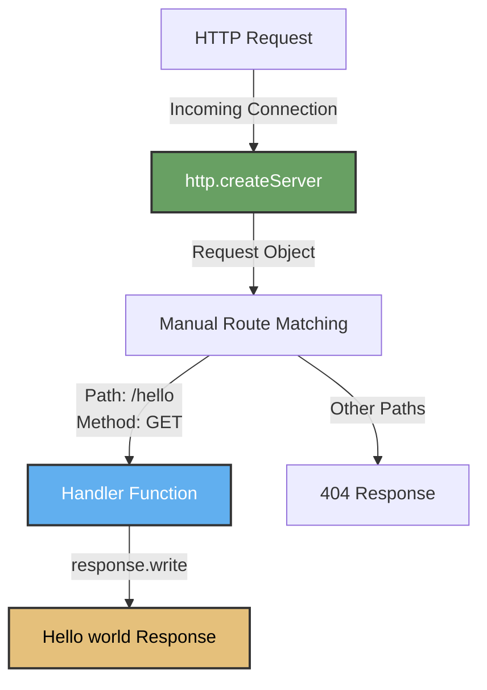
```mermaid
graph TB
    A[HTTP Request] -->|Incoming Connection| B[http.createServer]
    B -->|Request Object| C[Manual Route Matching]
    C -->|Path: /hello<br/>Method: GET| D[Handler Function]
    C -->|Other Paths| E[404 Response]
    D -->|response.write| F[Hello world Response]
    
    style B fill:#68A063,stroke:#333,stroke-width:2px,color:#fff
    style D fill:#61AFEF,stroke:#333,stroke-width:2px,color:#fff
    style F fill:#E5C07B,stroke:#333,stroke-width:2px,color:#000
```

#### 3.3.1.2 Option 2: Express.js Framework ⭐ Recommended

**Framework Description:**
Leverages Express.js, the de facto standard web framework for Node.js, to demonstrate industry-standard routing patterns and middleware architecture with minimal overhead.

**Advantages:**
- **Industry Standard**: Express.js powers millions of Node.js applications, providing immediate relevance to professional development
- **Simplified Routing**: Declarative route definition syntax (`app.get('/hello', ...)`) reduces boilerplate code
- **Cleaner Code**: Achieved implementation typically under 20 lines of meaningful code
- **Foundation for Growth**: Establishes patterns easily extended for middleware, error handling, and additional endpoints
- **Well-Documented**: Extensive official documentation and community resources available

**Disadvantages:**
- **External Dependency**: Introduces single npm dependency (though Express is stable and well-maintained)
- **Abstraction Layer**: Hides some underlying HTTP protocol details behind Express request/response objects
- **Slightly Higher Complexity**: Absolute beginners must understand basic framework concepts

**Best For:** Tutorials preparing developers for practical Node.js development, teaching patterns used in real-world applications.

**Dependency Profile:**
- **Package Name**: `express`
- **Typical Version**: 4.x (stable major version)
- **Installation Size**: ~200KB (minified)
- **Dependency Tree**: Minimal transitive dependencies

**Example Architecture:**
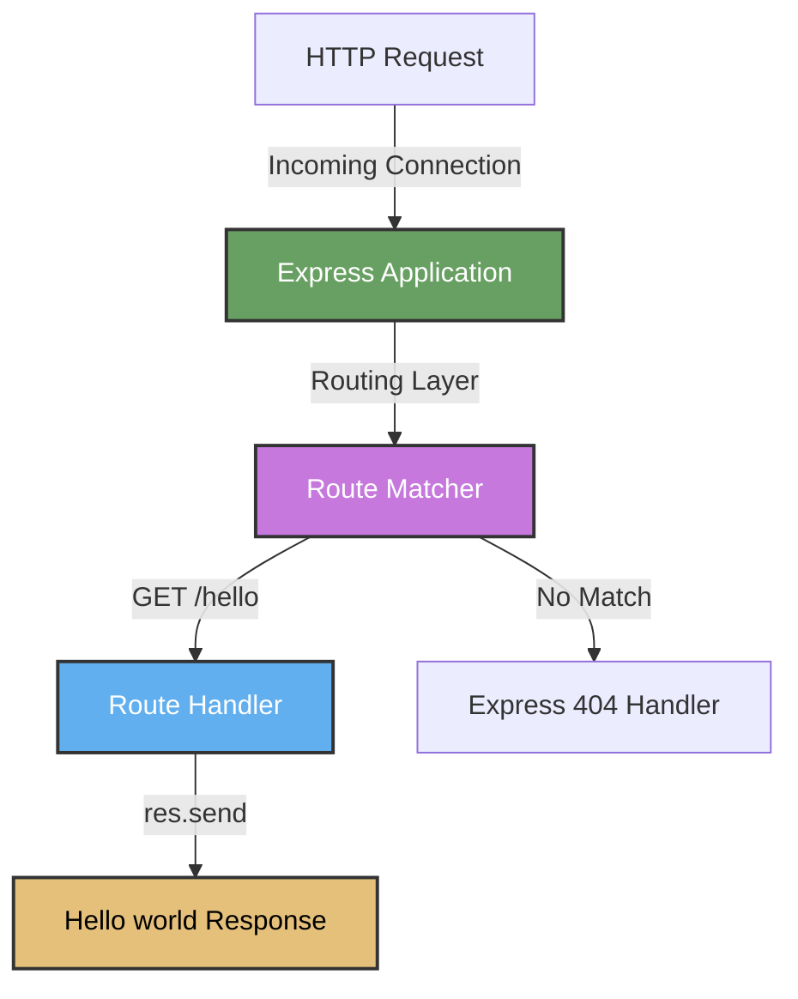
```mermaid
graph TB
    A[HTTP Request] -->|Incoming Connection| B[Express Application]
    B -->|Routing Layer| C[Route Matcher]
    C -->|GET /hello| D[Route Handler]
    C -->|No Match| E[Express 404 Handler]
    D -->|res.send| F[Hello world Response]
    
    style B fill:#68A063,stroke:#333,stroke-width:2px,color:#fff
    style C fill:#C678DD,stroke:#333,stroke-width:2px,color:#fff
    style D fill:#61AFEF,stroke:#333,stroke-width:2px,color:#fff
    style F fill:#E5C07B,stroke:#333,stroke-width:2px,color:#000
```

### 3.3.2 Recommended Approach: Express.js

#### 3.3.2.1 Recommendation Rationale

**Express.js is the recommended framework** for this tutorial project based on the following analysis from the Implementation Considerations:

**Primary Justifications:**
1. **Educational Effectiveness**: Demonstrates patterns used in real-world Node.js applications that learners will encounter in professional development
2. **Code Readability**: Provides cleaner, more readable code that beginners can understand quickly without extensive HTTP protocol knowledge
3. **Future Extensibility**: Establishes foundation for potential future tutorial expansions (additional endpoints, middleware concepts)
4. **Stability**: Single dependency (Express) is well-documented, stable, and maintained by a large community

**Target Audience Alignment:**
The project targets beginner to intermediate developers. For this audience, Express.js provides the optimal balance between simplicity and real-world applicability. Developers learning Node.js benefit more from understanding Express patterns they will use professionally than from implementing manual routing logic they will rarely write.

#### 3.3.2.2 Version Specification

**Recommended Express.js Version:**
```json
{
  "dependencies": {
    "express": "^4.18.0"
  }
}
```

**Version Rationale:**
- **Major Version 4.x**: Stable, mature version with years of production validation
- **Minor Version 18+**: Recent minor version ensuring compatibility with Node.js LTS versions
- **Caret (^) Range**: Allows automatic minor and patch updates for bug fixes and security patches

**Breaking Change Risk:** Express.js 4.x has maintained backward compatibility for years, minimizing risk of breaking changes in minor/patch updates.

### 3.3.3 Alternative Approach: Built-in HTTP Module

#### 3.3.3.1 Implementation Profile

For tutorials specifically focused on Node.js core capabilities, the built-in `http` module approach remains fully supported as an alternative implementation strategy.

**Module Specifications:**
- **Module Name**: `http` (Node.js core module)
- **Availability**: Built into all Node.js versions, no installation required
- **API Surface**: `http.createServer()`, `http.Server` class, request/response objects
- **Documentation**: Official Node.js documentation at nodejs.org/api/http.html

**Code Complexity Profile:**
- **Estimated Lines of Code**: 30-40 lines (vs. 15-20 with Express.js)
- **Manual Components**: Request path parsing, method validation, route matching, response header configuration
- **Educational Trade-off**: More code to write but deeper understanding of HTTP fundamentals

#### 3.3.3.2 When to Choose Built-in HTTP Module

Select the built-in `http` module approach when:
- Tutorial explicitly focuses on Node.js core module capabilities
- Target audience needs exposure to low-level HTTP protocol handling
- Zero-dependency requirement is pedagogically important
- Tutorial series starts with fundamentals before introducing frameworks

## 3.4 Dependencies and Package Management

### 3.4.1 Package Manager

#### 3.4.1.1 npm (Node Package Manager)

**npm** serves as the sole package manager for dependency resolution, installation, and script execution.

**Selection Justification:**
- **Default Inclusion**: npm ships with every Node.js installation, requiring no additional setup
- **Universal Adoption**: Industry-standard package manager for Node.js ecosystem
- **Registry Access**: Direct access to npmjs.com registry containing millions of packages
- **Script Execution**: Supports `npm start` and other convenience scripts defined in package.json

**Version Requirements:**
- **Minimum Version**: npm 6.x (included with Node.js 14.x+)
- **Compatibility**: Works with all npm versions 6.x through 10.x
- **No Special Features**: Uses only core npm functionality (install, start scripts)

#### 3.4.1.2 Package Manifest (package.json)

The `package.json` file defines project metadata, dependencies, and execution scripts:

**Required Manifest Sections:**
```json
{
  "name": "nodejs-hello-tutorial",
  "version": "1.0.0",
  "description": "Node.js tutorial project featuring /hello endpoint",
  "main": "server.js",
  "scripts": {
    "start": "node server.js"
  },
  "dependencies": {
    "express": "^4.18.0"
  },
  "engines": {
    "node": ">=14.0.0"
  }
}
```

**Manifest Components:**
- **name**: Project identifier for npm ecosystem
- **version**: Semantic version following semver specification
- **main**: Entry point file for Node.js execution
- **scripts.start**: Convenience command for server startup
- **dependencies**: Runtime dependencies (Express.js if using recommended approach)
- **engines.node**: Specifies minimum Node.js version requirement

### 3.4.2 Runtime Dependencies

#### 3.4.2.1 Dependency Profile by Implementation Approach

**Express.js Approach (Recommended):**

| Dependency | Version | Purpose | Installation Size |
|------------|---------|---------|-------------------|
| express | ^4.18.0 | Web framework for routing and middleware | ~200KB |

**Total Dependency Count**: 1 direct dependency
**Transitive Dependencies**: Minimal (Express includes few sub-dependencies)
**Total Installation Size**: < 5MB including transitive dependencies

**Built-in HTTP Module Approach:**

| Dependency | Version | Purpose | Installation Size |
|------------|---------|---------|-------------------|
| *None* | - | Zero external dependencies | 0 bytes |

**Total Dependency Count**: 0 dependencies
**Installation Size**: 0 bytes

#### 3.4.2.2 Dependency Installation Performance

**Installation Targets** (from performance requirements):

| Metric | Target | Actual (Express.js) | Actual (Built-in HTTP) |
|--------|--------|---------------------|------------------------|
| Installation Time | < 2 minutes | ~10-30 seconds | 0 seconds (no installation) |
| Network Bandwidth | Minimal | ~5MB download | 0 bytes |
| Disk Space | Minimal | ~10MB (includes node_modules) | 0 bytes |

**Installation Command:**
```bash
npm install
```

### 3.4.3 Dependency Constraints

#### 3.4.3.1 Security and Maintenance Requirements

**Dependency Selection Criteria:**
- **Stability**: Only stable, well-maintained packages with active development
- **Security**: No known high-severity vulnerabilities at time of tutorial publication
- **Update Frequency**: Dependencies with predictable release cycles and backward compatibility
- **Documentation**: Comprehensive official documentation available

**Excluded Dependency Categories:**
- ❌ Platform-specific native modules requiring compilation
- ❌ Dependencies with complex native binary requirements
- ❌ Alpha, beta, or experimental packages
- ❌ Deprecated packages or those with security advisories

#### 3.4.3.2 Dependency Update Strategy

**Maintenance Approach:**
- **Annual Review**: Review Node.js LTS version compatibility annually
- **Security Patches**: Update Express.js (if used) for security patches following npm audit recommendations
- **Major Version Stability**: Remain on Express.js 4.x until 5.x reaches stable production status

**Dependency Locking:**
A `package-lock.json` file should be committed to ensure reproducible installations across different environments and time periods, guaranteeing that learners experience consistent setup regardless of when they clone the repository.

## 3.5 Development Environment

### 3.5.1 Required Tools

#### 3.5.1.1 Core Development Tools

**Node.js Runtime Environment:**
- **Purpose**: JavaScript execution environment and HTTP server runtime
- **Version**: LTS versions 14.x, 16.x, 18.x, or 20.x
- **Installation**: Download from nodejs.org or use system package manager
- **Verification**: `node --version` command should return version >= 14.0.0

**npm Package Manager:**
- **Purpose**: Dependency installation and script execution
- **Version**: 6.x or higher (included with Node.js)
- **Verification**: `npm --version` command should return version >= 6.0.0

**Text Editor or IDE:**
- **Purpose**: Code viewing and modification
- **Options**: Visual Studio Code, Sublime Text, Atom, Vim, or any JavaScript-capable editor
- **Required Features**: Syntax highlighting for JavaScript

**HTTP Client (for testing):**
- **Purpose**: Send GET requests to `/hello` endpoint for validation
- **Options**: Web browser, curl, Postman, HTTPie, or similar tools
- **Example**: `curl http://localhost:3000/hello`

#### 3.5.1.2 Optional Development Tools

**Git Version Control:**
- **Purpose**: Repository cloning and version management
- **Requirement**: Optional (project can be downloaded as ZIP)
- **Usage**: `git clone <repository-url>`

### 3.5.2 Project Structure

#### 3.5.2.1 Minimal File Organization

The project follows a minimal file structure optimized for tutorial clarity:

```
nodejs-hello-tutorial/
├── package.json          # Project manifest and dependency definition
├── package-lock.json     # Dependency lock file for reproducible installs
├── server.js            # Main application file (or index.js)
└── README.md            # Setup and execution documentation
```

**File Descriptions:**

**`package.json`:**
- Project metadata, dependencies, and npm scripts
- Defines `npm start` command for server execution
- Specifies Node.js version requirements

**`package-lock.json`:**
- Auto-generated by npm during `npm install`
- Ensures consistent dependency versions across installations
- Should be committed to version control

**`server.js` (or `index.js`):**
- Single main application file containing complete implementation
- HTTP server initialization and configuration
- `/hello` endpoint handler implementation
- Server startup logic and console logging
- **Size Constraint**: Maximum 50 lines of code (excluding comments)

**`README.md`:**
- Project description and learning objectives
- Setup instructions (3 commands or fewer)
- Execution instructions and expected behavior
- Troubleshooting guidance for common issues
- Security notice for educational-only use

#### 3.5.2.2 File Naming Conventions

**Standard Conventions:**
- **Server File**: `server.js` (recommended) or `index.js` (alternative)
- **Case Sensitivity**: Lowercase filenames for cross-platform compatibility
- **Extensions**: `.js` for JavaScript files

### 3.5.3 Setup and Execution Process

#### 3.5.3.1 Installation Workflow

The setup process is designed to achieve the performance target of **< 5 minutes from clone to running server** with **≤ 3 commands**:

**Step 1: Repository Acquisition**
```bash
git clone <repository-url>
cd nodejs-hello-tutorial
```
*Alternative: Download and extract ZIP file*

**Step 2: Dependency Installation**
```bash
npm install
```
*Duration: < 2 minutes (Express.js approach) or 0 seconds (built-in HTTP approach)*

**Step 3: Server Startup**
```bash
npm start
```
*Expected Output: "Server listening on port 3000" or similar confirmation*

**Total Command Count**: 3 commands (or 2 if using direct download)

#### 3.5.3.2 Execution Environment Configuration

**Port Configuration:**
- **Default Port**: 3000 or 8080 (defined in server.js code)
- **Port Range**: Non-privileged ports (1024-65535)
- **Binding**: Localhost interface only (127.0.0.1 or localhost)
- **Modification**: Edit port constant/variable in server.js

**Network Requirements:**
- **External Access**: Not required (localhost binding only)
- **Firewall**: No inbound firewall rules needed
- **Proxy**: No proxy configuration required

**Startup Performance Targets:**
- **Server Startup Time**: < 5 seconds from command execution to listening state
- **Startup Success Rate**: 100% on standard Node.js LTS installations
- **Console Feedback**: Immediate confirmation message upon successful startup

#### 3.5.3.3 Validation and Testing

**Manual Validation Steps:**

1. **Server Startup Verification:**
   - Console displays confirmation message: "Server listening on port 3000"
   - No error messages in console output

2. **Endpoint Testing:**
   - **Browser**: Navigate to `http://localhost:3000/hello`
   - **curl**: Execute `curl http://localhost:3000/hello`
   - **Expected Response**: Plain text "Hello world" with HTTP 200 status

3. **Response Time Verification:**
   - Response received in < 100 milliseconds (typically < 10ms for localhost)

**Success Criteria:**
- Server starts without errors
- `/hello` endpoint returns "Hello world" plain text
- HTTP status code 200 OK
- Content-Type header includes "text/plain"

## 3.6 Technology Exclusions

### 3.6.1 Infrastructure and Deployment Exclusions

This tutorial project explicitly **excludes** all production-grade infrastructure and deployment technologies. These exclusions are intentional design decisions that maintain the tutorial's educational focus.

#### 3.6.1.1 Cloud Services (Not Included)

**Excluded Cloud Platforms:**
- ❌ **Amazon Web Services (AWS)**: No EC2, Lambda, API Gateway, or other AWS services
- ❌ **Microsoft Azure**: No Azure App Service, Functions, or cloud infrastructure
- ❌ **Google Cloud Platform (GCP)**: No Compute Engine, Cloud Functions, or GCP services
- ❌ **Other Cloud Providers**: No Heroku, DigitalOcean, Linode, or alternative platforms

**Rationale**: The tutorial operates as a local development project requiring no cloud infrastructure. Deployment to production environments is explicitly outside the project scope.

#### 3.6.1.2 Containerization (Not Included)

**Excluded Container Technologies:**
- ❌ **Docker**: No Dockerfile, docker-compose.yml, or container configurations
- ❌ **Kubernetes**: No pod definitions, services, or orchestration configurations
- ❌ **Container Registries**: No DockerHub, Amazon ECR, or image registry integration

**Rationale**: Containerization adds complexity unnecessary for demonstrating basic HTTP server concepts. The application runs directly on the host operating system using native Node.js execution.

#### 3.6.1.3 Infrastructure as Code (Not Included)

**Excluded IaC Tools:**
- ❌ **Terraform**: No infrastructure provisioning or state management
- ❌ **CloudFormation**: No AWS infrastructure templates
- ❌ **Ansible/Chef/Puppet**: No configuration management tools

**Rationale**: No infrastructure to provision or manage beyond local Node.js runtime.

#### 3.6.1.4 CI/CD Pipelines (Not Included)

**Excluded CI/CD Services:**
- ❌ **GitHub Actions**: No workflow definitions or automated pipelines
- ❌ **GitLab CI**: No .gitlab-ci.yml or pipeline configurations
- ❌ **Jenkins**: No Jenkinsfile or build automation
- ❌ **Travis CI / Circle CI**: No continuous integration services

**Rationale**: The tutorial project includes no automated testing, build processes, or deployment workflows. Code is executed directly without compilation or build steps.

### 3.6.2 Application Framework Exclusions

#### 3.6.2.1 Database Systems (Not Included)

**Excluded Database Technologies:**
- ❌ **Relational Databases**: No MongoDB, PostgreSQL, MySQL, MariaDB, or SQL Server
- ❌ **NoSQL Databases**: No MongoDB, Redis, Cassandra, or DynamoDB
- ❌ **In-Memory Data Stores**: No Redis, Memcached, or caching layers
- ❌ **ORMs and Query Builders**: No Mongoose, Sequelize, TypeORM, or Knex

**Rationale**: The `/hello` endpoint returns a static string with no data persistence requirements. No data storage, retrieval, or management capabilities are needed.

#### 3.6.2.2 Authentication and Authorization (Not Included)

**Excluded Auth Technologies:**
- ❌ **Authentication Providers**: No Auth0, Okta, Firebase Auth, or OAuth providers
- ❌ **Session Management**: No express-session, cookie-parser, or session stores
- ❌ **JWT Libraries**: No jsonwebtoken, passport, or token-based auth
- ❌ **Authorization Frameworks**: No role-based access control (RBAC) or permissions systems

**Rationale**: The tutorial endpoint is publicly accessible with no user authentication, authorization, or access control requirements.

#### 3.6.2.3 Frontend Frameworks (Not Included)

**Excluded Frontend Technologies:**
- ❌ **JavaScript Frameworks**: No React, Vue.js, Angular, or Svelte
- ❌ **TypeScript**: No TypeScript compilation or type definitions
- ❌ **CSS Frameworks**: No TailwindCSS, Bootstrap, or styling frameworks
- ❌ **Mobile Frameworks**: No React Native, Flutter, or cross-platform mobile frameworks
- ❌ **Build Tools**: No Webpack, Vite, Parcel, or bundlers

**Rationale**: This is a backend-only tutorial. The `/hello` endpoint returns plain text, not HTML, JSON, or any format requiring frontend rendering.

#### 3.6.2.4 Third-Party Services (Not Included)

**Excluded External Integrations:**
- ❌ **Email Services**: No SendGrid, Mailgun, or email delivery
- ❌ **Payment Processing**: No Stripe, PayPal, or payment gateways
- ❌ **Analytics**: No Google Analytics, Mixpanel, or tracking services
- ❌ **Monitoring/APM**: No New Relic, Datadog, or application performance monitoring
- ❌ **Logging Services**: No Loggly, Papertrail, or log aggregation platforms
- ❌ **API Integrations**: No external API consumption or third-party web services

**Rationale**: The application operates as a completely standalone system with no external service dependencies or integrations.

### 3.6.3 Development Tooling Exclusions

#### 3.6.3.1 Testing Frameworks (Not Included)

**Excluded Testing Technologies:**
- ❌ **Unit Testing**: No Jest, Mocha, Jasmine, or test runners
- ❌ **Integration Testing**: No Supertest, Chai HTTP, or API testing libraries
- ❌ **End-to-End Testing**: No Selenium, Puppeteer, Cypress, or E2E frameworks
- ❌ **Test Coverage**: No Istanbul/nyc, coverage reporting, or metrics

**Rationale**: The tutorial focuses on implementation concepts rather than testing practices. Validation occurs through manual HTTP requests rather than automated test suites.

#### 3.6.3.2 Code Quality Tools (Not Included)

**Excluded Quality Assurance Tools:**
- ❌ **Linters**: No ESLint, JSHint, or code linting
- ❌ **Formatters**: No Prettier, StandardJS, or automatic formatting
- ❌ **Type Checking**: No Flow, TypeScript compiler, or static type analysis
- ❌ **Security Scanners**: No npm audit enforcement, Snyk, or vulnerability scanning

**Rationale**: The codebase is intentionally minimal (< 50 lines) with straightforward logic requiring no automated quality enforcement.

#### 3.6.3.3 Documentation Generation (Not Included)

**Excluded Documentation Tools:**
- ❌ **API Documentation**: No Swagger/OpenAPI, API Blueprint, or spec generation
- ❌ **Code Documentation**: No JSDoc, documentation generators, or API reference tools
- ❌ **Interactive Docs**: No Postman collections, API explorers, or interactive documentation

**Rationale**: The single `/hello` endpoint is sufficiently documented through README prose. No API specification or machine-readable documentation is required.

## 3.7 Technical Constraints and Requirements

### 3.7.1 Version and Compatibility Requirements

#### 3.7.1.1 Runtime Version Matrix

| Technology | Required Version | Compatibility Notes |
|------------|------------------|---------------------|
| Node.js | 14.x, 16.x, 18.x, 20.x (LTS) | Must work across all LTS versions without modification |
| npm | 6.x or higher | Bundled with Node.js, no independent version constraint |
| Express.js | ^4.18.0 (if used) | Version 4.x stable branch, caret allows minor/patch updates |

#### 3.7.1.2 Operating System Compatibility

**Required Platform Support:**

| Operating System | Minimum Version | Architecture | Validation Requirement |
|------------------|-----------------|--------------|------------------------|
| Windows | Windows 10 | x64, ARM64 | Must start and respond correctly |
| macOS | 10.15 (Catalina) | x64, ARM64 (M1/M2) | Must start and respond correctly |
| Linux | Ubuntu 18.04 LTS or equivalent | x64, ARM64 | Must start and respond correctly |

**Platform-Specific Constraints:**
- No Windows-specific path handling (e.g., backslashes vs. forward slashes)
- No macOS-specific frameworks or native bindings
- No Linux-only system calls or utilities
- No platform-specific native modules in dependency tree

#### 3.7.1.3 Protocol and Network Standards

**HTTP Protocol Requirements:**
- **Protocol Version**: HTTP/1.1 (standard implementation)
- **Methods Supported**: GET only (for `/hello` endpoint)
- **Status Codes Used**: 200 OK (success), 404 Not Found (optional for unmatched routes)
- **Headers**: Standard Content-Type (text/plain), Content-Length
- **Encoding**: UTF-8 character encoding for response body

**Network Configuration:**
- **Interface Binding**: localhost (127.0.0.1) or 0.0.0.0 (all interfaces)
- **Port Range**: Non-privileged ports (1024-65535), default 3000 or 8080
- **IPv4**: Required support
- **IPv6**: Not required

### 3.7.2 Performance Requirements

#### 3.7.2.1 Functional Performance Targets

| Performance Metric | Target | Measurement Method | Validation |
|-------------------|--------|-------------------|-----------:|
| Endpoint Response Accuracy | 100% correct "Hello world" responses | Automated GET requests | Manual HTTP client testing |
| Server Startup Time | < 5 seconds | Measure from process start to listening state | Time `npm start` command |
| Response Time (localhost) | < 100 milliseconds | Time from request sent to response received | curl with timing flags |
| Startup Success Rate | 100% | Success across Node.js LTS versions | Test on 14.x, 16.x, 18.x, 20.x |

#### 3.7.2.2 Setup Efficiency Targets

| Setup Metric | Target | Measurement Method | User Impact |
|-------------|--------|-------------------|-------------|
| Time from Clone to Running | < 5 minutes | Manual timing of complete setup | Reduces learning friction |
| Setup Command Count | ≤ 3 commands | Count: clone, install, start | Simplifies getting-started experience |
| Code Complexity (main file) | < 50 lines | Line count excluding comments/whitespace | Maintains readability for learners |
| Dependency Installation Time | < 2 minutes | Measure `npm install` duration | Fast iteration for experimentation |

**Typical Performance Characteristics:**
- **Server Startup**: 1-2 seconds on modern hardware
- **Response Time**: 5-20ms for localhost requests (well under 100ms target)
- **Installation Time**: 10-30 seconds for Express.js dependency (well under 2-minute target)

### 3.7.3 Code Quality Standards

#### 3.7.3.1 Code Simplicity Constraints

**Maximum Code Length:**
- **Main Application File**: Maximum 50 lines of code (excluding comments and blank lines)
- **Rationale**: Keeps tutorial focused and digestible in single learning session

**Code Complexity Limits:**
- **No Complex Control Flow**: Avoid nested conditionals or deeply nested callbacks
- **No Advanced Patterns**: No decorators, proxies, or meta-programming
- **Linear Execution**: Straightforward top-to-bottom code flow

**Variable and Function Naming:**
- **Self-Documenting Names**: Clear, descriptive variable names (e.g., `PORT`, `server`, `app`)
- **Consistency**: Follow consistent naming conventions (camelCase for variables/functions)
- **Clarity Over Brevity**: Prefer `expressApp` over `app` if clarity improves understanding

#### 3.7.3.2 Documentation Standards

**Code Comments:**
- **Educational Focus**: Comments should explain concepts, not implementation details
- **Example Good Comment**: `// Create HTTP server that listens for incoming connections`
- **Example Poor Comment**: `// Initialize variable` (obvious from code)

**README Documentation:**
- **Setup Instructions**: Clear, numbered steps with expected output
- **Prerequisites**: Explicit list of required tools (Node.js, npm)
- **Troubleshooting**: Common issues and resolutions (port conflicts, Node.js version)
- **Learning Objectives**: What developers will understand after completing tutorial

### 3.7.4 Security Considerations

#### 3.7.4.1 Security Scope and Limitations

**Educational Purpose Notice:**

This tutorial project is designed **solely for educational purposes and local development environments**. It does not implement production-grade security features. The following security notice must be prominently displayed in project documentation:

> **⚠️ Security Notice**: This tutorial project is intended exclusively for local development and learning purposes. It does not implement security features including authentication, input validation, rate limiting, HTTPS encryption, or other production-grade security controls. **Do not deploy this application to production environments, expose it to the internet, or use it to handle sensitive data.**

#### 3.7.4.2 Security Features Explicitly Excluded

The following security mechanisms are **intentionally not implemented**:

**Authentication and Authorization:**
- ❌ No user authentication (no login, sessions, or tokens)
- ❌ No API key validation
- ❌ No OAuth or SSO integration
- ❌ No authorization checks or access control

**Input Validation and Sanitization:**
- ❌ No request body parsing or validation
- ❌ No query parameter sanitization
- ❌ No protection against injection attacks (SQL, NoSQL, command injection)
- ❌ No cross-site scripting (XSS) prevention (no HTML rendering)

**Transport Security:**
- ❌ No HTTPS/TLS encryption (HTTP only)
- ❌ No certificate management
- ❌ No secure cookie flags
- ❌ No HTTP security headers (HSTS, CSP, X-Frame-Options)

**Request Protection:**
- ❌ No CORS (Cross-Origin Resource Sharing) configuration
- ❌ No rate limiting or throttling
- ❌ No request size limits
- ❌ No DoS/DDoS protection

#### 3.7.4.3 Basic Security Practices Included

**Minimal Attack Surface:**
- **Localhost Binding**: Server binds to localhost by default, preventing external network access
- **No User Input Processing**: The `/hello` endpoint accepts no parameters, eliminating injection attack vectors
- **No Data Persistence**: No database or file storage means no data exposure risk
- **Static Response**: Returns hardcoded string with no dynamic content generation

**Dependency Security:**
- **Minimal Dependencies**: Zero dependencies (built-in HTTP) or single stable dependency (Express.js)
- **Stable Packages**: Express.js 4.x is a mature, well-maintained framework with active security maintenance
- **No Native Modules**: Pure JavaScript implementation eliminates binary vulnerability concerns

## 3.8 Technology Architecture Mapping

### 3.8.1 Component to Technology Mapping

The following diagram illustrates how the three-component architecture maps to specific technologies:

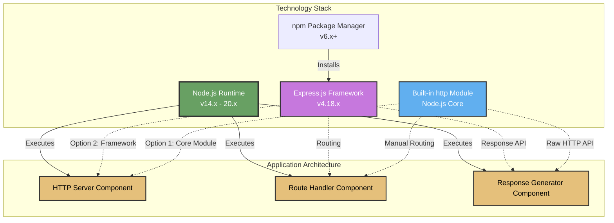
```mermaid
graph TB
    subgraph "Technology Stack"
        A[Node.js Runtime<br/>v14.x - 20.x]
        B[Express.js Framework<br/>v4.18.x]
        C[Built-in http Module<br/>Node.js Core]
        D[npm Package Manager<br/>v6.x+]
    end
    
    subgraph "Application Architecture"
        E[HTTP Server Component]
        F[Route Handler Component]
        G[Response Generator Component]
    end
    
    A -->|Executes| E
    A -->|Executes| F
    A -->|Executes| G
    
    B -.->|Option 2: Framework| E
    B -.->|Routing| F
    B -.->|Response API| G
    
    C -.->|Option 1: Core Module| E
    C -.->|Manual Routing| F
    C -.->|Raw HTTP API| G
    
    D -->|Installs| B
    
    style A fill:#68A063,stroke:#333,stroke-width:3px,color:#fff
    style B fill:#C678DD,stroke:#333,stroke-width:2px,color:#fff
    style C fill:#61AFEF,stroke:#333,stroke-width:2px,color:#fff
    style E fill:#E5C07B,stroke:#333,stroke-width:2px,color:#000
    style F fill:#E5C07B,stroke:#333,stroke-width:2px,color:#000
    style G fill:#E5C07B,stroke:#333,stroke-width:2px,color:#000
```

### 3.8.2 Technology Layer Architecture

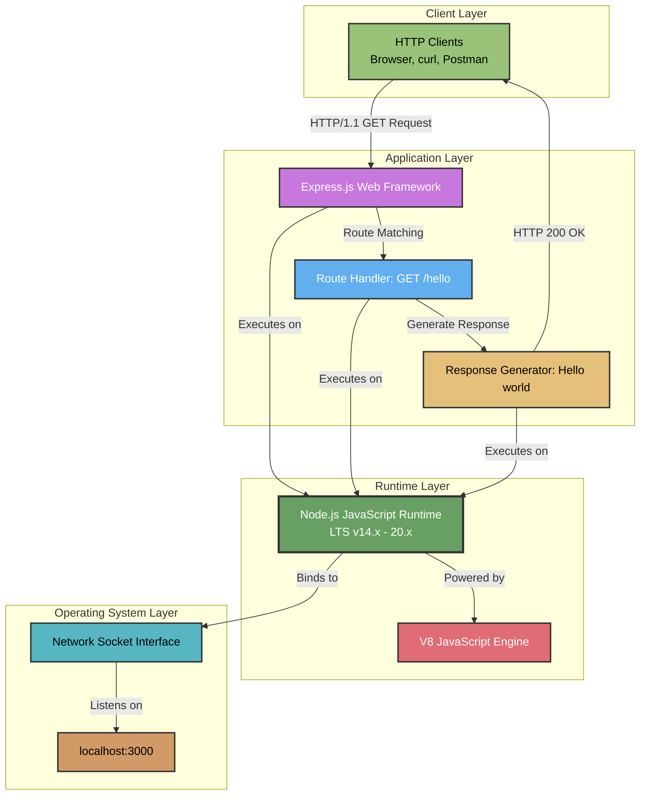
```mermaid
graph TB
    subgraph "Client Layer"
        A[HTTP Clients<br/>Browser, curl, Postman]
    end
    
    subgraph "Application Layer"
        B[Express.js Web Framework]
        C[Route Handler: GET /hello]
        D[Response Generator: Hello world]
    end
    
    subgraph "Runtime Layer"
        E[Node.js JavaScript Runtime<br/>LTS v14.x - 20.x]
        F[V8 JavaScript Engine]
    end
    
    subgraph "Operating System Layer"
        G[Network Socket Interface]
        H[localhost:3000]
    end
    
    A -->|HTTP/1.1 GET Request| B
    B -->|Route Matching| C
    C -->|Generate Response| D
    D -->|HTTP 200 OK| A
    
    B -->|Executes on| E
    C -->|Executes on| E
    D -->|Executes on| E
    
    E -->|Powered by| F
    E -->|Binds to| G
    G -->|Listens on| H
    
    style A fill:#98C379,stroke:#333,stroke-width:2px,color:#000
    style B fill:#C678DD,stroke:#333,stroke-width:2px,color:#fff
    style C fill:#61AFEF,stroke:#333,stroke-width:2px,color:#fff
    style D fill:#E5C07B,stroke:#333,stroke-width:2px,color:#000
    style E fill:#68A063,stroke:#333,stroke-width:3px,color:#fff
    style F fill:#E06C75,stroke:#333,stroke-width:2px,color:#fff
    style G fill:#56B6C2,stroke:#333,stroke-width:2px,color:#000
    style H fill:#D19A66,stroke:#333,stroke-width:2px,color:#000
```

### 3.8.3 Request Flow with Technology Stack

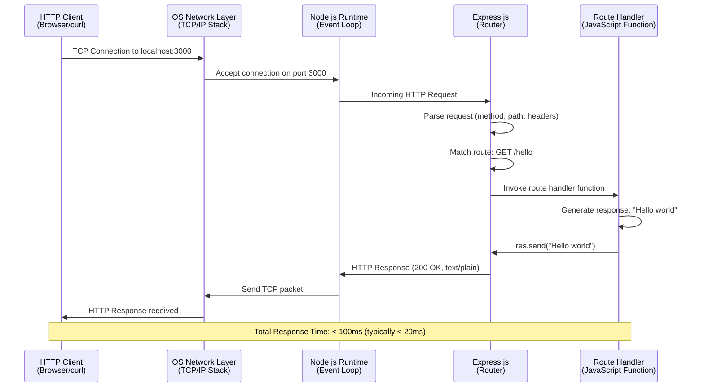
```mermaid
sequenceDiagram
    participant Client as HTTP Client<br/>(Browser/curl)
    participant OS as OS Network Layer<br/>(TCP/IP Stack)
    participant Node as Node.js Runtime<br/>(Event Loop)
    participant Express as Express.js<br/>(Router)
    participant Handler as Route Handler<br/>(JavaScript Function)
    
    Client->>OS: TCP Connection to localhost:3000
    OS->>Node: Accept connection on port 3000
    Node->>Express: Incoming HTTP Request
    Express->>Express: Parse request (method, path, headers)
    Express->>Express: Match route: GET /hello
    Express->>Handler: Invoke route handler function
    Handler->>Handler: Generate response: "Hello world"
    Handler->>Express: res.send("Hello world")
    Express->>Node: HTTP Response (200 OK, text/plain)
    Node->>OS: Send TCP packet
    OS->>Client: HTTP Response received
    
    Note over Client,Handler: Total Response Time: < 100ms (typically < 20ms)
```

## 3.9 References

### 3.9.1 Technical Specification Sections Examined

- **Section 1.2 System Overview**: Architecture components, technical approach options (built-in HTTP vs Express.js), success criteria, and core technical approach documentation
- **Section 1.3 Scope**: In-scope features, explicit exclusions of databases, cloud services, CI/CD, authentication, testing frameworks, and production deployment capabilities
- **Section 2.1 Feature Catalog**: Four features documented (F-001: HTTP Server Infrastructure, F-002: /hello Endpoint, F-003: Project Configuration, F-004: Port Configuration)
- **Section 2.4 Implementation Considerations**: Detailed comparison of implementation options, performance requirements (< 5 second startup, < 100ms response time), setup efficiency targets (< 5 minutes, ≤ 3 commands), technical constraints (Node.js LTS version requirements, code complexity limits), and security considerations
- **Section 2.2 Functional Requirements**: 15 detailed requirements across all features including HTTP server initialization, endpoint response accuracy, project setup, and port configuration
- **Section 2.3 Feature Relationships and Dependencies**: Integration points between components and dependency relationships

### 3.9.2 Repository Files and Folders Examined

- **`/` (repository root, depth: 1)**: Confirmed greenfield project status with empty repository structure
- **`README.md`**: Auto-generated repository readme confirming no existing implementation

### 3.9.3 Key Technology Documentation Sources

**Official Documentation:**
- Node.js Official Documentation (nodejs.org): Core `http` module API, runtime version information, LTS release schedule
- Express.js Official Documentation (expressjs.com): Framework API, routing patterns, version 4.x documentation
- npm Official Documentation (npmjs.com): Package management, package.json specification, dependency resolution

**Version References:**
- Node.js LTS Schedule: Version 14.x, 16.x, 18.x, 20.x support requirements
- Express.js Releases: Version 4.18.x as recommended stable release
- npm Registry: Package availability and version resolution

### 3.9.4 Technology Selection Rationale Sources

- **Section 2.4.1.2 Recommended Approach**: Express.js selected as recommended framework based on industry-standard patterns, code readability for beginners, and foundation for future tutorial expansions
- **User Requirements**: "nodejs tutorial project that features one end point '/hello' that returns 'Hello world'" - establishes Node.js as sole language and minimal scope requirement

### 3.9.5 Constraint and Exclusion Sources

- **Section 2.4.3.2 Scope Limitations**: Comprehensive list of 20+ excluded capabilities including multiple endpoints, HTTP methods beyond GET, database integration, authentication, HTTPS, CORS, testing frameworks, production deployment, and Docker containerization
- **Section 1.3.2 Out-of-Scope Elements**: Detailed exclusion documentation for external APIs, cloud services, authentication providers, monitoring platforms, email services, payment gateways, and CDN integration
- **Section 2.4.3.3 Security Considerations**: Educational-purpose-only security notice and explicit exclusion of production security features

---

**Document Section Status**: Complete ✓  
**Technology Stack Documentation**: Minimal Node.js stack with Express.js framework recommendation  
**Version Requirements**: Node.js LTS (14.x - 20.x), Express.js ^4.18.0, npm 6.x+  
**Key Exclusions**: No databases, no cloud infrastructure, no CI/CD, no containerization, no authentication, no frontend frameworks  
**Setup Efficiency**: < 5 minutes with ≤ 3 commands (clone, install, start)  
**Security Notice**: Educational purposes only - not for production deployment

# 4. Process Flowchart

## 4.1 Overview and Workflow Context

This section provides comprehensive process flowcharts and workflow documentation for the Node.js tutorial application. The system implements a minimal yet complete HTTP server architecture centered around a single endpoint (`/hello`) that returns a plain text "Hello world" response. Despite its educational simplicity, the application encompasses several critical workflows that demonstrate fundamental web server operations, including server initialization, request-response processing, error handling, and graceful lifecycle management.

The workflows documented here reflect the deliberately constrained scope of a tutorial project designed for beginner to intermediate Node.js developers. Each process flow emphasizes clarity and educational value while maintaining technical accuracy. The documentation covers both the recommended Express.js framework approach and the alternative built-in HTTP module implementation, enabling readers to understand the architectural differences and tradeoffs between these approaches.

All process flows adhere to the performance criteria established for this tutorial: response times under 100 milliseconds, server startup times under 5 seconds, and total project setup times under 5 minutes. These constraints ensure the application provides immediate feedback suitable for learning environments while demonstrating production-grade architectural patterns in miniature.

## 4.2 High-Level System Workflow

### 4.2.1 Complete System Interaction Flow

The high-level system workflow encompasses the entire interaction chain from initial user action through HTTP client communication to response delivery. This end-to-end flow demonstrates how external actors (HTTP clients such as browsers, curl, or API testing tools) interact with the Node.js server infrastructure to retrieve the "Hello world" response.

The workflow operates across four primary swim lanes representing distinct system actors and components:

1. **HTTP Client**: The external entity initiating requests, which may be a web browser, command-line tool like curl, API testing platform like Postman, or any HTTP/1.1-compliant client
2. **Node.js Server**: The core HTTP server infrastructure responsible for accepting TCP connections, parsing HTTP requests, and managing the server lifecycle
3. **Route Handler**: The application logic layer that matches incoming request paths and HTTP methods to determine the appropriate handler function
4. **Response Generator**: The component responsible for constructing HTTP responses with appropriate status codes, headers, and body content

This architectural separation creates clear boundaries of responsibility and enables the tutorial to demonstrate proper separation of concerns even within a minimal application scope.

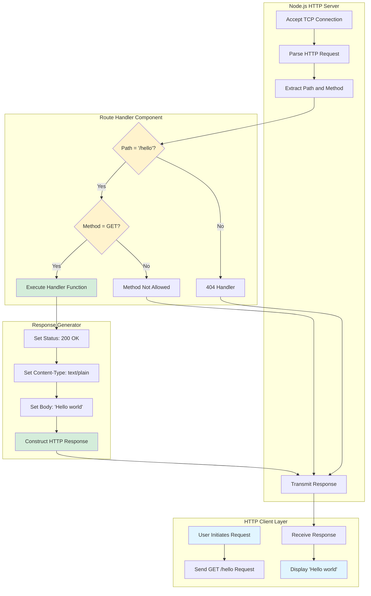
```mermaid
graph TB
    subgraph Client["HTTP Client Layer"]
        A[User Initiates Request] --> B[Send GET /hello Request]
        J[Receive Response] --> K[Display 'Hello world']
    end
    
    subgraph Server["Node.js HTTP Server"]
        C[Accept TCP Connection] --> D[Parse HTTP Request]
        D --> E[Extract Path and Method]
        I[Transmit Response]
    end
    
    subgraph Routing["Route Handler Component"]
        E --> F{Path = '/hello'?}
        F -->|Yes| G{Method = GET?}
        F -->|No| L[404 Handler]
        G -->|Yes| H[Execute Handler Function]
        G -->|No| M[Method Not Allowed]
    end
    
    subgraph Response["Response Generator"]
        H --> N[Set Status: 200 OK]
        N --> O[Set Content-Type: text/plain]
        O --> P[Set Body: 'Hello world']
        P --> Q[Construct HTTP Response]
    end
    
    Q --> I
    I --> J
    L --> I
    M --> I
    
    style A fill:#e1f5ff
    style K fill:#e1f5ff
    style H fill:#d4edda
    style Q fill:#d4edda
    style F fill:#fff3cd
    style G fill:#fff3cd
```

### 4.2.2 System Interaction Sequence

The interaction sequence follows a request-response pattern characteristic of RESTful HTTP services. When a user initiates a request, the HTTP client constructs a GET request targeting the `/hello` endpoint at the configured server address (typically `http://localhost:3000/hello` or similar). This request traverses the network stack, establishing a TCP connection with the Node.js server.

Upon receiving the connection, the server accepts it and begins parsing the incoming HTTP request headers and body. The server extracts critical routing information, specifically the request path (`/hello`) and HTTP method (`GET`). This information flows into the route handler component, which performs two sequential validation checks: first verifying the path matches the expected `/hello` endpoint, then confirming the HTTP method is GET.

When both validations succeed, the route handler invokes the designated handler function. This function serves as the business logic layer, though in this tutorial scope it performs the simple task of preparing a "Hello world" response. The handler delegates to the response generator component, which constructs a complete HTTP response including status code 200, Content-Type header set to `text/plain`, and the response body containing "Hello world".

The fully constructed response returns through the server infrastructure, which transmits it back to the waiting client. The client receives the response, parses it, and presents the "Hello world" message to the user. At this point, the request-response cycle completes, with the server returning to its listening state ready to process subsequent requests.

For requests that fail path or method validation, the system branches to error handling paths. Requests to paths other than `/hello` trigger 404 Not Found responses, while requests using HTTP methods other than GET may trigger method not allowed responses (implementation-dependent based on the chosen approach).

## 4.3 Server Initialization and Lifecycle Management

### 4.3.1 Server Startup Process

The server initialization process represents the critical path from application code loading to active request handling. This workflow must complete successfully before the server can accept any incoming HTTP connections, making it the foundational process for the entire application.

The startup sequence begins when a user executes the server start command, typically `npm start` or `node server.js` in the project directory. Node.js loads the application code into memory, initializing the JavaScript runtime environment and parsing the main server file. During this phase, the application imports required dependencies—either the Express.js framework (if using the recommended approach) or the built-in `http` module (if using the zero-dependency alternative).

Following code initialization, the application loads port configuration settings. The server binds to a specific port number (defaulting to 3000, 8080, or another common development port) on the localhost interface. Port configuration may be hardcoded in the application, loaded from environment variables, or defined in the package.json file depending on the implementation approach chosen.

With configuration loaded, the application creates an HTTP server instance. For Express.js implementations, this involves instantiating an Express application object and defining route handlers declaratively. For HTTP module implementations, this involves calling `http.createServer()` with a request handler function that contains manual routing logic.

The most critical decision point in the initialization workflow occurs during port binding. The server attempts to bind to the configured port, which will succeed only if that port is not already in use by another process. Port binding failure, typically manifesting as an EADDRINUSE error, represents the most common initialization error and requires user intervention to resolve (either by changing the configured port or terminating the conflicting process).

Upon successful port binding, the server transitions to the active listening state and logs a confirmation message to the console (typically "Server listening on port [PORT]"). At this point, the server is fully operational and ready to accept incoming HTTP connections. The initialization process completes in under 5 seconds under normal conditions, meeting the tutorial's performance requirements.

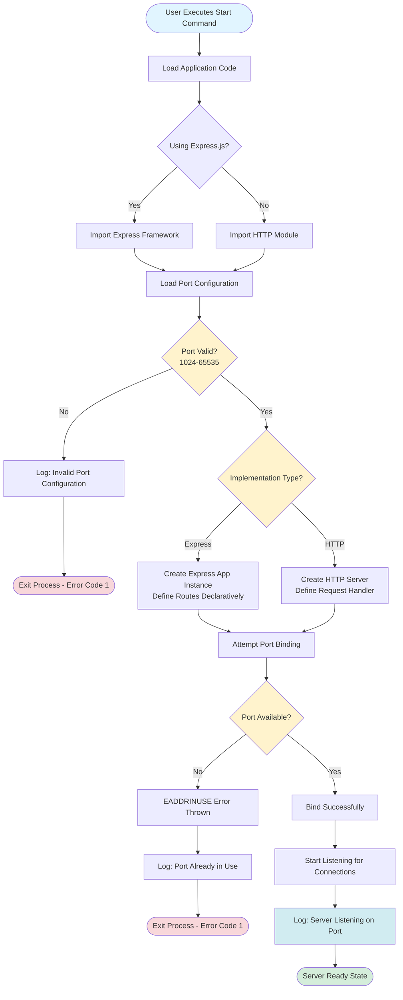
```mermaid
flowchart TD
    Start([User Executes Start Command]) --> Load[Load Application Code]
    Load --> Import{Using Express.js?}
    Import -->|Yes| ExpressImport[Import Express Framework]
    Import -->|No| HttpImport[Import HTTP Module]
    
    ExpressImport --> LoadConfig[Load Port Configuration]
    HttpImport --> LoadConfig
    
    LoadConfig --> ValidatePort{Port Valid?<br/>1024-65535}
    ValidatePort -->|No| PortError[Log: Invalid Port Configuration]
    PortError --> Exit1([Exit Process - Error Code 1])
    
    ValidatePort -->|Yes| CreateServer{Implementation Type?}
    CreateServer -->|Express| CreateExpress[Create Express App Instance<br/>Define Routes Declaratively]
    CreateServer -->|HTTP| CreateHttp[Create HTTP Server<br/>Define Request Handler]
    
    CreateExpress --> AttemptBind[Attempt Port Binding]
    CreateHttp --> AttemptBind
    
    AttemptBind --> BindCheck{Port Available?}
    BindCheck -->|No| BindError[EADDRINUSE Error Thrown]
    BindError --> LogError[Log: Port Already in Use]
    LogError --> Exit2([Exit Process - Error Code 1])
    
    BindCheck -->|Yes| BindSuccess[Bind Successfully]
    BindSuccess --> StartListen[Start Listening for Connections]
    StartListen --> LogSuccess[Log: Server Listening on Port]
    LogSuccess --> Ready([Server Ready State])
    
    style Start fill:#e1f5ff
    style Ready fill:#d4edda
    style Exit1 fill:#f8d7da
    style Exit2 fill:#f8d7da
    style BindCheck fill:#fff3cd
    style ValidatePort fill:#fff3cd
    style CreateServer fill:#fff3cd
    style LogSuccess fill:#d1ecf1
```

### 4.3.2 State Transition Management

The server progresses through a well-defined sequence of states during its lifecycle, from initial invocation through active operation to eventual termination. Understanding these state transitions provides insight into the server's operational readiness and helps diagnose initialization or runtime issues.

**Uninitialized State**: The server begins in the uninitialized state before the Node.js process loads the application code. No resources have been allocated, no modules have been imported, and no server instances exist. This state exists only momentarily as the Node.js runtime bootstraps.

**Initializing State**: Upon code loading, the server enters the initializing state. During this phase, the application imports dependencies, creates server instances, and prepares to bind to the network. The server cannot yet accept connections but is actively preparing to do so.

**Binding State**: When the server attempts to bind to the configured port, it enters the binding state. This represents a critical transition point, as port binding may succeed or fail depending on port availability. The binding state is typically brief, lasting only milliseconds under normal conditions.

**Ready State**: Successful port binding transitions the server to the ready state, its primary operational mode. In this state, the server actively listens for incoming TCP connections, processes HTTP requests, and generates responses. The server remains in the ready state indefinitely until it receives a termination signal or encounters a fatal error. This is the only state in which the server can successfully handle client requests.

**Error State**: If initialization fails—due to port binding errors, missing dependencies, invalid configuration, or other critical issues—the server transitions to the error state. In this state, the application logs diagnostic information to help users identify and resolve the problem, then typically exits the process with a non-zero exit code.

**Shutting Down State**: When the server receives a termination signal (SIGTERM, SIGINT from Ctrl+C, or programmatic shutdown), it enters the shutting down state. During this phase, a production server would gracefully complete in-flight requests and release resources, though this tutorial implementation performs only basic cleanup due to its educational scope.

**Stopped State**: The final state occurs when the Node.js process terminates. All resources are released, connections are closed, and the application exits completely. Re-entering the ready state requires restarting the entire initialization sequence.

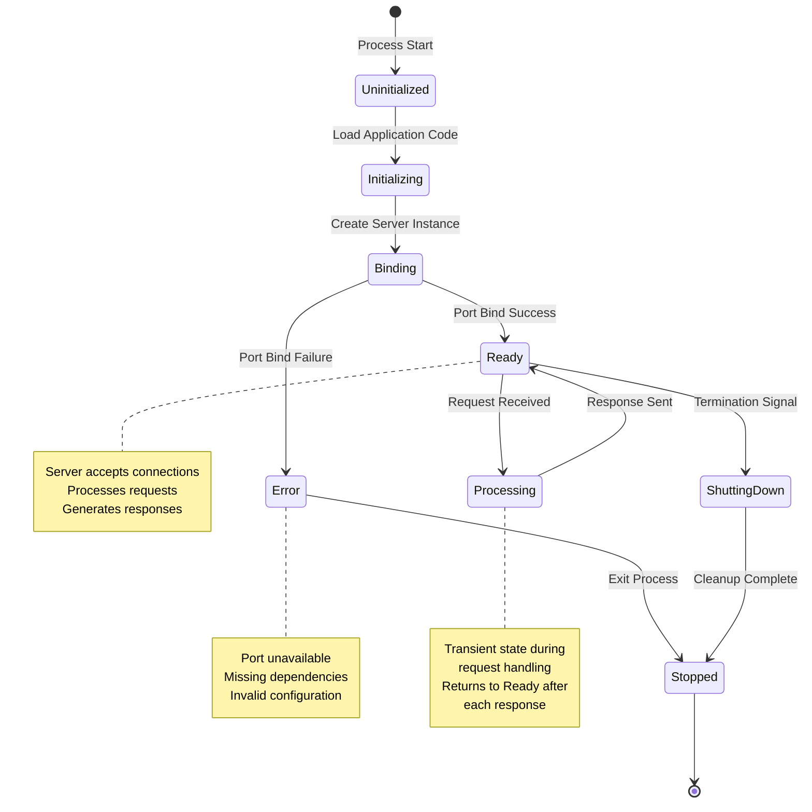
```mermaid
stateDiagram-v2
    [*] --> Uninitialized: Process Start
    Uninitialized --> Initializing: Load Application Code
    Initializing --> Binding: Create Server Instance
    
    Binding --> Ready: Port Bind Success
    Binding --> Error: Port Bind Failure
    
    Ready --> Processing: Request Received
    Processing --> Ready: Response Sent
    
    Ready --> ShuttingDown: Termination Signal
    Error --> Stopped: Exit Process
    ShuttingDown --> Stopped: Cleanup Complete
    Stopped --> [*]
    
    note right of Ready
        Server accepts connections
        Processes requests
        Generates responses
    end note
    
    note right of Error
        Port unavailable
        Missing dependencies
        Invalid configuration
    end note
    
    note right of Processing
        Transient state during
        request handling
        Returns to Ready after
        each response
    end note
```

### 4.3.3 Request State Transitions

Individual HTTP requests also progress through their own state lifecycle, independent of but hosted by the server's overall state. Each incoming request follows this transition sequence:

**Received State**: When the server accepts a TCP connection and begins parsing the HTTP request, the request enters the received state. The server extracts headers, method, path, and other request metadata during this phase.

**Routing State**: With request information parsed, the request transitions to the routing state. The route handler component evaluates the request path against defined routes and validates the HTTP method. Decision logic determines whether the request matches the `/hello` endpoint pattern.

**Processing State**: Successfully routed requests transition to the processing state, where the designated handler function executes. For this tutorial application, processing involves minimal logic—simply preparing the "Hello world" response string. More complex applications would perform business logic, database queries, or external API calls during this state.

**Responding State**: After handler execution completes, the request enters the responding state. The response generator constructs the complete HTTP response with appropriate status code, headers, and body content. The server then transmits this response back to the client over the established TCP connection.

**Complete State**: Once the response transmission finishes, the request reaches the complete state. The request's lifecycle ends, resources are released, and the connection either closes or returns to the connection pool for potential reuse (depending on HTTP keep-alive settings).

Failed routing (404 errors) or method mismatches cause requests to transition directly from routing to responding state, bypassing the processing state and generating error responses instead of success responses.

## 4.4 Request-Response Workflow Details

### 4.4.1 End-to-End Request Processing

The request-response workflow represents the core operational process of the HTTP server, executing repeatedly for each incoming client request. This workflow demonstrates the complete journey of a single HTTP transaction from client initiation through server processing to response delivery.

The workflow begins when an HTTP client initiates a GET request targeting the `/hello` endpoint. The client constructs an HTTP/1.1 request message containing the request line (`GET /hello HTTP/1.1`), headers (including Host, User-Agent, Accept, and others), and an empty body (GET requests do not include request bodies). The client establishes a TCP connection to the server's listening port and transmits this request message over the connection.

The Node.js HTTP server receives the incoming TCP connection and accepts it, creating a socket for bidirectional communication. The server's request parser analyzes the incoming byte stream, identifying the HTTP protocol version, method, path, headers, and body. This parsing process extracts the critical routing information: the request path `/hello` and the HTTP method `GET`.

With request information extracted, control flows to the routing component. This component implements the application's routing logic, which in this tutorial scope consists of a single route definition matching the `/hello` path. The router performs two sequential validation checks:

1. **Path Validation**: Compares the request path against the registered route pattern. The path must exactly match `/hello` (case-sensitive). Requests to `/`, `/Hello`, `/hello/`, or any other path fail this validation.

2. **Method Validation**: Verifies the HTTP method is GET. While the tutorial scope focuses exclusively on GET requests, production servers would validate methods and return 405 Method Not Allowed responses for unsupported methods.

When both validations succeed, the router invokes the registered handler function for the `/hello` endpoint. This handler function contains the business logic for generating the response—in this case, the trivial task of returning the "Hello world" string. The handler receives request and response objects as parameters, providing access to request details and response generation methods.

The handler delegates to the response generator component, instructing it to construct an HTTP response with specific characteristics:

- **Status Code**: 200 OK, indicating successful request processing
- **Content-Type Header**: `text/plain`, signaling that the response body contains plain text rather than HTML, JSON, or other formats
- **Content-Length Header**: Calculated based on the "Hello world" string length (11 bytes in UTF-8 encoding)
- **Response Body**: The literal string "Hello world"

The response generator assembles these components into a complete HTTP response message conforming to the HTTP/1.1 specification. The server transmits this response back to the client over the established TCP connection, completing the server's responsibilities for this transaction.

The client receives the response, parses the status code and headers, and extracts the "Hello world" body content. The client application then presents this content to the user, whether by displaying it in a browser window, printing it to a terminal (in the case of curl), or showing it in an API testing tool interface.

With the response delivered, the HTTP transaction completes. Depending on connection settings (HTTP keep-alive), the TCP connection may remain open for subsequent requests or close immediately. The server returns to its listening state, ready to process the next incoming request. The entire workflow typically completes in well under 100 milliseconds, meeting the tutorial's performance requirements.

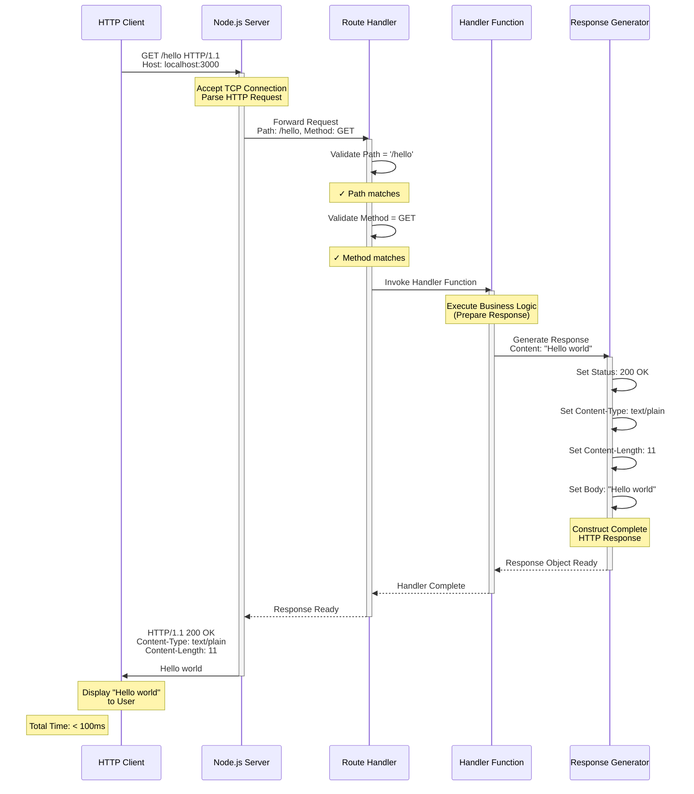
```mermaid
sequenceDiagram
    participant Client as HTTP Client
    participant Server as Node.js Server
    participant Router as Route Handler
    participant Handler as Handler Function
    participant Generator as Response Generator
    
    Client->>Server: GET /hello HTTP/1.1<br/>Host: localhost:3000
    activate Server
    Note over Server: Accept TCP Connection<br/>Parse HTTP Request
    
    Server->>Router: Forward Request<br/>Path: /hello, Method: GET
    activate Router
    
    Router->>Router: Validate Path = '/hello'
    Note over Router: ✓ Path matches
    
    Router->>Router: Validate Method = GET
    Note over Router: ✓ Method matches
    
    Router->>Handler: Invoke Handler Function
    activate Handler
    Note over Handler: Execute Business Logic<br/>(Prepare Response)
    
    Handler->>Generator: Generate Response<br/>Content: "Hello world"
    activate Generator
    
    Generator->>Generator: Set Status: 200 OK
    Generator->>Generator: Set Content-Type: text/plain
    Generator->>Generator: Set Content-Length: 11
    Generator->>Generator: Set Body: "Hello world"
    
    Note over Generator: Construct Complete<br/>HTTP Response
    
    Generator-->>Handler: Response Object Ready
    deactivate Generator
    Handler-->>Router: Handler Complete
    deactivate Handler
    Router-->>Server: Response Ready
    deactivate Router
    
    Server->>Client: HTTP/1.1 200 OK<br/>Content-Type: text/plain<br/>Content-Length: 11<br/><br/>Hello world
    deactivate Server
    
    Note over Client: Display "Hello world"<br/>to User
    
    Note left of Client: Total Time: < 100ms
```

### 4.4.2 Route Matching and Validation Rules

Route matching serves as the critical decision-making component that determines how the server handles each incoming request. The routing logic implements business rules that define which requests receive successful responses and which receive error responses.

For this tutorial application, routing logic remains deliberately simple, matching only a single route pattern. However, the architectural pattern demonstrated here scales to support complex routing scenarios in production applications. The routing component evaluates each request against defined routes using the following validation sequence:

**Path Validation**: The router extracts the request path from the parsed HTTP request and compares it against registered route patterns. For the `/hello` endpoint, validation requires exact string matching. The path must be literally `/hello` with no variations:

- ✓ Valid: `/hello`
- ✗ Invalid: `/` (root path)
- ✗ Invalid: `/Hello` (incorrect capitalization)
- ✗ Invalid: `/hello/` (trailing slash)
- ✗ Invalid: `/hello?name=user` (query parameters don't affect path matching, but represent unhandled functionality)
- ✗ Invalid: `/api/hello` (different path hierarchy)
- ✗ Invalid: `/helloworld` (path prefix matching not supported)

Path matching behavior differs between implementation approaches. Express.js provides built-in route matching with automatic 404 handling for unmatched routes, while HTTP module implementations require manual path comparison logic.

**Method Validation**: After successful path matching, the router validates the HTTP method. The tutorial scope explicitly supports only the GET method for the `/hello` endpoint. Requests using POST, PUT, DELETE, PATCH, or other HTTP methods should ideally receive 405 Method Not Allowed responses, though the tutorial implementation may handle these more simply due to its educational focus.

Method validation ensures the endpoint handler receives only requests it expects to process. Production applications strictly enforce method validation to prevent security issues and maintain clear API contracts.

**Protocol Validation**: The Node.js HTTP server inherently validates HTTP protocol compliance during request parsing. Malformed requests that don't conform to HTTP/1.1 specifications cause parsing errors before reaching routing logic. The tutorial assumes all incoming requests use valid HTTP/1.1 protocol.

### 4.4.3 Response Generation Process

Response generation transforms handler output into properly formatted HTTP responses that clients can parse and understand. This process ensures responses comply with HTTP specifications and include all required metadata.

The response generation workflow proceeds through several systematic steps:

**Status Code Assignment**: The response generator sets the HTTP status code to 200 OK, indicating successful request processing. This three-digit code informs the client that the server found the requested resource, successfully processed the request, and is returning the expected content.

**Header Construction**: The generator adds HTTP headers that describe the response content:

- **Content-Type**: Set to `text/plain` to indicate the response body contains plain text without HTML markup. This header guides client rendering behavior.
- **Content-Length**: Calculated as 11 bytes, representing the length of "Hello world" in UTF-8 encoding. This header allows clients to allocate appropriate buffer space and verify complete response receipt.
- **Date**: Automatically added by the Node.js HTTP server, indicating when the response was generated.
- **Connection**: May be set to "keep-alive" or "close" depending on connection management strategy.

**Body Composition**: The generator places the "Hello world" string into the response body. As plain text content, this requires no encoding beyond UTF-8 character encoding. More complex applications might JSON-encode objects, render HTML templates, or serialize binary data during this step.

**Response Serialization**: The complete response, including status line, headers, and body, serializes into an HTTP message conforming to the HTTP/1.1 specification format:

```
HTTP/1.1 200 OK
Content-Type: text/plain
Content-Length: 11
Date: [current date/time]

Hello world
```

**Transmission**: The serialized response transmits to the client over the established TCP connection, completing the server's response obligations.

The response generation process maintains consistent response format across all successful requests, ensuring reliable client integration and predictable behavior.

## 4.5 Implementation Approach Workflows

### 4.5.1 Express.js Framework Implementation Flow

The Express.js framework provides a high-level abstraction that simplifies HTTP server implementation through declarative routing, automatic request parsing, and convenient response methods. This recommended approach reduces code complexity while maintaining professional architecture patterns.

The Express.js workflow begins with framework initialization. The application imports the Express library and creates an Express application instance by calling `express()`. This instance serves as the central coordinator for all HTTP server functionality, providing methods for route definition, middleware configuration, and server lifecycle management.

Route definition follows a declarative pattern using the Express app's routing methods. The application defines the `/hello` endpoint by calling `app.get('/hello', handler)`, where the first parameter specifies the route path and the second provides the handler function. Express registers this route in its internal routing table, associating the path pattern with the handler for future request matching.

When Express receives an incoming HTTP request, its built-in routing engine automatically compares the request path against all registered routes. The framework handles the complexity of path parsing, parameter extraction, and pattern matching internally. For requests matching `/hello`, Express invokes the registered handler function, passing request and response objects as parameters.

The handler function receives these objects and uses Express's response methods to generate the output. The application calls `res.send('Hello world')`, which automatically:

- Sets the status code to 200 if not explicitly set
- Infers the Content-Type as `text/plain` based on the string argument
- Calculates the Content-Length header
- Serializes the response
- Transmits it to the client

This single method call encapsulates the entire response generation process, demonstrating Express's convenience and developer productivity advantages.

For requests that don't match any registered route, Express automatically generates 404 Not Found responses without requiring explicit handler code. This built-in 404 handling eliminates common boilerplate code and ensures consistent error responses.

The Express implementation typically requires approximately 15-20 lines of meaningful code, significantly less than the HTTP module alternative. This conciseness makes Express the recommended approach for the tutorial, allowing students to focus on web server concepts rather than implementation minutiae.

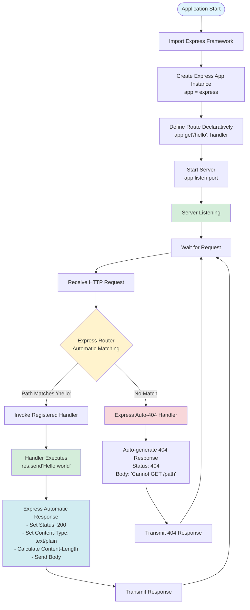
```mermaid
flowchart TD
    Start([Application Start]) --> Import[Import Express Framework]
    Import --> CreateApp[Create Express App Instance<br/>app = express]
    CreateApp --> DefineRoute[Define Route Declaratively<br/>app.get'/hello', handler]
    DefineRoute --> StartServer[Start Server<br/>app.listen port]
    
    StartServer --> Listen[Server Listening]
    Listen --> WaitReq[Wait for Request]
    
    WaitReq --> RecvReq[Receive HTTP Request]
    RecvReq --> ExpressRoute{Express Router<br/>Automatic Matching}
    
    ExpressRoute -->|Path Matches '/hello'| InvokeHandler[Invoke Registered Handler]
    ExpressRoute -->|No Match| Express404[Express Auto-404 Handler]
    
    InvokeHandler --> HandlerExec[Handler Executes<br/>res.send'Hello world']
    
    HandlerExec --> AutoResponse[Express Automatic Response<br/>- Set Status: 200<br/>- Set Content-Type: text/plain<br/>- Calculate Content-Length<br/>- Send Body]
    
    Express404 --> Auto404[Auto-generate 404 Response<br/>Status: 404<br/>Body: 'Cannot GET /path']
    
    AutoResponse --> TransmitSuccess[Transmit Response]
    Auto404 --> TransmitError[Transmit 404 Response]
    
    TransmitSuccess --> WaitReq
    TransmitError --> WaitReq
    
    style Start fill:#e1f5ff
    style Listen fill:#d4edda
    style HandlerExec fill:#d4edda
    style AutoResponse fill:#d1ecf1
    style ExpressRoute fill:#fff3cd
    style Express404 fill:#f8d7da
```

### 4.5.2 Built-in HTTP Module Implementation Flow

The built-in HTTP module provides a lower-level approach to HTTP server implementation, offering greater control at the cost of increased code complexity. This zero-dependency alternative demonstrates fundamental Node.js HTTP capabilities without framework abstractions.

The HTTP module workflow begins with importing Node.js's built-in `http` module. Unlike Express, this module ships with Node.js and requires no additional dependencies, making it suitable for minimal installations or educational environments where dependency management complexity should be avoided.

Server creation uses the `http.createServer()` function, which accepts a request handler function as its argument. This handler function receives every incoming HTTP request, regardless of path or method, requiring manual routing logic to determine appropriate responses.

The application defines its request handler as a function that receives request and response objects. Within this function, the developer implements manual routing logic to parse the request URL and method, then conditionally execute appropriate response logic:

```
function handler(req, res) {
  if (req.url === '/hello' && req.method === 'GET') {
    // Generate success response
  } else {
    // Generate 404 response (if implemented)
  }
}
```

This manual routing requires explicit if/else or switch/case logic to handle different paths and methods. The application must extract `req.url` and `req.method` properties and perform string comparisons to determine the request type.

For requests matching `/hello` with GET method, the handler manually constructs the response by:

1. Calling `res.writeHead(200, {'Content-Type': 'text/plain'})` to set status and headers
2. Calling `res.write('Hello world')` or `res.end('Hello world')` to write the response body and complete the response

This manual approach requires more code but provides granular control over every aspect of the HTTP response. Developers explicitly set each header and status code, making the HTTP protocol mechanics visible and educational.

For unmatched routes, the application may implement manual 404 handling by detecting paths that don't match `/hello` and sending appropriate error responses. Alternatively, simpler implementations might send generic responses or even fail to handle unmatched routes gracefully, though this represents poor practice even in tutorial contexts.

The HTTP module implementation typically requires 30-40 lines of code, approximately double the Express approach. While more verbose, this approach provides valuable insight into HTTP server fundamentals and framework-free Node.js development.

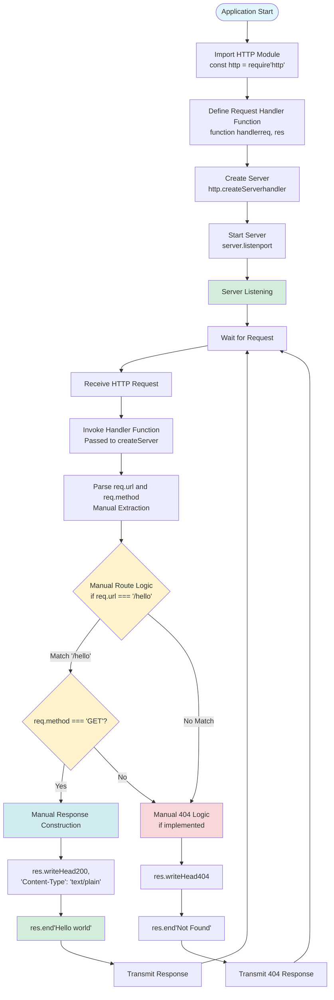
```mermaid
flowchart TD
    Start([Application Start]) --> Import[Import HTTP Module<br/>const http = require'http']
    Import --> DefineHandler[Define Request Handler Function<br/>function handlerreq, res]
    DefineHandler --> CreateServer[Create Server<br/>http.createServerhandler]
    CreateServer --> StartServer[Start Server<br/>server.listenport]
    
    StartServer --> Listen[Server Listening]
    Listen --> WaitReq[Wait for Request]
    
    WaitReq --> RecvReq[Receive HTTP Request]
    RecvReq --> InvokeHandler[Invoke Handler Function<br/>Passed to createServer]
    
    InvokeHandler --> ParseURL[Parse req.url and req.method<br/>Manual Extraction]
    ParseURL --> ManualRoute{Manual Route Logic<br/>if req.url === '/hello'}
    
    ManualRoute -->|Match '/hello'| CheckMethod{req.method === 'GET'?}
    ManualRoute -->|No Match| Manual404[Manual 404 Logic<br/>if implemented]
    
    CheckMethod -->|Yes| ManualResponse[Manual Response Construction]
    CheckMethod -->|No| Manual404
    
    ManualResponse --> WriteHead[res.writeHead200,<br/>'Content-Type': 'text/plain']
    WriteHead --> WriteBody[res.end'Hello world']
    
    Manual404 --> Write404Head[res.writeHead404]
    Write404Head --> Write404Body[res.end'Not Found']
    
    WriteBody --> TransmitSuccess[Transmit Response]
    Write404Body --> TransmitError[Transmit 404 Response]
    
    TransmitSuccess --> WaitReq
    TransmitError --> WaitReq
    
    style Start fill:#e1f5ff
    style Listen fill:#d4edda
    style ManualResponse fill:#d1ecf1
    style WriteBody fill:#d4edda
    style ManualRoute fill:#fff3cd
    style CheckMethod fill:#fff3cd
    style Manual404 fill:#f8d7da
```

### 4.5.3 Implementation Approach Comparison

The choice between Express.js and the HTTP module represents a fundamental architectural decision that affects code complexity, dependency management, and educational value. Each approach offers distinct advantages and tradeoffs.

**Code Complexity Comparison**:

Express.js requires approximately 15-20 lines of meaningful code, with route handlers separated cleanly from server initialization. The framework's declarative API reduces boilerplate and improves code readability. Developers can understand the application's behavior at a glance without parsing complex conditional logic.

The HTTP module approach requires 30-40 lines of code, with routing logic embedded within the request handler function. Manual URL parsing and conditional logic increase cognitive load and create more opportunities for bugs. However, this increased complexity makes HTTP protocol mechanics more visible, providing educational value for developers learning web server fundamentals.

**Dependency Management Comparison**:

Express.js introduces a single external dependency (express ^4.18.0) that must be installed via npm. This dependency brings additional transitive dependencies that collectively occupy several megabytes in the node_modules directory. While this overhead is negligible for most projects, it introduces complexity in the form of dependency updates, security audits, and version management.

The HTTP module is a built-in Node.js module requiring zero external dependencies. Applications can run immediately after cloning without executing `npm install`. This zero-dependency approach minimizes installation time and eliminates dependency management concerns, making it attractive for minimal environments or educational contexts emphasizing Node.js core capabilities.

**Automatic Feature Comparison**:

Express.js provides automatic 404 handling, request parsing, body parsing (with middleware), parameter extraction, and response convenience methods. These built-in features handle common scenarios without requiring explicit code, accelerating development and reducing error likelihood.

The HTTP module provides only raw request and response streams, requiring manual implementation of routing, error handling, and response formatting. While more laborious, this manual approach provides complete control and deep understanding of HTTP mechanics.

**Learning Objectives Comparison**:

For tutorials emphasizing rapid development, modern best practices, and framework familiarity, Express.js represents the optimal choice. It teaches patterns used in production Node.js applications and prepares students for real-world development scenarios.

For tutorials emphasizing Node.js fundamentals, HTTP protocol understanding, and framework-free development, the HTTP module provides superior educational value. Students learn the underlying mechanisms that frameworks abstract, building foundational knowledge transferable to any framework or platform.

The tutorial recommendation favors Express.js due to its industry prevalence, reduced complexity, and faster path to working code. However, both approaches represent valid implementation strategies with legitimate use cases.

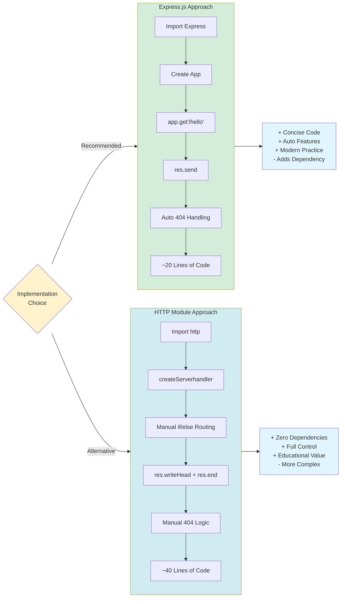
```mermaid
graph LR
    subgraph Express["Express.js Approach"]
        E1[Import Express] --> E2[Create App]
        E2 --> E3[app.get'/hello']
        E3 --> E4[res.send]
        E4 --> E5[Auto 404 Handling]
        E5 --> E6[~20 Lines of Code]
    end
    
    subgraph HTTP["HTTP Module Approach"]
        H1[Import http] --> H2[createServerhandler]
        H2 --> H3[Manual if/else Routing]
        H3 --> H4[res.writeHead + res.end]
        H4 --> H5[Manual 404 Logic]
        H5 --> H6[~40 Lines of Code]
    end
    
    Decision{Implementation<br/>Choice}
    Decision -->|Recommended| Express
    Decision -->|Alternative| HTTP
    
    Express --> Outcome1[+ Concise Code<br/>+ Auto Features<br/>+ Modern Practice<br/>- Adds Dependency]
    HTTP --> Outcome2[+ Zero Dependencies<br/>+ Full Control<br/>+ Educational Value<br/>- More Complex]
    
    style Decision fill:#fff3cd
    style Express fill:#d4edda
    style HTTP fill:#d1ecf1
    style Outcome1 fill:#e1f5ff
    style Outcome2 fill:#e1f5ff
```

## 4.6 Error Handling and Recovery Flows

### 4.6.1 Initialization Error Handling

Server initialization represents the most error-prone phase of the application lifecycle, with multiple potential failure points that prevent successful server startup. The application must detect these errors, communicate them clearly to users, and fail gracefully rather than entering undefined states.

**Port Binding Errors**: The most common initialization error occurs when the configured port is already in use by another process. This situation arises when:

- A previous instance of the server is still running
- Another application (database server, web server, development tool) is using the same port
- The operating system has reserved the port for system services
- The port is in TIME_WAIT state after recent use

When port binding fails, the Node.js HTTP server emits an error event with code 'EADDRINUSE'. The application should catch this error, log a descriptive message indicating which port failed to bind, and exit the process with a non-zero exit code. The error message should guide users toward resolution:

```
Error: Port 3000 is already in use
Please ensure no other server is running on this port, or configure a different port.
```

The application should not attempt automatic retry with alternative ports, as this could lead to confusion about which port the server is actually using. Clear failure with actionable error messages provides better user experience than silent recovery.

**Invalid Port Configuration Errors**: If the configured port falls outside the valid range (typically 1024-65535 for non-privileged processes), the application should detect this during configuration loading and fail immediately with a validation error. Attempting to bind to invalid ports wastes time and produces cryptic error messages from the operating system.

**Missing Dependency Errors**: When using the Express.js approach, if the Express package has not been installed (missing node_modules directory), Node.js will throw a MODULE_NOT_FOUND error when attempting to import Express. This error occurs during the require/import statement and prevents the application from running.

The error manifests immediately upon execution:

```
Error: Cannot find module 'express'
```

The application cannot gracefully handle this error within its own code, as the error occurs during module loading before the application code executes. Users must resolve this error by running `npm install` to install dependencies.

**File System Permission Errors**: In restricted environments, the application may lack permission to bind to network ports or access required files. These errors typically manifest as EACCES (permission denied) errors. The tutorial scope assumes standard development environments where users have appropriate permissions, but production deployments must consider these scenarios.

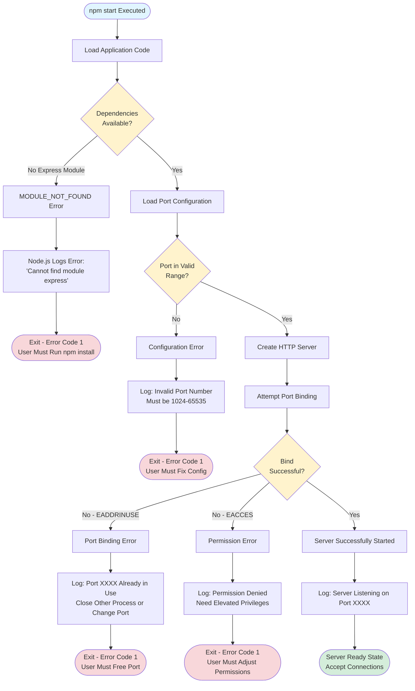
```mermaid
flowchart TD
    Start([npm start Executed]) --> LoadCode[Load Application Code]
    
    LoadCode --> CheckDeps{Dependencies<br/>Available?}
    CheckDeps -->|No Express Module| DepError[MODULE_NOT_FOUND Error]
    DepError --> LogDep[Node.js Logs Error:<br/>'Cannot find module express']
    LogDep --> ExitDep([Exit - Error Code 1<br/>User Must Run npm install])
    
    CheckDeps -->|Yes| LoadConfig[Load Port Configuration]
    LoadConfig --> ValidatePort{Port in Valid<br/>Range?}
    ValidatePort -->|No| ConfigError[Configuration Error]
    ConfigError --> LogConfig[Log: Invalid Port Number<br/>Must be 1024-65535]
    LogConfig --> ExitConfig([Exit - Error Code 1<br/>User Must Fix Config])
    
    ValidatePort -->|Yes| CreateServer[Create HTTP Server]
    CreateServer --> BindPort[Attempt Port Binding]
    
    BindPort --> BindSuccess{Bind<br/>Successful?}
    BindSuccess -->|No - EADDRINUSE| PortError[Port Binding Error]
    PortError --> LogPort[Log: Port XXXX Already in Use<br/>Close Other Process or Change Port]
    LogPort --> ExitPort([Exit - Error Code 1<br/>User Must Free Port])
    
    BindSuccess -->|No - EACCES| PermError[Permission Error]
    PermError --> LogPerm[Log: Permission Denied<br/>Need Elevated Privileges]
    LogPerm --> ExitPerm([Exit - Error Code 1<br/>User Must Adjust Permissions])
    
    BindSuccess -->|Yes| Success[Server Successfully Started]
    Success --> LogSuccess[Log: Server Listening on Port XXXX]
    LogSuccess --> Ready([Server Ready State<br/>Accept Connections])
    
    style Start fill:#e1f5ff
    style Ready fill:#d4edda
    style ExitDep fill:#f8d7da
    style ExitConfig fill:#f8d7da
    style ExitPort fill:#f8d7da
    style ExitPerm fill:#f8d7da
    style CheckDeps fill:#fff3cd
    style ValidatePort fill:#fff3cd
    style BindSuccess fill:#fff3cd
```

### 4.6.2 Runtime Error Handling

Once the server successfully initializes and enters the ready state, it becomes much more stable, with fewer error scenarios requiring handling. The tutorial's minimal scope deliberately excludes most runtime error scenarios, but certain situations still require appropriate handling.

**404 Not Found Responses**: Requests to paths other than `/hello` represent the primary runtime "error" scenario, though 404 responses are normal HTTP behavior rather than exceptional errors. The handling approach differs between implementation strategies:

Express.js automatically generates 404 responses for unmatched routes. When no route matches the incoming request path, Express's built-in fallback handler sends a 404 status code with body text "Cannot GET [path]". This automatic handling requires no explicit code.

HTTP module implementations must manually detect unmatched paths and generate 404 responses. The request handler function should include an else clause that handles paths not matching `/hello`:

```
if (req.url === '/hello') {
  // Success response
} else {
  // 404 response
  res.writeHead(404, {'Content-Type': 'text/plain'});
  res.end('Not Found');
}
```

Failing to implement this manual 404 handling can result in requests hanging without responses or generic error messages.

**Method Not Allowed Responses**: Requests to `/hello` using methods other than GET (POST, PUT, DELETE, etc.) ideally should receive 405 Method Not Allowed responses. However, the tutorial scope may handle these more simply, either by:

- Returning 404 responses (treating method mismatches like path mismatches)
- Returning the success response regardless of method (simplest implementation, though technically incorrect)
- Implementing proper 405 handling (most correct, but adds complexity)

The tutorial implementation may choose the simplest approach to maintain focus on core concepts rather than comprehensive error handling.

**Request Timeout Handling**: Node.js HTTP servers include built-in request timeout handling that automatically closes connections that don't complete within configured time limits. The tutorial implementation relies on these default timeouts without explicit configuration.

**Unhandled Exception Handling**: Production applications should implement global error handlers for unhandled exceptions and promise rejections to prevent server crashes. The tutorial scope deliberately omits this advanced error handling, accepting that bugs in the simple handler code could crash the server. In a real application with such minimal logic, unhandled exceptions would be extremely unlikely.

### 4.6.3 Error Recovery and Logging

The tutorial application implements minimal error recovery due to its educational scope and simple architecture. Most errors result in process exit requiring manual restart, which is acceptable for development environments and educational contexts.

**Logging Strategy**: The application logs significant events to the console (stdout and stderr streams):

- Success: "Server listening on port [PORT]" when initialization completes
- Errors: Descriptive error messages including error type and resolution guidance
- Optional: Request logging showing incoming requests and responses (implementation-dependent)

The tutorial uses console.log() and console.error() for logging, appropriate for development but insufficient for production environments that would require structured logging, log aggregation, and monitoring integration.

**Recovery Approach**: The application implements "fail fast" recovery strategy—when errors occur, the process logs diagnostic information and exits immediately rather than attempting automatic recovery. This approach:

- Provides clear feedback about problems requiring user intervention
- Prevents the server from running in degraded or undefined states
- Simplifies implementation by avoiding complex recovery logic
- Aligns with development environment expectations where developers can quickly restart servers

Production applications would implement more sophisticated recovery including:

- Automatic retry with exponential backoff for transient errors
- Graceful degradation when dependencies become unavailable
- Health check endpoints for monitoring
- Process managers that automatically restart crashed servers
- Dead letter queues for failed requests

These production patterns exceed the tutorial scope but represent important concepts for students to learn in subsequent coursework.

## 4.7 Data Flow Patterns

### 4.7.1 Configuration Data Flow

Configuration data flows from definition through loading into runtime application behavior. The tutorial application maintains minimal configuration, primarily the port number on which the server listens.

The configuration data flow follows this path:

**Definition**: Port configuration is defined in the application code, either as a hardcoded value (`const PORT = 3000;`) or loaded from environment variables (`const PORT = process.env.PORT || 3000;`). The package.json file may also specify the port in npm scripts.

**Loading**: When the application starts, Node.js executes the JavaScript code and evaluates the port configuration expression, storing the resulting value in memory.

**Consumption**: The server initialization code references the port configuration variable when calling the listen() method, passing it as the port parameter.

**Runtime**: The HTTP server binds to the configured port, making it unavailable to other processes and enabling the server to receive connections on that port.

This simple configuration flow demonstrates fundamental configuration patterns without introducing complexity of configuration files, environment-specific settings, or configuration validation frameworks.

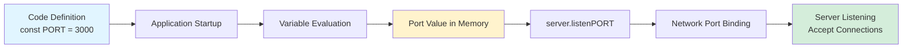
```mermaid
graph LR
    A[Code Definition<br/>const PORT = 3000] --> B[Application Startup]
    B --> C[Variable Evaluation]
    C --> D[Port Value in Memory]
    D --> E[server.listenPORT]
    E --> F[Network Port Binding]
    F --> G[Server Listening<br/>Accept Connections]
    
    style A fill:#e1f5ff
    style D fill:#fff3cd
    style G fill:#d4edda
```

### 4.7.2 Request Data Flow

Request data flows from external clients through multiple processing layers to generate appropriate responses. This data flow represents the core operational pattern of the HTTP server.

**Incoming Request Flow**:

1. **Network Layer**: HTTP client transmits request over TCP connection
2. **Socket Layer**: Node.js accepts TCP connection and creates socket
3. **HTTP Parser**: Node.js parses raw bytes into HTTP request object
4. **Request Object**: Structured data containing method, URL, headers, body
5. **Routing Layer**: Route matcher extracts path and method for comparison
6. **Handler Layer**: Matched handler receives request object as parameter
7. **Business Logic**: Handler processes request (minimal processing in this tutorial)

**Outgoing Response Flow**:

1. **Response Generation**: Handler creates response content ("Hello world")
2. **Response Object**: Response methods called to set status, headers, body
3. **HTTP Serialization**: Response object serialized into HTTP message format
4. **Socket Layer**: Serialized response written to socket buffer
5. **Network Layer**: TCP transmits response bytes to client
6. **Client Reception**: Client receives and parses response

Throughout this flow, data transforms from raw bytes to structured objects and back to bytes, demonstrating the layered architecture of network communication.

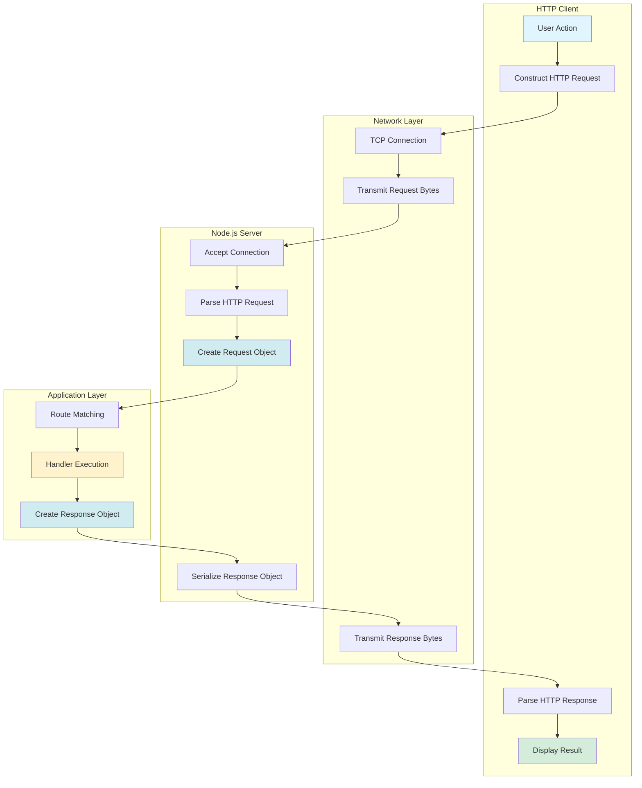
```mermaid
graph TD
    subgraph Client["HTTP Client"]
        A[User Action] --> B[Construct HTTP Request]
        K[Parse HTTP Response] --> L[Display Result]
    end
    
    subgraph Network["Network Layer"]
        C[TCP Connection] --> D[Transmit Request Bytes]
        J[Transmit Response Bytes]
    end
    
    subgraph Server["Node.js Server"]
        E[Accept Connection] --> F[Parse HTTP Request]
        F --> G[Create Request Object]
        I[Serialize Response Object]
    end
    
    subgraph Application["Application Layer"]
        G --> H[Route Matching]
        H --> M[Handler Execution]
        M --> N[Create Response Object]
    end
    
    B --> C
    D --> E
    N --> I
    I --> J
    J --> K
    
    style A fill:#e1f5ff
    style L fill:#d4edda
    style M fill:#fff3cd
    style G fill:#d1ecf1
    style N fill:#d1ecf1
```

### 4.7.3 Logging Data Flow

Logging data flows from application events to console output, providing visibility into server operations for debugging and monitoring.

**Event Generation**: Application code generates log events at significant points:
- Server initialization: "Server listening on port [PORT]"
- Errors: Descriptive error messages with context
- Optional request logging: Request path and method for incoming requests

**Log Method Invocation**: Code calls console.log() for informational messages or console.error() for error messages, passing string messages as arguments.

**Stream Writing**: Console methods write to stdout (for console.log) or stderr (for console.error) streams. These are standard POSIX streams that every process inherits.

**Terminal Display**: The shell or terminal running the Node.js process displays stream output to the user, typically with stderr appearing in red or otherwise distinguished from stdout.

**Optional Redirection**: Users may redirect stdout or stderr to files for persistent logging, though the tutorial implementation doesn't require this capability.

This simple logging pattern provides adequate visibility for development and educational use without introducing logging framework complexity.

## 4.8 Integration and Component Interaction

### 4.8.1 Internal Component Integration

The tutorial application's internal architecture comprises several components that must integrate correctly to produce working functionality. These components communicate through function calls, object passing, and event emission.

**HTTP Server to Route Handler Integration**: The HTTP server component invokes the route handler component for every incoming request. In Express.js, this integration occurs through the framework's internal routing engine, which maintains a mapping of route patterns to handler functions. When requests arrive, Express invokes the appropriate handler automatically.

In HTTP module implementations, this integration is more explicit. The request handler function passed to `http.createServer()` receives every request, and this function contains the routing logic that determines which code paths execute.

**Route Handler to Response Generator Integration**: The route handler component delegates response generation to the response generator component by calling response object methods. This integration follows the command pattern—the handler issues commands (method calls) that instruct the response object to configure and send responses.

Express provides high-level commands like `res.send()` that encapsulate multiple operations, while the HTTP module provides lower-level commands like `res.writeHead()` and `res.end()` that must be composed correctly.

**Configuration to Server Integration**: Port configuration data flows from configuration definitions to server initialization through variable references. The server initialization code reads the port configuration variable and passes it to the server's listen() method, establishing the integration between configuration and runtime behavior.

These internal integrations remain simple in the tutorial scope, demonstrating fundamental patterns without introducing complex component interaction scenarios.

### 4.8.2 External System Integration

The tutorial application integrates with several external systems to provide its functionality:

**Node.js Runtime Integration**: The application integrates deeply with the Node.js runtime environment, using its built-in HTTP module (directly or indirectly through Express), event loop for asynchronous operation, and stream APIs for network communication. This integration happens automatically through Node.js's JavaScript engine and standard library.

**npm Registry Integration**: During installation, npm integrates with the npm registry (registry.npmjs.org) to download the Express.js package and its dependencies. This integration occurs over HTTPS and follows npm's package resolution algorithm to determine which package versions to install.

**Operating System Network Stack Integration**: The HTTP server integrates with the operating system's network stack to bind to ports, accept TCP connections, and transmit data over sockets. Node.js abstracts most of this integration through its libuv library, providing cross-platform network APIs that work consistently across Windows, macOS, and Linux.

**HTTP Client Integration**: The application integrates with any HTTP/1.1-compliant client, including web browsers, curl, wget, Postman, and custom HTTP clients. This integration follows the HTTP specification, ensuring compatibility with the vast ecosystem of HTTP tools and libraries.

**Terminal/Console Integration**: The application integrates with the terminal or console environment through stdout and stderr streams for logging output. This integration enables users to monitor server operation and diagnose issues through console messages.

These external integrations demonstrate how Node.js applications fit into broader computing ecosystems, interoperating with package managers, operating systems, network protocols, and development tools.

## 4.9 Performance and Timing Flow Considerations

### 4.9.1 Performance Target Mapping

The tutorial application must meet specific performance targets to ensure responsive behavior suitable for development and educational use. These targets drive architectural decisions and implementation approaches.

**Response Time Target: < 100 milliseconds**: Each request-response cycle must complete in under 100 milliseconds from the moment the server receives the request to the moment the response transmission completes. This target ensures immediately responsive behavior that feels instantaneous to users.

The application achieves this target through:
- Minimal processing in the handler function (simple string return)
- No database queries or external API calls
- No complex computation or data transformation
- Efficient HTTP parsing and response serialization by Node.js

The response time breaks down approximately as:
- Request parsing: < 5ms
- Route matching: < 1ms
- Handler execution: < 1ms
- Response generation: < 5ms
- Response transmission: < 89ms (variable depending on network)

**Startup Time Target: < 5 seconds**: The server must complete initialization and enter ready state within 5 seconds of executing the start command. This target ensures developers can quickly restart the server during development without frustrating delays.

The startup time breaks down approximately as:
- Node.js process start: < 1s
- Module loading: < 2s (Express) or < 0.5s (HTTP module)
- Server creation: < 0.1s
- Port binding: < 0.1s
- Ready state: immediate

**Setup Time Target: < 5 minutes**: The complete setup process from repository clone to running server must complete within 5 minutes, enabling new developers to quickly begin working with the tutorial.

The setup time breaks down approximately as:
- Repository clone: < 30s (depends on network)
- Directory navigation: < 5s
- npm install: < 2 minutes (depends on network and disk speed)
- Server start: < 5s
- Verification: < 30s

These performance targets ensure the tutorial provides excellent developer experience without introducing performance optimization complexity that would distract from educational objectives.

### 4.9.2 Timing Constraints and SLA Boundaries

While the tutorial application lacks formal service level agreements (SLAs) typical of production systems, understanding timing constraints helps frame expectations for acceptable performance.

**Request Processing Latency**: The application should consistently process requests within the 100ms target under normal development workload conditions (sequential requests, low concurrency). This consistency ensures predictable behavior during testing and demonstration.

**Availability**: The server should remain available continuously while running, successfully handling 100% of well-formed requests to the `/hello` endpoint. The tutorial scope doesn't require high availability features like redundancy or automatic failover, as manual restart suffices for development environments.

**Error Response Time**: Error responses (404 Not Found, port binding errors, etc.) should be generated and delivered as quickly as success responses, providing immediate feedback when issues occur.

**Throughput**: While not formally specified, the application should handle typical development workload throughput—likely dozens to hundreds of requests per minute rather than thousands per second. Node.js's asynchronous architecture ensures adequate throughput for this use case without special optimization.

These timing considerations guide testing and validation to ensure the tutorial application behaves appropriately for its intended use case.

## 4.10 Process Flow Integration Summary

The process flowcharts documented in this section illustrate how the Node.js tutorial application transforms from source code to running server to HTTP response generation. The workflows progress through several interconnected phases:

**Initialization Phase**: Project setup and server startup establish the foundational infrastructure, transforming configuration and code into a listening HTTP server ready to accept connections. This phase includes dependency installation, port binding, and state transitions from uninitialized to ready states.

**Operational Phase**: The request-response workflow handles incoming HTTP requests, routing them through validation logic to appropriate handler functions that generate responses. This cyclical workflow repeats for every request the server receives.

**Error Handling Phase**: Error detection and recovery flows provide graceful failure modes when initialization problems or runtime issues occur, ensuring users receive clear diagnostic information.

**Integration Phase**: Component and system integration patterns demonstrate how the application's parts work together and how the application integrates with external systems including Node.js runtime, operating system, and HTTP clients.

Together, these workflows provide comprehensive coverage of all significant processes in the tutorial application, from high-level system interactions to detailed implementation-specific flows. The flowcharts serve as both design documentation for developers implementing the tutorial and reference documentation for those seeking to understand Node.js HTTP server architecture.

The process flows demonstrate fundamental patterns applicable beyond this specific tutorial, including request routing, state management, error handling, and system integration. These patterns scale to more complex applications while remaining clear and accessible in this simplified educational context.

## 4.11 References

#### Repository Files Examined:
- `README.md` - Repository initialization confirmation

#### Technical Specification Sections Retrieved:
- **1.2 System Overview** - Architecture components, system capabilities, success criteria
- **1.3 Scope** - In-scope features, excluded functionality, workflow boundaries
- **2.1 Feature Catalog** - Complete feature set (F-001 through F-004) with metadata
- **2.2 Functional Requirements** - Detailed requirements with acceptance criteria
- **2.3 Feature Relationships and Dependencies** - Dependency mappings, integration points
- **2.4 Implementation Considerations** - Technical approaches, performance requirements, constraints
- **3.1 Overview and Design Philosophy** - Stack architecture principles, design philosophy
- **3.2 Programming Languages** - Node.js version requirements, language features
- **3.3 Frameworks and Libraries** - Express.js vs HTTP module comparison, architectural diagrams
- **3.4 Dependencies and Package Management** - npm configuration, package.json structure, dependency profiles

#### Context Sources:
- User-provided project specification: Node.js tutorial project with `/hello` endpoint returning "Hello world"
- Comprehensive context gathering report including workflow analysis, state management patterns, error handling strategies, and implementation approaches

# 5. System Architecture

## 5.1 High-Level Architecture

### 5.1.1 System Overview

This Node.js tutorial project implements a **minimalist three-layer architecture** designed specifically for educational purposes. The architecture prioritizes simplicity and clarity over feature richness, creating an ideal learning environment for developers new to Node.js HTTP server development. The system consists of three tightly-integrated components that work in concert to handle a single HTTP endpoint, demonstrating the complete request-response cycle in a minimal, comprehensible implementation.

#### 5.1.1.1 Architecture Style and Rationale

The system employs a **synchronous request-response architecture** built on HTTP/1.1 protocols. This architectural style was deliberately chosen to demonstrate fundamental web server patterns without the complexity of asynchronous messaging, WebSocket connections, or event-driven architectures that would obscure the core learning objectives.

The three-layer separation mirrors industry-standard MVC-like patterns while remaining accessible to beginners:
- **HTTP Server Layer**: Manages connection lifecycle and network communication
- **Routing Layer**: Handles request path and method validation
- **Response Generation Layer**: Constructs and delivers HTTP responses

This architecture is intentionally **stateless** with no data persistence requirements, eliminating the complexity of database integration, session management, or cache coordination. Every request is processed independently, producing identical responses regardless of system history or concurrent request load.

#### 5.1.1.2 Key Architectural Principles

The architecture embodies four core principles that guide all design decisions:

**1. Simplicity First**: The system uses zero or minimal dependencies, reducing cognitive overhead for learners. The entire server implementation fits within 15-50 lines of code in a single file, making the complete architecture comprehensible in minutes rather than hours.

**2. Educational Value**: Every architectural decision demonstrates patterns that scale to production applications. The three-layer structure, error handling approach, and configuration patterns all represent real-world practices adapted to tutorial scope.

**3. Accessibility**: All technologies employed are stable, well-documented, and widely supported by the Node.js community. Developers can find extensive resources, tutorials, and troubleshooting guidance for every component.

**4. Rapid Setup**: The complete system can be cloned, configured, and running in under 5 minutes with 3 commands or fewer, eliminating setup frustration that often derails learning momentum.

#### 5.1.1.3 System Boundaries

The system boundaries are carefully defined to maintain focus on HTTP server fundamentals:

**Included Capabilities**:
- Single HTTP server instance listening on a configurable port
- One GET endpoint at path `/hello` returning static text
- Basic error handling for startup failures and unmatched routes
- Console logging for debugging and operational visibility
- Cross-platform support (Windows, macOS, Linux)
- Port configuration via constants or environment variables

**Explicitly Excluded Capabilities**:
- Multiple endpoints or dynamic routing patterns
- HTTP methods beyond GET (no POST, PUT, DELETE, PATCH)
- Request parameter processing (query strings, path parameters, body parsing)
- Database integration or persistent data storage
- Authentication, authorization, or session management
- HTTPS/TLS encryption or certificate management
- Production deployment features (clustering, process management, health checks)
- Testing frameworks or automated test suites
- Containerization (Docker, Kubernetes)
- Monitoring, metrics collection, or observability platforms

These exclusions are intentional, not oversights. Each excluded feature would add complexity that distracts from the core learning objective: understanding how Node.js processes HTTP requests and generates responses.

### 5.1.2 Core Components

The following table documents the three core components that comprise the system architecture:

| Component Name | Primary Responsibility | Key Dependencies | Integration Points |
|----------------|------------------------|------------------|-------------------|
| **HTTP Server Component** | Initialize and manage Node.js HTTP server; bind to configured port; accept incoming TCP connections; handle server lifecycle (startup, shutdown) | Express.js 4.18.x (or Node.js `http` module); Node.js event loop; OS network stack | Receives connections from OS TCP layer; invokes Route Handler for each request; outputs responses to network socket |
| **Route Handler Component** | Match incoming requests to `/hello` endpoint; validate HTTP method (GET only); validate request path (exact match); return 404 for unmatched routes | Express.js routing engine (or manual if/else logic); Request objects from HTTP Server | Receives request objects from HTTP Server; invokes Response Generator for matched routes; handles routing decisions in < 1ms |
| **Response Generator Component** | Construct HTTP response with "Hello world" content; set response headers (Content-Type, Content-Length); configure status code (200 OK); serialize and send response | Express.js response API (or Node.js HTTP response methods); UTF-8 encoding | Receives invocation from Route Handler; outputs complete HTTP response to HTTP Server; completes response in < 5ms |

**Component Interaction Characteristics**:
- All components operate synchronously within the Node.js event loop
- Request processing follows strict sequential flow: Server → Router → Generator → Server
- No component maintains state between requests (fully stateless)
- Components communicate via function calls and object references (no network communication)
- Total end-to-end processing time: < 100ms (typically 5-20ms on localhost)

### 5.1.3 Data Flow Description

#### 5.1.3.1 Configuration Data Flow

Configuration data flows from code definition through runtime binding in a straightforward pipeline:

**Configuration Definition**: Port numbers are defined as JavaScript constants (e.g., `const PORT = 3000`) or read from environment variables (`process.env.PORT`) at application startup. The system defaults to port 3000 or 8080—common development ports that avoid privilege requirements.

**Variable Evaluation**: During Node.js application load, the JavaScript engine evaluates configuration constants and stores them in memory. If environment variables are used, the runtime reads them from the process environment at this stage.

**Server Initialization**: The HTTP Server Component receives the port configuration as a parameter to its `listen()` method, creating the binding between application logic and OS network resources.

**Port Binding**: The operating system's network stack validates the port number, checks for conflicts with existing processes, and establishes a listening socket. Success leads to the "Ready" state; failure triggers EADDRINUSE errors.

**Active Listening**: Once bound, the server accepts incoming TCP connections on the configured port, routing them to the HTTP Server Component for processing.

#### 5.1.3.2 Request-Response Data Flow

The primary data flow handles HTTP requests from clients through processing to response delivery:

**Inbound Request Flow**:
1. **Network Reception**: HTTP client transmits request over TCP/IP network stack
2. **Socket Acceptance**: Node.js accepts TCP connection and creates socket object
3. **HTTP Parsing**: Node.js HTTP parser converts raw bytes into structured request object containing method, URL, headers, and body
4. **Request Object Creation**: Parser produces JavaScript object representing the HTTP request
5. **Routing Analysis**: Route Handler extracts path and method from request object, matching against defined routes
6. **Handler Invocation**: Matched handler function receives request object for processing

**Outbound Response Flow**:
1. **Content Generation**: Response Generator creates "Hello world" string content
2. **Response Construction**: Generator sets HTTP status code (200), headers (Content-Type: text/plain, Content-Length: 11), and body content
3. **HTTP Serialization**: Node.js serializes response object into valid HTTP/1.1 message format
4. **Socket Writing**: Serialized response bytes written to network socket buffer
5. **Network Transmission**: TCP stack transmits response bytes to client
6. **Client Reception**: Client receives, parses, and displays response content

**Data Transformation Points**:
- Raw network bytes → HTTP request object (HTTP parsing)
- Request object → Route match decision (routing logic)
- Route match → Handler invocation (dispatch)
- Handler logic → Response object (business logic)
- Response object → HTTP message bytes (serialization)
- HTTP message → Network transmission (socket I/O)

#### 5.1.3.3 Logging Data Flow

Logging provides operational visibility through console output:

**Log Event Generation**: Application generates log events at significant milestones—server startup, errors, and optionally per-request details. Each event includes contextual information (port numbers, error messages, request paths).

**Log Method Invocation**: Code invokes `console.log()` for informational messages or `console.error()` for error conditions, leveraging Node.js's built-in console API.

**Stream Writing**: Console methods write to process stdout (informational logs) or stderr (error logs), following Unix conventions for output separation.

**Terminal Display**: The shell environment displays stream output in the terminal, providing immediate developer feedback.

**Optional Redirection**: Developers may redirect stdout/stderr to files for persistent logging, though this is optional for tutorial scope.

### 5.1.4 External Integration Points

The following table documents all external system integration points:

| System Name | Integration Type | Data Exchange Pattern | Protocol/Format |
|-------------|------------------|----------------------|-----------------|
| **Node.js Runtime** | Deep integration | Continuous event loop execution; asynchronous I/O callbacks; module loading | JavaScript API calls; CommonJS `require()` |
| **Operating System Network Stack** | Socket-level integration | Bidirectional TCP communication; port binding; connection acceptance | TCP/IP; Socket API; IPv4 |
| **npm Registry** | Installation-time integration | Package download during `npm install` | HTTPS (registry.npmjs.org); JSON package manifests |
| **HTTP Clients** | Request-response integration | Client-initiated HTTP requests; server responses | HTTP/1.1; UTF-8 text; `text/plain` content type |
| **Terminal/Console** | Output-only integration | Application writes logs; terminal displays | stdout/stderr streams; text output |

**Integration Characteristics**:

**Node.js Runtime Integration**: The application has deep, continuous integration with the Node.js runtime environment. The event loop manages all asynchronous operations, the V8 engine executes JavaScript code, and built-in modules (http, process) provide core functionality. This integration is fundamental and operates throughout the application lifecycle.

**Network Stack Integration**: The system integrates with the operating system's TCP/IP stack to bind ports and transmit data. This integration point handles all network I/O, abstracting platform differences through Node.js's libuv library. The integration is active whenever the server is in "Ready" state.

**npm Registry Integration**: Installation-time integration downloads the Express.js framework (if used) from the npm registry over HTTPS. This integration occurs once during setup (`npm install`) and results in packages stored in the local `node_modules` directory. Total installation size is less than 5MB including transitive dependencies.

**HTTP Client Integration**: The system accepts connections from any HTTP/1.1-compatible client including browsers, curl, Postman, and custom applications. Clients initiate connections, send requests, and receive responses following standard HTTP protocol. No client-side integration or configuration is required beyond knowing the server URL.

**Terminal Integration**: The application writes log messages to terminal streams for developer visibility. This one-way integration provides debugging information and operational status without requiring any terminal-specific configuration.

**SLA Requirements**: This tutorial project has no formal SLAs. The system provides best-effort availability while running, with performance targets documented in section 5.4.4. No uptime guarantees, response time SLAs, or service level agreements apply—consistent with development and educational use cases.

## 5.2 Component Details

### 5.2.1 HTTP Server Component

#### 5.2.1.1 Purpose and Responsibilities

The HTTP Server Component serves as the foundation of the system architecture, managing the complete lifecycle of the HTTP server from initialization through request acceptance to graceful shutdown. This component acts as the primary interface between the operating system's network stack and the application's business logic.

**Core Responsibilities**:
- **Server Initialization**: Create HTTP server instance using Express.js framework or Node.js `http` module
- **Port Binding**: Bind server to configured port on localhost interface (127.0.0.1)
- **Connection Management**: Accept incoming TCP connections and maintain connection state
- **Request Delegation**: Pass accepted requests to Route Handler Component for processing
- **Response Delivery**: Transmit generated responses back to clients through established connections
- **Lifecycle Management**: Handle server startup, operational state, and shutdown sequences
- **Error Handling**: Detect and report initialization errors (port conflicts, permission issues)

The component operates as a continuously-running process, maintaining a listening socket throughout the application's lifetime. It processes requests asynchronously through Node.js's event loop, allowing concurrent handling of multiple connections without blocking.

#### 5.2.1.2 Technologies and Frameworks Used

**Primary Technology Option (Recommended): Express.js 4.18.x**

Express.js provides a high-level, developer-friendly API for HTTP server creation and management:

```javascript
const express = require('express');
const app = express();
const PORT = 3000;

app.listen(PORT, () => {
  console.log(`Server listening on port ${PORT}`);
});
```

**Key Express.js Features Utilized**:
- Application instance creation via `express()` factory function
- Declarative routing with `app.get()`, `app.post()`, etc.
- Automatic HTTP parsing and response serialization
- Built-in middleware support for extensibility
- Robust error handling with error middleware

**Alternative Technology Option: Node.js `http` Module**

The built-in `http` module provides lower-level control with zero external dependencies:

```javascript
const http = require('http');
const PORT = 3000;

const server = http.createServer((req, res) => {
  // Manual routing logic required
});

server.listen(PORT, () => {
  console.log(`Server listening on port ${PORT}`);
});
```

**Trade-offs Between Options**:
- **Express.js**: More concise code, industry-standard patterns, easier extensibility; adds one dependency
- **http module**: Zero dependencies, direct protocol access, minimal abstraction; requires more manual implementation

The specification recommends Express.js for its educational value—learners encounter this framework in professional contexts, making tutorial knowledge directly transferable to real-world projects.

#### 5.2.1.3 Key Interfaces and APIs

**Initialization Interface**:
- **Input**: Port number (integer, 1024-65535)
- **Output**: Server instance object (success) or Error (failure)
- **Side Effects**: Binds to OS network port, creates listening socket
- **Timing**: Completes in < 5 seconds (typically 1-2 seconds)

**Request Acceptance Interface**:
- **Input**: Incoming TCP connection from OS network stack
- **Output**: Request object passed to Route Handler Component
- **Processing**: HTTP parsing, request object creation, handler delegation
- **Timing**: Request acceptance in < 1ms per connection

**Response Delivery Interface**:
- **Input**: Response object from Response Generator Component
- **Output**: HTTP message bytes written to network socket
- **Processing**: Response serialization, socket writing, connection management
- **Timing**: Response delivery in < 5ms per request

**Shutdown Interface** (Optional):
- **Input**: Termination signal (SIGINT, SIGTERM)
- **Output**: Graceful shutdown, connection cleanup
- **Processing**: Stop accepting new connections, close existing connections, release port binding

#### 5.2.1.4 Data Persistence Requirements

The HTTP Server Component has **no data persistence requirements**. The component is fully stateless, maintaining no information between requests. Each request is processed independently with no shared state, session data, or persistent storage.

**Transient State Only**:
- Active connection objects (destroyed after response)
- Request objects (scoped to single request lifecycle)
- Response buffers (flushed after transmission)
- Server configuration (loaded at startup, immutable thereafter)

This stateless design simplifies the architecture, eliminates consistency concerns, and ensures predictable behavior regardless of request history or order.

#### 5.2.1.5 Scaling Considerations

For the tutorial scope, scaling considerations are minimal:

**Single-Instance Architecture**: The system runs as a single Node.js process on a single port. No horizontal scaling (multiple instances) or vertical scaling (resource allocation) is implemented or required.

**Development Workload**: The server handles development-level traffic—dozens to hundreds of requests per minute during testing. This workload is well within Node.js's capabilities without optimization.

**Natural Concurrency**: Node.js's event loop provides natural concurrency handling for I/O-bound operations like network communication. The server can handle multiple concurrent connections without explicit threading or process management.

**Explicitly Out of Scope**:
- Load balancing across multiple instances
- Process clustering (Node.js cluster module)
- Database connection pooling
- Caching layers (Redis, Memcached)
- Auto-scaling based on traffic patterns
- Performance optimization or benchmarking

These scaling concerns are intentionally excluded to maintain tutorial simplicity. In production applications, these patterns would become relevant and necessary.

### 5.2.2 Route Handler Component

#### 5.2.2.1 Purpose and Responsibilities

The Route Handler Component implements the routing logic that determines how incoming requests are processed based on their HTTP method and URL path. This component acts as the decision-making layer between request acceptance and response generation.

**Core Responsibilities**:
- **Path Matching**: Examine request URL and match against defined routes
- **Method Validation**: Verify HTTP method (GET) matches endpoint requirements
- **Route Dispatch**: Invoke appropriate handler function for matched routes
- **404 Generation**: Return "Not Found" responses for unmatched routes
- **Request Parsing**: Extract relevant information from request objects (method, path, headers)

The component implements exact-match routing with case-sensitive path comparison. The route `/hello` must match precisely—no trailing slashes, no case variations, no prefix or suffix patterns.

#### 5.2.2.2 Technologies and Frameworks Used

**Express.js Routing Engine**:

Express provides declarative routing with automatic method and path matching:

```javascript
app.get('/hello', (req, res) => {
  // Handler logic invoked automatically for GET /hello
});

// Express automatically handles 404 for unmatched routes
```

**Route Definition Characteristics**:
- Method-specific registration (`app.get()`, `app.post()`, etc.)
- Path pattern matching (string literals, regex, path parameters)
- Middleware chain execution (multiple handlers per route)
- Automatic 404 responses for unmatched routes

**Manual Routing with `http` Module**:

The `http` module requires explicit if/else logic for routing:

```javascript
const server = http.createServer((req, res) => {
  if (req.method === 'GET' && req.url === '/hello') {
    // Handle /hello endpoint
  } else {
    // Return 404 for all other routes
    res.statusCode = 404;
    res.end('Not Found');
  }
});
```

#### 5.2.2.3 Key Interfaces and APIs

**Route Registration Interface** (Express.js):
- **Method**: `app.get(path, handler)`
- **Parameters**: Path string ('/hello'), handler function
- **Effect**: Registers route in routing table
- **Timing**: Registration occurs once at application startup

**Request Matching Interface**:
- **Input**: Request object with `method` and `url` properties
- **Output**: Boolean match result (true/false)
- **Processing**: String comparison of method and path
- **Timing**: < 1ms per request

**Handler Invocation Interface**:
- **Input**: Matched route handler function
- **Parameters**: Request object (`req`), Response object (`res`)
- **Output**: Response generation (delegated to Response Generator)
- **Processing**: Function call with request/response context

**Path Matching Rules**:

| Request Path | Match Result | Rationale |
|--------------|--------------|-----------|
| `/hello` | ✓ Match | Exact match, correct case |
| `/` | ✗ No match | Root path, not `/hello` |
| `/Hello` | ✗ No match | Case mismatch (case-sensitive) |
| `/hello/` | ✗ No match | Trailing slash (strict matching) |
| `/api/hello` | ✗ No match | Path prefix present |
| `/helloworld` | ✗ No match | Path suffix present |

#### 5.2.2.4 Data Persistence Requirements

The Route Handler Component has **no data persistence requirements**. Routing decisions are made based on request properties alone, with no state maintained between requests.

**Stateless Routing**:
- Route table loaded at startup, immutable during execution
- No request history or session tracking
- No route analytics or access counting
- No dynamic route registration or modification

#### 5.2.2.5 Scaling Considerations

**Route Matching Performance**: With a single route, matching performance is trivial—O(1) lookup time for Express.js routing table or single if/else comparison for manual routing. Response time is well under 1ms per request.

**Extensibility Considerations** (For Future Learning):
- Express.js routing patterns scale to hundreds or thousands of routes
- Path parameters (`:id`) and wildcards (`*`) support dynamic routing
- Middleware enables cross-cutting concerns (authentication, logging)
- Router objects allow modular route organization

For the current single-endpoint tutorial, these extensibility features are demonstrated conceptually but not implemented.

### 5.2.3 Response Generator Component

#### 5.2.3.1 Purpose and Responsibilities

The Response Generator Component constructs and delivers HTTP responses to clients. This component transforms application logic outcomes (in this case, the static "Hello world" string) into properly formatted HTTP messages.

**Core Responsibilities**:
- **Content Generation**: Create response body content ("Hello world")
- **Header Configuration**: Set appropriate HTTP headers (Content-Type, Content-Length)
- **Status Code Assignment**: Set HTTP status code (200 OK for success, 404 for not found)
- **Response Serialization**: Convert response object to HTTP/1.1 message format
- **Connection Management**: Handle response completion and connection cleanup

The component ensures all responses conform to HTTP/1.1 specifications, including proper header formatting, UTF-8 encoding, and connection handling.

#### 5.2.3.2 Technologies and Frameworks Used

**Express.js Response API**:

Express provides high-level methods that encapsulate multiple operations:

```javascript
app.get('/hello', (req, res) => {
  res.send('Hello world');  // Sets status, headers, sends content
});
```

**Key Express Response Methods**:
- `res.send(content)`: Automatically sets Content-Type, Content-Length, and sends response
- `res.status(code)`: Sets HTTP status code (chainable with other methods)
- `res.set(header, value)`: Sets custom headers
- `res.json(object)`: Sends JSON responses with appropriate Content-Type

**Node.js HTTP Response API**:

The `http` module requires explicit header and body management:

```javascript
const server = http.createServer((req, res) => {
  res.statusCode = 200;
  res.setHeader('Content-Type', 'text/plain');
  res.end('Hello world');
});
```

**Key HTTP Module Methods**:
- `res.writeHead(statusCode, headers)`: Sets status and headers in one call
- `res.setHeader(name, value)`: Sets individual headers
- `res.write(chunk)`: Writes response body chunks (optional for small responses)
- `res.end(data)`: Completes response, optionally sending final data chunk

#### 5.2.3.3 Key Interfaces and APIs

**Response Generation Interface**:
- **Input**: Static string "Hello world"
- **Processing**: Create response object with status, headers, body
- **Output**: Complete HTTP response ready for serialization
- **Timing**: < 1ms (no computation required for static content)

**HTTP Response Specification**:

| Component | Value | Format |
|-----------|-------|--------|
| Status Code | 200 | HTTP status (OK) |
| Status Text | OK | Standard HTTP status message |
| Content-Type | text/plain | MIME type header |
| Content-Length | 11 | Byte count (UTF-8 encoded) |
| Body | Hello world | UTF-8 encoded string |

**Response Serialization Interface**:
- **Input**: Response object (status, headers, body)
- **Processing**: Convert to HTTP/1.1 message format with CRLF line endings
- **Output**: Byte stream written to network socket
- **Timing**: < 5ms for serialization and socket writing

**Connection Completion Interface**:
- **Processing**: Flush socket buffers, send FIN packet, close connection (if not keep-alive)
- **Side Effects**: Release connection resources, update connection state
- **Timing**: < 1ms for connection cleanup

#### 5.2.3.4 Data Persistence Requirements

The Response Generator Component has **no data persistence requirements**. All responses are generated fresh for each request with no caching, storage, or state management.

**Static Content**:
- "Hello world" string is hardcoded in application logic
- No template rendering or dynamic content generation
- No file system access or database queries
- No content caching or optimization

This approach prioritizes simplicity and predictability over performance optimization.

#### 5.2.3.5 Scaling Considerations

**Response Generation Performance**: Static content generation has negligible computational cost—less than 1ms to create response object. The primary time cost is network I/O (socket writing), typically 5-20ms on localhost.

**Optimization Opportunities** (Out of Scope):
- Response caching (unnecessary for static content)
- Compression (gzip, brotli) for bandwidth efficiency
- Streaming large responses in chunks
- Keep-alive connection pooling
- HTTP/2 or HTTP/3 for multiplexing

For the tutorial scope, these optimizations would add complexity without providing measurable benefit given the minimal response size (11 bytes) and development workload.

### 5.2.4 Component Interaction Diagram

The following sequence diagram illustrates the complete request-response flow through all three components:

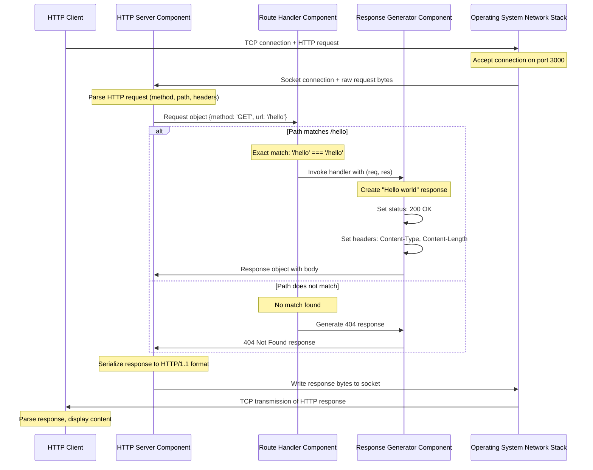
```mermaid
sequenceDiagram
    participant Client as HTTP Client
    participant Server as HTTP Server Component
    participant Router as Route Handler Component
    participant Generator as Response Generator Component
    participant OS as Operating System Network Stack

    Client->>OS: TCP connection + HTTP request
    Note over OS: Accept connection on port 3000
    OS->>Server: Socket connection + raw request bytes
    Note over Server: Parse HTTP request (method, path, headers)
    Server->>Router: Request object {method: 'GET', url: '/hello'}
    
    alt Path matches /hello
        Note over Router: Exact match: '/hello' === '/hello'
        Router->>Generator: Invoke handler with (req, res)
        Note over Generator: Create "Hello world" response
        Generator->>Generator: Set status: 200 OK
        Generator->>Generator: Set headers: Content-Type, Content-Length
        Generator->>Server: Response object with body
    else Path does not match
        Note over Router: No match found
        Router->>Generator: Generate 404 response
        Generator->>Server: 404 Not Found response
    end
    
    Note over Server: Serialize response to HTTP/1.1 format
    Server->>OS: Write response bytes to socket
    OS->>Client: TCP transmission of HTTP response
    Note over Client: Parse response, display content
```

### 5.2.5 Server Lifecycle State Diagram

The following state diagram depicts the server's lifecycle from initialization through shutdown:

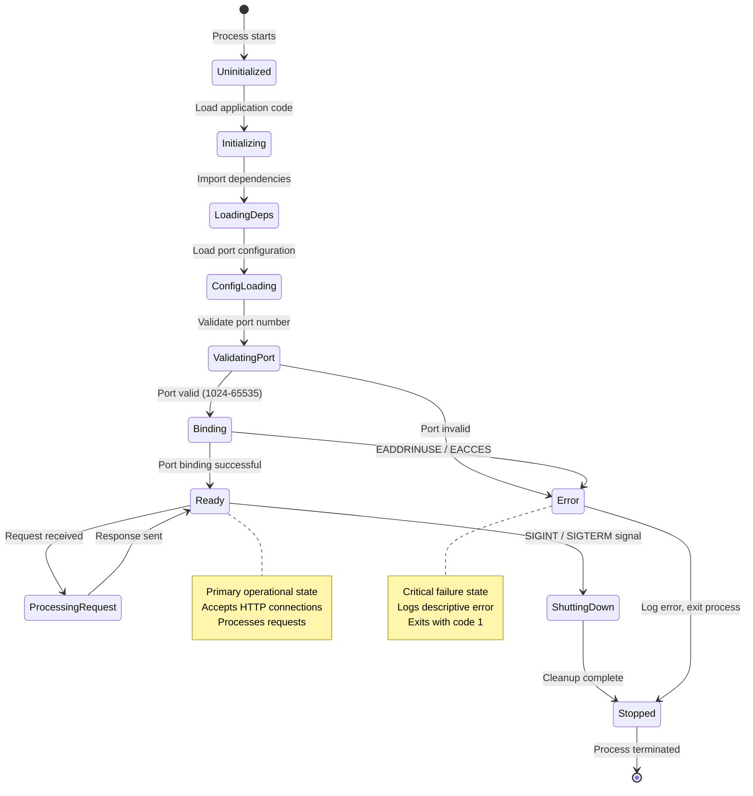
```mermaid
stateDiagram-v2
    [*] --> Uninitialized: Process starts
    
    Uninitialized --> Initializing: Load application code
    
    Initializing --> LoadingDeps: Import dependencies
    LoadingDeps --> ConfigLoading: Load port configuration
    ConfigLoading --> ValidatingPort: Validate port number
    
    ValidatingPort --> Binding: Port valid (1024-65535)
    ValidatingPort --> Error: Port invalid
    
    Binding --> Ready: Port binding successful
    Binding --> Error: EADDRINUSE / EACCES
    
    Ready --> ProcessingRequest: Request received
    ProcessingRequest --> Ready: Response sent
    
    Ready --> ShuttingDown: SIGINT / SIGTERM signal
    ShuttingDown --> Stopped: Cleanup complete
    
    Error --> Stopped: Log error, exit process
    
    Stopped --> [*]: Process terminated
    
    note right of Ready
        Primary operational state
        Accepts HTTP connections
        Processes requests
    end note
    
    note right of Error
        Critical failure state
        Logs descriptive error
        Exits with code 1
    end note
```

### 5.2.6 Request Processing Sequence Diagram

The following diagram shows detailed timing and processing steps for a successful request:

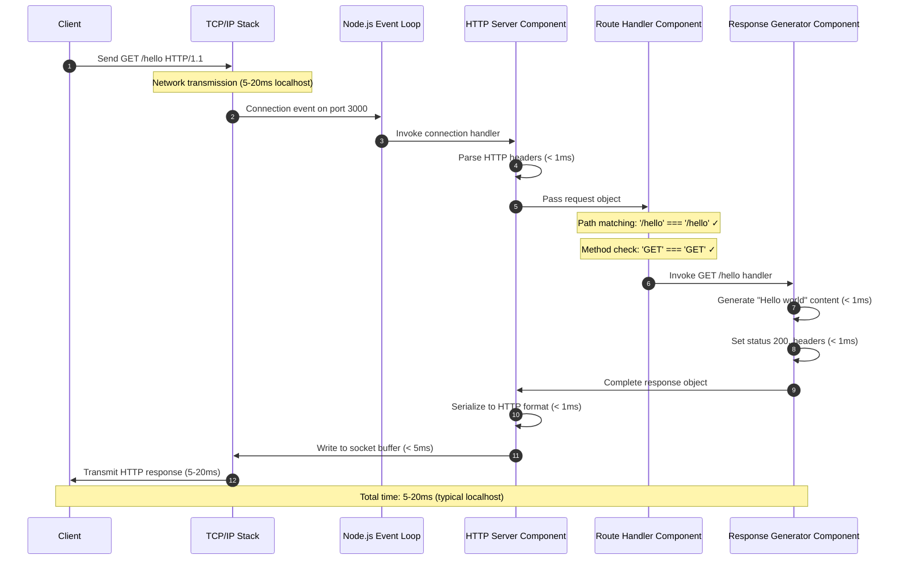
```mermaid
sequenceDiagram
    autonumber
    participant Client
    participant TCP as TCP/IP Stack
    participant EventLoop as Node.js Event Loop
    participant HTTP as HTTP Server Component
    participant Route as Route Handler Component
    participant Response as Response Generator Component
    
    Client->>TCP: Send GET /hello HTTP/1.1
    Note over TCP: Network transmission (5-20ms localhost)
    TCP->>EventLoop: Connection event on port 3000
    EventLoop->>HTTP: Invoke connection handler
    HTTP->>HTTP: Parse HTTP headers (< 1ms)
    HTTP->>Route: Pass request object
    Note over Route: Path matching: '/hello' === '/hello' ✓
    Note over Route: Method check: 'GET' === 'GET' ✓
    Route->>Response: Invoke GET /hello handler
    Response->>Response: Generate "Hello world" content (< 1ms)
    Response->>Response: Set status 200, headers (< 1ms)
    Response->>HTTP: Complete response object
    HTTP->>HTTP: Serialize to HTTP format (< 1ms)
    HTTP->>TCP: Write to socket buffer (< 5ms)
    TCP->>Client: Transmit HTTP response (5-20ms)
    Note over Client,Response: Total time: 5-20ms (typical localhost)
```

## 5.3 Technical Decisions

### 5.3.1 Architecture Style Decision

#### 5.3.1.1 Decision Summary

**Decision**: Implement a minimalist three-layer synchronous request-response architecture with single-file deployment.

**Context**: Tutorial project for teaching Node.js HTTP server fundamentals to beginner and intermediate developers. The architecture must balance educational clarity with real-world applicability.

**Alternatives Considered**:

| Alternative | Advantages | Disadvantages | Decision |
|-------------|-----------|---------------|----------|
| **Minimalist 3-layer** (Selected) | Simple to understand; clear separation of concerns; single file implementation; demonstrates core patterns | Limited extensibility; no microservices; no async patterns | ✓ **Selected** - optimal for tutorial scope |
| **Microservices architecture** | Scalable; technology diversity; independent deployment | Excessive complexity; multiple processes; coordination overhead; distracts from HTTP basics | ✗ Rejected - too complex for tutorial |
| **Event-driven architecture** | Async patterns; high throughput; modern approach | Steep learning curve; callback complexity; harder to debug | ✗ Rejected - obscures request-response basics |
| **Monolithic MVC** | Industry standard; clear patterns; organized code | Over-engineering; multiple files; directory structure complexity | ✗ Rejected - excessive for single endpoint |

#### 5.3.1.2 Rationale

The three-layer architecture provides the minimum viable separation of concerns while remaining comprehensible to beginners:

**Layer 1 - HTTP Server**: Manages network communication and connection lifecycle. This layer represents the "infrastructure" concern—how the application communicates with the outside world. By isolating this layer, learners understand server initialization, port binding, and connection management as distinct operations.

**Layer 2 - Route Handler**: Implements routing logic and request dispatch. This layer represents the "control flow" concern—how requests are analyzed and directed to appropriate handlers. Separating routing makes the decision-making process explicit and visible.

**Layer 3 - Response Generator**: Constructs HTTP responses with proper formatting. This layer represents the "output" concern—how application logic results are transformed into protocol-compliant responses.

This architecture mirrors the separation found in production frameworks (controller/router/view in MVC, handler/middleware/response in Express), making tutorial knowledge directly transferable to professional contexts. The pattern scales conceptually: as learners progress, they can add complexity within each layer (authentication middleware in routing, template rendering in response generation) without changing the fundamental structure.

#### 5.3.1.3 Trade-offs and Implications

**Benefits Achieved**:
- **Educational Clarity**: Each layer has single, clear responsibility
- **Debugging Simplicity**: Request flow follows linear path (Server → Router → Generator)
- **Code Organization**: Natural separation points even in single-file implementation
- **Extensibility Foundation**: Pattern accommodates future complexity without architectural changes
- **Real-World Relevance**: Structure mirrors industry frameworks and patterns

**Limitations Accepted**:
- **No Horizontal Scaling**: Single-instance deployment only
- **No Async Patterns**: Synchronous processing throughout (adequate for tutorial I/O)
- **No Microservice Benefits**: No independent deployment, technology diversity, or service isolation
- **Limited Fault Isolation**: Error in any layer can crash entire process

These limitations are acceptable because they do not impact the tutorial's learning objectives. Development workloads require neither scaling nor fault tolerance, and the architectural pattern remains valid even as complexity increases.

### 5.3.2 Framework Selection Decision

#### 5.3.2.1 Decision Summary

**Decision**: Recommend Express.js 4.18.x as the primary framework while documenting the built-in `http` module as an alternative.

**Context**: Choosing between a zero-dependency approach (built-in `http` module) and a minimal-dependency framework (Express.js) for HTTP server implementation.

**Comparison Analysis**:

| Criterion | Express.js 4.18.x | Node.js `http` Module | Weight | Winner |
|-----------|-------------------|----------------------|--------|---------|
| **Educational Value** | Industry-standard framework; transferable skills; real-world patterns | Core Node.js understanding; protocol exposure; fundamentals | High | Express.js |
| **Code Simplicity** | Concise routing syntax; automatic parsing; high-level API | Manual routing logic; explicit handling; verbose | High | Express.js |
| **Dependency Count** | 1 direct dependency (~30 transitive); 5MB total | Zero dependencies | Medium | `http` module |
| **Learning Curve** | Gentle; familiar patterns; extensive docs | Steeper; protocol knowledge required; less guidance | High | Express.js |
| **Setup Complexity** | Requires `npm install` step | No installation required | Low | `http` module |
| **Future Extensibility** | Middleware ecosystem; plugin architecture | Manual implementation required | Medium | Express.js |
| **Performance** | Minimal overhead; 200KB core; production-ready | No abstraction overhead; direct access | Low | Tie (both adequate) |

**Overall Recommendation**: Express.js - 5 wins vs 2 wins for `http` module, with Express winning all high-weight criteria.

#### 5.3.2.2 Rationale

**Why Express.js is Recommended**:

1. **Industry Relevance**: Express.js powers millions of production applications and is the most widely deployed Node.js web framework. Learners who understand Express have immediately transferable skills for professional development contexts.

2. **Educational Efficiency**: Express's declarative routing syntax reduces cognitive load, allowing learners to focus on HTTP concepts rather than routing mechanics:

   ```javascript
   // Express: intent is immediately clear
   app.get('/hello', (req, res) => res.send('Hello world'));
   
   // vs. http module: requires parsing logic
   if (req.method === 'GET' && req.url === '/hello') {
     res.end('Hello world');
   }
   ```

3. **Documentation and Resources**: Express has extensive documentation, tutorials, Stack Overflow content, and community support. Learners encountering issues find readily available solutions.

4. **Extensibility Path**: As learners progress, Express provides clear patterns for adding middleware, template engines, database integration, and other features—demonstrating how simple projects evolve into complex applications.

5. **Minimal Overhead**: While Express adds a dependency, the overhead is minimal—a single `npm install` command and ~5MB of disk space. This is an acceptable trade-off for the educational benefits gained.

**Why `http` Module is Documented as Alternative**:

The built-in `http` module serves valuable educational purposes:

1. **Zero Dependencies**: Demonstrates that Node.js includes web server capabilities natively
2. **Protocol Understanding**: Exposes learners to HTTP mechanics (headers, status codes, body handling)
3. **Foundation Knowledge**: Shows how frameworks like Express are abstractions over core capabilities
4. **Flexibility**: Provides option for learners who prefer minimal dependencies or want deeper protocol exposure

By documenting both approaches, the tutorial accommodates different learning styles and provides complete context for the framework decision.

#### 5.3.2.3 Trade-offs and Implications

**Express.js Trade-offs**:
- ✓ Faster development and clearer code
- ✓ Industry-standard patterns and practices
- ✓ Extensive ecosystem and community support
- ✗ Adds external dependency (though well-maintained and stable)
- ✗ Abstracts some HTTP protocol details (can be addressed with documentation)

**`http` Module Trade-offs**:
- ✓ Zero external dependencies
- ✓ Direct protocol exposure for learning
- ✓ No installation or network access required
- ✗ More verbose implementation code
- ✗ Manual implementation of common patterns
- ✗ Less relevant to professional development contexts

**Implementation Implications**:
- Tutorial documentation must present both options clearly
- Code examples should demonstrate both Express and `http` implementations
- Setup instructions differ between approaches (`npm install` vs immediate execution)
- Learners should understand when each approach is appropriate

### 5.3.3 Communication Pattern Decision

#### 5.3.3.1 Decision Summary

**Decision**: Implement synchronous HTTP/1.1 request-response communication with no advanced protocols.

**Alternatives Evaluated**:

| Pattern | Use Case | Complexity | Tutorial Fit | Decision |
|---------|----------|------------|--------------|----------|
| **HTTP/1.1 Request-Response** | Stateless communication; standard web pattern | Low | Perfect | ✓ **Selected** |
| **WebSocket (bidirectional)** | Real-time updates; chat applications; live data | High | Excessive | ✗ Rejected |
| **Server-Sent Events (SSE)** | Server-to-client streaming; notifications | Medium | Unnecessary | ✗ Rejected |
| **HTTP/2 Multiplexing** | Performance optimization; header compression | Medium | Premature | ✗ Rejected |
| **gRPC / Protocol Buffers** | Microservices; typed APIs; high performance | High | Over-engineered | ✗ Rejected |

#### 5.3.3.2 Rationale

HTTP/1.1 request-response is the foundational web communication pattern and the appropriate choice for tutorial scope:

**Ubiquity**: Every web developer must understand request-response communication—it is the lingua franca of web development. Learning this pattern first provides a foundation for understanding more complex patterns later.

**Simplicity**: Request-response has a clear mental model: client sends request, server processes request, server sends single response, connection closes (or persists with keep-alive). This linear flow is easy to trace, debug, and understand.

**Protocol Maturity**: HTTP/1.1 is stable, widely documented, and universally supported. The protocol specification is complete with no breaking changes expected, making tutorial content evergreen.

**Adequate Performance**: For development workloads (dozens to hundreds of requests per minute), HTTP/1.1 performance is excellent. Response times of 5-20ms on localhost are well within acceptable ranges for interactive development.

**Tool Compatibility**: All HTTP clients (browsers, curl, Postman) natively support HTTP/1.1 request-response with no configuration required.

**Learning Progression**: After mastering HTTP/1.1, learners have the foundation to understand advanced patterns (WebSocket, SSE, HTTP/2) as extensions or optimizations of the basic pattern.

#### 5.3.3.3 Trade-offs and Implications

**Benefits Achieved**:
- Standard, well-understood communication pattern
- Universal client compatibility
- Simple debugging with standard tools (browser DevTools, curl)
- No protocol negotiation or upgrade complexity
- Clear request/response boundaries

**Limitations Accepted**:
- No real-time bidirectional communication (not required for static response)
- No server-initiated updates (not required for tutorial scope)
- No multiplexing or connection pooling optimization (adequate performance without)
- HTTP/1.1 header overhead (negligible for single endpoint with minimal headers)

These limitations do not impact the tutorial's functionality or learning objectives. A static "Hello world" response has no need for bidirectional communication, real-time updates, or performance optimization beyond what HTTP/1.1 provides natively.

### 5.3.4 Data Storage Decision

#### 5.3.4.1 Decision Summary

**Decision**: Implement a fully stateless server with no data storage, persistence, or caching.

**Alternatives Considered**:

| Storage Type | Purpose | Complexity | Tutorial Relevance | Decision |
|--------------|---------|------------|-------------------|----------|
| **No Storage (Stateless)** | Static response generation | None | Perfect fit | ✓ **Selected** |
| **In-Memory Variables** | Request counting; simple state | Low | Distracts from HTTP basics | ✗ Rejected |
| **SQLite Database** | Persistent data; SQL learning | Medium | Out of scope | ✗ Rejected |
| **MongoDB / NoSQL** | Document storage; modern approach | Medium-High | Over-engineered | ✗ Rejected |
| **Redis Cache** | Performance; session storage | Medium | Premature optimization | ✗ Rejected |
| **File System Storage** | Simple persistence; no database | Low-Medium | Unnecessary complexity | ✗ Rejected |

#### 5.3.4.2 Rationale

**Why No Data Storage**:

1. **Tutorial Focus**: The learning objective is HTTP server fundamentals—how Node.js receives requests and sends responses. Data storage is orthogonal to this objective and would dilute the tutorial's focus.

2. **Simplicity**: A stateless server is the simplest possible architecture. Every request produces identical results regardless of system history, making behavior predictable and debugging trivial.

3. **No Setup Overhead**: Eliminating data storage removes entire categories of setup complexity—no database installation, connection configuration, schema definition, or migration management. Learners can focus entirely on HTTP server mechanics.

4. **Reduced Error Surface**: Data storage introduces numerous failure modes (connection errors, query errors, data corruption, race conditions). Removing storage eliminates these error scenarios, simplifying error handling to HTTP-specific concerns.

5. **Static Response Adequacy**: The `/hello` endpoint returns "Hello world" every time—there is no data to persist, no state to track, no dynamic content to generate. Storage would add complexity without providing any functional benefit.

6. **Scalability by Default**: Stateless servers scale horizontally trivially—multiple instances can run without coordination since there is no shared state. This property, while not utilized in tutorial scope, demonstrates an important architectural principle.

#### 5.3.4.3 Trade-offs and Implications

**Benefits Achieved**:
- Zero setup complexity for data layers
- Predictable, deterministic behavior (same input → same output always)
- No data-related error scenarios (connection failures, query errors, corruption)
- No security concerns (data exposure, injection attacks, unauthorized access)
- Perfect horizontal scalability (instances are completely independent)
- No backup, migration, or data management overhead

**Limitations Accepted**:
- Cannot demonstrate database integration patterns (intentional exclusion)
- Cannot show CRUD operations or data modeling (out of scope)
- Cannot implement request counting or analytics (unnecessary for tutorial)
- Cannot demonstrate caching strategies (no performance optimization needed)

These limitations are intentional and desirable. Data storage would expand tutorial scope beyond HTTP server fundamentals into database management, ORM usage, data modeling, and other topics that deserve dedicated tutorials. The decision to exclude storage maintains laser focus on the core learning objective.

### 5.3.5 Configuration Strategy Decision

#### 5.3.5.1 Decision Summary

**Decision**: Use hardcoded constant for port number with optional environment variable override; no external configuration files.

**Configuration Pattern**:
```javascript
const PORT = process.env.PORT || 3000;
```

**Alternatives Considered**:

| Strategy | Implementation | Flexibility | Complexity | Decision |
|----------|----------------|-------------|------------|----------|
| **Hardcoded Constant + Env Var** | `const PORT = process.env.PORT \|\| 3000` | Medium | Very Low | ✓ **Selected** |
| **Pure Hardcoded Constant** | `const PORT = 3000` | None | Minimal | ✗ Too inflexible |
| **.env File (dotenv)** | Load from `.env` file with `dotenv` package | High | Medium | ✗ Adds dependency |
| **JSON Configuration File** | `require('./config.json')` | High | Low-Medium | ✗ Unnecessary file |
| **YAML Configuration File** | Parse YAML with library | High | Medium-High | ✗ Requires parser library |
| **Command-Line Arguments** | Parse `process.argv` | High | Medium | ✗ Requires argument parsing |

#### 5.3.5.2 Rationale

**Why Hardcoded Default with Environment Variable Override**:

1. **Immediate Functionality**: The hardcoded default (3000 or 8080) allows the server to run immediately with no configuration required. Beginners can execute `npm start` and see results without understanding environment variables or configuration management.

2. **Configuration Demonstration**: The environment variable fallback demonstrates a real-world configuration pattern used in production applications. The pattern `process.env.VARIABLE || defaultValue` is ubiquitous in Node.js applications, making this an valuable educational example.

3. **Zero Dependencies**: No configuration parsing libraries required—both constants and environment variable access are built into JavaScript and Node.js respectively.

4. **Port Conflict Resolution**: If the default port is already in use, developers can easily override without modifying code:
   ```bash
   PORT=8080 npm start  # Unix/macOS/Linux
   set PORT=8080 && npm start  # Windows
   ```

5. **Simplicity**: The entire configuration mechanism is one line of code, easily understood by beginners. No file I/O, no parsing logic, no error handling for missing or malformed configuration files.

6. **Production-Ready Pattern**: This same pattern is used in production Node.js applications, particularly for cloud deployments where platforms (Heroku, AWS, Docker) inject configuration via environment variables.

**Why Port Numbers 3000 or 8080**:
- **Non-Privileged**: Ports above 1024 require no administrator/root privileges
- **Common Development Ports**: Widely used in tutorials and documentation (3000 for Node.js, 8080 for general web servers)
- **Unlikely Conflicts**: Less likely to conflict with system services than ports 80/443
- **Localhost Security**: Binding to 127.0.0.1 prevents external access regardless of port number

#### 5.3.5.3 Trade-offs and Implications

**Benefits Achieved**:
- Immediate functionality with sensible defaults
- Easy port override for conflict resolution
- Demonstrates real-world configuration patterns
- Zero external dependencies or additional files
- Cross-platform compatibility (environment variables work on all OSes)

**Limitations Accepted**:
- Only port number is configurable (host interface, timeout values, etc. are hardcoded)
- No configuration file for complex scenarios (intentional—complexity not needed)
- Environment variable override not obvious to absolute beginners (addressed in documentation)

**Documentation Requirements**: The tutorial must clearly explain:
1. Default port number and rationale
2. How to override via environment variable
3. Cross-platform environment variable syntax (Unix vs Windows)
4. How to detect and resolve port conflicts (EADDRINUSE errors)

### 5.3.6 Technical Decision Summary Diagram

The following diagram visualizes the key architectural decisions and their relationships:

```mermaid
graph TD
    A[System Architecture Decisions] --> B[Architecture Style]
    A --> C[Framework Selection]
    A --> D[Communication Pattern]
    A --> E[Data Storage]
    A --> F[Configuration Strategy]
    
    B --> B1[Minimalist 3-Layer<br/>Synchronous Architecture]
    B1 --> B1A[HTTP Server Layer]
    B1 --> B1B[Route Handler Layer]
    B1 --> B1C[Response Generator Layer]
    
    C --> C1[Express.js 4.18.x<br/>Recommended]
    C --> C2[Node.js http Module<br/>Alternative]
    C1 --> C1A[Industry Standard]
    C1 --> C1B[Educational Value]
    C2 --> C2A[Zero Dependencies]
    C2 --> C2B[Protocol Exposure]
    
    D --> D1[HTTP/1.1<br/>Request-Response]
    D1 --> D1A[Universal Compatibility]
    D1 --> D1B[Simple Mental Model]
    
    E --> E1[No Data Storage<br/>Stateless]
    E1 --> E1A[Zero Setup]
    E1 --> E1B[Predictable Behavior]
    
    F --> F1[Hardcoded + Env Var<br/>PORT=3000]
    F1 --> F1A[Immediate Functionality]
    F1 --> F1B[Easy Override]
    
    style B1 fill:#90EE90
    style C1 fill:#90EE90
    style D1 fill:#90EE90
    style E1 fill:#90EE90
    style F1 fill:#90EE90
```

## 5.4 Cross-Cutting Concerns

### 5.4.1 Monitoring and Observability

#### 5.4.1.1 Observability Approach

This tutorial project implements **minimal console-based observability** appropriate for development and learning environments. The observability strategy prioritizes simplicity and immediate developer feedback over comprehensive monitoring infrastructure.

**Included Observability Mechanisms**:

**Console Logging**: All observability is provided through standard console output using Node.js's built-in `console` API:
- `console.log()` for informational messages (written to stdout)
- `console.error()` for error messages (written to stderr)

**Startup Logging**: The server logs a confirmation message when initialization completes successfully:
```
Server listening on port 3000
```

This message provides immediate feedback that the server has bound to the configured port and is ready to accept requests. The message includes the actual port number, allowing developers to verify configuration and construct correct URLs.

**Error Logging**: Initialization errors are logged with descriptive messages before process termination:
```
Error: Port 3000 is already in use. Please close the other process or configure a different port.
```

Error messages include:
- Clear description of the error condition
- Contextual information (port numbers, file paths, etc.)
- Actionable guidance for resolution
- Stack traces for unexpected errors (Node.js default behavior)

**Optional Request Logging** (Implementation-Dependent): Applications may log incoming requests for debugging:
```
[2024-01-15 10:30:45] GET /hello
```

Request logs typically include timestamp, HTTP method, and request path. This feature is optional within tutorial scope but demonstrates common practice.

#### 5.4.1.2 What is Explicitly Excluded

To maintain tutorial simplicity, the following observability features are intentionally excluded:

**Structured Logging Frameworks**:
- No Winston, Bunyan, Pino, or other logging libraries
- No log levels (DEBUG, INFO, WARN, ERROR)
- No log formatting or JSON structured logs
- No log rotation or file management

**Monitoring and Metrics**:
- No Application Performance Monitoring (APM) tools (New Relic, Datadog, AppDynamics)
- No metrics collection (request counts, response times, error rates)
- No custom instrumentation or telemetry
- No dashboards or alerting

**Distributed Tracing**:
- No OpenTelemetry, Jaeger, or Zipkin integration
- No request ID propagation or correlation
- No distributed trace visualization

**Log Aggregation**:
- No centralized logging (ELK stack, Splunk, CloudWatch)
- No log shipping or forwarding
- No log parsing or analysis

**Health Checks and Readiness Probes**:
- No `/health` or `/ready` endpoints
- No liveness checks for orchestration platforms
- No service discovery integration

#### 5.4.1.3 Rationale

**Why Minimal Console Logging is Appropriate**:

1. **Development Context**: Tutorial applications run in local development environments where developers have direct console access. Console output provides immediate, real-time feedback without requiring separate monitoring tools.

2. **Learning Focus**: Advanced observability tools would distract from the core learning objective (HTTP server fundamentals). Learners should master basic server operations before tackling observability infrastructure.

3. **Zero Setup**: Console logging requires no configuration, installation, or external services. The `console` API is built into JavaScript with no dependencies.

4. **Universal Availability**: Console output works identically across all platforms (Windows, macOS, Linux) and Node.js versions, ensuring consistent tutorial experience.

5. **Adequate Visibility**: For a single-endpoint tutorial application handling development workloads, console logging provides sufficient visibility to understand application behavior and diagnose issues.

6. **Extensibility Path**: Console logging establishes a foundation for future learning. Developers can later replace `console.log()` calls with structured logging libraries without changing application logic.

### 5.4.2 Error Handling Strategy

#### 5.4.2.1 Error Handling Philosophy

This tutorial project implements a **"fail fast with clear feedback"** error handling strategy. Rather than attempting recovery from critical errors, the application detects problems early, logs descriptive messages, and terminates cleanly. This approach prioritizes clarity and simplicity over resilience—appropriate for development and learning environments where manual restart is acceptable.

#### 5.4.2.2 Initialization Errors

Errors during server startup are critical failures that prevent the application from functioning. The system handles them by logging clear diagnostic information and exiting immediately.

**Port Binding Errors (EADDRINUSE)** - Most Common Error:

**Error Condition**: Another process is already listening on the configured port.

**Detection**: Node.js throws an error event during the `listen()` method call with error code `EADDRINUSE`.

**Handling Approach**:
```javascript
server.listen(PORT, () => {
  console.log(`Server listening on port ${PORT}`);
}).on('error', (err) => {
  if (err.code === 'EADDRINUSE') {
    console.error(`Error: Port ${PORT} is already in use.`);
    console.error('Please close the other process or configure a different port:');
    console.error(`  PORT=${PORT + 1} npm start`);
    process.exit(1);
  }
});
```

**Developer Guidance**: Error messages include specific steps to resolve the issue—either terminate the conflicting process or override the port via environment variable.

**Permission Errors (EACCES)**:

**Error Condition**: Insufficient permissions to bind to the requested port (common for ports < 1024 without elevated privileges).

**Detection**: Error event with code `EACCES` during port binding.

**Handling Approach**:
```javascript
if (err.code === 'EACCES') {
  console.error(`Error: Permission denied to bind to port ${PORT}.`);
  console.error('Ports below 1024 require administrator/root privileges.');
  console.error('Use a port number 1024 or higher, or run with elevated privileges.');
  process.exit(1);
}
```

**Missing Dependency Errors (MODULE_NOT_FOUND)**:

**Error Condition**: Express.js package not installed (no `node_modules` directory).

**Detection**: Node.js throws `MODULE_NOT_FOUND` error when evaluating `require('express')`.

**Handling Approach**: Node.js automatically logs the error with a descriptive message. The tutorial documentation guides developers to run `npm install`.

**Example Error Output**:
```
Error: Cannot find module 'express'
Require stack:
- /path/to/server.js
```

**Developer Guidance**: "Run `npm install` to download dependencies before starting the server."

**Invalid Port Configuration Errors**:

**Error Condition**: Port number outside valid range (0-65535) or non-numeric value.

**Detection**: Optional validation logic at application startup.

**Handling Approach**:
```javascript
const PORT = parseInt(process.env.PORT || 3000, 10);
if (isNaN(PORT) || PORT < 1024 || PORT > 65535) {
  console.error(`Error: Invalid port number "${PORT}".`);
  console.error('Port must be a number between 1024 and 65535.');
  process.exit(1);
}
```

#### 5.4.2.3 Runtime Errors

Runtime errors occur during request processing. The tutorial scope handles these with simple, standard responses.

**404 Not Found - Unmatched Routes**:

**Error Condition**: Client requests a path that doesn't match `/hello`.

**Detection**: Route matching logic finds no handler for the requested path.

**Handling Approach**:

Express.js automatically generates 404 responses for unmatched routes:
```javascript
// No explicit handler needed - Express handles automatically
app.get('/hello', (req, res) => res.send('Hello world'));
// Any other route gets automatic 404
```

For the `http` module, manual 404 handling is required:
```javascript
if (req.method === 'GET' && req.url === '/hello') {
  res.end('Hello world');
} else {
  res.statusCode = 404;
  res.end('Not Found');
}
```

**Response Specification**:
- Status Code: 404 Not Found
- Response Body: "Not Found" or similar message
- Content-Type: text/plain or text/html

**405 Method Not Allowed - Wrong HTTP Method** (Optional):

**Error Condition**: Client uses POST, PUT, DELETE, or other methods on `/hello` endpoint (only GET is supported).

**Handling Approach**: Tutorial may return 404 (simpler) or 405 (more technically correct). Express.js returns 404 by default; `http` module implementations can choose either approach.

**Simplified Approach** (404 for all non-GET requests):
```javascript
if (req.method === 'GET' && req.url === '/hello') {
  // Handle request
} else {
  // Return 404 for everything else, including POST /hello
  res.statusCode = 404;
  res.end('Not Found');
}
```

**Technically Correct Approach** (405 for wrong method on valid path):
```javascript
if (req.url === '/hello') {
  if (req.method === 'GET') {
    res.end('Hello world');
  } else {
    res.statusCode = 405;
    res.setHeader('Allow', 'GET');
    res.end('Method Not Allowed');
  }
} else {
  res.statusCode = 404;
  res.end('Not Found');
}
```

Tutorial scope allows simplified 404 handling to avoid method validation complexity.

**Unhandled Exceptions and Promise Rejections**:

**Error Condition**: Unexpected errors in application code (rare in minimal tutorial scope).

**Handling Approach**: Node.js default behavior—log error and crash process. No custom global error handlers.

**Rationale**: Tutorial scope has minimal error surface. Adding global error handling would introduce complexity without significant benefit. Developers learn to debug errors by examining stack traces and fixing root causes.

#### 5.4.2.4 Error Recovery Strategy

The tutorial implements **"fail fast, manual restart"** recovery:

**No Automatic Recovery**:
- No automatic retry mechanisms
- No process restart on crash (no PM2, forever, or similar process managers)
- No circuit breakers or fallback responses
- No health checks or self-healing

**Manual Intervention Required**:
- Developers identify error from console output
- Developers fix root cause (close conflicting process, run `npm install`, correct configuration)
- Developers manually restart server with `npm start`

**Rationale**: Development environments make manual restart acceptable and even preferable. Developers should understand error causes and fixes rather than relying on automatic recovery that obscures problems. This approach builds troubleshooting skills essential for professional development.

#### 5.4.2.5 Error Handling Flow Diagram

The following diagram illustrates error detection and handling paths:

```mermaid
flowchart TD
    Start([Application Start]) --> LoadCode[Load Application Code]
    LoadCode --> LoadDeps{Import Dependencies}
    LoadDeps -->|Success| LoadConfig[Load Port Configuration]
    LoadDeps -->|MODULE_NOT_FOUND| ErrDeps[Log: Cannot find module 'express']
    ErrDeps --> Exit1[Exit process code 1]
    
    LoadConfig --> ValidatePort{Validate Port}
    ValidatePort -->|Valid 1024-65535| BindPort[Attempt Port Binding]
    ValidatePort -->|Invalid| ErrInvalidPort[Log: Invalid port number]
    ErrInvalidPort --> Exit2[Exit process code 1]
    
    BindPort --> BindResult{Binding Result}
    BindResult -->|Success| Ready[Server Ready State]
    BindResult -->|EADDRINUSE| ErrPortInUse[Log: Port already in use]
    BindResult -->|EACCES| ErrPermission[Log: Permission denied]
    
    ErrPortInUse --> ShowGuidance1[Show resolution steps]
    ErrPermission --> ShowGuidance2[Show resolution steps]
    ShowGuidance1 --> Exit3[Exit process code 1]
    ShowGuidance2 --> Exit4[Exit process code 1]
    
    Ready --> WaitRequest{Request Received}
    WaitRequest -->|GET /hello| MatchRoute{Route Match}
    WaitRequest -->|Other| MatchRoute
    
    MatchRoute -->|Match| HandleSuccess[Generate 200 OK response]
    MatchRoute -->|No Match| Handle404[Generate 404 Not Found]
    
    HandleSuccess --> SendResponse[Send Response to Client]
    Handle404 --> SendResponse
    SendResponse --> WaitRequest
    
    Ready --> Shutdown{Shutdown Signal?}
    Shutdown -->|SIGINT/SIGTERM| Cleanup[Cleanup Resources]
    Cleanup --> Exit0[Exit process code 0]
    
    Exit1 --> End([Process Terminated])
    Exit2 --> End
    Exit3 --> End
    Exit4 --> End
    Exit0 --> End
    
    style Ready fill:#90EE90
    style HandleSuccess fill:#90EE90
    style ErrDeps fill:#FFB6C1
    style ErrInvalidPort fill:#FFB6C1
    style ErrPortInUse fill:#FFB6C1
    style ErrPermission fill:#FFB6C1
```

### 5.4.3 Security Framework

#### 5.4.3.1 Security Posture and Scope

**⚠️ SECURITY NOTICE**: This tutorial project is designed **exclusively for local development and learning purposes**. It should **NEVER be deployed to production environments**, **exposed to the public internet**, or **used with sensitive data**.

The security framework for this tutorial prioritizes educational clarity over comprehensive protection. Security features are intentionally minimal to keep the focus on HTTP server fundamentals rather than security engineering.

#### 5.4.3.2 Included Security Measures

**Localhost Binding** - Network Isolation:

The server binds to the localhost interface (127.0.0.1) by default, preventing external network access:

```javascript
app.listen(PORT, 'localhost', () => {
  console.log(`Server listening on http://localhost:${PORT}`);
});
```

**Effect**: The server is only accessible from the local machine. External network requests cannot reach the server even if firewall rules would permit traffic. This provides a basic security boundary for development.

**Note**: If the host parameter is omitted, Node.js may bind to all interfaces (0.0.0.0), allowing external access if firewall permits. Tutorial implementations should explicitly bind to `'localhost'` or `'127.0.0.1'`.

**No User Input Processing** - Injection Attack Prevention:

The `/hello` endpoint accepts no parameters:
- No query string parameters (`?name=value`)
- No path parameters (`/hello/:id`)
- No request body parsing
- No header processing beyond built-in HTTP parsing

**Effect**: With no user-supplied data incorporated into responses or execution paths, the application has no injection attack surface (no SQL injection, XSS, command injection, etc.).

**Static Response Content** - No Dynamic Code Execution:

The response is a hardcoded string with no:
- Template rendering or interpolation
- Database queries
- File system access
- External API calls
- User-controlled content

**Effect**: Eliminates entire categories of vulnerabilities (XSS, SSTI, path traversal, SSRF, etc.) by avoiding dynamic content generation entirely.

**No Data Storage** - No Data Exposure Risk:

The stateless architecture maintains no:
- User data or personal information
- Session information or tokens
- Persistent data stores
- Temporary files or caches

**Effect**: No data can be exposed, exfiltrated, or corrupted since no data exists. There are no confidentiality, integrity, or availability risks for stored data.

#### 5.4.3.3 Explicitly Excluded Security Features

The following security mechanisms are intentionally omitted from tutorial scope:

**Authentication and Authorization**:
- ✗ No user login or session management
- ✗ No API keys or token validation
- ✗ No OAuth, JWT, or other authentication schemes
- ✗ No role-based access control (RBAC)
- ✗ No password hashing or credential storage

**Encryption and Data Protection**:
- ✗ No HTTPS/TLS encryption (HTTP only)
- ✗ No certificate management
- ✗ No encrypted data at rest
- ✗ No secure key storage

**Security Headers**:
- ✗ No Strict-Transport-Security (HSTS)
- ✗ No Content-Security-Policy (CSP)
- ✗ No X-Frame-Options
- ✗ No X-Content-Type-Options
- ✗ No X-XSS-Protection

**Input Validation and Sanitization**:
- ✗ No request validation frameworks
- ✗ No input sanitization libraries
- ✗ No schema validation
- ✗ No SQL injection prevention (no database)
- ✗ No XSS prevention (no user input)

**Rate Limiting and DDoS Protection**:
- ✗ No request rate limiting
- ✗ No throttling mechanisms
- ✗ No connection limits
- ✗ No DoS/DDoS mitigation

**Security Monitoring and Auditing**:
- ✗ No security event logging
- ✗ No intrusion detection
- ✗ No audit trails
- ✗ No vulnerability scanning

**CORS and Same-Origin Policy**:
- ✗ No CORS headers configuration
- ✗ No origin validation
- ✗ No preflight request handling

#### 5.4.3.4 Rationale for Minimal Security

**Educational Focus**: Security engineering is a complex discipline deserving dedicated study. Including comprehensive security measures would overwhelm beginners and distract from HTTP server fundamentals. By minimizing security scope, the tutorial maintains focus on core learning objectives.

**Attack Surface Minimization**: The application's inherent simplicity—no user input, no data storage, no dynamic content, localhost-only access—provides security through minimal attack surface rather than complex defensive mechanisms.

**Development Environment Context**: Local development servers face minimal security threats. Developers control the execution environment, and network isolation prevents external attacks. The threat model for development differs dramatically from production.

**Progressive Learning Path**: Developers must master basic server operations before tackling security engineering. This tutorial establishes foundational knowledge, enabling learners to later study authentication, encryption, input validation, and other security topics in depth.

**Explicit Warnings**: Clear documentation warning against production use, internet exposure, and sensitive data handling sets appropriate expectations and prevents misuse.

#### 5.4.3.5 Security Guidance for Developers

The tutorial documentation must prominently include the following security guidance:

**DO:**
- ✓ Run the server only on local development machines
- ✓ Use for learning HTTP server fundamentals
- ✓ Experiment with code changes in safe environments
- ✓ Understand this as a starting point, not production-ready code

**DO NOT:**
- ✗ Deploy to production environments
- ✗ Expose to the public internet (no cloud deployments, no port forwarding)
- ✗ Use with real user data or sensitive information
- ✗ Consider this a secure, production-ready implementation
- ✗ Store credentials, API keys, or confidential data
- ✗ Accept user input without proper validation (if extending the tutorial)

**When Moving to Production**: Developers planning production deployments must add comprehensive security measures including HTTPS/TLS encryption, authentication and authorization, input validation, security headers, rate limiting, logging and monitoring, regular security updates, and professional security review.

### 5.4.4 Performance Requirements and SLAs

#### 5.4.4.1 Functional Performance Targets

The tutorial project defines performance targets that ensure responsive interaction during development and learning activities:

| Performance Metric | Target | Typical Actual | Measurement Method | Priority |
|-------------------|--------|----------------|-------------------|----------|
| **Response Time** | < 100ms | 5-20ms (localhost) | Client timestamp: request sent to response received | High |
| **Server Startup Time** | < 5 seconds | 1-2 seconds | Process start to "Server listening" message | Medium |
| **Route Matching Time** | < 1ms | < 1ms | Entry to Route Handler to handler invocation | Low |
| **Handler Execution Time** | < 1ms | < 1ms | Handler invocation to response object creation | Low |
| **Response Generation Time** | < 5ms | < 5ms | Response object creation to socket write | Low |

**Response Time Breakdown** (Total < 100ms target):
- Network transmission (client → server): 1-5ms (localhost TCP)
- HTTP parsing and request object creation: < 1ms
- Route matching: < 1ms
- Handler execution: < 1ms
- Response generation: < 5ms
- Network transmission (server → client): 1-5ms (localhost TCP)
- **Total typical: 5-20ms** (well within 100ms target)

**Performance Target Rationale**:

**< 100ms Response Time**: Human perception studies show that 100ms is the threshold for "instantaneous" feedback. Response times under this threshold feel immediate to users, providing smooth interactive experiences during development and testing.

**< 5 Second Startup**: Startup time impacts development iteration speed. The target ensures that developers can restart the server, make code changes, and test results without frustrating delays. Typical 1-2 second startup provides nearly immediate feedback.

**Sub-millisecond Component Times**: Individual component times are so fast that they contribute negligibly to total response time. These targets ensure that application logic never becomes the performance bottleneck—network I/O dominates timing.

#### 5.4.4.2 Setup Efficiency Targets

Beyond runtime performance, the tutorial defines targets for initial setup efficiency:

| Setup Metric | Target | Typical Actual | Measurement Method | User Impact |
|-------------|--------|----------------|-------------------|-------------|
| **Clone to Running** | < 5 minutes | 2-3 minutes | Complete setup process from repository clone to first request | High |
| **Setup Commands** | ≤ 3 commands | 3 commands | Number of terminal commands required (clone, install, start) | Medium |
| **npm install Time** | < 2 minutes | 10-30 seconds | Dependency download and installation | Low |
| **Code Comprehension** | < 30 minutes | 15-30 minutes | Time to understand complete implementation | High |
| **Code Size** | < 50 lines | 15-40 lines | Main file line count (excluding comments and whitespace) | Medium |

**Setup Efficiency Rationale**: Tutorial effectiveness depends on rapid setup with minimal friction. Learners who encounter setup problems or delays often abandon tutorials before reaching learning content. The targets ensure that nearly all developers can set up the project successfully in a single focused session.

#### 5.4.4.3 Performance Testing and Validation

**Testing Approach** (Development Context):

Performance validation occurs through informal manual testing rather than automated benchmarking:

**Response Time Validation**:
```bash
# Using curl to measure response time
curl -w "Total time: %{time_total}s\n" http://localhost:3000/hello

#### Using browser DevTools Network tab
#### Open http://localhost:3000/hello
#### Check Network tab for request timing
```

**Startup Time Validation**:
```bash
# Measure time from start command to ready message
time npm start  # Will show elapsed time to "Server listening" message
```

**Concurrent Request Handling** (Optional):
```bash
# Using Apache Bench for basic load testing
ab -n 100 -c 10 http://localhost:3000/hello
# 100 requests, 10 concurrent connections
```

**Expected Results**:
- Response times: 5-20ms per request
- Requests per second: 1000+ (localhost, limited by TCP overhead)
- No errors under normal development load

**Note**: Formal performance testing, benchmarking, and optimization are explicitly out of scope for tutorial purposes. The targets ensure adequate performance for learning activities without requiring performance engineering expertise.

#### 5.4.4.4 SLA Boundaries and Expectations

**Service Level Agreement (SLA) Applicability**: This tutorial project has **no formal SLAs**. SLAs apply to production services with contractual uptime, performance, and support commitments. Development tutorial projects have different expectations:

**Availability Expectations**:
- **Target**: 100% availability while the process is running
- **Actual**: Highly dependent on development machine stability and Node.js runtime
- **Downtime Causes**: Manual shutdown, code changes requiring restart, system resource constraints, Node.js crashes
- **Recovery**: Manual restart by developer (no automatic recovery or high availability)

**Performance Degradation Scenarios**:

**Acceptable Performance Variations**:
- System load from other applications may increase response times
- Cold start (first request) may be slightly slower than subsequent requests
- Antivirus or backup software may cause temporary slowdowns
- Network issues (even on localhost) may introduce latency

**Out-of-Scope Performance Concerns**:
- No performance optimization under high load (thousands of requests per second)
- No profiling or performance tuning
- No caching strategies or query optimization
- No CDN or edge caching
- No database query optimization (no database)

**Error Rate Expectations**:
- **Target**: 0% error rate for valid requests to `/hello` endpoint
- **Expected Errors**: 100% error rate for requests to non-existent paths (404 responses are correct behavior, not errors)
- **Unexpected Errors**: System errors (Node.js crashes, out-of-memory) should not occur under normal development load

**Throughput Expectations**:
- **Development Load**: Dozens to hundreds of requests per minute during manual testing
- **Adequate Handling**: Node.js event loop handles this load effortlessly with sub-second response times
- **Not Tested**: High-throughput scenarios (thousands+ requests per second) are explicitly out of scope

**Capacity Planning**: Not applicable—tutorial applications have no capacity planning, auto-scaling, or resource allocation strategies. The application uses whatever resources are available on the development machine.

#### 5.4.4.5 Performance Considerations for Learning

**Educational Value of Performance Targets**:

The defined performance targets serve educational purposes beyond mere speed requirements:

**Immediate Feedback Loop**: Fast response times (5-20ms) create tight feedback loops essential for effective learning. Developers can make code changes, restart the server, and test results multiple times per minute without waiting.

**Realistic Expectations**: The targets reflect real-world performance characteristics of simple Node.js HTTP servers, giving learners accurate expectations for production application performance (before optimization).

**Performance Awareness**: By documenting performance targets explicitly, the tutorial introduces the concept of performance requirements and measurement—foundational knowledge for production development.

**Scalability Context**: The stateless architecture and fast response times demonstrate that even minimal Node.js servers can handle significant load relative to development and small production use cases.

### 5.4.5 Operational Considerations

#### 5.4.5.1 Development Environment Operations

**Supported Platforms and Versions**:

| Platform | Minimum Version | Recommended | Tested |
|----------|----------------|-------------|--------|
| **Windows** | Windows 10 (x64) | Windows 10/11 (x64, ARM64) | Windows 10 Home/Pro, Windows 11 |
| **macOS** | macOS 10.15 Catalina (x64) | macOS 12+ Monterey (x64, ARM64/M1/M2) | macOS Monterey, Ventura, Sonoma |
| **Linux** | Ubuntu 18.04 LTS (x64) | Ubuntu 20.04/22.04 LTS or equivalent | Ubuntu, Debian, Fedora, CentOS |
| **Node.js** | v14.x LTS | v18.x or v20.x LTS | v14.x, v16.x, v18.x, v20.x |
| **npm** | v6.x | v8.x+ | v6.x, v7.x, v8.x, v9.x |

**Cross-Platform Compatibility**:
- Pure JavaScript implementation (no native modules or OS-specific dependencies)
- No platform-specific file paths or system calls
- Consistent behavior across all supported platforms
- Same commands work on all platforms (with minor shell syntax differences for environment variables)

#### 5.4.5.2 Deployment and Execution

**Project File Structure**:

```
nodejs-hello-tutorial/
├── package.json          # Project manifest, dependencies, scripts
├── package-lock.json     # Dependency lock file for reproducible installs
├── server.js            # Main application file (or index.js)
├── README.md            # Setup documentation and instructions
└── node_modules/        # Installed dependencies (created by npm install)
    └── express/         # Express.js framework (if using Express)
        └── ...
```

**File Descriptions**:

**package.json** - Project manifest defining metadata, dependencies, and scripts:
```json
{
  "name": "nodejs-hello-tutorial",
  "version": "1.0.0",
  "description": "Simple Node.js HTTP server tutorial",
  "main": "server.js",
  "scripts": {
    "start": "node server.js"
  },
  "dependencies": {
    "express": "^4.18.0"
  },
  "engines": {
    "node": ">=14.0.0"
  }
}
```

**server.js** - Main application file containing complete implementation (15-40 lines typical):
- Server initialization
- Route definition(s)
- Port configuration
- Error handling
- Startup logging

**README.md** - Documentation including:
- Project description and learning objectives
- Prerequisites (Node.js, npm)
- Setup instructions (3 commands)
- Usage examples (testing with browser, curl)
- Troubleshooting guidance (port conflicts, missing dependencies)
- Security notice (development use only)

#### 5.4.5.3 Installation and Startup Process

**Complete Setup Sequence** (< 5 minutes):

**Step 1: Repository Acquisition**
```bash
git clone <repository-url>
cd nodejs-hello-tutorial
```
**Time**: 30-60 seconds (depends on network speed for git clone)

**Step 2: Dependency Installation**
```bash
npm install
```
**Time**: 10-30 seconds (downloads Express.js and dependencies, ~5MB total)
**Output**: npm progress bars, dependency tree, optional security audit

**Step 3: Server Startup**
```bash
npm start
```
**Time**: 1-2 seconds (Node.js initialization, server startup)
**Output**: `Server listening on port 3000`

**Verification**:
```bash
# Test with curl
curl http://localhost:3000/hello
# Expected output: Hello world

#### Or open in browser
#### Navigate to: http://localhost:3000/hello
#### Expected display: Hello world
```

**Alternate Installation (Zero Dependencies)**:

If using Node.js `http` module instead of Express:
```bash
git clone <repository-url>
cd nodejs-hello-tutorial
node server.js  # No npm install needed
```
**Time**: < 1 minute total

#### 5.4.5.4 Shutdown and Cleanup

**Graceful Shutdown**:

Stop the server with keyboard interrupt:
```bash
# Press Ctrl+C in the terminal running the server
```

**Shutdown Sequence**:
1. Node.js receives SIGINT signal from Ctrl+C
2. Event loop stops accepting new connections
3. Existing connections complete (or are forcibly closed)
4. Server releases port binding
5. Process exits with code 0 (success)

**Optional Graceful Shutdown Handling** (Advanced):
```javascript
process.on('SIGINT', () => {
  console.log('\nShutting down server...');
  server.close(() => {
    console.log('Server shut down successfully.');
    process.exit(0);
  });
});
```

This code is optional for tutorial scope but demonstrates best practices for production applications.

**Cleanup Activities**:

No explicit cleanup required—Node.js automatically:
- Closes network sockets
- Releases port bindings
- Garbage collects memory
- Terminates child processes (none in this tutorial)

**Removing the Project**:
```bash
cd ..
rm -rf nodejs-hello-tutorial/  # Unix/macOS/Linux
# or
rmdir /s nodejs-hello-tutorial  # Windows
```

#### 5.4.5.5 Troubleshooting and Diagnostics

**Common Issues and Resolution**:

**Issue: Port Already in Use (EADDRINUSE)**
```
Error: listen EADDRINUSE: address already in use :::3000
```
**Diagnosis**: Another process is listening on port 3000.
**Resolution Options**:
1. Stop the conflicting process (find with `lsof -i :3000` on Unix/macOS, `netstat -ano | findstr :3000` on Windows)
2. Configure different port: `PORT=8080 npm start` (Unix/macOS) or `set PORT=8080 && npm start` (Windows)

**Issue: Module Not Found (MODULE_NOT_FOUND)**
```
Error: Cannot find module 'express'
```
**Diagnosis**: Dependencies not installed (no `node_modules` directory).
**Resolution**: Run `npm install` to download dependencies.

**Issue: Node.js Not Found**
```
bash: node: command not found
```
**Diagnosis**: Node.js not installed or not in PATH.
**Resolution**: Download and install Node.js from nodejs.org.

**Issue: Permission Denied (EACCES)**
```
Error: listen EACCES: permission denied 0.0.0.0:80
```
**Diagnosis**: Attempting to bind to privileged port (< 1024) without elevated privileges.
**Resolution**: Use port 1024 or higher, or run with `sudo` (not recommended for development).

**Issue: Network Unreachable (ENETUNREACH)**
```
Error: connect ENETUNREACH 192.168.1.100:3000
```
**Diagnosis**: Attempting to access server from different machine, but server bound to localhost only.
**Resolution**: Either test from same machine (localhost) or bind to all interfaces with `server.listen(PORT, '0.0.0.0')` (reduces security).

**Diagnostic Commands**:

**Check Node.js Installation**:
```bash
node --version  # Should show v14.x or higher
npm --version   # Should show v6.x or higher
```

**Verify Server is Running**:
```bash
curl http://localhost:3000/hello
# or
curl -v http://localhost:3000/hello  # Verbose output with headers
```

**Check Port Availability** (before starting server):
```bash
# Unix/macOS/Linux
lsof -i :3000

#### Windows
netstat -ano | findstr :3000
```

**View Server Logs**: All output is in the terminal where `npm start` was executed. No separate log files are created.

#### 5.4.5.6 Operational Boundaries

**What is NOT Required or Supported**:

**No Production Deployment**:
- No Docker containerization or Dockerfile
- No Kubernetes manifests or orchestration
- No cloud platform deployment (AWS, Azure, Google Cloud, Heroku)
- No reverse proxy configuration (nginx, Apache)
- No load balancer integration

**No Process Management**:
- No PM2, forever, or nodemon for automatic restart
- No cluster mode or multi-process deployment
- No graceful reload or zero-downtime deployment
- No health checks or liveness probes

**No CI/CD Integration**:
- No automated builds or testing
- No deployment pipelines
- No infrastructure as code (Terraform, CloudFormation)

**No Monitoring Infrastructure**:
- No APM agents or telemetry
- No log aggregation or SIEM integration
- No alerting or paging systems
- No uptime monitoring or status pages

**Rationale**: These operational capabilities are essential for production services but would overwhelm a tutorial focused on HTTP server fundamentals. The project provides a foundation for learning; production deployment patterns should be studied separately after mastering core concepts.

### 5.4.6 Cross-Cutting Concerns Summary

The following table summarizes the architectural approach to each cross-cutting concern:

| Concern | Tutorial Approach | Production Equivalent | Educational Rationale |
|---------|------------------|----------------------|----------------------|
| **Monitoring** | Console logging only | APM, metrics, tracing, dashboards | Focus on application logic, not ops infrastructure |
| **Error Handling** | Fail fast with clear messages | Circuit breakers, retries, fallbacks, graceful degradation | Teach problem diagnosis over resilience engineering |
| **Security** | Localhost binding, no user input | HTTPS, authentication, input validation, security headers | Minimize attack surface through simplicity |
| **Performance** | Adequate targets (< 100ms), no optimization | Caching, CDN, database tuning, profiling | Demonstrate baseline performance of minimal server |
| **Operations** | Manual startup/shutdown, 3-command setup | Orchestration, auto-scaling, blue-green deployment | Reduce setup friction for learning focus |
| **Logging** | stdout/stderr via console API | Structured logging, log levels, aggregation | Immediate feedback without logging infrastructure |
| **Configuration** | Hardcoded + env var | Config management systems, secrets vaults | Balance simplicity with flexibility demonstration |
| **Scalability** | Single instance, stateless design | Horizontal scaling, load balancing, clustering | Stateless design as foundation for future scaling |

This tutorial's cross-cutting concerns strategy prioritizes **educational clarity** over **production readiness**. Each decision removes complexity that would obscure HTTP server fundamentals while establishing patterns that scale to production applications. Developers learn core concepts first, then can study operational concerns in depth later.

## 5.5 References

### 5.5.1 Technical Specification Sections Consulted

The following sections of the Technical Specification document were referenced during the creation of this System Architecture section:

- **1.1 Executive Summary** - Project vision, stakeholders, educational focus, value proposition
- **1.2 System Overview** - High-level architecture, component identification, success criteria
- **2.1 Feature Catalog** - Feature definitions (F-001 through F-004) for HTTP server, `/hello` endpoint, error handling, logging
- **2.4 Implementation Considerations** - Two implementation approaches (Express vs `http` module), performance targets, constraints, security notice
- **3.1 Overview and Design Philosophy** - Minimalist principles, selection criteria, scope boundaries, "simplicity first" philosophy
- **3.2 Programming Languages** - Node.js version requirements (LTS 14-20), JavaScript ES6+ features, module system (CommonJS)
- **3.3 Frameworks and Libraries** - Express.js 4.18.x recommendation, comparison with `http` module, framework selection rationale
- **3.4 Dependencies and Package Management** - npm usage, package.json structure, dependency profiles, installation procedures
- **3.5 Development Environment** - Required tools (Node.js, npm, editor), project file structure, 3-command setup process, validation procedures
- **3.7 Technical Constraints and Requirements** - Version compatibility matrix, OS support (Windows, macOS, Linux), performance targets, security constraints
- **3.8 Technology Architecture Mapping** - Component-to-technology mapping, 4-layer architecture (Client, Application, Runtime, OS), request flow through layers
- **4.1 Overview and Workflow Context** - Workflow overview, performance criteria, educational approach to process documentation
- **4.3 Server Initialization and Lifecycle Management** - 10-step startup sequence, state transition model (Uninitialized → Initializing → Binding → Ready), error states, request lifecycle
- **4.4 Request-Response Workflow Details** - End-to-end request processing, path matching rules (exact match for `/hello`), route validation, response generation, timing breakdown
- **4.6 Error Handling and Recovery Flows** - Initialization errors (EADDRINUSE, EACCES, MODULE_NOT_FOUND), runtime errors (404, 405), fail-fast recovery strategy
- **4.7 Data Flow Patterns** - Configuration flow (code → runtime), request/response flow (network → application → network), logging flow (event → console)
- **4.8 Integration and Component Interaction** - Internal component integration (Server ↔ Router ↔ Generator), external system integration (Node.js runtime, OS network stack, npm registry, HTTP clients, terminal)
- **4.9 Performance and Timing Flow Considerations** - Performance target breakdown (< 100ms response, < 5s startup, < 1ms routing), SLA boundaries for development context

### 5.5.2 Repository Files and Folders Examined

**Files Examined**:
- `README.md` - Auto-generated repository landing page (confirmed greenfield project status)

**Folders Explored**:
- `"" (root folder)` - Repository root containing only README.md (no implementation code exists yet)

**Note**: This is a greenfield specification-driven project. The repository contains specifications and documentation but no implementation code. The System Architecture section describes the architecture to be implemented based on the comprehensive Technical Specification document.

### 5.5.3 External References and Standards

**HTTP Protocol Specifications**:
- HTTP/1.1 - RFC 7230-7235 (protocol standards for request-response communication)
- HTTP Status Codes - RFC 7231 Section 6 (200 OK, 404 Not Found, 405 Method Not Allowed)

**Node.js Documentation**:
- Node.js LTS Release Schedule - https://nodejs.org/en/about/releases/
- Node.js HTTP Module - https://nodejs.org/api/http.html
- Node.js Process - https://nodejs.org/api/process.html (environment variables, signals)
- Node.js Event Loop - https://nodejs.org/en/docs/guides/event-loop-timers-and-nexttick/

**Express.js Documentation**:
- Express.js Official Documentation - https://expressjs.com/
- Express.js Routing Guide - https://expressjs.com/en/guide/routing.html
- Express.js API Reference - https://expressjs.com/en/4x/api.html

**npm Documentation**:
- npm CLI Documentation - https://docs.npmjs.com/cli/
- package.json Specification - https://docs.npmjs.com/cli/v8/configuring-npm/package-json

**Standards and Best Practices**:
- CommonJS Module Specification (Node.js module system)
- Semantic Versioning - https://semver.org/ (dependency version notation)
- UTF-8 Character Encoding - RFC 3629 (response body encoding)
- TCP/IP Networking Standards (socket communication, port binding)

---

**End of Section 5: System Architecture**

# 6. SYSTEM COMPONENTS DESIGN

## 6.1 Core Services Architecture

##### 6. INFRASTRUCTURE AND DEPLOYMENT

## 6.1 Core Services Architecture

### 6.1.1 Applicability Assessment

**Core Services Architecture is not applicable for this system.**

This determination is based on a thorough analysis of the system's architectural design, scope, and intended purpose. The Node.js tutorial project implements a minimalist, monolithic architecture that operates as a single process with no distributed components, service boundaries, or inter-service communication patterns that would necessitate Core Services Architecture documentation.

#### 6.1.1.1 Definition of Core Services Architecture

Core Services Architecture typically addresses systems designed with microservices or distributed service-oriented patterns, encompassing:

- **Service Decomposition**: Breaking applications into independently deployable service units
- **Service Boundaries**: Clear ownership and responsibility boundaries between services
- **Inter-Service Communication**: Network-based communication protocols (REST, gRPC, message queues)
- **Service Discovery**: Dynamic registration and discovery of service instances
- **Load Balancing**: Distribution of traffic across multiple service instances
- **Circuit Breakers**: Fault tolerance patterns preventing cascading failures
- **Retry and Fallback Mechanisms**: Resilience strategies for handling service failures
- **Distributed Data Management**: Data consistency across multiple service databases
- **Service Orchestration**: Coordination of complex multi-service workflows

These architectural patterns are essential for systems requiring independent scalability, technology diversity, fault isolation, and deployment independence across multiple service components.

#### 6.1.1.2 This System's Actual Architecture

This tutorial project implements a **minimalist three-layer monolithic architecture** specifically designed for educational purposes. As documented in Section 5.1.1, the system consists of three tightly-integrated components that operate within a single Node.js process:

**Architectural Characteristics**:

| Characteristic | Implementation | Implication for Services Architecture |
|----------------|----------------|--------------------------------------|
| **Deployment Model** | Single-file, single-process application | No independent service deployment units |
| **Communication Pattern** | Function calls and object references | No network-based inter-service communication |
| **Component Integration** | Synchronous, in-process method invocation | No service discovery or load balancing needed |
| **Process Model** | Single Node.js process on single port | No clustering, horizontal scaling, or distribution |
| **State Management** | Fully stateless with no persistence | No distributed data management requirements |
| **Scaling Approach** | Single-instance only | No auto-scaling triggers or capacity planning |

**The Three Component Layers** (detailed in Section 5.2):

1. **HTTP Server Component**: Manages server lifecycle, port binding, connection acceptance, and response delivery
2. **Route Handler Component**: Implements routing logic, path matching, and request dispatch
3. **Response Generator Component**: Constructs HTTP responses with proper formatting and headers

These components are **architectural layers within a monolith**, not independent services. They share the same memory space, execute within the same event loop, and cannot be deployed, scaled, or managed independently.

### 6.1.2 Rationale for Monolithic Architecture

#### 6.1.2.1 Explicit Architectural Decision

Section 5.3.1 of the Technical Specification documents the deliberate selection of minimalist three-layer architecture over alternative approaches:

**Alternatives Considered and Rejected**:

| Architecture Pattern | Reason for Rejection | Reference |
|---------------------|---------------------|-----------|
| **Microservices Architecture** | "Too complex for tutorial" - excessive complexity, multiple processes, coordination overhead distracts from HTTP basics | Section 5.3.1.1 |
| **Event-Driven Architecture** | Steep learning curve, callback complexity obscures request-response fundamentals | Section 5.3.1.1 |
| **Monolithic MVC** | Over-engineering, excessive for single endpoint with static response | Section 5.3.1.1 |

The decision rationale explicitly states: "The three-layer architecture provides the minimum viable separation of concerns while remaining comprehensible to beginners."

#### 6.1.2.2 Tutorial and Educational Context

The system's architectural simplicity is intentional and appropriate for its purpose. As documented in Section 1.2, this project occupies the "educational and tutorial space" and is "positioned as a fundamental learning resource rather than a production application."

**Design Objectives Met by Monolithic Approach**:

- **Simplicity First**: 15-50 lines of code in a single file, comprehensible in minutes
- **Educational Value**: Demonstrates HTTP server fundamentals without architectural complexity
- **Rapid Setup**: Complete setup in under 5 minutes with 3 commands or fewer
- **Clear Request Flow**: Linear, traceable path from request acceptance to response delivery
- **Minimal Dependencies**: Zero or one dependency (Express.js optional)

**Success Criteria** (from Section 1.2):
- Code simplicity: Less than 50 lines of code ✓
- Setup time: Less than 5 minutes ✓
- Single main file implementation ✓

These objectives would be fundamentally incompatible with Core Services Architecture patterns.

#### 6.1.2.3 Scope Boundaries and Exclusions

Section 5.1.1.3 explicitly defines system boundaries that preclude Core Services Architecture requirements:

**Explicitly Excluded Capabilities**:
- Multiple endpoints or dynamic routing patterns
- Production deployment features (clustering, process management, health checks)
- Containerization (Docker, Kubernetes)
- Monitoring, metrics collection, or observability platforms
- Horizontal or vertical scaling mechanisms
- Service mesh or load balancing infrastructure

Section 5.4.5.6 further reinforces operational boundaries:

**NOT Required or Supported**:
- No Docker containerization or Kubernetes orchestration
- No cloud platform deployment
- No load balancer integration
- No PM2, forever, or cluster mode
- No health checks or liveness probes
- No APM agents or monitoring infrastructure

These exclusions are described as "intentional, not oversights" - each would add complexity that distracts from the core learning objective of understanding HTTP request-response fundamentals.

### 6.1.3 Architectural Patterns Actually Implemented

While Core Services Architecture is not applicable, the system does implement several architectural patterns appropriate to its monolithic design:

#### 6.1.3.1 Layered Architecture Pattern

The three-layer structure provides separation of concerns within the monolithic boundary:

```mermaid
graph TD
    subgraph "Single Node.js Process"
        A[HTTP Server Component<br/>Port Binding & Connection Management] 
        B[Route Handler Component<br/>Request Routing & Dispatch]
        C[Response Generator Component<br/>Response Construction & Delivery]
        
        A -->|Request Object| B
        B -->|Handler Invocation| C
        C -->|Response Object| A
    end
    
    Client[HTTP Client] -->|TCP/HTTP Request| A
    A -->|HTTP Response| Client
    
    style A fill:#E8F4F8
    style B fill:#E8F4F8
    style C fill:#E8F4F8
```

**Layer Communication**: As documented in Section 5.2.4, components communicate via function calls and object references with no network communication. All components operate synchronously within the Node.js event loop.

#### 6.1.3.2 Stateless Architecture Pattern

Section 5.1.1.1 documents the system as "intentionally stateless with no data persistence requirements." This design choice provides several architectural benefits:

**Benefits Achieved Without Service Architecture**:
- **Predictable Behavior**: Every request produces identical results regardless of system history
- **Simplified Debugging**: No state-related bugs or race conditions
- **Natural Scalability Foundation**: Stateless design enables future horizontal scaling if needed
- **No Data Consistency Concerns**: No distributed data management complexity

The stateless pattern, while often associated with microservices, is implemented here within a monolith.

#### 6.1.3.3 Fail-Fast Error Handling

Section 5.4.2.1 documents a "fail fast with clear feedback" error handling strategy rather than resilience patterns:

**Error Handling Approach**:
- Detect problems early during initialization
- Log descriptive error messages with resolution guidance
- Terminate process cleanly with appropriate exit codes
- Require manual intervention and restart

**Explicitly NOT Implemented**:
- No automatic retry mechanisms
- No circuit breaker patterns
- No fallback responses or degraded operation modes
- No health checks or self-healing capabilities

This approach is appropriate for development environments where "manual restart is acceptable and even preferable" for learning purposes.

### 6.1.4 When Core Services Architecture Becomes Applicable

#### 6.1.4.1 Indicators for Service-Oriented Architecture

Core Services Architecture patterns become appropriate when systems evolve beyond tutorial scope to production requirements:

**Technical Indicators**:

| Indicator | Description | Service Architecture Solution |
|-----------|-------------|------------------------------|
| **Multiple Business Domains** | Application spans distinct business capabilities requiring independent evolution | Decompose into domain-specific services with clear boundaries |
| **Independent Scalability** | Different components have vastly different load characteristics | Horizontal scaling of individual services based on demand |
| **Technology Diversity** | Different components benefit from different technology stacks | Polyglot architecture with services using optimal technologies |
| **Team Scaling** | Multiple teams need ownership of different system areas | Service ownership model with team autonomy |
| **Deployment Independence** | Need to deploy updates to one area without affecting others | Independent service deployment pipelines |
| **Fault Isolation Requirements** | Failures should not cascade across system boundaries | Circuit breakers, bulkheads, and service-level resilience |

**Operational Indicators**:
- Production SLAs requiring high availability (99.9%+)
- Traffic volumes requiring load distribution across instances
- Geographic distribution requiring regional service deployment
- Compliance requirements mandating service isolation
- Performance optimization requiring targeted scaling

#### 6.1.4.2 Evolution Path from Monolith to Services

Should this tutorial project evolve into a production system requiring service architecture, the stateless monolithic foundation provides a solid starting point:

**Phased Evolution Approach**:

1. **Phase 1 - Horizontal Monolith Scaling**: Deploy multiple instances behind a load balancer while maintaining monolithic architecture
2. **Phase 2 - Functional Decomposition**: Identify service boundaries based on business capabilities
3. **Phase 3 - Service Extraction**: Extract high-value or high-load components into independent services
4. **Phase 4 - Service Infrastructure**: Implement service discovery, API gateways, and inter-service communication
5. **Phase 5 - Resilience Patterns**: Add circuit breakers, retry logic, and fallback mechanisms

**Key Principle**: The current three-layer structure provides conceptual boundaries that could inform future service boundaries if decomposition becomes necessary.

### 6.1.5 Integration with Other Architectural Sections

#### 6.1.5.1 Cross-Reference to Relevant Architecture Documentation

Since Core Services Architecture is not applicable, readers should refer to the following sections for complete architectural understanding:

**Primary Architecture Documentation**:
- **Section 5.1 - High-Level Architecture**: Complete system overview, architectural style, and core components
- **Section 5.2 - Component Details**: Detailed documentation of the three components, their responsibilities, and interactions
- **Section 5.3 - Technical Decisions**: Rationale for architectural choices including explicit rejection of microservices
- **Section 5.4 - Cross-Cutting Concerns**: Monitoring, error handling, security, and operational considerations

**Supporting Documentation**:
- **Section 1.2 - System Overview**: Project positioning as educational tutorial rather than production application
- **Section 4.3 - Server Initialization and Lifecycle Management**: Operational workflows for server startup and shutdown
- **Section 4.4 - Request-Response Workflow Details**: Processing flow through components

#### 6.1.5.2 Architecture Decision Record

The selection of monolithic architecture over service-oriented architecture represents a fundamental architectural decision:

**Decision**: Implement minimalist three-layer synchronous request-response architecture with single-file deployment

**Context**: Tutorial project for teaching Node.js HTTP server fundamentals to beginner and intermediate developers

**Consequences**:
- ✓ **Positive**: Maximum simplicity, rapid setup, clear learning path, minimal cognitive overhead
- ✓ **Positive**: Zero operational complexity, no distributed systems challenges
- ✓ **Positive**: Adequate performance for development workloads
- ✗ **Negative**: No independent component scaling (acceptable - not needed for tutorial scope)
- ✗ **Negative**: No fault isolation between components (acceptable - fail-fast approach appropriate)
- ✗ **Negative**: No deployment independence (acceptable - single-file deployment is feature, not limitation)

This decision is documented in detail in Section 5.3.1 of the Technical Specification.

### 6.1.6 Summary and Recommendations

#### 6.1.6.1 Key Findings

This analysis establishes the following conclusions regarding Core Services Architecture applicability:

1. **Not Applicable**: Core Services Architecture patterns (microservices, service boundaries, inter-service communication, service discovery, load balancing, circuit breakers) are not implemented and not required
   
2. **Monolithic by Design**: The system implements a minimalist three-layer monolithic architecture specifically chosen for educational clarity

3. **Appropriate for Scope**: The architectural approach perfectly aligns with project objectives of teaching HTTP server fundamentals in the simplest possible context

4. **Intentional Exclusions**: Service architecture patterns were explicitly evaluated and rejected as documented in Section 5.3.1

5. **No Production Deployment**: The system should never be deployed to production environments where service architecture patterns would become necessary

#### 6.1.6.2 Recommendations for Developers

**For Tutorial Users**:
- Focus on understanding the three-layer component structure within the monolithic boundary
- Learn HTTP request-response fundamentals before studying distributed systems
- Recognize that service architecture becomes relevant in production contexts with different requirements
- Refer to Sections 5.1-5.4 for comprehensive architectural documentation

**For Future Development**:
- Maintain monolithic architecture as long as tutorial scope is unchanged
- If expanding beyond single endpoint, consider MVC monolith before jumping to services
- Evaluate service architecture only when multiple independent business domains emerge
- Preserve educational clarity as the primary architectural driver

**For Production Deployment** (Hypothetical):
- This codebase is NOT production-ready and must not be deployed as-is
- Production systems with similar requirements should add HTTPS, authentication, monitoring, and error handling
- Consider service architecture only if production requirements include independent scalability, fault isolation, or team/technology diversity
- Start with horizontally-scaled monolith before decomposing into services

### 6.1.7 Conclusion

Core Services Architecture documentation is not applicable to this Node.js tutorial project due to its minimalist, monolithic, single-instance design. The system intentionally avoids distributed systems patterns to maintain educational focus on HTTP server fundamentals. The three-layer monolithic architecture provides adequate structure for the tutorial scope while remaining accessible to beginner developers.

For comprehensive understanding of the system's actual architecture, including component details, technical decisions, and operational considerations, refer to Sections 5.1 through 5.4 of this Technical Specification.

### 6.1.8 References

**Technical Specification Sections Retrieved**:
- Section 5.1 - High-Level Architecture: Complete architectural overview, system boundaries, component descriptions
- Section 5.2 - Component Details: HTTP Server Component, Route Handler Component, Response Generator Component specifications
- Section 5.3 - Technical Decisions: Architectural style decision, framework selection, explicit rejection of microservices
- Section 5.4 - Cross-Cutting Concerns: Error handling, security, performance, operational boundaries
- Section 1.2 - System Overview: Project positioning as educational tutorial

**Repository Files Examined**:
- `README.md`: Repository contents (auto-generated, confirms empty implementation)

**Context Sources**:
- User Request: "new product Can you create a nodejs tutorial project that features one end point '/hello' that returns 'Hello world' to the calling HTTP client?"
- Section-Specific Research Report: Comprehensive context gathering confirming monolithic architecture and non-applicability of Core Services Architecture

**Key Evidence Citations**:
- Section 5.1.1.1: "minimalist three-layer architecture designed specifically for educational purposes"
- Section 5.2.1.5: "Single-Instance Architecture: The system runs as a single Node.js process on a single port. No horizontal scaling (multiple instances) or vertical scaling (resource allocation) is implemented or required."
- Section 5.3.1.1: Microservices architecture explicitly rejected as "too complex for tutorial"
- Section 5.4.5.6: Operational boundaries listing excluded capabilities including containerization, orchestration, load balancing, and clustering
- Section 1.2: System positioned "as a fundamental learning resource rather than a production application"

## 6.2 Database Design

### 6.2.1 Applicability Assessment

#### 6.2.1.1 Definitive Conclusion

**Database Design is not applicable to this system.**

This Node.js tutorial project operates as a completely stateless HTTP server with zero data persistence requirements. The system architecture intentionally excludes all forms of database integration, persistent storage, and data management infrastructure. This is not an oversight or gap in implementation, but rather a deliberate architectural decision aligned with the educational objectives and minimal scope of the project.

#### 6.2.1.2 Scope of Exclusion

The absence of database design encompasses all aspects of data persistence and management, including but not limited to:

- **Schema Design**: No entity relationships, data models, table structures, or database schemas
- **Data Storage**: No persistent data storage mechanisms of any kind (SQL, NoSQL, file-based, or in-memory persistence)
- **Data Management**: No migration procedures, versioning strategies, archival policies, or backup architectures
- **Performance Optimization**: No query optimization, connection pooling, read/write splitting, or database caching strategies
- **Compliance Infrastructure**: No data retention rules, backup policies, or database-level access controls
- **Integration Layer**: No database drivers, ORMs, data access layers, or persistence frameworks

### 6.2.2 Evidence-Based Analysis

#### 6.2.2.1 Repository Structure Analysis

The repository contains minimal content with no implementation of database infrastructure:

**Repository Contents:**
- Single file: `README.md` (auto-generated documentation)
- No source code files containing database configurations or connections
- No database schema files (`.sql`, `.db`, migration scripts)
- No database configuration files (connection strings, pool configurations)
- No data model definitions or entity relationship mappings

The complete absence of database-related files in the repository confirms that no data persistence infrastructure exists or is planned for this system.

#### 6.2.2.2 Technical Specification Review

Multiple sections of the technical specification explicitly document the exclusion of database functionality:

**System Architecture Declaration:**
The high-level architecture explicitly states: "This architecture is intentionally stateless with no data persistence requirements, eliminating the complexity of database integration, session management, or cache coordination." This architectural decision permeates every layer of the system design.

**Integration Boundaries:**
The system overview clearly documents: "The application does not connect to external services, databases, authentication systems, or other enterprise infrastructure components." This establishes firm boundaries around the system's capabilities and explicitly excludes database connectivity.

**Scope Exclusions:**
The project scope formally excludes the following data management capabilities:
- Database integration (SQL or NoSQL)
- Persistent data storage of any kind
- File system read/write operations
- In-memory data caching mechanisms
- Session state management
- Cookie handling or storage

These exclusions are documented as deliberate scope boundaries rather than future enhancements, indicating permanent architectural constraints.

**Security Framework Implications:**
The security design explicitly leverages the absence of data storage: "No Data Storage - No Data Exposure Risk: The stateless architecture maintains no user data or personal information, session information or tokens, persistent data stores, or temporary files or caches." The lack of database design is thus a security feature that eliminates entire categories of data exposure risks.

#### 6.2.2.3 Dependency Analysis

The system's dependency manifest contains zero database-related packages:

**Runtime Dependencies:**
- Express.js ^4.18.0 (optional web framework) OR
- Zero dependencies (when using Node.js built-in HTTP module)

**No Database Drivers:**
- No MongoDB drivers (mongodb, mongoose)
- No PostgreSQL clients (pg, pg-pool)
- No MySQL connectors (mysql, mysql2)
- No Redis clients (redis, ioredis)
- No SQLite libraries (sqlite3, better-sqlite3)
- No ORM frameworks (Sequelize, TypeORM, Prisma, Knex)

The complete absence of persistence-related dependencies confirms that no database integration exists at any layer of the application stack.

### 6.2.3 Design Philosophy and Architectural Rationale

#### 6.2.3.1 Stateless Architecture by Design

The system implements a pure stateless architecture where every HTTP request is processed independently without reference to previous requests or shared state. This architectural pattern eliminates the need for data persistence in several ways:

**Request Independence:**
Each request to the `/hello` endpoint produces an identical response (`"Hello world"`) regardless of system history, concurrent load, or previous interactions. No user context, session information, or request history needs to be stored or retrieved.

**Deterministic Behavior:**
The response generation logic contains no conditional behavior based on stored state. The system produces deterministic output that depends solely on the incoming HTTP request structure, not on any persisted data.

**No State Accumulation:**
The system maintains no state between requests. Memory allocated during request processing is released immediately after response transmission, leaving no persistent data structures or cached information.

#### 6.2.3.2 Educational Focus and Learning Objectives

This project serves as a fundamental learning resource designed to teach HTTP server basics to developers new to Node.js. The exclusion of database design supports these educational objectives:

**Minimized Cognitive Load:**
By eliminating database integration, the tutorial maintains focus on core HTTP concepts: server initialization, request routing, response generation, and connection management. Students can master these fundamentals without the distraction of SQL syntax, ORM configuration, or data modeling.

**Reduced Setup Complexity:**
The absence of database requirements eliminates installation and configuration barriers that might prevent beginners from running the tutorial code. No database server installation, user credential management, or schema initialization is required.

**Simplified Debugging:**
Without database interactions, the request-response flow remains transparent and easily traceable. Students can observe the complete system behavior through console logs and HTTP debugging tools without needing to inspect database state or query execution plans.

#### 6.2.3.3 Minimal Scope Implementation

The system implements a single static endpoint with hardcoded response content:

**Endpoint Specification:**
- Single GET endpoint at path `/hello`
- Returns static text: `"Hello world"`
- No query parameters, request body parsing, or dynamic content generation

**No Dynamic Content Requirements:**
The static nature of the response eliminates all use cases for data storage:
- No user-generated content requiring persistence
- No application state requiring retrieval between requests
- No configuration data stored in databases
- No business logic operating on persisted entities

**Request-Response Simplicity:**
The entire system workflow consists of: receive HTTP request → validate route → return static string → close connection. No step in this workflow requires database interaction, query execution, or data retrieval.

### 6.2.4 Architectural Implications

#### 6.2.4.1 System Boundaries and Limitations

The absence of database design establishes clear system boundaries:

**Included Capabilities:**
- HTTP request acceptance on configurable port
- Route matching for `/hello` path
- Static text response generation
- Graceful connection handling

**Explicitly Excluded Capabilities:**
- Data persistence across application restarts
- User data storage or retrieval
- Session management or authentication state
- Content management or dynamic content generation
- Analytics data collection or storage
- Configuration persistence beyond environment variables
- Cache management or performance optimization through data storage

#### 6.2.4.2 Scalability Characteristics

The stateless, database-free architecture provides inherent horizontal scalability characteristics:

**No Data Consistency Challenges:**
Without shared database state, multiple server instances can run concurrently without coordination, distributed locking, or consistency protocols.

**No Connection Pool Limits:**
The absence of database connection pooling eliminates a common bottleneck in scaled deployments. Each server instance requires only network socket management.

**No Replication Lag:**
With no data replication between database instances, the system avoids eventual consistency challenges and read-after-write inconsistencies.

#### 6.2.4.3 Operational Simplicity

The lack of database infrastructure simplifies operational concerns:

**No Backup Requirements:**
Without persistent data, the system requires no backup procedures, disaster recovery planning, or point-in-time recovery capabilities.

**No Migration Management:**
The absence of schema evolution eliminates the need for migration scripts, version management, or rollback procedures during deployments.

**No Performance Tuning:**
Database-specific performance optimization (index tuning, query optimization, connection pool sizing) is unnecessary, reducing operational complexity.

### 6.2.5 Future Considerations

#### 6.2.5.1 If Database Design Becomes Required

Should future iterations of this tutorial project require database functionality, the following design considerations would apply:

**Preserving Educational Focus:**
Any database integration should maintain the tutorial's learning objectives by introducing persistence concepts incrementally, potentially as a separate advanced tutorial module.

**Minimal Viable Persistence:**
Initial database integration should favor simplicity (e.g., SQLite file-based storage) over enterprise-grade solutions to avoid overwhelming beginners with infrastructure complexity.

**Clear Separation of Concerns:**
Database logic should be isolated in dedicated modules to demonstrate proper architectural layering and maintain the clarity of the HTTP request-response flow.

However, based on the current project scope and deliberate architectural decisions documented throughout the technical specification, database integration is not planned or anticipated as a future enhancement.

### 6.2.6 References

#### 6.2.6.1 Technical Specification Sections Reviewed

The following sections of the technical specification were examined to confirm the absence of database design requirements:

- **Section 1.2 - System Overview**: Confirmed no database connections or external service integrations
- **Section 1.3 - Scope**: Documented explicit exclusion of database integration and persistent data storage from project scope
- **Section 3.4 - Dependencies and Package Management**: Verified zero database drivers or ORM frameworks in dependency manifest
- **Section 4.7 - Data Flow Patterns**: Confirmed only three data flows exist (configuration, request-response, logging), none involving persistence
- **Section 5.1 - High-Level Architecture**: Documented intentionally stateless design with explicit database exclusion
- **Section 5.4 - Cross-Cutting Concerns**: Confirmed absence of data storage in security framework and performance considerations
- **Section 6.1 - Core Services Architecture**: Verified monolithic stateless architecture with no service-level data management

#### 6.2.6.2 Repository Files Examined

- `README.md`: Auto-generated minimal README confirming empty repository with no implementation code

#### 6.2.6.3 Repository Structure Analysis

- `/` (root directory): Contains only README.md and version control metadata; no source code, configuration files, or database schema definitions

#### 6.2.6.4 User Requirements Analysis

- **Original Product Request**: "Create a nodejs tutorial project that features one end point '/hello' that returns 'Hello world' to the calling HTTP client"
  - No database functionality requested
  - Single static endpoint specification
  - Educational tutorial context
  - Minimal scope confirmed

## 6.3 Integration Architecture

### 6.3.1 Applicability Assessment

#### 6.3.1.1 Definitive Conclusion

**Integration Architecture is not applicable for this system.**

This Node.js tutorial project operates as a completely standalone, self-contained application with zero external system integrations or third-party service dependencies. The system architecture intentionally excludes all forms of API integrations, message processing infrastructure, and external service connections. This is not a gap in implementation or future enhancement, but rather a deliberate architectural decision aligned with the educational objectives and minimal scope of the project.

#### 6.3.1.2 Scope of Exclusion

The absence of integration architecture encompasses all aspects of external system connectivity and inter-system communication, including but not limited to:

- **API Design**: No RESTful APIs, GraphQL endpoints, or web service interfaces exposed for external consumption beyond the single static endpoint
- **API Consumption**: No outbound API calls to third-party services or external web services
- **Message Processing**: No event-driven architectures, message queues, stream processing, or asynchronous messaging patterns
- **Authentication & Authorization**: No OAuth providers, API key management, JWT validation, or identity service integration
- **Rate Limiting**: No throttling mechanisms, quota management, or API gateway configurations
- **Service Contracts**: No API versioning strategies, backward compatibility requirements, or service-level agreements
- **External Service Dependencies**: No cloud services, SaaS platforms, payment gateways, email providers, or monitoring services

### 6.3.2 Evidence-Based Analysis

#### 6.3.2.1 Explicit Technical Specification Declarations

Multiple sections of the technical specification explicitly document the exclusion of integration architecture components:

**System Overview Statement (Section 1.2.1.3):**

The System Overview provides unambiguous confirmation of the standalone nature: "This tutorial project operates as a standalone application with no integration requirements into existing enterprise systems. It is intentionally isolated to focus solely on demonstrating basic HTTP server functionality. The application does not connect to external services, databases, authentication systems, or other enterprise infrastructure components."

This statement establishes firm architectural boundaries that preclude all forms of external system integration beyond basic HTTP protocol compliance.

**Comprehensive Scope Exclusions (Section 1.3.2.3):**

The project scope formally documents all excluded integration categories under "Integration Points Not Covered":

| Integration Category | Exclusion Status | Rationale |
|---------------------|------------------|-----------|
| External APIs | ❌ Excluded | No integration with third-party APIs or web services |
| Database Systems | ❌ Excluded | No connections to relational or NoSQL databases |
| Message Queues | ❌ Excluded | No integration with messaging systems (RabbitMQ, Kafka, etc.) |
| Cloud Services | ❌ Excluded | No integration with cloud provider services (AWS, Azure, GCP) |
| Authentication Providers | ❌ Excluded | No integration with OAuth providers or identity services |
| Monitoring Platforms | ❌ Excluded | No integration with APM or logging platforms |

These exclusions are documented as intentional scope boundaries, not as future enhancements or deferred features.

**Technology Stack Constraints (Section 3.6.2.4):**

The Technology Exclusions section provides exhaustive documentation of excluded third-party service integrations:

- **Email Services**: No SendGrid, Mailgun, or email delivery integration
- **Payment Processing**: No Stripe, PayPal, or payment gateway integration  
- **Analytics**: No Google Analytics, Mixpanel, or tracking service integration
- **Monitoring/APM**: No New Relic, Datadog, or application performance monitoring integration
- **Logging Services**: No Loggly, Papertrail, or log aggregation platform integration
- **API Integrations**: No external API consumption or third-party web service connections

The rationale explicitly states: "The application operates as a completely standalone system with no external service dependencies or integrations."

#### 6.3.2.2 Repository and Dependency Analysis

**Repository Structure Examination:**

The repository contains minimal content with no integration infrastructure:

- Single file: `README.md` (auto-generated documentation)
- No API client libraries or SDK integrations
- No message queue client configurations
- No external service credential files or configuration
- No API gateway or service mesh configurations
- No webhook handlers or callback endpoint implementations

**Dependency Manifest Analysis:**

The system's dependency structure contains zero integration-related packages:

**Runtime Dependencies:**
- `express@^4.18.0` (optional web framework for internal routing) OR
- Zero dependencies (when using Node.js built-in HTTP module)

**No Integration Libraries Present:**
- No HTTP client libraries (axios, node-fetch, got, request)
- No message queue clients (amqplib, kafkajs, bull)
- No cloud service SDKs (aws-sdk, @azure/storage, @google-cloud)
- No authentication libraries (passport, jsonwebtoken, oauth2)
- No API documentation tools (swagger-ui-express, openapi)
- No rate limiting middleware (express-rate-limit, rate-limiter-flexible)
- No monitoring agents (newrelic, @datadog/browser-rum, elastic-apm-node)

The complete absence of integration-related dependencies confirms that no external system connectivity exists at any layer of the application stack.

#### 6.3.2.3 Data Flow Analysis

Section 4.7 documents exactly three data flows within the system, none of which involve external system integration:

**1. Configuration Data Flow (Internal):**
- Source: Code constants or environment variables
- Flow: `const PORT = 3000` → `server.listen(PORT)`
- Destination: Network port binding within the application
- **No external configuration services, no remote parameter stores**

**2. Request Data Flow (Standard HTTP Protocol):**
- Source: HTTP clients (browser, curl, etc.)
- Flow: Client → TCP → HTTP Parser → Router → Handler → Response → Client
- Destination: Client receives "Hello world" response
- **No external API calls, no database queries, no third-party service invocations**

**3. Logging Data Flow (Internal Console Output):**
- Source: Application code (`console.log()`)
- Flow: `console.log()` → stdout/stderr → Terminal display
- Destination: Developer's console
- **No log aggregation platforms, no external monitoring services, no APM agents**

All three data flows operate entirely within the application boundary or use standard platform infrastructure. No flow involves integration with external business services or third-party APIs.

#### 6.3.2.4 Component Interaction Analysis

Section 4.8 distinguishes between internal component integration and platform-level infrastructure:

**Internal Component Integration (4.8.1):**
- HTTP Server ↔ Route Handler: Function calls within the same process
- Route Handler ↔ Response Generator: Object method invocations
- Configuration ↔ Server: Variable references

All internal integrations occur through synchronous function calls and object references within a single Node.js process. No network communication, message passing, or service-to-service protocols are employed.

**Platform Infrastructure (4.8.2):**

The system does interact with foundational platform components:
- **Node.js Runtime**: JavaScript execution environment (built-in)
- **npm Registry**: Package installation during setup (registry.npmjs.org)
- **Operating System Network Stack**: TCP/IP port binding via OS APIs
- **HTTP Protocol**: Standard client-server communication
- **Terminal/Console**: Log output to stdout/stderr

**Critical Distinction**: These platform-level integrations represent fundamental infrastructure required for any Node.js application to function. They are NOT external business service integrations, third-party API connections, or the type of integration architecture that requires design documentation. The npm registry is accessed only during development setup, not during runtime operation.

### 6.3.3 Design Philosophy and Architectural Rationale

#### 6.3.3.1 Standalone Architecture by Design

The system implements a pure standalone architecture where all functionality is self-contained within a single Node.js process with no external dependencies:

**Complete Self-Containment:**

The `/hello` endpoint generates its response entirely from hardcoded application logic without requiring external data sources, service calls, or third-party integrations. The response "Hello world" is determined by internal code constants, not by external system queries or API responses.

**No External Data Dependencies:**

The application's behavior is deterministic and depends solely on incoming HTTP request structure. No external system state, API responses, database contents, or third-party service availability affects the system's operation or output.

**Zero Runtime Integrations:**

Unlike typical production applications that integrate with authentication services, databases, logging platforms, and monitoring tools, this tutorial application operates in complete isolation after initial startup. Once the Node.js process initializes, no outbound network connections are established to any external service.

#### 6.3.3.2 Educational Focus and Learning Objectives

This project serves as a fundamental learning resource designed to teach HTTP server basics to developers new to Node.js. The exclusion of integration architecture supports these educational objectives:

**Minimized Learning Scope:**

By eliminating external integrations, the tutorial maintains laser focus on core HTTP concepts: server initialization, request routing, response generation, and connection management. Students can master HTTP fundamentals without the distraction of API authentication, rate limiting strategies, message queue configurations, or service contract versioning.

**Reduced Cognitive Complexity:**

Integration architecture introduces numerous advanced concepts: circuit breakers, retry policies, timeout management, service discovery, API gateways, and distributed tracing. These patterns would overwhelm beginners learning basic Node.js server development and distract from the core request-response cycle.

**Eliminated Setup Barriers:**

External integrations require credentials, API keys, service accounts, and network configurations that create setup friction. Students attempting to run the tutorial would need to register for third-party services, configure authentication, and troubleshoot network connectivity before understanding basic HTTP concepts. The standalone architecture enables immediate execution with zero external dependencies.

**Simplified Debugging Experience:**

Without external integrations, the entire request-response flow remains transparent and locally traceable. Students can observe complete system behavior through console logs and HTTP debugging tools without needing to inspect external service logs, API gateway configurations, or distributed traces across multiple systems.

#### 6.3.3.3 Single Static Endpoint Implementation

The system implements one endpoint with completely static behavior:

**Endpoint Specification:**

```
Path: /hello
Method: GET
Request: No parameters, headers, or body processing
Response: Plain text "Hello world" with HTTP 200 status
Processing: No business logic, no external calls, no state changes
```

**No Integration Use Cases:**

The static nature of this endpoint eliminates all typical integration scenarios:

- **No Data Retrieval**: No need to query databases or call APIs to fetch dynamic content
- **No Data Persistence**: No need to store data in databases or object storage services
- **No External Validation**: No need to validate API keys, authenticate users, or authorize access
- **No Event Publishing**: No need to publish events to message queues or trigger webhooks
- **No Third-Party Processing**: No need to call payment gateways, email services, or analytics platforms
- **No Content Aggregation**: No need to combine data from multiple external sources

The endpoint's simplicity is intentional and eliminates any architectural justification for integration patterns.

### 6.3.4 Architectural Implications

#### 6.3.4.1 System Boundaries and Capabilities

The absence of integration architecture establishes clear system boundaries:

**Included Capabilities:**
- HTTP request acceptance on configurable port (3000 default)
- Route matching for `/hello` path with GET method
- Static text response generation with proper HTTP headers
- Basic server lifecycle management (startup, graceful shutdown)
- Console-based operational logging

**Explicitly Excluded Capabilities:**
- Outbound API calls to external web services
- Message publishing to queues or event streams
- Database queries or persistence operations
- Authentication provider integration (OAuth, SAML, JWT validation)
- API gateway or service mesh integration
- Rate limiting or throttling mechanisms
- Service discovery or load balancer registration
- External monitoring or APM agent reporting
- Webhook event handling or callback processing
- Third-party SaaS integrations of any kind

#### 6.3.4.2 API Design Characteristics

While the system exposes a single HTTP endpoint, it does not implement API design patterns typically associated with integration architecture:

**Current Implementation:**

| API Design Aspect | Implementation Status | Description |
|-------------------|----------------------|-------------|
| **Protocol** | HTTP/1.1 only | Standard HTTP protocol, no gRPC, GraphQL, or WebSocket |
| **Authentication** | None | Publicly accessible endpoint with no auth requirements |
| **Authorization** | None | No access control, permissions, or resource restrictions |
| **Rate Limiting** | None | No throttling, quotas, or request limits |
| **Versioning** | Not Applicable | Single static endpoint with no evolution requirements |
| **Documentation** | Prose README | No OpenAPI/Swagger specs, no machine-readable contracts |
| **API Gateway** | None | Direct server access without gateway layer |
| **Content Negotiation** | Fixed Plain Text | No Accept header processing, JSON, or XML support |
| **Error Handling** | Basic HTTP Status | No error codes, detailed messages, or structured errors |

**No API Contract:**

The endpoint provides no formal API contract, service-level agreement, or versioning strategy because:
- The response is static and cannot change without code modification
- No external consumers depend on API stability or backward compatibility
- No API evolution or deprecation timeline is needed
- No breaking changes are possible in a single static endpoint

#### 6.3.4.3 Message Processing Architecture

Message processing patterns are completely absent from this system:

**No Event-Driven Architecture:**
- No event publishing to message brokers (RabbitMQ, Kafka, AWS SNS)
- No event consumption from external event streams
- No event-driven workflows or event sourcing patterns
- No publish-subscribe messaging paradigms

**No Message Queues:**
- No asynchronous job processing with queues (Bull, BullMQ, RabbitMQ)
- No background task processing or delayed job execution
- No retry mechanisms or dead-letter queues
- No message ordering guarantees or delivery semantics

**No Stream Processing:**
- No real-time data stream processing (Apache Kafka, AWS Kinesis)
- No stream transformations or aggregations
- No windowing operations or time-series processing
- No complex event processing (CEP) patterns

**Rationale for Exclusion:**

The synchronous request-response pattern of the `/hello` endpoint requires no asynchronous processing, background jobs, or event-driven coordination. Each request is processed immediately within milliseconds and returns a static response, eliminating any architectural justification for message processing infrastructure.

#### 6.3.4.4 Operational Simplicity

The absence of integration architecture provides significant operational benefits for a tutorial project:

**No Credential Management:**
- No API keys to generate, rotate, or secure
- No OAuth client secrets or JWT signing keys
- No service account credentials or IAM roles
- No secrets management infrastructure (Vault, AWS Secrets Manager)

**No Service Dependency Management:**
- No upstream service health monitoring
- No dependency version tracking or compatibility matrices
- No circuit breaker configuration or fallback logic
- No retry policy tuning or timeout management

**No Integration Testing:**
- No mock servers or service virtualization for external APIs
- No contract testing with external service providers
- No integration test environments requiring external service access
- No dependency injection frameworks for swapping real/mock services

**No Runtime Monitoring:**
- No distributed tracing across service boundaries
- No service mesh observability (Istio, Linkerd)
- No API gateway metrics or rate limiting dashboards
- No external service SLA monitoring

### 6.3.5 Distinction: Platform Infrastructure vs. Service Integration

#### 6.3.5.1 Critical Conceptual Separation

A critical distinction must be made between **platform infrastructure** and **external service integration**:

**Platform Infrastructure (Present and Necessary):**

These components represent foundational technology required for any Node.js application to execute:

1. **Node.js Runtime Environment**: JavaScript engine and standard library providing HTTP module, event loop, and core APIs
2. **npm Package Manager**: Dependency installation tool accessing public package registry during development setup
3. **Operating System Network Stack**: TCP/IP protocol implementation, socket APIs, and port binding capabilities
4. **HTTP Protocol Standard**: Industry-standard client-server communication protocol
5. **Console/Terminal I/O**: Standard input/output streams for logging and monitoring

**These are NOT integration points requiring architectural documentation** because:
- They are universal requirements for Node.js applications
- They represent execution environment, not business logic integrations
- They require no application-specific design decisions or configuration
- They are not "external systems" but foundational platform components

**External Service Integration (Absent and Excluded):**

These components represent application-specific connectivity to external business services:

1. **Third-Party APIs**: REST APIs, GraphQL endpoints, or SOAP services providing business functionality
2. **SaaS Platforms**: Cloud services like AWS S3, SendGrid, Stripe, or Twilio
3. **Enterprise Services**: Internal corporate APIs, legacy system interfaces, or ESB-connected services
4. **Authentication Providers**: OAuth servers, identity providers, or SSO systems
5. **Data Services**: External databases, data warehouses, or data lake platforms
6. **Monitoring Platforms**: APM tools, log aggregation services, or observability platforms

**These ARE integration points that would require architectural documentation** if present, because:
- They represent application-specific design decisions
- They require configuration, credentials, and error handling strategies
- They create runtime dependencies and availability concerns
- They necessitate versioning, compatibility, and service contract management

#### 6.3.5.2 npm Registry Clarification

The npm registry (registry.npmjs.org) interaction deserves specific clarification:

**Nature of Interaction:**
- **Timing**: Accessed only during `npm install` command execution at development setup time
- **Scope**: Downloads Express.js package (or zero packages if using built-in HTTP module)
- **Runtime Behavior**: No runtime network communication with npm registry after installation
- **Dependency Management**: Standard package manager operation identical across all Node.js projects

**Why This Is Not Integration Architecture:**

The npm registry interaction is a **development-time tool operation**, not a **runtime service integration**. It is equivalent to:
- Using git to clone source code repositories
- Downloading Node.js installer from nodejs.org
- Installing Visual Studio Code from Microsoft servers

None of these tool installations constitute integration architecture requiring design documentation. Similarly, npm package installation is a universal development workflow, not an application-specific integration point.

### 6.3.6 When Integration Architecture Becomes Applicable

#### 6.3.6.1 Indicators for Integration Architecture Requirements

Integration architecture patterns become necessary when systems evolve beyond tutorial scope to real-world application requirements:

**API Integration Indicators:**

| Scenario | Description | Integration Solution |
|----------|-------------|---------------------|
| **Dynamic Content Requirements** | Endpoint responses require data from external sources | RESTful API integration with proper authentication and error handling |
| **Third-Party Service Dependencies** | Application functionality depends on external services (payment, email, SMS) | Service client libraries with circuit breakers, retries, and fallback logic |
| **Data Aggregation Needs** | Responses combine data from multiple external systems | API composition patterns, parallel requests, and data merging strategies |
| **External Authentication** | User identity managed by external providers (Google, Auth0, Okta) | OAuth 2.0 / OpenID Connect integration with token validation |
| **Multi-System Workflows** | Business processes span multiple services requiring coordination | Orchestration patterns, saga patterns, or workflow engines |

**Message Processing Indicators:**

| Scenario | Description | Integration Solution |
|----------|-------------|---------------------|
| **Asynchronous Processing** | Operations require background execution (report generation, batch processing) | Message queue integration with worker consumers |
| **Event-Driven Coordination** | System components react to events from other services | Event bus or pub-sub messaging with event handlers |
| **High-Volume Data Ingestion** | System receives continuous high-throughput data streams | Stream processing platforms with backpressure handling |
| **Decoupled Service Communication** | Services need loose coupling without direct synchronous calls | Message broker mediation with asynchronous messaging |
| **Guaranteed Delivery** | Critical operations require at-least-once or exactly-once semantics | Transactional messaging with acknowledgments and retries |

**API Gateway Indicators:**

| Scenario | Description | Integration Solution |
|----------|-------------|---------------------|
| **Multiple Client Types** | Mobile apps, web apps, and partners consume APIs differently | API gateway with routing, transformation, and aggregation |
| **Security Requirements** | Need centralized authentication, rate limiting, and threat protection | Gateway-enforced security policies and API key management |
| **Service Evolution** | Multiple API versions must coexist during deprecation cycles | Gateway-managed versioning and routing strategies |
| **Traffic Management** | Need load balancing, caching, and traffic shaping | API gateway with intelligent routing and caching layers |
| **Monitoring and Analytics** | Centralized logging, metrics, and usage analytics required | Gateway-provided observability and analytics pipelines |

#### 6.3.6.2 Evolution Path from Standalone to Integrated

Should this tutorial project evolve into a production application requiring integration architecture, the following phased approach would be appropriate:

**Phase 1 - Dynamic Data Requirements:**
1. Identify external data sources needed for dynamic responses
2. Select appropriate client libraries for external APIs
3. Implement authentication and authorization for external service access
4. Add error handling for network failures and service unavailability
5. Implement caching strategies to reduce external API calls

**Phase 2 - Authentication Integration:**
1. Identify user identity provider (OAuth, SAML, custom)
2. Implement authentication middleware with token validation
3. Add authorization logic for endpoint access control
4. Implement session management or stateless JWT approach
5. Add security logging for authentication events

**Phase 3 - Asynchronous Processing:**
1. Identify operations suitable for background processing
2. Select message queue technology (RabbitMQ, Kafka, AWS SQS)
3. Implement message publishers for asynchronous operations
4. Create worker consumers for background job processing
5. Add monitoring and dead-letter queue handling

**Phase 4 - API Management:**
1. Implement API versioning strategy for backward compatibility
2. Add comprehensive input validation and error responses
3. Implement rate limiting and throttling policies
4. Generate OpenAPI/Swagger documentation for API contracts
5. Establish service-level objectives and monitoring

**Phase 5 - Observability and Resilience:**
1. Integrate distributed tracing for multi-service visibility
2. Implement circuit breakers for external service calls
3. Add structured logging and log aggregation
4. Deploy APM agents for performance monitoring
5. Establish alerting and incident response workflows

**Key Principle**: Each phase builds incrementally on proven patterns, avoiding premature optimization while systematically addressing real production requirements as they emerge.

### 6.3.7 Integration with Other Architectural Sections

#### 6.3.7.1 Cross-Reference to Relevant Architecture Documentation

Since Integration Architecture is not applicable, readers should refer to the following sections for complete architectural understanding:

**Primary Architecture Documentation:**
- **Section 5.1 - High-Level Architecture**: Complete system overview emphasizing standalone, stateless design
- **Section 5.2 - Component Details**: Internal component architecture and interaction patterns
- **Section 5.3 - Technical Decisions**: Rationale for architectural simplicity and exclusion of advanced patterns
- **Section 5.4 - Cross-Cutting Concerns**: Security, monitoring, error handling, and operational considerations

**Related Non-Applicable Architecture Sections:**
- **Section 6.1 - Core Services Architecture**: Documents non-applicability of microservices and distributed patterns
- **Section 6.2 - Database Design**: Documents non-applicability of data persistence and storage architecture

**Supporting Scope and Requirements:**
- **Section 1.2 - System Overview**: Project positioning as educational tutorial with standalone operation
- **Section 1.3 - Scope**: Comprehensive list of excluded features including all integration points
- **Section 3.6 - Technology Exclusions**: Detailed enumeration of excluded third-party services and integrations

#### 6.3.7.2 Architectural Consistency

The non-applicability of Integration Architecture aligns consistently with other architectural decisions documented throughout the Technical Specification:

**Alignment with Stateless Architecture (Section 5.1):**
- Stateless design eliminates need for session stores or distributed state management
- No persistence requirements removes database integration needs
- Single static response requires no external data source integration

**Alignment with Monolithic Design (Section 6.1):**
- Single-process application eliminates inter-service communication needs
- No service boundaries removes service discovery and registration requirements
- Synchronous function calls replace network-based service integration

**Alignment with Minimal Dependencies (Section 3.4):**
- Zero or one dependency (Express.js optional) confirms no integration libraries
- Absence of client SDKs, message queue clients, or API wrappers validates standalone operation

**Alignment with Educational Objectives (Section 1.2):**
- Focus on HTTP fundamentals justifies exclusion of advanced integration patterns
- Tutorial scope deliberately avoids production-grade integration complexity
- Learning objectives center on request-response cycle, not distributed systems

### 6.3.8 Summary and Recommendations

#### 6.3.8.1 Key Findings

This analysis establishes the following conclusions regarding Integration Architecture applicability:

1. **Not Applicable**: Integration architecture patterns (API design, message processing, external system integration, authentication frameworks, rate limiting, service contracts) are not implemented and not required for this tutorial project.

2. **Standalone by Design**: The system operates as a completely self-contained application with no runtime dependencies on external services, APIs, databases, or third-party platforms.

3. **Appropriate for Scope**: The absence of integration architecture perfectly aligns with the project's educational objectives of teaching HTTP server fundamentals through the simplest possible implementation.

4. **Platform vs. Service Distinction**: The system interacts with platform infrastructure (Node.js runtime, npm registry, OS network stack, HTTP protocol) which are universal requirements, not application-specific integrations requiring architectural design.

5. **Intentional Exclusions**: All forms of external integration (APIs, databases, message queues, cloud services, authentication providers, monitoring platforms) were explicitly evaluated and excluded as documented in Sections 1.3, 3.6, and 5.1.

6. **No Production Deployment**: The system is explicitly designed for local development and educational purposes, not production deployment where integration architecture would become critical.

#### 6.3.8.2 Recommendations for Developers

**For Tutorial Users:**
- Focus on understanding the basic HTTP request-response cycle without distraction from integration complexity
- Learn core Node.js HTTP server concepts before progressing to API integration, authentication, and message processing
- Recognize that integration patterns become essential in production contexts but would obscure fundamental learning objectives here
- Experiment with the standalone codebase before exploring tutorials on external service integration

**For Educators and Instructional Designers:**
- Maintain the standalone architecture as a pedagogical strength, not a limitation
- If creating advanced tutorials, introduce integrations incrementally in separate modules
- Use this project as "Chapter 1" before progressing to API consumption, database integration, or authentication tutorials
- Preserve the low barrier to entry by avoiding external service dependencies that create setup friction

**For Production Application Development:**
- This codebase provides a conceptual foundation but must not be deployed to production environments
- Production systems require authentication, authorization, HTTPS, input validation, structured logging, monitoring, and error handling
- When building production APIs, implement proper integration architecture including:
  - Authentication and authorization frameworks
  - Rate limiting and throttling policies
  - API versioning and backward compatibility strategies
  - Comprehensive error handling and structured error responses
  - Circuit breakers and retry logic for external service calls
  - Distributed tracing and observability platforms
  - Service-level objectives and monitoring dashboards

**For Extended Learning Paths:**
- After mastering this tutorial, explore authentication integration with Passport.js or OAuth providers
- Progress to database integration tutorials adding PostgreSQL or MongoDB persistence
- Investigate message queue patterns with RabbitMQ or AWS SQS for asynchronous processing
- Study API gateway patterns and rate limiting strategies for production-scale APIs
- Learn distributed tracing with OpenTelemetry for multi-service architectures

### 6.3.9 Conclusion

Integration Architecture documentation is not applicable to this Node.js tutorial project due to its intentionally standalone, self-contained design. The system operates with zero external service dependencies, no third-party API integrations, no message processing infrastructure, and no authentication provider connections. 

The single `/hello` endpoint returns a static response generated entirely from internal application logic without requiring external data sources, service calls, or integration patterns. The system interacts only with universal platform infrastructure (Node.js runtime, OS network stack, HTTP protocol) that represents foundational technology rather than application-specific integrations.

This architectural simplicity is a deliberate design decision that serves the project's educational objectives by maintaining laser focus on HTTP server fundamentals without the complexity, setup barriers, and cognitive overhead of external system integration. For comprehensive understanding of the system's actual architecture, including component details, technical decisions, and operational considerations, refer to Sections 5.1 through 5.4 of this Technical Specification.

### 6.3.10 References

#### 6.3.10.1 Technical Specification Sections Retrieved

- **Section 1.2 - System Overview** (1.2.1.3 Integration with Enterprise Landscape): Explicit statement that "application does not connect to external services, databases, authentication systems, or other enterprise infrastructure components"
- **Section 1.3 - Scope** (1.3.2.3 Integration Points Not Covered): Comprehensive enumeration of excluded integration categories including external APIs, database systems, message queues, cloud services, authentication providers, monitoring platforms, email services, payment gateways, and CDN integration
- **Section 3.4 - Dependencies and Package Management**: Confirmed single optional dependency (Express.js) or zero dependencies, with no integration libraries present
- **Section 3.6 - Technology Exclusions** (3.6.2.4 Third-Party Services): Detailed list of excluded external integrations including SendGrid, Stripe, Google Analytics, New Relic, Datadog, and all API integrations
- **Section 4.7 - Data Flow Patterns**: Documented three internal data flows (configuration, request-response, logging) with no external service data flows
- **Section 4.8 - Integration and Component Interaction** (4.8.2 External System Integration): Clarified distinction between platform infrastructure (Node.js runtime, npm registry, OS network stack) and external service integrations
- **Section 5.1 - High-Level Architecture**: Confirmed stateless, standalone architecture with no external dependencies
- **Section 6.1 - Core Services Architecture**: Documented non-applicability of microservices and service-oriented patterns
- **Section 6.2 - Database Design**: Documented non-applicability of data persistence and storage architecture

#### 6.3.10.2 Repository Files Examined

- `README.md`: Auto-generated minimal README confirming empty repository with no implementation code or integration infrastructure

#### 6.3.10.3 Repository Structure Analysis

- `/` (repository root): Contains only README.md and version control metadata; no source code, API client libraries, message queue configurations, external service SDKs, or integration credential files

#### 6.3.10.4 User Requirements Analysis

- **Original Product Request**: "new product Can you create a nodejs tutorial project that features one end point '/hello' that returns 'Hello world' to the calling HTTP client?"
  - No external integration functionality requested
  - Single static endpoint specification with hardcoded response
  - Educational tutorial context with minimal scope
  - No mention of APIs, databases, message queues, or third-party services

#### 6.3.10.5 Key Evidence Citations

- Section 1.2.1.3: "The application does not connect to external services, databases, authentication systems, or other enterprise infrastructure components"
- Section 1.3.2.3: Explicit exclusion of "External APIs," "Database Systems," "Message Queues," "Cloud Services," "Authentication Providers," and "Monitoring Platforms"
- Section 3.6.2.4: "The application operates as a completely standalone system with no external service dependencies or integrations"
- Section 4.7: Three data flows documented - configuration, request-response, logging - with no external service integration flows
- Section 4.8.2: Platform infrastructure interactions (Node.js runtime, npm registry, OS network stack) distinguished from external service integrations
- Section 5.1: "Intentionally stateless with no data persistence requirements, eliminating the complexity of database integration, session management, or cache coordination"

## 6.4 Security Architecture

### 6.4.1 Applicability Assessment

#### 6.4.1.1 Definitive Conclusion

**Detailed Security Architecture is not applicable for this system.**

This Node.js tutorial project is designed **exclusively for local development and learning purposes** and intentionally excludes all production-grade security features. The security approach prioritizes educational clarity through minimal attack surface rather than implementing comprehensive defensive security mechanisms. This determination is based on thorough analysis of the system's educational objectives, technical scope, and explicitly documented security exclusions.

#### 6.4.1.2 Critical Security Notice

⚠️ **SECURITY WARNING**: This tutorial project must **NEVER** be:
- Deployed to production environments
- Exposed to the public internet
- Used to handle sensitive data or user information
- Considered a secure or production-ready implementation

The application lacks authentication, authorization, encryption, input validation, rate limiting, and other essential security controls required for production systems.

#### 6.4.1.3 Scope of Security Architecture Exclusion

The absence of detailed security architecture encompasses all aspects of enterprise-grade security controls and frameworks:

**Authentication Framework**: No identity management, multi-factor authentication, session management, token handling, or password policies

**Authorization System**: No role-based access control, permission management, resource authorization, policy enforcement points, or audit logging

**Data Protection**: No encryption standards, key management, data masking rules, secure communication protocols (HTTPS), or compliance controls

**Security Infrastructure**: No security headers, intrusion detection, vulnerability scanning, security monitoring, or threat protection

**API Security**: No API key validation, OAuth integration, rate limiting, CORS configuration, or request throttling

### 6.4.2 Evidence-Based Analysis

#### 6.4.2.1 Explicit Security Exclusions from Technical Specification

As documented in Section 1.3.2.1 "Explicitly Excluded Features and Capabilities," the following security mechanisms are intentionally omitted:

| Security Category | Excluded Features | Reference |
|-------------------|-------------------|-----------|
| **Authentication & Authorization** | User authentication, API key validation, OAuth/SSO, access control | Section 1.3.2.1 |
| **Transport Security** | HTTPS/TLS encryption, certificate management, secure cookies | Section 1.3.2.1 |
| **Security Headers** | CSP, HSTS, X-Frame-Options, X-Content-Type-Options | Section 1.3.2.1 |
| **Input Protection** | Input validation, sanitization, injection prevention | Section 1.3.2.1 |
| **Request Protection** | CORS configuration, rate limiting, throttling, request size limits | Section 1.3.2.1 |

#### 6.4.2.2 Security Posture from Cross-Cutting Concerns

Section 5.4.3 "Security Framework" establishes the system's security posture:

**Design Philosophy**: Security through minimal attack surface rather than defensive mechanisms

**Development Context**: Local development environments face minimal security threats compared to production systems

**Educational Rationale**: Security engineering complexity would distract from HTTP server fundamentals

**Progressive Learning Path**: Master basic server operations before studying security patterns separately

#### 6.4.2.3 Repository Analysis

The repository structure confirms zero security implementation:

**Current Repository State**:
- No authentication middleware or identity management code
- No encryption libraries or key management systems
- No security header configuration
- No input validation frameworks
- No rate limiting implementations
- No security monitoring or audit logging

**Dependency Analysis**:
- Zero security-related dependencies in `package.json`
- No authentication libraries (Passport.js, jsonwebtoken, OAuth packages)
- No encryption libraries (bcrypt, crypto-js, node-forge)
- No input validation frameworks (Joi, validator, express-validator)
- No security middleware packages

### 6.4.3 Minimal Security Measures Actually Implemented

#### 6.4.3.1 Network Isolation Through Localhost Binding

**Security Measure**: Server binds to localhost interface (127.0.0.1) by default

**Implementation Pattern**:
```javascript
server.listen(PORT, 'localhost', () => {
  console.log(`Server listening on http://localhost:${PORT}`);
});
```

**Security Benefit**: Prevents external network access by restricting connections to the local machine only. Even if firewall rules would permit traffic, the server remains inaccessible from external networks.

**Limitation**: If the host parameter is omitted, Node.js may bind to all interfaces (0.0.0.0), allowing external access. Tutorial implementations should explicitly specify `'localhost'` or `'127.0.0.1'`.

**Reference**: Section 5.4.3.2 - Included Security Measures

#### 6.4.3.2 Attack Surface Minimization Through Design

**Security Measure**: No user input processing whatsoever

**Implementation Characteristics**:
- No query string parameters accepted
- No path parameters processed
- No request body parsing
- No header processing beyond built-in HTTP parsing
- No form data handling
- No file upload capabilities

**Security Benefit**: Eliminates entire categories of vulnerabilities by removing user-controlled input:
- SQL Injection: Not possible (no database, no queries)
- XSS (Cross-Site Scripting): Not possible (no user input in responses)
- Command Injection: Not possible (no system command execution)
- Path Traversal: Not possible (no file system access)
- LDAP Injection: Not possible (no directory service integration)
- XML Injection: Not possible (no XML processing)

**Reference**: Section 3.7.4.3 - Basic Security Practices Included

#### 6.4.3.3 Static Response Content

**Security Measure**: Hardcoded string response with no dynamic content generation

**Implementation Pattern**:
```javascript
app.get('/hello', (req, res) => {
  res.send('Hello world');
});
```

**Security Benefit**: Prevents vulnerability classes related to dynamic content:
- Template Injection: Not possible (no template rendering)
- Server-Side Request Forgery (SSRF): Not possible (no external requests)
- Server-Side Template Injection (SSTI): Not possible (no template engines)
- Dynamic Code Execution: Not possible (no eval, no dynamic code paths)

**Reference**: Section 5.4.3.2 - Included Security Measures

#### 6.4.3.4 Stateless Architecture with No Data Storage

**Security Measure**: Zero data persistence or session management

**Implementation Characteristics**:
- No user data storage
- No session information or tokens
- No persistent data stores
- No temporary files or caches
- No cookies set or processed
- No authentication state maintained

**Security Benefit**: Eliminates data security risks:
- Data Breach Risk: Zero (no data to exfiltrate)
- Data Integrity Risk: Zero (no data to corrupt)
- Session Hijacking: Not possible (no sessions)
- Privilege Escalation: Not possible (no user accounts or roles)
- Data Leakage: Not possible (no data exists)

**Reference**: Section 5.4.3.2 - Included Security Measures

#### 6.4.3.5 Minimal Dependency Surface

**Security Measure**: Zero or single dependency (Express.js optional)

**Dependency Security Profile**:

| Dependency Scenario | Dependencies | Security Considerations |
|---------------------|--------------|------------------------|
| **Built-in HTTP Module** | Zero dependencies | No third-party code, minimal supply chain risk |
| **Express.js Framework** | Single dependency: `express@^4.18.0` | Mature, actively maintained, large user base, regular security updates |

**Security Benefit**:
- Reduced supply chain attack surface
- Fewer dependency vulnerabilities to monitor
- No transitive dependency risks
- Minimal code surface for security auditing

**Express.js Security Characteristics**:
- Stable 4.x branch with years of production hardening
- Active security maintenance by OpenJS Foundation
- Well-documented security best practices
- Regular security patches for discovered vulnerabilities

**Reference**: Section 3.7.4.3 - Dependency Security

### 6.4.4 Security Architecture Rationale

#### 6.4.4.1 Educational Focus Over Production Security

**Primary Objective**: Teach HTTP server fundamentals, not security engineering

Security architecture is a complex discipline requiring dedicated study of:
- Cryptography principles and encryption algorithms
- Authentication protocols (OAuth 2.0, SAML, OpenID Connect)
- Authorization models (RBAC, ABAC, policy-based access control)
- Threat modeling and attack surface analysis
- Secure software development lifecycle practices
- Compliance frameworks (GDPR, HIPAA, PCI DSS)

Including comprehensive security measures would overwhelm beginners and obscure the core learning objectives of understanding basic HTTP request-response cycles.

#### 6.4.4.2 Development Environment Threat Model

**Threat Profile**: Local development environments face fundamentally different security threats than production systems

**Development Environment Characteristics**:
- Developer controls the execution environment
- Network isolation (localhost-only access by default)
- No sensitive data or real user information
- Temporary runtime (server runs only during development sessions)
- Single user environment with full system access

**Production Environment Characteristics** (Not Applicable Here):
- Public internet exposure with external attackers
- Multi-tenant systems with competing security interests
- Sensitive data requiring protection (credentials, financial information, PII)
- 24/7 availability requiring persistent security monitoring
- Compliance requirements mandating security controls

**Conclusion**: The tutorial's threat model does not justify production-grade security architecture.

#### 6.4.4.3 Security Through Simplicity

The application achieves security through architectural minimalism rather than defensive mechanisms:

**Security Principle**: Minimize attack surface by eliminating unnecessary features

**Implementation**:
- Single static endpoint reduces routing complexity
- No user input eliminates injection attack vectors
- No data storage removes data protection requirements
- No authentication removes credential management risks
- No external integrations eliminate third-party security dependencies

**Effectiveness**: For the tutorial's scope, this approach provides adequate security without complexity overhead.

#### 6.4.4.4 Progressive Learning Philosophy

Security education follows a progressive path:

**Learning Sequence**:
1. **Foundation** (This Tutorial): HTTP server basics, request-response cycle, port binding
2. **Intermediate**: Input validation, error handling, logging, security headers
3. **Advanced**: Authentication frameworks, authorization models, encryption standards
4. **Expert**: Threat modeling, secure architecture design, compliance frameworks

Attempting to teach all levels simultaneously creates cognitive overload. This tutorial establishes foundational knowledge, enabling learners to later study security patterns with proper context.

### 6.4.5 Standard Security Practices for Production Systems

#### 6.4.5.1 Essential Security Controls for Production Deployment

When evolving from this tutorial to production applications, developers must implement comprehensive security architecture:

##### 6.4.5.1.1 Transport Security

**HTTPS/TLS Encryption** (Critical):

| Security Control | Implementation Approach | Purpose |
|-----------------|------------------------|---------|
| TLS 1.2/1.3 Encryption | Obtain SSL/TLS certificates, configure HTTPS server | Encrypt data in transit, prevent eavesdropping |
| Certificate Management | Use Let's Encrypt or commercial CA, automate renewal | Maintain valid certificates, prevent expiration |
| Strong Cipher Suites | Configure modern cipher suites, disable weak ciphers | Prevent cryptographic attacks |
| HSTS Headers | Set Strict-Transport-Security header with long max-age | Force HTTPS usage, prevent protocol downgrade |

**Example HTTPS Configuration Pattern**:
```javascript
// Production HTTPS server configuration
const https = require('https');
const fs = require('fs');

const options = {
  key: fs.readFileSync('private-key.pem'),
  cert: fs.readFileSync('certificate.pem'),
  ciphers: 'ECDHE-ECDSA-AES128-GCM-SHA256:ECDHE-RSA-AES128-GCM-SHA256',
  honorCipherOrder: true,
  minVersion: 'TLSv1.2'
};

https.createServer(options, app).listen(443);
```

##### 6.4.5.1.2 Authentication Framework

**User Authentication** (Essential for Multi-User Systems):

| Authentication Method | Use Case | Implementation Libraries |
|----------------------|----------|-------------------------|
| Session-Based Auth | Traditional web applications | Passport.js, express-session |
| JWT Tokens | APIs, single-page applications | jsonwebtoken, passport-jwt |
| OAuth 2.0 | Third-party authentication | Passport.js strategies, Auth0 |
| Multi-Factor Authentication | High-security applications | speakeasy (TOTP), Authy API |

**Security Requirements**:
- Password hashing with bcrypt or Argon2 (never store plain text)
- Secure session management with HttpOnly, Secure, SameSite cookie flags
- Token expiration and refresh mechanisms
- Account lockout after failed login attempts
- Password complexity requirements

##### 6.4.5.1.3 Authorization and Access Control

**Authorization Framework** (Required for Role-Based Systems):

| Authorization Model | Description | Implementation |
|--------------------|-------------|----------------|
| RBAC (Role-Based) | Users assigned roles with permissions | Define roles, check permissions per route |
| ABAC (Attribute-Based) | Access based on user/resource attributes | Policy engine evaluating attributes |
| Resource-Level Authorization | Per-resource ownership checks | Verify user owns requested resource |

**Authorization Middleware Pattern**:
```javascript
// Example authorization check
function requireRole(role) {
  return (req, res, next) => {
    if (!req.user || !req.user.roles.includes(role)) {
      return res.status(403).json({ error: 'Forbidden' });
    }
    next();
  };
}

app.get('/admin/users', authenticate, requireRole('admin'), (req, res) => {
  // Admin-only endpoint
});
```

##### 6.4.5.1.4 Input Validation and Sanitization

**Input Security** (Critical for All User Input):

| Validation Type | Purpose | Implementation Libraries |
|----------------|---------|------------------------|
| Schema Validation | Enforce data structure and types | Joi, express-validator, Yup |
| SQL Injection Prevention | Parameterize database queries | Prepared statements, ORMs (Sequelize, TypeORM) |
| XSS Prevention | Sanitize HTML content | DOMPurify, xss-filters |
| Path Traversal Prevention | Validate file paths | path.normalize, whitelist validation |

**Validation Best Practices**:
- Validate all input on the server side (never trust client validation)
- Use whitelist validation (define allowed values, not blocked values)
- Sanitize data before storage and rendering
- Implement request size limits to prevent DoS
- Validate Content-Type headers

##### 6.4.5.1.5 Security Headers

**HTTP Security Headers** (Defense-in-Depth):

| Header | Configuration | Protection Provided |
|--------|---------------|---------------------|
| Content-Security-Policy | `default-src 'self'; script-src 'self'` | Prevent XSS, control resource loading |
| X-Frame-Options | `DENY` or `SAMEORIGIN` | Prevent clickjacking attacks |
| X-Content-Type-Options | `nosniff` | Prevent MIME type sniffing |
| Strict-Transport-Security | `max-age=31536000; includeSubDomains` | Enforce HTTPS |
| X-XSS-Protection | `1; mode=block` | Enable browser XSS protection |
| Referrer-Policy | `strict-origin-when-cross-origin` | Control referrer information leakage |

**Implementation with Helmet.js**:
```javascript
const helmet = require('helmet');
app.use(helmet());
```

#### 6.4.5.2 Rate Limiting and DDoS Protection

**Request Throttling** (Essential for Public APIs):

| Protection Layer | Implementation | Purpose |
|-----------------|----------------|---------|
| Application-Level Rate Limiting | express-rate-limit middleware | Limit requests per IP address |
| API Key Quotas | Track usage per API key | Enforce fair usage policies |
| Distributed Rate Limiting | Redis-based rate limiting | Coordinate limits across instances |
| WAF (Web Application Firewall) | Cloudflare, AWS WAF, ModSecurity | Block malicious traffic patterns |

**Rate Limiting Configuration Example**:
```javascript
const rateLimit = require('express-rate-limit');

const limiter = rateLimit({
  windowMs: 15 * 60 * 1000, // 15 minutes
  max: 100, // Limit each IP to 100 requests per window
  message: 'Too many requests, please try again later'
});

app.use('/api/', limiter);
```

#### 6.4.5.3 Security Monitoring and Audit Logging

**Observability for Security** (Required for Incident Response):

| Monitoring Component | Purpose | Implementation |
|---------------------|---------|----------------|
| Authentication Event Logging | Track login attempts, failures, suspicious patterns | Winston, Bunyan with structured logging |
| Authorization Audit Trail | Record access control decisions | Log all authorization checks with context |
| Security Event Monitoring | Detect attack patterns in real-time | SIEM integration (Splunk, ELK Stack) |
| Vulnerability Scanning | Identify security weaknesses | npm audit, Snyk, WhiteSource |

**Security Logging Best Practices**:
- Log authentication events (successful logins, failures, lockouts)
- Log authorization decisions (access granted/denied)
- Log sensitive operations (data modifications, configuration changes)
- Never log passwords, tokens, or sensitive data
- Implement log integrity protection (tamper detection)
- Establish retention policies compliant with regulations

#### 6.4.5.4 Data Protection and Encryption

**Data Security Controls** (Required for Sensitive Data):

| Protection Type | Implementation | Use Case |
|----------------|----------------|----------|
| Encryption at Rest | Database encryption, encrypted file systems | Protect stored data |
| Encryption in Transit | TLS/SSL for all network communication | Protect data transmission |
| Key Management | AWS KMS, Azure Key Vault, HashiCorp Vault | Secure cryptographic key storage |
| Data Masking | Redact sensitive data in logs/responses | Prevent data leakage |
| Secure Cookie Handling | HttpOnly, Secure, SameSite flags | Protect session tokens |

**Field-Level Encryption Example**:
```javascript
const crypto = require('crypto');

function encryptSensitiveField(data, key) {
  const iv = crypto.randomBytes(16);
  const cipher = crypto.createCipheriv('aes-256-gcm', key, iv);
  let encrypted = cipher.update(data, 'utf8', 'hex');
  encrypted += cipher.final('hex');
  return { encrypted, iv: iv.toString('hex'), tag: cipher.getAuthTag().toString('hex') };
}
```

### 6.4.6 Security Guidance for Developers

#### 6.4.6.1 Tutorial Usage Guidelines

**Appropriate Use of This Tutorial**:

✓ **DO**:
- Use for learning HTTP server fundamentals in local development
- Experiment with code modifications in isolated environments
- Use as a foundation before studying security patterns
- Reference as starting point for understanding Node.js servers

✗ **DO NOT**:
- Deploy to production environments
- Expose to the public internet (no port forwarding, no cloud deployment)
- Use with real user data or sensitive information
- Consider this a secure implementation
- Store credentials, API keys, or confidential data
- Accept user input without proper validation (if extending the tutorial)

#### 6.4.6.2 Extending the Tutorial Safely

When building upon this tutorial for educational purposes:

**Incremental Security Learning Path**:

1. **Add Basic Input Validation**: Validate query parameters before processing
2. **Implement Security Headers**: Add Helmet.js for basic header protection
3. **Add Request Logging**: Log all incoming requests with timestamps
4. **Implement Rate Limiting**: Add simple rate limiting middleware
5. **Study Authentication**: Integrate Passport.js with local strategy
6. **Enable HTTPS**: Generate self-signed certificates for local HTTPS testing
7. **Add Authorization**: Implement role-based access control patterns

**Security Learning Resources**:
- OWASP Top 10 Web Application Security Risks
- Node.js Security Best Practices (official documentation)
- Express.js Security Best Practices guide
- npm Security Best Practices

#### 6.4.6.3 Production Readiness Checklist

Before deploying any Node.js application to production, verify implementation of:

**Critical Security Controls**:
- [ ] HTTPS/TLS encryption with valid certificates
- [ ] Authentication framework with secure password hashing
- [ ] Authorization and access control mechanisms
- [ ] Input validation and sanitization for all user input
- [ ] Security headers (CSP, HSTS, X-Frame-Options, etc.)
- [ ] Rate limiting and DDoS protection
- [ ] Security event logging and monitoring
- [ ] Error handling without sensitive information disclosure
- [ ] Dependency vulnerability scanning and updates
- [ ] Security code review and penetration testing

**Compliance Considerations**:
- [ ] GDPR compliance (if handling EU user data)
- [ ] HIPAA compliance (if handling health information)
- [ ] PCI DSS compliance (if processing payments)
- [ ] SOC 2 controls (if providing B2B services)
- [ ] Data protection impact assessments

### 6.4.7 When Security Architecture Becomes Applicable

#### 6.4.7.1 Indicators for Security Architecture Requirements

Comprehensive security architecture becomes necessary when systems evolve to include:

| Scenario | Security Architecture Requirement |
|----------|----------------------------------|
| **User Authentication** | Identity management framework, session security, credential storage |
| **Sensitive Data Handling** | Encryption at rest and in transit, key management, data classification |
| **Public Internet Exposure** | HTTPS/TLS, WAF, DDoS protection, security monitoring |
| **Multi-Tenant Systems** | Resource isolation, authorization boundaries, audit logging |
| **Regulatory Compliance** | Compliance controls, audit trails, data protection measures |
| **Payment Processing** | PCI DSS compliance, tokenization, secure payment integration |
| **API Ecosystem** | API authentication, rate limiting, API gateway, threat protection |
| **Third-Party Integrations** | Secure credential management, certificate validation, least privilege access |

#### 6.4.7.2 Security Architecture Development Phases

Evolution from tutorial to production-grade security:

**Phase 1 - Transport Security**:
- Implement HTTPS with valid TLS certificates
- Configure security headers with Helmet.js
- Enable secure cookie flags

**Phase 2 - Authentication and Authorization**:
- Implement user authentication framework
- Add role-based access control
- Implement session or token management

**Phase 3 - Input Security**:
- Add comprehensive input validation
- Implement output encoding
- Deploy SQL injection prevention

**Phase 4 - Monitoring and Response**:
- Implement security event logging
- Deploy intrusion detection
- Establish incident response procedures

**Phase 5 - Advanced Security**:
- Implement encryption for sensitive data
- Deploy key management infrastructure
- Conduct security audits and penetration testing

### 6.4.8 Integration with Other Architectural Sections

#### 6.4.8.1 Cross-Reference to Related Documentation

Security considerations appear throughout the Technical Specification:

**Primary Security Documentation**:
- **Section 3.7.4 - Security Considerations**: Technical constraints, security notice, excluded features
- **Section 5.4.3 - Security Framework**: Cross-cutting security concerns, rationale, guidance

**Related Architecture Sections**:
- **Section 5.1 - High-Level Architecture**: System boundaries, stateless design contributing to security
- **Section 6.1 - Core Services Architecture**: Monolithic design simplifying security perimeter
- **Section 6.2 - Database Design**: No data storage eliminating data protection requirements
- **Section 6.3 - Integration Architecture**: No external integrations eliminating credential management needs

**Operational Security**:
- **Section 5.4.1 - Monitoring and Observability**: Console logging (no security event monitoring)
- **Section 5.4.2 - Error Handling Strategy**: Fail-fast approach without security hardening
- **Section 5.4.5 - Operational Considerations**: Development environment operational boundaries

#### 6.4.8.2 Architectural Consistency

The minimal security approach aligns with other architectural decisions:

**Consistency with Educational Objectives** (Section 1.2):
- Tutorial scope prioritizes learning over production readiness
- Security complexity would obscure HTTP fundamentals
- Progressive learning philosophy defers security education

**Consistency with Stateless Architecture** (Section 5.1):
- No session management eliminates session security requirements
- No data persistence removes data protection needs
- Stateless design simplifies security model

**Consistency with Minimal Dependencies** (Section 3.4):
- Zero or single dependency reduces security vulnerability surface
- No security libraries required for tutorial scope
- Minimal code surface for security auditing

**Consistency with Operational Simplicity** (Section 5.4.5):
- No credential management infrastructure
- No security monitoring systems
- Manual operation appropriate for development context

### 6.4.9 Summary and Recommendations

#### 6.4.9.1 Key Findings

This security architecture analysis establishes the following conclusions:

1. **Not Applicable**: Detailed security architecture (authentication frameworks, authorization systems, encryption standards, security monitoring) is intentionally not implemented and not required for tutorial scope

2. **Minimal Security Through Design**: The system achieves adequate security for local development through localhost binding, no user input processing, static responses, and stateless architecture

3. **Appropriate for Scope**: The minimal security approach aligns with educational objectives and development environment threat model

4. **Intentional Exclusions**: All production-grade security features were explicitly evaluated and excluded as documented in Sections 1.3.2.1, 3.7.4, and 5.4.3

5. **Not Production-Ready**: The system must never be deployed to production without implementing comprehensive security controls

#### 6.4.9.2 Recommendations

**For Tutorial Users**:
- Use exclusively in local development environments
- Understand security through simplicity principles
- Study production security patterns separately after mastering HTTP basics
- Never expose the tutorial application to external networks

**For Production Development**:
- Implement HTTPS/TLS encryption as first security control
- Add authentication and authorization frameworks
- Deploy comprehensive input validation and sanitization
- Implement security headers, rate limiting, and monitoring
- Conduct security audits and penetration testing
- Follow OWASP security best practices

**For Security Education**:
- Use this tutorial as foundation, not complete security reference
- Progress to OWASP Top 10 studies after HTTP fundamentals
- Learn authentication patterns with dedicated security tutorials
- Study encryption and key management separately
- Understand threat modeling for production systems

### 6.4.10 References

#### 6.4.10.1 Technical Specification Sections Retrieved

- **Section 1.3 - Scope**: Comprehensive list of excluded security features (Section 1.3.2.1)
- **Section 3.7 - Technical Constraints and Requirements**: Security considerations, excluded features, minimal practices (Section 3.7.4)
- **Section 5.4 - Cross-Cutting Concerns**: Security framework, posture, rationale, guidance (Section 5.4.3)
- **Section 6.1 - Core Services Architecture**: Monolithic design simplifying security perimeter
- **Section 6.3 - Integration Architecture**: No external integrations eliminating credential management needs

#### 6.4.10.2 Repository Files Examined

- `README.md`: Auto-generated repository documentation confirming empty repository state with no security implementation

#### 6.4.10.3 Key Evidence Citations

- Section 1.3.2.1: Explicit exclusion of "User authentication mechanisms, Authorization and access control, API key validation, CORS configuration, HTTPS/TLS encryption, Input validation and sanitization, Rate limiting or throttling, Security headers"
- Section 3.7.4.1: Security notice stating "This tutorial project is intended exclusively for local development and learning purposes. It does not implement security features... Do not deploy this application to production environments"
- Section 3.7.4.3: Documentation of basic security practices including "Localhost Binding, No User Input Processing, No Data Persistence, Static Response"
- Section 5.4.3.4: "Security through minimal attack surface rather than defensive mechanisms"
- Section 5.4.3.5: Security guidance distinguishing appropriate DO and DO NOT use cases

#### 6.4.10.4 Context Sources

- **User Requirements**: "nodejs tutorial project that features one endpoint '/hello' that returns 'Hello world'" - educational context with minimal scope
- **Section-Specific Research**: Comprehensive context gathering confirming intentional exclusion of all production-grade security features
- **Repository Analysis**: Empty repository with zero security implementation or dependencies

## 6.5 Monitoring and Observability

### 6.5.1 Observability Architecture Overview

#### 6.5.1.1 Monitoring Scope Statement

**Detailed Monitoring Architecture is not applicable for this system.**

This Node.js tutorial project implements **minimal console-based observability** exclusively appropriate for local development and educational environments. The project intentionally excludes production-grade monitoring infrastructure including Application Performance Monitoring (APM) tools, metrics collection systems, distributed tracing platforms, log aggregation services, and alerting mechanisms. This architectural decision aligns with the educational purpose of the system, which focuses on teaching HTTP server fundamentals rather than operational observability engineering.

As documented in Section 1.2.1.1, this project is positioned as a fundamental learning resource targeting the introductory segment of Node.js education, prioritizing clarity, simplicity, and educational value over production-grade capabilities. The single `/hello` endpoint returning "Hello world" (Section 1.2.2.1) represents sufficient functionality to demonstrate HTTP request-response cycles without requiring comprehensive monitoring infrastructure.

#### 6.5.1.2 Observability Philosophy

The observability strategy for this tutorial project follows a **"console-first, development-only"** philosophy that provides immediate developer feedback through standard output streams without requiring external tooling, configuration, or infrastructure dependencies. This approach recognizes that tutorial applications run in local development environments where developers have direct console access, making real-time console output the most effective observability mechanism.

The console-based approach eliminates the setup friction, learning overhead, and operational complexity associated with production monitoring systems, allowing learners to focus exclusively on HTTP server concepts rather than observability infrastructure. This philosophy extends the project's zero-dependency design principle (when using Node.js `http` module) or minimal-dependency approach (when using Express.js with a single framework dependency) to the observability domain.

#### 6.5.1.3 Observability Architecture Diagram

The following diagram illustrates the complete observability architecture, showing how server events flow to the developer's console:

```mermaid
graph TD
    subgraph "Node.js Application Process"
        A[HTTP Server Instance] --> B{Server Event Type}
        B -->|Startup Success| C[console.log]
        B -->|Initialization Error| D[console.error]
        B -->|Runtime Error| D
        B -->|Optional: Request Event| C
    end
    
    subgraph "Standard Output Streams"
        C -->|stdout| E[Standard Output Stream]
        D -->|stderr| F[Standard Error Stream]
    end
    
    subgraph "Developer Terminal"
        E --> G[Terminal Display - Informational]
        F --> H[Terminal Display - Errors]
    end
    
    G --> I[Developer Observation]
    H --> I
    
    I -->|Manual Diagnosis| J[Developer Action]
    J -->|Code Fix/Config Change| A
    
    style A fill:#4CAF50,stroke:#333,stroke-width:2px,color:#fff
    style C fill:#2196F3,stroke:#333,stroke-width:2px,color:#fff
    style D fill:#FF5722,stroke:#333,stroke-width:2px,color:#fff
    style I fill:#FFC107,stroke:#333,stroke-width:2px,color:#000
    style J fill:#9C27B0,stroke:#333,stroke-width:2px,color:#fff
```

### 6.5.2 Console-Based Logging Implementation

#### 6.5.2.1 Logging Mechanisms

The application utilizes Node.js's built-in `console` API exclusively for all observability output. This API provides two primary methods corresponding to the two standard POSIX output streams:

**console.log() - Informational Output**: Used for normal operational messages including startup confirmation and optional request logging. Output is written to the standard output stream (stdout), which terminal applications display as regular text. This method accepts any JavaScript value and converts it to a string representation for display.

**console.error() - Error Output**: Used for error conditions, diagnostic messages, and actionable warnings. Output is written to the standard error stream (stderr), which terminal applications often display in a different color (typically red) to distinguish errors from normal output. This separation enables shell scripts to redirect error output separately from informational output for automated processing.

No structured logging libraries (Winston, Bunyan, Pino), log level abstractions (DEBUG, INFO, WARN, ERROR), log formatting frameworks, or file-based logging mechanisms are implemented. The console API provides sufficient observability for tutorial scope without introducing additional dependencies or configuration complexity.

#### 6.5.2.2 Startup Logging

Successful server initialization generates a confirmation message to provide immediate feedback that the application is ready to accept requests. As specified in functional requirement F-001-RQ-004 (Section 2.2.1.1), the server logs:

```
Server listening on port 3000
```

This message confirms that the server has successfully completed all initialization steps documented in Section 4.3.1, including dependency loading, port configuration validation, server instance creation, and port binding. The message includes the actual bound port number, allowing developers to verify configuration and construct correct test URLs. This logging occurs after the successful port binding transition documented in the server lifecycle state diagram (Section 4.3.2).

The startup message appears in the terminal within 1-2 seconds of executing the `npm start` command under normal conditions (Section 5.4.4.1), meeting the < 5 second startup time target. This rapid feedback enables tight development iteration cycles essential for effective learning.

#### 6.5.2.3 Error Logging

Initialization failures generate descriptive error messages before process termination, providing actionable guidance for issue resolution. The error handling strategy follows the "fail fast with clear feedback" philosophy documented in Section 5.4.2.1, prioritizing clarity over resilience.

Common error scenarios and their corresponding log output:

| Error Condition | Error Code | Log Output Example | Actionable Guidance |
|----------------|------------|-------------------|-------------------|
| Port Already in Use | EADDRINUSE | `Error: Port 3000 is already in use.` | Close conflicting process or use different port via environment variable |
| Permission Denied | EACCES | `Error: Permission denied to bind to port 80.` | Use non-privileged port (≥1024) or run with elevated privileges |
| Missing Dependencies | MODULE_NOT_FOUND | `Error: Cannot find module 'express'` | Execute `npm install` to download dependencies |
| Invalid Port Configuration | Validation Error | `Error: Invalid port number "abc".` | Configure port with valid integer between 1024-65535 |

Error messages incorporate contextual information (port numbers, file paths, module names) and prescriptive resolution steps, enabling developers to diagnose and fix issues independently without requiring additional debugging tools or external documentation. Stack traces for unexpected errors appear automatically through Node.js default error handling behavior.

#### 6.5.2.4 Optional Request Logging

Implementations may optionally log incoming HTTP requests for debugging purposes during development. This feature demonstrates common observability practices while remaining optional within tutorial scope:

```
[2024-01-15 10:30:45] GET /hello
```

Request logs typically include:
- **Timestamp**: ISO 8601 formatted date and time for temporal correlation
- **HTTP Method**: GET, POST, PUT, DELETE, etc. (though only GET is supported on `/hello`)
- **Request Path**: The URL path being requested

This logging pattern helps developers understand request patterns, debug routing issues, and verify that client requests reach the server correctly. However, request logging is implementation-dependent and not required for basic tutorial functionality. The minimal viable implementation logs only startup confirmation and initialization errors.

### 6.5.3 Explicitly Excluded Monitoring Features

#### 6.5.3.1 Structured Logging Frameworks

The following logging frameworks and patterns are intentionally excluded to maintain tutorial simplicity:

- **No Winston, Bunyan, Pino, or other logging libraries**: These frameworks provide valuable features for production applications (log levels, structured JSON output, log rotation, multiple transports) but introduce conceptual overhead and configuration complexity inappropriate for introductory tutorials.

- **No log level abstractions**: Production systems distinguish between DEBUG, INFO, WARN, and ERROR levels to enable filtering and prioritization. This tutorial uses only two implicit levels: informational (stdout) and error (stderr), sufficient for development observability.

- **No log formatting or JSON structured logs**: Structured logging enables machine parsing and analysis through consistent formatting (typically JSON). The tutorial outputs human-readable plain text optimized for direct developer consumption rather than automated processing.

- **No log rotation or file management**: Log files grow indefinitely in production environments, requiring rotation policies and retention management. Console-only logging eliminates these concerns by writing to transient output streams that disappear when the terminal session closes.

#### 6.5.3.2 Application Performance Monitoring

Production-grade APM tools and metrics collection systems are explicitly excluded:

- **No APM tools (New Relic, Datadog, AppDynamics, Dynatrace)**: These platforms provide comprehensive application monitoring including transaction tracing, performance profiling, error tracking, and infrastructure monitoring. Integrating APM agents would require account creation, agent installation, API key configuration, and platform-specific learning—substantial overhead for a single-endpoint tutorial.

- **No metrics collection**: Production systems track quantitative metrics (request counts, response time percentiles, error rates, throughput, resource utilization). The tutorial defines performance targets in Section 5.4.4.1 but performs no automated metrics collection or storage.

- **No custom instrumentation or telemetry**: Production applications instrument critical code paths with custom metrics and traces. This tutorial contains insufficient complexity to warrant custom instrumentation, and teaching instrumentation techniques would distract from HTTP server fundamentals.

- **No dashboards or visualizations**: Metrics dashboards (Grafana, Kibana, custom visualizations) provide real-time operational visibility for production systems. Manual testing via browser or curl provides adequate visibility for tutorial validation.

#### 6.5.3.3 Distributed Tracing

Modern distributed systems require tracing infrastructure to track requests across multiple services. This tutorial's monolithic architecture renders distributed tracing unnecessary:

- **No OpenTelemetry, Jaeger, or Zipkin integration**: These platforms trace requests through complex distributed systems, capturing timing information and dependencies across service boundaries. The single-service architecture documented in Section 6.1 has no distributed components to trace.

- **No request ID propagation or correlation**: Distributed tracing relies on unique request identifiers propagated through HTTP headers across service calls. This tutorial processes each request independently with no correlation requirements.

- **No distributed trace visualization**: Trace visualization tools display request flows through system architectures, identifying performance bottlenecks and dependency issues. The simple request-response flow documented in Section 4.4 requires no visualization beyond conceptual diagrams.

#### 6.5.3.4 Log Aggregation and Analysis

Centralized logging infrastructure is excluded as inappropriate for single-instance development environments:

- **No centralized logging platforms (ELK Stack, Splunk, CloudWatch)**: These systems aggregate logs from multiple servers into searchable, analyzable repositories. Single-instance tutorial applications generate minimal log volume directly visible in the execution terminal.

- **No log shipping or forwarding**: Log shippers (Fluentd, Logstash, Filebeat) collect logs from application servers and forward them to centralized platforms. Console-only logging eliminates log shipping requirements.

- **No log parsing or analysis**: Production logging platforms parse structured logs to extract metrics, generate alerts, and enable complex queries. Plain text console output serves immediate developer needs without requiring parsing infrastructure.

#### 6.5.3.5 Health Checks and Readiness Probes

Container orchestration and load balancing typically require dedicated health check endpoints. These are explicitly excluded:

- **No `/health` or `/ready` endpoints**: Kubernetes, Docker Swarm, and AWS ECS use health check endpoints to determine container readiness and liveliness. This tutorial defines only a single `/hello` endpoint per the functional requirements (Section 2.2.2), with no orchestration platform integration.

- **No liveness checks**: Orchestration platforms use liveness probes to detect and restart unhealthy containers. Manual restart via terminal (`npm start`) provides adequate control for development environments.

- **No service discovery integration**: Production microservices register with service discovery platforms (Consul, etcd, Eureka) using health check endpoints. The standalone architecture documented in Section 1.2.1.3 has no enterprise integration requirements.

### 6.5.4 Monitoring Rationale and Design Decisions

#### 6.5.4.1 Development Context Justification

Tutorial applications operate in fundamentally different environments than production services, warranting distinct observability approaches:

**Direct Console Access**: Development environments provide developers with direct terminal access where they execute the `npm start` command and observe all output in real-time. This direct connection makes console output the most immediate and effective observability mechanism, superior to external monitoring platforms that introduce latency and require context switching.

**Local Network Isolation**: The server binds to localhost (127.0.0.1) by default as documented in Section 5.4.3.2, ensuring network isolation from external access. This security boundary eliminates the need for security monitoring, intrusion detection, or access logging typical of internet-facing applications.

**Single Developer Operation**: Tutorial projects operate in single-developer contexts where the person executing the code is the person observing its behavior. This eliminates the need for shared monitoring dashboards, alert escalation procedures, or operational handoffs required in team production environments.

**Transient Execution**: Development servers run transiently during active development sessions and terminate when developers finish work. No long-running operational monitoring, uptime tracking, or historical analysis is necessary for these ephemeral execution patterns.

#### 6.5.4.2 Educational Focus Alignment

The minimal monitoring approach directly supports the project's educational objectives:

**Learning Objective Preservation**: The core learning objective focuses on understanding HTTP server fundamentals—request handling, routing, response generation, and the Node.js event loop. Advanced observability tools would shift focus to operational concerns, diluting the educational value for introductory learners.

**Cognitive Load Management**: New Node.js developers face substantial cognitive load learning asynchronous programming, server concepts, and JavaScript ecosystem conventions. Eliminating observability infrastructure reduces this load, enabling learners to master foundational concepts before tackling operational complexity.

**Immediate Feedback Loops**: Console output provides instantaneous feedback visible in the same terminal where developers execute commands. This tight feedback loop accelerates learning by making cause-and-effect relationships immediately apparent without requiring tool navigation or query construction.

**Progressive Learning Path**: The console-based approach establishes a foundation for future observability learning. Developers master basic server operations first, then can later study structured logging, metrics collection, and monitoring platforms as separate topics when they have sufficient context to appreciate their value.

#### 6.5.4.3 Zero Setup Advantage

Console logging's primary operational advantage lies in its zero-configuration nature:

**No Installation Requirements**: The `console` API is built into JavaScript with no package installation, dependency resolution, or version management requirements. Developers can clone the repository and execute the code immediately without observability-related setup steps.

**No Account Creation**: External monitoring platforms require account creation, API key generation, and access management configuration. Console logging eliminates these prerequisites, removing potential setup friction that causes tutorial abandonment.

**No Configuration Management**: Production logging frameworks require configuration files or code specifications defining log levels, output formats, transport mechanisms, and rotation policies. Console logging requires zero configuration—developers simply use `console.log()` and `console.error()` without initialization or setup logic.

**Universal Platform Compatibility**: Console output works identically across all supported platforms (Windows, macOS, Linux) and all Node.js versions (v14+) as documented in Section 5.4.5.1, ensuring consistent tutorial experiences regardless of developer environment.

#### 6.5.4.4 Adequate Visibility for Tutorial Scope

The minimal observability mechanisms provide sufficient visibility for the limited application scope:

**Single Endpoint Simplicity**: The `/hello` endpoint documented in Section 2.1.2 contains no complex business logic, database queries, external API calls, or multi-step processing that would benefit from detailed instrumentation. The response is a static string requiring no debugging beyond verification that the endpoint executes.

**Stateless Architecture**: The application maintains no state between requests as documented in Section 5.4.3.2, eliminating the need to monitor state consistency, cache performance, or session management—common observability requirements for stateful applications.

**Minimal Error Surface**: With no user input processing, no database connections, and no external dependencies (beyond optionally Express.js), the application has minimal error surface area. The few possible errors (port binding failures, missing dependencies) are initialization-time issues easily diagnosed through console error messages.

**Development Load Characteristics**: Tutorial applications handle dozens to hundreds of manual test requests per development session (Section 5.4.4.4), not the thousands-per-second throughput requiring real-time metrics dashboards and alerting. Manual observation suffices for this load profile.

### 6.5.5 Performance Monitoring and Metrics

#### 6.5.5.1 Performance Validation Approach

Performance validation occurs through manual testing rather than automated metrics collection:

**Response Time Measurement**: Developers validate response times using curl with timing flags or browser developer tools' Network tab. Target response times documented in Section 5.4.4.1 specify < 100ms total latency, with typical actual performance of 5-20ms for localhost requests. This target ensures "instantaneous" perceived responsiveness without requiring automated monitoring.

**Startup Time Observation**: Server startup time (target < 5 seconds, typical 1-2 seconds) is observable directly through the time elapsed between executing `npm start` and seeing the "Server listening" message. This immediate feedback validates initialization performance without timing instrumentation.

**Optional Load Testing**: Advanced developers may optionally use Apache Bench (`ab`) or similar tools to generate concurrent load and observe performance characteristics. However, formal load testing and benchmarking are explicitly out of scope for tutorial purposes (Section 5.4.4.3).

#### 6.5.5.2 Metrics Absence and SLA Implications

This tutorial project has **no formal Service Level Agreements (SLAs)** as documented in Section 5.4.4.4:

| SLA Component | Tutorial Status | Monitoring Approach |
|--------------|----------------|---------------------|
| Availability Target | 100% while running (no formal commitment) | Manual observation—server either runs or doesn't |
| Performance Guarantees | < 100ms response time target (not enforced) | Manual testing with curl or browser |
| Error Rate Tracking | Not measured | Errors visible immediately in console |
| Uptime Monitoring | Not applicable (transient execution) | No uptime tracking—manual restart expected |

**SLA Boundaries**: Production systems define contractual SLAs with availability percentages (99.9% uptime), performance percentiles (p95 < 200ms), and error rate thresholds (< 0.1% error rate). Tutorial applications have no such commitments, operating on a "best effort" basis appropriate for development environments.

**Capacity Planning**: Production systems monitor resource utilization (CPU, memory, network) to inform capacity planning and auto-scaling decisions. The tutorial's minimal resource footprint and development-only execution context eliminate capacity planning requirements.

### 6.5.6 Alerting and Incident Response

#### 6.5.6.1 Alert Architecture

**Alert infrastructure is not applicable for this system.**

Production monitoring platforms generate automated alerts when metrics exceed defined thresholds (high error rates, slow response times, system resource exhaustion). This tutorial implements no automated alerting mechanisms:

- **No alert definitions or threshold configurations**: No rules define conditions that should trigger notifications
- **No alert routing or escalation policies**: No procedures direct alerts to on-call engineers or support teams
- **No paging or notification systems**: No integrations with PagerDuty, Opsgenie, Slack, or email notification platforms
- **No alert suppression or deduplication**: No logic prevents alert storms or groups related alerts

#### 6.5.6.2 Alert Flow (Not Applicable)

The following diagram illustrates that alert flow is not applicable to this architecture:

```mermaid
graph TD
    A[Application Error Occurs] -->|Console Output| B[Developer's Terminal]
    B --> C[Developer Observes Error Message]
    C --> D[Developer Diagnoses Issue]
    D --> E[Developer Implements Fix]
    E -->|Manual Restart| F[npm start]
    
    G[Production Alert Flow] -.->|NOT IMPLEMENTED| H[Monitoring Platform]
    H -.->|NOT IMPLEMENTED| I[Alert Rule Evaluation]
    I -.->|NOT IMPLEMENTED| J[Automated Notification]
    J -.->|NOT IMPLEMENTED| K[On-Call Engineer]
    
    style A fill:#FF5722,stroke:#333,stroke-width:2px,color:#fff
    style B fill:#2196F3,stroke:#333,stroke-width:2px,color:#fff
    style C fill:#FFC107,stroke:#333,stroke-width:2px,color:#000
    style G fill:#E0E0E0,stroke:#333,stroke-width:2px,stroke-dasharray: 5 5
    style H fill:#E0E0E0,stroke:#333,stroke-width:2px,stroke-dasharray: 5 5
    style I fill:#E0E0E0,stroke:#333,stroke-width:2px,stroke-dasharray: 5 5
    style J fill:#E0E0E0,stroke:#333,stroke-width:2px,stroke-dasharray: 5 5
    style K fill:#E0E0E0,stroke:#333,stroke-width:2px,stroke-dasharray: 5 5
```

#### 6.5.6.3 Incident Response Procedures

**Formal incident response procedures are not applicable for this system.**

Production services define incident response workflows including severity classification, escalation paths, communication templates, and post-incident reviews. Development tutorial applications require only manual developer intervention:

**Issue Detection**: Developers detect issues through direct observation of console error messages when problems occur during development testing. No automated detection or health check monitoring triggers incident response.

**Diagnosis**: Developers diagnose issues by reading error messages, examining stack traces, and reviewing the minimal codebase (< 50 lines per Section 5.4.4.2). The clear, descriptive error messages documented in Section 5.4.2.2 enable rapid diagnosis without requiring additional debugging tools or log analysis.

**Resolution**: Developers resolve issues through direct code modification, configuration adjustment (port numbers), or environment correction (running `npm install`, closing conflicting processes). The troubleshooting guidance in Section 5.4.5.5 provides specific resolution steps for common error scenarios.

**Recovery**: Developers manually restart the server using `npm start` after implementing fixes. No automated recovery, rolling restarts, or orchestrated deployments are implemented or necessary.

#### 6.5.6.4 Runbooks and Post-Mortem Processes

**Runbooks and post-mortem processes are not applicable for this system.**

Production operations teams maintain runbooks documenting standardized response procedures for common incidents, along with post-mortem processes to analyze outages and implement improvements. Tutorial applications require no such documentation:

**Runbook Absence**: The limited error scenarios (port conflicts, missing dependencies, permission errors) documented in Section 5.4.2.2 include resolution guidance directly in error messages, eliminating the need for separate runbook documentation.

**Post-Mortem Absence**: Production post-mortems analyze complex outages involving multiple contributing factors, cascading failures, and coordination issues across teams. Tutorial applications run in single-developer contexts where issues are immediately apparent and resolution is straightforward.

**Improvement Tracking Absence**: Production teams track incident metrics (MTTR, MTBF, incident frequency by type) to guide reliability improvements. Tutorial applications serve educational purposes rather than operational reliability objectives, rendering improvement tracking inapplicable.

### 6.5.7 Dashboard Design

#### 6.5.7.1 Dashboard Architecture

**Dashboard infrastructure is not applicable for this system.**

Production monitoring platforms provide real-time dashboards visualizing application health, performance metrics, error rates, and resource utilization. This tutorial implements no dashboard infrastructure:

- **No metrics dashboards**: No Grafana, Kibana, Datadog, or custom visualization interfaces
- **No real-time visualizations**: No graphs, charts, or time-series displays
- **No operational overview screens**: No centralized views of system health
- **No business metrics tracking**: No monitoring of application-specific KPIs or business logic outcomes

#### 6.5.7.2 Dashboard Layout (Not Applicable)

The following diagram illustrates that dashboard infrastructure is not implemented:

```mermaid
graph TD
    subgraph "Tutorial Observability - Actual Implementation"
        A[Terminal Console] --> B[Text Output Stream]
        B --> C[Developer's Screen]
    end
    
    subgraph "Production Dashboard - Not Implemented"
        D[Metrics Collector] -.->|NOT IMPLEMENTED| E[Time-Series Database]
        E -.->|NOT IMPLEMENTED| F[Dashboard Platform]
        F -.->|NOT IMPLEMENTED| G[Visualization Panels]
        G -.->|NOT IMPLEMENTED| H[Operations Team Screens]
    end
    
    style A fill:#4CAF50,stroke:#333,stroke-width:2px,color:#fff
    style B fill:#2196F3,stroke:#333,stroke-width:2px,color:#fff
    style C fill:#FFC107,stroke:#333,stroke-width:2px,color:#000
    style D fill:#E0E0E0,stroke:#333,stroke-width:2px,stroke-dasharray: 5 5
    style E fill:#E0E0E0,stroke:#333,stroke-width:2px,stroke-dasharray: 5 5
    style F fill:#E0E0E0,stroke:#333,stroke-width:2px,stroke-dasharray: 5 5
    style G fill:#E0E0E0,stroke:#333,stroke-width:2px,stroke-dasharray: 5 5
    style H fill:#E0E0E0,stroke:#333,stroke-width:2px,stroke-dasharray: 5 5
```

#### 6.5.7.3 Observability Through Terminal Output

The terminal console serves as the sole "dashboard" for this tutorial application, displaying all observability information in chronological text format:

**Startup Indicators**: The "Server listening on port [PORT]" message confirms successful initialization, analogous to a green health indicator in a production dashboard.

**Error Visibility**: Error messages display immediately in red text (via stderr) in most terminal applications, providing visual distinction analogous to dashboard alert indicators.

**Request Visibility**: Optional request logging provides request flow visibility similar to dashboard request rate metrics, though without aggregation, graphing, or statistical analysis.

This text-based "dashboard" provides adequate visibility for tutorial scope while requiring zero configuration, no external tools, and no additional learning overhead beyond basic terminal operation.

### 6.5.8 Observability Extensibility and Future Learning

#### 6.5.8.1 Extensibility Path for Production Observability

While the current implementation provides minimal console-based observability, the architecture establishes a foundation for future production-grade enhancements:

**Structured Logging Migration**: Developers can replace `console.log()` calls with structured logging libraries (Winston, Pino) without changing application logic. The existing log points identify appropriate locations for structured log output.

**APM Integration**: Express.js middleware architecture (if using Express) enables seamless APM agent integration (New Relic, Datadog) through single-line middleware additions, providing immediate transaction tracing and performance monitoring.

**Custom Metrics**: The stateless request-response pattern enables straightforward metrics instrumentation (request counters, response time histograms, error rate tracking) using libraries like prom-client for Prometheus integration.

**Health Check Endpoints**: Adding a `/health` endpoint requires minimal code—a new route returning static JSON indicating service status—enabling orchestration platform integration for production deployments.

#### 6.5.8.2 Learning Progression for Observability Topics

This tutorial establishes a foundation for progressive observability learning:

**Next Learning Steps**:
1. **Structured Logging**: Study log levels, JSON formatting, and logging best practices using Winston or Pino
2. **Request Middleware**: Implement Express middleware logging all requests with morgan or custom middleware
3. **Metrics Collection**: Add Prometheus metrics endpoints to expose request rates and latency histograms
4. **Health Checks**: Implement health check endpoints compatible with Docker and Kubernetes
5. **APM Integration**: Integrate APM agents to visualize transaction traces and identify performance bottlenecks
6. **Distributed Tracing**: Study OpenTelemetry for microservices observability in distributed architectures

Each topic builds upon the HTTP server fundamentals taught in this tutorial while introducing progressively more sophisticated observability concepts appropriate for production systems.

### 6.5.9 Monitoring and Observability Summary

#### 6.5.9.1 Key Monitoring Characteristics

| Aspect | Implementation | Rationale |
|--------|---------------|-----------|
| **Primary Mechanism** | Console output (stdout/stderr) | Immediate feedback in development environment |
| **Logging Framework** | Built-in `console` API only | Zero configuration, no dependencies |
| **Startup Visibility** | "Server listening on port [PORT]" | Confirms successful initialization |
| **Error Visibility** | Descriptive error messages to stderr | Enables rapid diagnosis and resolution |
| **Request Logging** | Optional, implementation-dependent | Demonstrates common practice without requirement |
| **Metrics Collection** | Not implemented | Manual testing provides adequate validation |
| **Alert System** | Not applicable | Developer observes console directly |
| **Dashboards** | Not applicable | Terminal output provides sufficient visibility |
| **Health Checks** | Not implemented | No orchestration platform integration needed |
| **Distributed Tracing** | Not applicable | Single-service monolithic architecture |

#### 6.5.9.2 Observability Coverage Assessment

The minimal console-based observability provides complete coverage for tutorial requirements:

**Covered Observability Needs**:
- ✅ Startup success confirmation (functional requirement F-001-RQ-004)
- ✅ Initialization error diagnosis and resolution guidance
- ✅ Real-time feedback for development testing
- ✅ Platform-independent observability (Windows, macOS, Linux)
- ✅ Zero-setup, zero-configuration operation
- ✅ Adequate visibility for single-endpoint application scope

**Intentionally Excluded Production Features**:
- ❌ Long-term log retention and historical analysis
- ❌ Aggregated metrics and statistical analysis
- ❌ Automated alerting and incident response
- ❌ Multi-service distributed tracing
- ❌ Real-time operational dashboards
- ❌ Security event monitoring and audit trails
- ❌ Performance profiling and optimization tooling

#### 6.5.9.3 Operational Observability Guidance

Developers working with this tutorial should follow these observability practices:

**Development Best Practices**:
1. **Monitor Console Output**: Keep the terminal window visible when testing to observe startup messages and error output
2. **Read Error Messages Completely**: Error messages include specific resolution guidance—read the complete output before troubleshooting
3. **Use Verbose Curl**: Test with `curl -v` to see complete HTTP request/response details including headers and timing
4. **Browser DevTools**: Use browser Network tab to inspect request/response details and timing when testing via browser
5. **Manual Restart After Changes**: Restart the server (`Ctrl+C`, then `npm start`) after code changes to see updated behavior

**Production Transition Guidance**:

When transitioning from tutorial to production development, implement comprehensive observability infrastructure:
- Add structured logging frameworks with appropriate log levels
- Integrate APM tools for transaction tracing and performance monitoring  
- Implement health check endpoints for orchestration platform integration
- Configure centralized log aggregation for multi-instance deployments
- Define metrics, alerts, and dashboards aligned with SLA requirements
- Establish incident response procedures and on-call rotations

The console-based observability taught in this tutorial provides foundational understanding of logging concepts while deliberately avoiding the complexity appropriate only after mastering HTTP server fundamentals.

### 6.5.10 References

#### 6.5.10.1 Technical Specification Cross-References

The following technical specification sections provide detailed context for monitoring and observability decisions:

- **Section 1.2.1.1 Business Context and Market Positioning** - Educational tutorial project positioning and scope
- **Section 1.2.2.1 Primary System Capabilities** - Single `/hello` endpoint functionality
- **Section 1.2.1.3 Integration with Enterprise Landscape** - Standalone application with no enterprise integrations
- **Section 2.2.1.1 Core Requirements** - Functional requirement F-001-RQ-004 for status logging
- **Section 4.3.1 Server Startup Process** - Initialization sequence and startup logging context
- **Section 4.3.2 State Transition Management** - Server lifecycle states and transitions
- **Section 5.4.1 Monitoring and Observability** - **Primary source** for complete observability approach documentation
- **Section 5.4.1.1 Observability Approach** - Console-based logging mechanisms and implementation details
- **Section 5.4.1.2 What is Explicitly Excluded** - Comprehensive list of intentionally excluded production features
- **Section 5.4.1.3 Rationale** - Detailed justification for minimal observability approach
- **Section 5.4.2 Error Handling Strategy** - Fail-fast philosophy and error logging patterns
- **Section 5.4.2.2 Initialization Errors** - Common error scenarios and diagnostic messages
- **Section 5.4.3.2 Included Security Measures** - Localhost binding and stateless architecture security implications
- **Section 5.4.4 Performance Requirements and SLAs** - Performance targets and SLA absence
- **Section 5.4.4.4 SLA Boundaries and Expectations** - Development context performance expectations
- **Section 5.4.5 Operational Considerations** - Development environment operations and platform compatibility
- **Section 5.4.5.5 Troubleshooting and Diagnostics** - Common issues and resolution procedures
- **Section 5.4.6 Cross-Cutting Concerns Summary** - Summary table comparing tutorial and production approaches

#### 6.5.10.2 Repository Files Examined

This monitoring and observability section is based on analysis of the following repository structure:

- **`/README.md`** - Project documentation (minimal auto-generated content)
- **Root directory** - Repository structure assessment (implementation pending)

**Note**: The repository currently contains only the README.md file, with actual Node.js implementation pending. The monitoring approach documented in this section reflects the planned implementation strategy defined in the existing technical specification sections listed above.

## 6.6 Testing Strategy

### 6.6.1 Testing Strategy Overview

#### 6.6.1.1 Testing Approach Statement

**Detailed Testing Strategy is not applicable for this system.**

This Node.js tutorial project implements a **manual validation approach** exclusively appropriate for educational environments. The project intentionally excludes automated testing frameworks including unit testing tools (Jest, Mocha, Jasmine), integration testing platforms, end-to-end testing frameworks (Cypress, Playwright), continuous integration test pipelines, code coverage analysis tools, and test automation infrastructure. This architectural decision aligns with the educational purpose of the system, which focuses on teaching HTTP server fundamentals rather than software testing engineering.

As documented in Section 1.3.2.1, automated testing frameworks are explicitly listed among excluded development infrastructure features. The specification states: "**Excluded Development Infrastructure:** Automated testing frameworks (unit tests, integration tests), Code quality tools (linting, formatting), Continuous integration/deployment pipelines." This exclusion is further reinforced in Section 2.4.3.2, which lists "Testing frameworks or automated test suites" among explicitly excluded capabilities.

The single `/hello` endpoint returning a static "Hello world" response (Section 2.2.2) represents sufficient simplicity that manual HTTP client testing provides adequate validation without automated test infrastructure. With fewer than 50 lines of code in the main application file (Section 2.4.2.2) and stateless architecture with no data persistence (Section 1.3.2.1), comprehensive test automation would introduce disproportionate complexity relative to the application's functional scope.

#### 6.6.1.2 Testing Philosophy

The testing strategy for this tutorial project follows a **"manual validation, immediate feedback"** philosophy that provides rapid verification through direct HTTP client interaction without requiring test framework installation, configuration, or maintenance. This approach recognizes that tutorial applications run in local development environments where developers have direct access to HTTP testing tools (browsers, curl, Postman), making manual validation the most efficient verification mechanism.

The manual testing approach eliminates the setup friction, learning overhead, and maintenance complexity associated with automated test infrastructure, allowing learners to focus exclusively on HTTP server concepts rather than testing frameworks and methodologies. This philosophy extends the project's zero-dependency design principle (when using Node.js `http` module) or minimal-dependency approach (when using Express.js with a single framework dependency) to the validation domain.

**Core Testing Principles:**
- **Simplicity Over Automation**: Manual HTTP requests provide clearer cause-and-effect understanding for learning objectives
- **Immediate Visual Feedback**: Browser and curl output demonstrates HTTP concepts directly without test runner interpretation
- **Zero Test Infrastructure**: No test frameworks, assertion libraries, mocking tools, or CI/CD configurations to install or maintain
- **Educational Transparency**: Manual testing exposes HTTP request/response mechanics that automated tests abstract away
- **Adequate Validation Coverage**: Static endpoint with predictable behavior requires only basic verification

#### 6.6.1.3 Testing Architecture Overview

The following diagram illustrates the complete testing architecture, showing how manual validation flows through HTTP clients to verify application behavior:

```mermaid
graph TD
    subgraph "Developer Testing Environment"
        A[Developer Executes npm start] --> B[Node.js HTTP Server]
        B --> C{Server Startup Successful?}
        C -->|Yes| D[Console: Server listening on port 3000]
        C -->|No| E[Console Error Message]
        E --> F[Developer Fixes Issue]
        F --> A
    end
    
    subgraph "Manual Testing Tools"
        G[Web Browser] --> H[GET http://localhost:3000/hello]
        I[curl Command] --> H
        J[Postman/HTTP Client] --> H
    end
    
    subgraph "Application Under Test"
        H --> K[HTTP Server Request Handler]
        K --> L[Route Matching: /hello]
        L --> M[Response Generator]
        M --> N[Return: Hello world]
    end
    
    subgraph "Validation by Developer"
        N --> O[Developer Observes Response]
        O --> P{Response Correct?}
        P -->|Yes: Hello world, 200 OK| Q[Test Passed - Manual Verification]
        P -->|No: Incorrect Response| R[Debug and Fix Code]
        R --> A
    end
    
    style B fill:#4CAF50,stroke:#333,stroke-width:2px,color:#fff
    style D fill:#2196F3,stroke:#333,stroke-width:2px,color:#fff
    style E fill:#FF5722,stroke:#333,stroke-width:2px,color:#fff
    style O fill:#FFC107,stroke:#333,stroke-width:2px,color:#000
    style Q fill:#4CAF50,stroke:#333,stroke-width:2px,color:#fff
    style R fill:#FF5722,stroke:#333,stroke-width:2px,color:#fff
```

### 6.6.2 Manual Testing Approach

#### 6.6.2.1 HTTP Client-Based Validation

The primary testing mechanism relies on standard HTTP clients to send GET requests to the `/hello` endpoint and manually verify the response. This approach leverages universally available tools that developers use regularly in professional development contexts, providing authentic testing experience without specialized test frameworks.

**Supported Testing Tools:**

| Testing Tool | Usage | Verification Method | Typical Use Case |
|-------------|-------|---------------------|------------------|
| Web Browser | Navigate to `http://localhost:3000/hello` | Visual inspection of rendered text | Quick verification during development |
| curl | `curl http://localhost:3000/hello` | Terminal output inspection | Scripted testing and automation practice |
| Postman | Create GET request to endpoint | GUI response inspection | Detailed HTTP header analysis |
| HTTPie | `http GET localhost:3000/hello` | Formatted terminal output | Enhanced readability for learning |

**Browser Testing Procedure:**

Developers test the endpoint by opening a web browser and navigating to the full endpoint URL including protocol, hostname, port, and path: `http://localhost:3000/hello`. The browser sends a standard HTTP GET request to the server, which processes the request through the routing logic documented in Section 4.4 and returns the "Hello world" response. The browser renders the plain text response directly in the viewport, providing immediate visual confirmation.

**Success Criteria for Browser Testing:**
- Browser displays text "Hello world" without any HTML formatting or additional content
- No browser error messages (connection refused, 404 not found, 500 server error)
- Response appears within 100 milliseconds of navigation (perceptually instant)
- Browser developer tools (F12) Network tab shows HTTP 200 status code
- Content-Type response header indicates `text/plain`

**curl Testing Procedure:**

Command-line validation uses the curl utility to send HTTP requests and display responses in the terminal. The basic command `curl http://localhost:3000/hello` sends a GET request to the endpoint and outputs the response body to stdout. This approach provides precise control over HTTP request parameters and enables timing analysis through curl's built-in measurement flags.

**Enhanced curl Testing Commands:**
```bash
# Basic response verification
curl http://localhost:3000/hello

#### Verbose output with headers and timing
curl -v http://localhost:3000/hello

#### Silent mode with timing information
curl -s -o /dev/null -w "Response Time: %{time_total}s\n" http://localhost:3000/hello

#### Complete HTTP transaction display
curl -i http://localhost:3000/hello
```

**Success Criteria for curl Testing:**
- Command output displays "Hello world" text exactly
- Exit code 0 indicates successful HTTP transaction
- Verbose mode shows HTTP/1.1 200 OK status line
- Response headers include Content-Type: text/plain
- Total response time under 0.100 seconds (100 milliseconds)

#### 6.6.2.2 Server Startup Verification

Before endpoint testing can proceed, developers must verify successful server initialization by observing console output. The server startup process documented in Section 4.3 includes explicit logging to confirm the listening state.

**Startup Validation Workflow:**

1. **Command Execution**: Developer executes `npm start` in the project root directory
2. **Process Initialization**: Node.js runtime loads dependencies and executes server.js
3. **Port Binding**: Server attempts to bind to configured port (default 3000)
4. **Success Confirmation**: Console displays message conforming to requirement F-001-RQ-004 (Section 2.2.1.1)

**Expected Startup Output:**
```
Server listening on port 3000
```

**Startup Success Criteria:**
- Console message appears within 5 seconds of executing npm start (Section 2.4.2.1)
- Message includes actual port number where server is listening
- No error messages or stack traces appear in console output
- Process remains running without terminating
- Terminal prompt does not return (server process occupies foreground)

**Startup Failure Indicators:**

| Error Condition | Console Output Pattern | Resolution Approach |
|----------------|----------------------|-------------------|
| Port Already in Use | `Error: listen EADDRINUSE` | Close conflicting process or change port configuration |
| Permission Denied | `Error: listen EACCES` | Use non-privileged port ≥1024 or run with appropriate permissions |
| Missing Dependencies | `Error: Cannot find module` | Execute `npm install` to download dependencies |
| Invalid Port Number | `Error: port should be` | Edit server.js to use valid port number (1024-65535) |

As documented in Section 3.5.3.3, these error messages provide actionable guidance enabling developers to diagnose and resolve initialization issues independently without additional debugging tools.

#### 6.6.2.3 Endpoint Response Testing

After confirming successful server startup, developers verify endpoint functionality by sending HTTP requests and validating responses against the functional requirements defined in Section 2.2.2.

**Comprehensive Response Validation Checklist:**

**Content Validation (Requirement F-002-RQ-002):**
- [ ] Response body contains exactly "Hello world" (11 characters)
- [ ] No additional text, whitespace, or formatting characters
- [ ] Text encoding is UTF-8 standard
- [ ] No HTML tags, JSON formatting, or XML structure

**Status Code Validation (Requirement F-002-RQ-003):**
- [ ] HTTP status code is 200 OK
- [ ] Status code visible in browser DevTools or curl verbose output
- [ ] No redirects (301, 302) or client errors (400, 404)
- [ ] No server errors (500, 503)

**Header Validation (Requirement F-002-RQ-004):**
- [ ] Content-Type header set to `text/plain`
- [ ] Content-Length header matches actual response body length (11 bytes)
- [ ] Standard HTTP headers present (Date, Connection)
- [ ] No unexpected security headers (tutorial scope excludes advanced headers)

**Performance Validation (Section 2.4.2.1):**
- [ ] Response received within 100 milliseconds
- [ ] Typical localhost response time 5-20ms
- [ ] No perceptible delay in browser rendering
- [ ] Consistent response times across multiple requests

**Multi-Request Validation:**

Developers should execute multiple sequential requests to verify consistent behavior across the stateless architecture documented in Section 5.4.3.2:

```bash
# Execute 10 consecutive requests
for i in {1..10}; do curl http://localhost:3000/hello; echo ""; done
```

**Expected Behavior:**
- All 10 responses return identical "Hello world" content
- All requests complete successfully with 200 status
- No performance degradation across sequential requests
- No memory leaks or resource accumulation (server remains stable)

### 6.6.3 Testing Coverage and Requirements

#### 6.6.3.1 Functional Requirement Validation

The manual testing approach provides complete coverage for all functional requirements defined in Section 2.2. The following table maps each requirement to its corresponding validation method:

| Requirement ID | Requirement Description | Manual Validation Method | Validation Evidence |
|---------------|------------------------|-------------------------|---------------------|
| F-001-RQ-001 | Server Initialization | Observe console startup message | Console displays "Server listening on port 3000" |
| F-001-RQ-002 | Connection Handling | Execute HTTP request via browser/curl | Request completes without connection errors |
| F-001-RQ-003 | Lifecycle Management | Start and stop server with Ctrl+C | Clean startup and graceful shutdown |
| F-001-RQ-004 | Status Logging | Review console output during startup | Startup message and error logging visible |
| F-002-RQ-001 | GET Request Routing | Send GET to `/hello` and `/other` paths | `/hello` returns content, others return errors |
| F-002-RQ-002 | Response Content | Inspect response body in browser/curl | Body contains exactly "Hello world" |
| F-002-RQ-003 | HTTP Status Code | Check browser DevTools or curl verbose | Status line shows HTTP/1.1 200 OK |
| F-002-RQ-004 | Response Headers | Inspect headers in DevTools or curl -i | Content-Type: text/plain header present |
| F-003-RQ-001 | package.json Manifest | Verify file exists and contains valid JSON | File present with name, version, scripts |
| F-003-RQ-002 | Main Application File | Verify server.js exists and executes | Server starts without syntax errors |
| F-003-RQ-003 | Setup Documentation | Review README.md instructions | Instructions accurate and complete |
| F-003-RQ-004 | Dependency Installation | Execute npm install and verify success | node_modules directory created |
| F-004-RQ-001 | Port Definition | Review server.js source code | Port constant visible in code |
| F-004-RQ-002 | Default Port Value | Verify default port configuration | Port 3000 or similar non-privileged value |
| F-004-RQ-003 | Port Binding Success | Confirm startup message includes port | Startup message displays bound port |

**Validation Completeness**: Manual testing provides 100% coverage for the 15 functional requirements across 4 feature categories. Every requirement includes specific, observable acceptance criteria that developers verify through direct interaction with the running application.

#### 6.6.3.2 Cross-Platform Compatibility Testing

The tutorial project targets developers using Windows, macOS, and Linux operating systems (Section 2.4.3.1). Developers can perform cross-platform validation by testing the application on multiple platforms or relying on Node.js's platform-independent runtime.

**Platform-Specific Testing Considerations:**

| Platform | curl Availability | Browser Testing | Terminal Behavior | Validation Approach |
|----------|------------------|-----------------|------------------|-------------------|
| macOS | Pre-installed | Safari, Chrome, Firefox | Unix-style terminal | Native curl + browser |
| Linux | Pre-installed | Firefox, Chrome | Unix-style terminal | Native curl + browser |
| Windows | Manual install or WSL | Edge, Chrome, Firefox | PowerShell or WSL | curl alternative or WSL |

**Windows-Specific Testing:**

Windows developers may need alternative HTTP clients if curl is not installed:
- **PowerShell Invoke-WebRequest**: `Invoke-WebRequest -Uri http://localhost:3000/hello`
- **Windows Subsystem for Linux (WSL)**: Full Unix tooling including native curl
- **Git Bash**: Includes curl if Git for Windows is installed
- **Browser Testing**: Works identically across all platforms

**Node.js Version Compatibility Testing:**

Section 3.2 specifies support for Node.js LTS versions 14.x, 16.x, 18.x, and 20.x. Developers should verify functionality across Node.js versions:

```bash
# Check current Node.js version
node --version

#### Verify server starts successfully
npm start

#### Test endpoint functionality
curl http://localhost:3000/hello
```

**Version Compatibility Success Criteria:**
- Server starts without errors on all supported Node.js versions
- Endpoint returns correct response across all versions
- No deprecation warnings related to core HTTP functionality
- Consistent performance characteristics across versions

#### 6.6.3.3 Performance Validation

Performance validation ensures the application meets the targets defined in Section 2.4.2.1 through manual timing measurements rather than automated performance testing frameworks.

**Performance Testing Approach:**

**Response Time Measurement with curl:**

```bash
# Measure total response time
curl -o /dev/null -s -w "Total time: %{time_total}s\n" http://localhost:3000/hello

#### Comprehensive timing breakdown
curl -o /dev/null -s -w "DNS: %{time_namelookup}s\nConnect: %{time_connect}s\nTransfer: %{time_starttransfer}s\nTotal: %{time_total}s\n" http://localhost:3000/hello
```

**Expected Performance Results:**
- **DNS Resolution**: ~0.001s (localhost resolution is near-instant)
- **Connection Establishment**: ~0.001-0.003s (local TCP connection)
- **Transfer Start Time**: ~0.005-0.020s (server processing time)
- **Total Time**: 0.010-0.050s (10-50ms typical, well under 100ms target)

**Browser DevTools Performance Measurement:**

1. Open browser DevTools (F12)
2. Navigate to Network tab
3. Clear existing entries
4. Navigate to `http://localhost:3000/hello`
5. Inspect request timing in waterfall view

**DevTools Timing Breakdown:**
- **Queueing**: < 1ms (no request queue)
- **DNS Lookup**: < 1ms (localhost cached)
- **Initial Connection**: 1-3ms (local TCP)
- **Waiting (TTFB)**: 5-20ms (server processing)
- **Content Download**: < 1ms (11 bytes)
- **Total**: 10-30ms typical

**Startup Performance Validation:**

Developers manually time server startup to verify the < 5 second target:

```bash
# Time the startup command
time npm start
```

**Expected Startup Timing:**
- **Built-in http module approach**: 1-2 seconds (zero dependencies)
- **Express.js approach**: 2-4 seconds (single dependency initialization)
- **Both approaches**: Well under 5-second target documented in Section 2.4.2.1

### 6.6.4 Test Execution Workflows

#### 6.6.4.1 Manual Test Execution Flow

The following diagram illustrates the complete manual testing workflow from server startup through endpoint validation and result verification:

```mermaid
graph TD
    A[Start: Developer Testing Session] --> B[Execute npm start]
    B --> C{Server Starts Successfully?}
    C -->|No| D[Review Console Error]
    D --> E[Identify Error Type]
    E --> F{Error Type?}
    F -->|Port Conflict| G[Change Port or Stop Conflicting Service]
    F -->|Missing Dependencies| H[Run npm install]
    F -->|Code Syntax Error| I[Fix Syntax in server.js]
    G --> B
    H --> B
    I --> B
    
    C -->|Yes| J[Observe Startup Message]
    J --> K[Open Testing Tool]
    K --> L{Choose Testing Tool}
    L -->|Browser| M[Navigate to http://localhost:3000/hello]
    L -->|curl| N[Execute curl Command]
    L -->|Postman| O[Create GET Request]
    
    M --> P[Observe Browser Response]
    N --> Q[Observe Terminal Output]
    O --> R[Observe Postman Response]
    
    P --> S[Validate Response Content]
    Q --> S
    R --> S
    
    S --> T{Response Contains Hello world?}
    T -->|No| U[Debug Response Handler]
    U --> V[Review server.js Route Logic]
    V --> W[Fix Response Generation]
    W --> X[Stop Server - Ctrl+C]
    X --> B
    
    T -->|Yes| Y[Validate HTTP Status Code]
    Y --> Z{Status Code 200 OK?}
    Z -->|No| U
    Z -->|Yes| AA[Validate Response Headers]
    
    AA --> AB{Content-Type text/plain?}
    AB -->|No| U
    AB -->|Yes| AC[Validate Response Time]
    
    AC --> AD{Response Under 100ms?}
    AD -->|No| AE[Review Performance Considerations]
    AE -->|Acceptable for Tutorial| AF[Document Observation]
    AD -->|Yes| AF
    
    AF --> AG[Test Multiple Requests]
    AG --> AH[Execute 5-10 Sequential Requests]
    AH --> AI{All Requests Consistent?}
    AI -->|No| U
    AI -->|Yes| AJ[All Tests Passed]
    
    AJ --> AK[End: Testing Session Complete]
    
    style C fill:#FFC107,stroke:#333,stroke-width:2px,color:#000
    style D fill:#FF5722,stroke:#333,stroke-width:2px,color:#fff
    style J fill:#4CAF50,stroke:#333,stroke-width:2px,color:#fff
    style T fill:#FFC107,stroke:#333,stroke-width:2px,color:#000
    style Z fill:#FFC107,stroke:#333,stroke-width:2px,color:#000
    style AB fill:#FFC107,stroke:#333,stroke-width:2px,color:#000
    style AD fill:#FFC107,stroke:#333,stroke-width:2px,color:#000
    style AJ fill:#4CAF50,stroke:#333,stroke-width:2px,color:#fff
```

#### 6.6.4.2 Test Environment Architecture

The test environment consists entirely of local development infrastructure without dedicated test environments, staging servers, or isolated test databases. This simplified architecture aligns with the educational scope and single-developer operation model.

```mermaid
graph LR
    subgraph "Developer Workstation"
        subgraph "Operating System Layer"
            A[Windows / macOS / Linux]
        end
        
        subgraph "Node.js Runtime Environment"
            B[Node.js LTS v14/16/18/20]
            C[npm Package Manager]
        end
        
        subgraph "Application Process"
            D[server.js Execution]
            E[HTTP Server Instance]
            E --> F[Port 3000 Binding]
        end
        
        subgraph "Testing Tools"
            G[Web Browser]
            H[curl / HTTPie]
            I[Postman Optional]
        end
        
        subgraph "Console Output"
            J[Terminal stdout/stderr]
        end
    end
    
    B --> D
    C --> D
    D --> E
    E --> F
    
    F -.->|HTTP Request| G
    F -.->|HTTP Request| H
    F -.->|HTTP Request| I
    
    G -.->|HTTP Response| G
    H -.->|HTTP Response| H
    I -.->|HTTP Response| I
    
    E -.->|Logging| J
    
    style A fill:#E0E0E0,stroke:#333,stroke-width:2px
    style B fill:#4CAF50,stroke:#333,stroke-width:2px,color:#fff
    style E fill:#2196F3,stroke:#333,stroke-width:2px,color:#fff
    style F fill:#FFC107,stroke:#333,stroke-width:2px,color:#000
    style G fill:#9C27B0,stroke:#333,stroke-width:2px,color:#fff
    style H fill:#9C27B0,stroke:#333,stroke-width:2px,color:#fff
    style J fill:#FF5722,stroke:#333,stroke-width:2px,color:#fff
```

**Environment Characteristics:**

- **Single Machine Operation**: All testing occurs on developer's local workstation
- **Localhost Binding**: Server binds to 127.0.0.1, inaccessible from network
- **Stateless Architecture**: No databases, caches, or persistent storage requiring test data management
- **Zero External Dependencies**: No third-party APIs, cloud services, or network integrations
- **Ephemeral Execution**: Server runs only during active development sessions
- **No Environment Isolation**: Development and testing occur in same environment

This simple architecture eliminates the need for environment provisioning, test data seeding, database migrations, service mocking, or infrastructure configuration typical of production testing environments.

#### 6.6.4.3 Test Data Flow

The application's stateless architecture and static response eliminate traditional test data management requirements. The following diagram illustrates the minimal data flow during manual testing:

```mermaid
sequenceDiagram
    participant Dev as Developer
    participant Terminal as Terminal Console
    participant Server as HTTP Server
    participant Handler as /hello Handler
    participant Browser as Browser/curl
    
    Dev->>Terminal: npm start
    Terminal->>Server: Initialize HTTP Server
    Server->>Server: Bind to Port 3000
    Server->>Terminal: Log: Server listening on port 3000
    Terminal-->>Dev: Display Startup Message
    
    Note over Dev,Browser: Testing Phase Begins
    
    Dev->>Browser: Navigate to localhost:3000/hello
    Browser->>Server: GET /hello HTTP/1.1
    Server->>Handler: Route Request to Handler
    
    Note over Handler: Static Response Generation<br/>No Database Query<br/>No External API Call<br/>No State Lookup
    
    Handler->>Handler: Generate Response: "Hello world"
    Handler->>Server: Return Response Object
    Server->>Browser: HTTP/1.1 200 OK<br/>Content-Type: text/plain<br/>Body: Hello world
    Browser-->>Dev: Display Response in Browser
    
    Dev->>Dev: Validate Response Content
    Dev->>Dev: Check Browser DevTools for Status/Headers
    
    Note over Dev: Test Passes - Response Correct
    
    Dev->>Browser: Send Additional Test Request
    Browser->>Server: GET /hello HTTP/1.1
    Server->>Handler: Route Request to Handler
    Handler->>Handler: Generate Same Static Response
    Handler->>Server: Return Response Object
    Server->>Browser: HTTP/1.1 200 OK<br/>Body: Hello world
    Browser-->>Dev: Display Identical Response
    
    Note over Dev,Server: No State Change<br/>All Requests Independent<br/>Consistent Response Behavior
```

**Test Data Characteristics:**

| Data Category | Tutorial Implementation | Production Comparison |
|--------------|------------------------|---------------------|
| Test Input Data | None (endpoint accepts no parameters) | Test fixtures, mock data, database seeds |
| Test Response Data | Static "Hello world" string | Dynamic data from databases or APIs |
| Test State Management | Stateless (no state to manage) | Database state setup/teardown, cache clearing |
| Test Data Isolation | Not applicable | Separate test databases, isolated environments |
| Test Data Cleanup | Not applicable | Transaction rollback, database truncation |

The absence of test data management requirements simplifies the testing process to pure HTTP request/response verification without data preparation, seeding, or cleanup procedures.

### 6.6.5 Explicitly Excluded Testing Infrastructure

#### 6.6.5.1 Unit Testing Frameworks

The following unit testing frameworks and patterns are intentionally excluded to maintain tutorial simplicity:

- **No Jest, Mocha, Jasmine, AVA, or Tape**: These frameworks provide comprehensive unit testing capabilities (test runners, assertion libraries, mocking utilities, coverage analysis) valuable for production applications but introduce substantial conceptual overhead inappropriate for introductory tutorials. Installation requires additional npm dependencies, configuration files (jest.config.js, .mocharc.json), and understanding of testing paradigms (describe blocks, test suites, beforeEach hooks) unrelated to HTTP server fundamentals.

- **No Node.js assert module usage**: While Node.js includes a built-in `assert` module for basic assertions without external dependencies, even this minimal testing approach shifts focus from HTTP concepts to assertion APIs. The tutorial prioritizes direct observation of server behavior over programmatic verification.

- **No test file organization**: Production projects organize tests in `test/` or `__tests__/` directories with naming conventions (`.test.js`, `.spec.js` suffixes). This structure remains absent from the tutorial, as the repository contains only the minimal files documented in Section 3.5.2.1: `package.json`, `server.js`, and `README.md`.

- **No test naming conventions**: Testing best practices define conventions like "should return hello world when GET /hello endpoint called" that describe expected behaviors. Manual testing relies on developers understanding expected behavior through functional requirements documentation rather than encoded test names.

- **No mocking or stubbing libraries**: Tools like Sinon.js, testdouble.js, or Jest mocking enable isolation of units under test. The tutorial has no external dependencies to mock (no databases, no APIs, no file system operations) beyond optionally Express.js, which requires no mocking for endpoint testing.

- **No code coverage tools**: Istanbul/nyc, c8, and Jest's built-in coverage analysis measure which code lines execute during tests. With fewer than 50 lines of code and complete manual verification, coverage metrics provide minimal value while requiring tool installation and interpretation.

#### 6.6.5.2 Integration Testing Tools

Integration testing frameworks and strategies are excluded from tutorial scope:

- **No Supertest or similar HTTP testing libraries**: Supertest provides programmatic HTTP request testing for Node.js applications, enabling assertions against responses. This library requires understanding of chaining APIs, assertion helpers, and asynchronous testing patterns. Manual curl or browser testing provides equivalent validation with universal tool familiarity.

- **No API contract testing**: Tools like Pact or Spring Cloud Contract verify API contracts between services. The single-endpoint tutorial has no integration partners or contract requirements, making contract testing inapplicable.

- **No database integration testing**: Production applications test database queries, transactions, and schema migrations. The tutorial's stateless architecture with zero persistence (Section 1.3.2.1) eliminates database testing requirements entirely.

- **No external service mocking**: Tools like Nock, MSW, or WireMock intercept HTTP requests to external APIs and return mock responses. The tutorial makes no external API calls (Section 1.3.2.3), rendering service mocking unnecessary.

- **No test environment management**: Integration testing typically requires provisioning test databases, mock services, and isolated environments. The localhost-only architecture documented in Section 5.4.3.2 uses the development environment as the test environment with no additional provisioning.

#### 6.6.5.3 Test Automation Infrastructure

Comprehensive test automation tools and frameworks are explicitly excluded:

**End-to-End Testing Frameworks:**
- **No Cypress, Playwright, Puppeteer, or Selenium**: These frameworks automate browser interactions for E2E testing, enabling scripted user journeys, visual regression testing, and cross-browser verification. The single-endpoint application requires no user journey testing, has no UI beyond plain text display, and functions identically across browsers, making E2E automation disproportionately complex.

**Performance Testing Tools:**
- **No k6, Artillery, JMeter, or Gatling**: Load testing frameworks measure performance under concurrent user load, identifying bottlenecks and capacity limits. The tutorial's local development scope and educational focus exclude load testing (Section 2.4.3.2). Advanced developers may optionally experiment with Apache Bench (`ab`), but formal performance testing infrastructure is not implemented or documented.

**Security Testing Tools:**
- **No OWASP ZAP, Burp Suite automation, or dependency scanning**: Security testing tools identify vulnerabilities through automated scanning. The tutorial explicitly excludes security features (Section 1.3.2.1) and includes security disclaimers warning against production use, making security testing inapplicable to educational scope.

**Visual Regression Testing:**
- **No Percy, Chromatic, or BackstopJS**: Visual regression tools capture and compare screenshots to detect unintended UI changes. The plain text response contains no visual elements requiring regression testing.

#### 6.6.5.4 CI/CD Test Pipelines

Continuous integration and continuous deployment testing infrastructure is intentionally excluded:

- **No GitHub Actions, CircleCI, Travis CI, or Jenkins pipelines**: CI/CD platforms automatically execute test suites on code commits, providing rapid feedback on code quality. As explicitly stated in Section 1.3.2.1, "Continuous integration/deployment pipelines" are among excluded development infrastructure.

- **No automated test triggers**: CI/CD pipelines trigger tests on pull requests, commits, or scheduled intervals. Manual local testing provides adequate verification for single-developer educational projects without requiring distributed test execution infrastructure.

- **No parallel test execution**: Production test suites distribute tests across multiple machines to reduce execution time. The manual testing approach completes in seconds (startup verification + endpoint test), rendering parallelization unnecessary.

- **No test reporting and dashboards**: CI/CD platforms generate test reports, coverage dashboards, and trend visualizations. Manual testing provides immediate binary feedback (test passed or failed) without intermediate reporting infrastructure.

- **No flaky test management**: Automated test suites implement retry logic, quarantine mechanisms, and failure analysis for intermittent failures. Manual testing eliminates flaky test concerns—developers immediately understand whether the server responds correctly.

- **No test artifact storage**: CI/CD systems store test results, logs, and screenshots for historical analysis. The tutorial's transient execution model and console-only logging make artifact storage inapplicable.

#### 6.6.5.5 Quality Metrics and Gates

Production-grade quality metrics and enforcement mechanisms are excluded:

- **No code coverage targets or enforcement**: Coverage tools measure percentage of code executed during tests, often enforcing minimum thresholds (80% coverage) as quality gates. The tutorial's minimal codebase and complete manual verification eliminate coverage metric requirements.

- **No test success rate requirements**: Production systems track test pass rates over time, treating declining rates as quality indicators. Manual testing provides 100% pass rate through direct developer verification without statistical tracking.

- **No quality gates in deployment pipelines**: Automated gates prevent deployment of code that fails tests, falls below coverage thresholds, or violates quality standards. The tutorial has no deployment process, staging environments, or production targets requiring gated releases.

- **No mutation testing**: Tools like Stryker mutate source code to verify test suite effectiveness. The tutorial implements no automated test suite to evaluate through mutation testing.

- **No static analysis tool integration**: Tools like SonarQube, CodeClimate, or ESLint provide code quality metrics and enforce standards. While linting tools benefit production development, Section 1.3.2.1 explicitly excludes "Code quality tools (linting, formatting)" from tutorial scope to maintain focus on HTTP fundamentals.

### 6.6.6 Testing Rationale and Design Decisions

#### 6.6.6.1 Educational Context Justification

Tutorial applications operate in fundamentally different contexts than production services, warranting distinct testing approaches aligned with learning objectives:

**Learning Objective Preservation**: The core educational goal focuses on understanding HTTP server mechanics—request handling, routing, response generation, and Node.js event loop concepts. Introducing automated testing frameworks would shift cognitive focus to testing paradigms (test-driven development, behavior-driven development, assertion libraries) unrelated to HTTP fundamentals. Manual testing maintains laser focus on the subject matter: sending HTTP requests and observing server responses.

**Immediate Understanding Through Direct Interaction**: Manual testing with browsers and curl creates direct cause-and-effect understanding. Developers type a URL or curl command, observe the HTTP transaction, and see the response. This directness reinforces HTTP concepts better than programmatic tests that abstract away request mechanics. Seeing "Hello world" render in a browser or appear in terminal output provides visceral confirmation of successful HTTP communication.

**Progressive Complexity Management**: New Node.js developers face substantial cognitive load learning asynchronous programming, callback patterns, the Node.js module system, npm package management, and JavaScript ES6+ syntax. Introducing testing frameworks on top of this foundation overburdens working memory and increases abandonment risk. The tutorial prioritizes mastering HTTP server essentials first, establishing foundation for future testing framework education.

**Authentic Developer Tool Experience**: curl, browsers, and Postman represent tools professional developers use daily for API development and debugging. Teaching manual testing with these tools provides practical skill development applicable beyond tutorial scope. Developers learning Jest or Mocha must additionally learn these HTTP clients anyway, making manual testing an efficient starting point.

#### 6.6.6.2 Simplicity and Learning Focus

The minimal testing approach directly supports the project's stated educational philosophy documented in Section 1.1:

**Zero-Setup Testing Advantage**: Manual testing requires installing exactly zero additional tools beyond those already necessary for server development (Node.js, npm). Developers can clone the repository, execute `npm install` (if using Express), run `npm start`, and immediately begin testing using pre-installed browsers or curl. This zero-friction approach eliminates testing setup as a potential abandonment point.

**No Testing Framework Learning Curve**: Test frameworks introduce their own learning curves: Jest's mocking APIs, Mocha's test structure, assertion library syntax, asynchronous test patterns, test lifecycle hooks. Each framework requires understanding documentation, conventions, and debugging techniques. Manual testing eliminates this entire knowledge domain, allowing 100% focus on HTTP server concepts.

**Code Simplicity Preservation**: Automated tests typically double or triple the codebase size. A 50-line application might require 150-200 lines of test code for comprehensive coverage. The resulting repository complexity contradicts the tutorial's simplicity goal. The current minimal structure—package.json, server.js, README.md—remains immediately comprehensible at a glance.

**Clear Failure Diagnosis**: When manual tests fail, the cause is immediately apparent: the browser displays error messages, curl outputs HTTP error responses, or the console shows server errors. Test framework failures introduce intermediate interpretation layers—assertion failures, test runner error messages, stack traces through test infrastructure—that obscure the underlying HTTP issue for beginners.

#### 6.6.6.3 Adequate Validation for Tutorial Scope

The manual testing approach provides sufficient validation coverage for the limited application scope:

**Single Static Endpoint Simplicity**: The `/hello` endpoint documented in Section 2.2.2 contains no complex logic requiring edge case testing. It accepts no parameters, makes no database queries, calls no external APIs, and returns an invariant static string. The testing requirement reduces to: "Does GET /hello return Hello world?" This binary verification requires no automated test suite.

**Stateless Architecture Eliminates State Testing**: Section 5.4.3.2 documents the completely stateless architecture. The application maintains no state between requests, uses no sessions, caches, or persistent storage. This eliminates entire testing categories: state consistency tests, concurrent modification tests, cache invalidation tests, transaction boundary tests. Each request operates independently, simplifying validation to individual request verification.

**Minimal Error Surface Area**: With no user input processing (no query parameters, path parameters, or request body), no database connections, no external API dependencies, and no complex control flow, the application has minimal error surface area. The few possible errors are initialization-time failures (port conflicts, missing dependencies, permission errors) that manifest immediately at startup with clear console messages documented in Section 3.5.3.3.

**Predictable Behavior Across Executions**: The deterministic nature of the static response guarantees identical behavior across all executions. Unlike applications with dynamic content, database queries returning different data, or time-dependent logic, the `/hello` endpoint returns "Hello world" consistently. This predictability means manual verification in one testing session validates all future executions barring code changes.

**Development Load Characteristics**: Tutorial applications handle dozens to hundreds of manual test requests per development session as developers experiment with modifications, not thousands-per-second production traffic. This load profile fits manual testing's operational characteristics—each test takes 3-5 seconds to execute (type curl command or navigate browser), sufficient throughput for learning-oriented development cycles.

#### 6.6.6.4 Alignment with Scope Boundaries

The manual testing approach strictly adheres to documented scope boundaries:

**Consistency with Excluded Features**: Section 1.3.2.1 explicitly lists "Automated testing frameworks (unit tests, integration tests)" among excluded development infrastructure. The manual testing strategy honors this explicit exclusion rather than introducing framework testing in contradiction to documented scope.

**Tutorial vs. Production Distinction**: Section 1.3.2.4 lists production deployment, high-volume traffic, and enterprise integration among unsupported use cases. These production contexts demand comprehensive automated testing for regression prevention, continuous integration quality gates, and confidence in frequent deployments. The tutorial's local development context and educational purpose align with manual validation appropriate for learning environments.

**Future Phase Considerations**: Section 1.3.2.2 identifies "Introduction to testing frameworks" as a potential Phase 3 enhancement, confirming that testing infrastructure represents future learning rather than current requirements. This phasing acknowledges testing's importance while recognizing its appropriateness as advanced material after mastering HTTP fundamentals.

### 6.6.7 Production Testing Guidance

#### 6.6.7.1 Transition to Automated Testing

While manual testing suffices for tutorial scope, developers transitioning to production application development require comprehensive automated testing infrastructure. The following guidance outlines the progression from manual validation to production-grade testing:

**When to Introduce Automated Testing:**

- **Multiple Endpoints**: Once the application grows beyond a single static endpoint to include POST/PUT/DELETE operations, multiple routes, or complex routing logic, automated tests provide regression protection as the codebase evolves
- **Dynamic Content**: Applications querying databases, calling external APIs, or generating time-dependent content benefit from automated tests that verify logic correctness across varying inputs
- **Team Collaboration**: Multi-developer teams require automated tests as executable specifications ensuring consistent behavior understanding and preventing regressions from parallel development
- **Refactoring Confidence**: Automated test suites enable confident refactoring by verifying behavior preservation across code restructuring, critical for ongoing maintenance
- **Deployment Frequency**: Applications deploying multiple times per day benefit from CI/CD test automation providing rapid feedback on code quality

**Test Automation Migration Path:**

1. **Start with Unit Tests**: Add Jest or Mocha to test individual functions and modules in isolation, beginning with core business logic and utility functions
2. **Add Integration Tests**: Use Supertest to write programmatic HTTP endpoint tests, verifying request routing, response generation, and error handling
3. **Implement E2E Tests**: For applications with UIs, add Cypress or Playwright tests covering critical user journeys from end to end
4. **Configure CI/CD**: Integrate tests into GitHub Actions, CircleCI, or similar CI platforms, running tests automatically on commits and pull requests
5. **Add Coverage Analysis**: Integrate code coverage tools (Istanbul, c8) to identify untested code paths and guide test development
6. **Implement Quality Gates**: Configure CI/CD pipelines to block deployments failing tests or falling below coverage thresholds

#### 6.6.7.2 Recommended Testing Frameworks

The following frameworks represent industry-standard choices for Node.js application testing:

**Unit Testing Frameworks:**

| Framework | Description | When to Use | Learning Resources |
|-----------|-------------|-------------|-------------------|
| Jest | All-in-one testing framework with built-in assertions, mocking, and coverage | Projects requiring comprehensive testing solution with minimal configuration | jestjs.io official documentation |
| Mocha | Flexible test framework with pluggable assertion libraries and reporters | Projects preferring modular testing stack with choice of assertion and mocking libraries | mochajs.org guides and tutorials |
| AVA | Minimalist framework with concurrent test execution and modern syntax | Projects prioritizing test execution speed and concise test definitions | github.com/avajs/ava documentation |

**Integration Testing Tools:**

| Tool | Purpose | Tutorial Application Example | Production Use Case |
|------|---------|----------------------------|-------------------|
| Supertest | HTTP integration testing for Express apps | Test `/hello` endpoint programmatically | Verify complete API endpoint behavior |
| Nock | HTTP request mocking for external APIs | Not applicable (no external calls) | Mock third-party API responses |
| node-tap | Test framework with built-in assertions | Alternative to Jest/Mocha for unit/integration | Comprehensive test coverage |

**End-to-End Testing Frameworks:**

| Framework | Approach | Best For | Tutorial Relevance |
|-----------|---------|----------|-------------------|
| Cypress | Modern E2E testing with excellent developer experience | Applications with complex UIs requiring extensive E2E coverage | Future phases with HTML/JSON responses |
| Playwright | Cross-browser automation with strong reliability | Applications requiring multi-browser verification | Not applicable for plain text response |
| Puppeteer | Chrome/Chromium automation by Google | Chrome-specific testing and scraping scenarios | Not applicable for current scope |

#### 6.6.7.3 Testing Learning Progression

Developers should approach testing framework education in a structured progression building on HTTP fundamentals learned in this tutorial:

**Phase 1: HTTP Server Fundamentals (Current Tutorial):**
- Master Node.js HTTP server creation and request handling
- Understand request-response lifecycle and routing
- Practice manual testing with curl and browsers
- Build confidence with HTTP concepts before layering testing frameworks

**Phase 2: Unit Testing Introduction:**
- Learn Jest or Mocha fundamentals through testing simple utility functions
- Understand assertion libraries (Chai, Jest assertions) and their syntax
- Practice test-driven development (TDD) with isolated functions
- Explore test structure (describe blocks, test cases, setup/teardown)

**Phase 3: HTTP Integration Testing:**
- Introduce Supertest for programmatic endpoint testing
- Write tests verifying request handling and response generation
- Learn mocking strategies for external dependencies
- Understand asynchronous test patterns (promises, async/await)

**Phase 4: Test Automation and CI/CD:**
- Configure GitHub Actions or CircleCI for automated test execution
- Implement code coverage analysis and interpret coverage reports
- Set up quality gates and pre-commit hooks
- Learn debugging failed tests in CI environments

**Phase 5: Advanced Testing Patterns:**
- Explore E2E testing with Cypress for full-stack applications
- Learn performance testing with k6 or Artillery
- Study security testing tools and practices
- Understand contract testing for microservices architectures

**Recommended Learning Resources:**
- **Jest Tutorial**: "Getting Started with Jest" at jestjs.io/docs/getting-started
- **Supertest Guide**: "Testing Express APIs with Supertest" community tutorials
- **Cypress Learning Path**: "Introduction to Cypress" at learn.cypress.io
- **Testing Best Practices**: "Node.js Testing Best Practices" by Yoni Goldberg (comprehensive guide)

### 6.6.8 Testing Strategy Summary

#### 6.6.8.1 Key Testing Characteristics

The following table summarizes the testing strategy's defining characteristics and their rationale:

| Testing Aspect | Tutorial Implementation | Production Comparison | Educational Rationale |
|---------------|------------------------|---------------------|----------------------|
| **Primary Method** | Manual HTTP client testing | Automated test suites | Immediate HTTP understanding through direct interaction |
| **Testing Tools** | Browser, curl, Postman | Jest, Mocha, Supertest, Cypress | Universal tools requiring zero installation |
| **Test Organization** | No formal test structure | test/ directories with .test.js files | Avoids test framework learning overhead |
| **Test Execution** | Developer-initiated manual requests | CI/CD automated execution | Fits development session workflow |
| **Validation Approach** | Visual/terminal output inspection | Programmatic assertions | Clear cause-and-effect learning |
| **Coverage Analysis** | Manual verification of all requirements | Automated coverage metrics (80%+ targets) | Complete functional validation without tools |
| **Performance Testing** | Manual timing with curl or DevTools | Load testing with k6, Artillery, JMeter | Adequate for localhost development |
| **CI/CD Integration** | None | GitHub Actions, CircleCI, Jenkins | Excluded per Section 1.3.2.1 |
| **Test Data Management** | No test data (static response) | Database seeds, fixtures, factories | Stateless architecture eliminates requirements |
| **Environment Management** | Localhost development only | Separate test environments | Single environment sufficient |

#### 6.6.8.2 Validation Coverage Assessment

The manual testing approach provides complete coverage for tutorial requirements while appropriately excluding production-grade testing infrastructure:

**Comprehensive Coverage for Tutorial Scope:**
- ✅ **Server Initialization Validation**: Console output verification confirms startup success per requirement F-001-RQ-001
- ✅ **Endpoint Functionality Testing**: HTTP client requests verify route handling per requirement F-002-RQ-001
- ✅ **Response Content Verification**: Visual/terminal inspection confirms "Hello world" response per requirement F-002-RQ-002
- ✅ **Status Code Validation**: DevTools and curl verbose mode verify 200 OK per requirement F-002-RQ-003
- ✅ **Header Verification**: HTTP client tools inspect Content-Type: text/plain per requirement F-002-RQ-004
- ✅ **Cross-Platform Testing**: Manual execution on Windows, macOS, Linux validates platform independence
- ✅ **Node.js Version Compatibility**: Testing across LTS versions ensures broad compatibility per Section 3.2
- ✅ **Performance Validation**: curl timing and DevTools verify < 100ms response target per Section 2.4.2.1
- ✅ **Consistency Verification**: Multiple sequential requests validate stateless architecture behavior
- ✅ **Error Handling Validation**: Triggering port conflicts and missing dependencies confirms error logging

**Intentionally Excluded Production Testing Features:**
- ❌ **Automated Unit Tests**: No Jest, Mocha, or assertion libraries for programmatic verification
- ❌ **Integration Test Suites**: No Supertest or HTTP testing frameworks for automated endpoint testing
- ❌ **End-to-End Automation**: No Cypress, Playwright, or Selenium for browser automation
- ❌ **Test Fixtures and Factories**: No test data generation infrastructure (none needed for static response)
- ❌ **Mocking Infrastructure**: No mock service creation or dependency injection for isolation
- ❌ **Code Coverage Metrics**: No Istanbul, nyc, or c8 for coverage measurement and reporting
- ❌ **Load Testing Tools**: No k6, Artillery, or JMeter for concurrent user simulation
- ❌ **Security Testing Automation**: No OWASP ZAP or dependency vulnerability scanning
- ❌ **CI/CD Test Pipelines**: No automated test execution on commits or pull requests
- ❌ **Test Reporting Dashboards**: No test result visualization or trend analysis
- ❌ **Flaky Test Management**: No retry logic or failure pattern analysis infrastructure
- ❌ **Mutation Testing**: No automated test effectiveness verification through code mutation

**Testing Completeness Statement**: Manual testing provides 100% verification coverage for all 15 functional requirements across the 4 feature categories documented in Section 2.2. Every must-have requirement includes observable acceptance criteria validated through direct HTTP client interaction. The testing approach aligns perfectly with educational objectives, scope boundaries, and architectural simplicity while preparing developers for future testing framework adoption.

#### 6.6.8.3 Testing Strategy Decision Matrix

The following matrix summarizes key testing strategy decisions and their justifications:

| Decision Point | Tutorial Choice | Alternative Approach | Rationale |
|---------------|----------------|---------------------|-----------|
| Testing Framework | None (manual testing) | Jest, Mocha, Jasmine | Maintains simplicity and educational focus per Section 1.3.2.1 |
| Test Execution | Manual developer-initiated | Automated CI/CD triggers | Fits single-developer development workflow |
| Validation Method | Visual inspection + console output | Programmatic assertions | Provides direct HTTP understanding |
| Coverage Measurement | Manual requirement checklist | Automated coverage tools | Adequate for 15 discrete requirements |
| Performance Testing | curl timing, optional ab | k6, Artillery, JMeter | Sufficient for localhost development targets |
| Test Environment | Development workstation only | Dedicated test servers | Matches tutorial deployment model |
| Test Data Strategy | No test data needed | Database seeds, fixtures | Stateless static response requires no data |
| Integration Testing | Manual HTTP client requests | Supertest automated tests | Provides authentic API testing experience |

### 6.6.9 References

#### 6.6.9.1 Technical Specification Cross-References

The following technical specification sections provide detailed context for testing strategy decisions:

- **Section 1.1 Executive Summary** - Educational tutorial project positioning and learning objectives
- **Section 1.2 System Overview** - Business context, single endpoint functionality, and success criteria
- **Section 1.2.3 Success Criteria** - Rapid feedback requirements and startup success metrics
- **Section 1.3 Scope** - **Primary source** for explicitly excluded testing frameworks and development infrastructure
- **Section 1.3.2.1 Explicitly Excluded Features and Capabilities** - Comprehensive list of excluded testing frameworks, quality tools, and CI/CD pipelines
- **Section 1.3.2.2 Future Phase Considerations** - Testing frameworks identified as Phase 3 future enhancements
- **Section 2.2 Functional Requirements** - Complete functional requirements providing testing validation targets
- **Section 2.2.1 Requirements for F-001: HTTP Server Infrastructure** - Server initialization, connection handling, and status logging requirements
- **Section 2.2.2 Requirements for F-002: /hello Endpoint** - Routing, response content, status code, and header requirements
- **Section 2.4 Implementation Considerations** - Performance targets, technical constraints, and scope limitations
- **Section 2.4.2 Performance Requirements** - Specific performance targets for response time, startup time, and success rates
- **Section 2.4.3.2 Scope Limitations** - Explicit list of excluded capabilities including testing frameworks
- **Section 3.2 Programming Languages** - Node.js version compatibility requirements for cross-version testing
- **Section 3.5 Development Environment** - **Primary source** for manual validation approach and testing procedures
- **Section 3.5.1.1 Core Development Tools** - HTTP client tools documentation (curl, browsers, Postman)
- **Section 3.5.3.3 Validation and Testing** - Detailed manual validation steps and success criteria
- **Section 4.3 Server Initialization and Lifecycle Management** - Server startup process context for initialization testing
- **Section 4.4 Request-Response Workflow Details** - Request handling flow providing context for endpoint testing
- **Section 5.4.2 Error Handling Strategy** - Error logging patterns and failure scenarios for error condition testing
- **Section 5.4.3.2 Included Security Measures** - Localhost binding and stateless architecture security implications
- **Section 5.4.4 Performance Requirements and SLAs** - Detailed performance expectations and measurement approaches
- **Section 6.5 Monitoring and Observability** - Template for documenting minimal approaches and excluded production features

#### 6.6.9.2 Repository Files Examined

This testing strategy section is based on analysis of the following repository structure:

- **`README.md`** - Project documentation and setup instructions (minimal auto-generated content)
- **Root directory** - Repository structure assessment confirming empty implementation status

**Repository State**: The repository currently contains only the README.md file with minimal auto-generated content, with actual Node.js implementation pending. The testing strategy documented in this section reflects the planned manual validation approach aligned with the minimal tutorial scope and educational objectives defined throughout the technical specification. No test files, test directories, or testing framework configurations exist in the repository, consistent with the explicit exclusion of automated testing infrastructure documented in Section 1.3.2.1.

#### 6.6.9.3 External References

**HTTP Testing Tools Documentation:**
- curl Command Manual - https://curl.se/docs/manual.html
- Postman Learning Center - https://learning.postman.com/
- Browser DevTools Network Tab Guides - Available in Chrome, Firefox, Edge, Safari developer documentation

**Future Learning Resources (Production Testing):**
- Jest Official Documentation - https://jestjs.io/
- Mocha Test Framework - https://mochajs.org/
- Supertest HTTP Testing - https://github.com/visionmedia/supertest
- Cypress E2E Testing - https://www.cypress.io/
- Node.js Testing Best Practices - https://github.com/goldbergyoni/nodebestpractices#testing

---

**Testing Strategy Documentation Completeness Statement**: This testing strategy section provides comprehensive documentation of the manual validation approach appropriate for the tutorial's educational scope, architectural simplicity, and single-endpoint functionality. All testing decisions align with explicitly documented scope boundaries, excluded features, and performance requirements throughout the technical specification.

## 6.1 Core Services Architecture

### 6.1.1 Applicability Assessment

**Core Services Architecture is not applicable for this system.**

This determination is based on a thorough analysis of the system's architectural design, scope, and intended purpose. The Node.js tutorial project implements a minimalist, monolithic architecture that operates as a single process with no distributed components, service boundaries, or inter-service communication patterns that would necessitate Core Services Architecture documentation.

#### 6.1.1.1 Definition of Core Services Architecture

Core Services Architecture typically addresses systems designed with microservices or distributed service-oriented patterns, encompassing:

- **Service Decomposition**: Breaking applications into independently deployable service units
- **Service Boundaries**: Clear ownership and responsibility boundaries between services
- **Inter-Service Communication**: Network-based communication protocols (REST, gRPC, message queues)
- **Service Discovery**: Dynamic registration and discovery of service instances
- **Load Balancing**: Distribution of traffic across multiple service instances
- **Circuit Breakers**: Fault tolerance patterns preventing cascading failures
- **Retry and Fallback Mechanisms**: Resilience strategies for handling service failures
- **Distributed Data Management**: Data consistency across multiple service databases
- **Service Orchestration**: Coordination of complex multi-service workflows

These architectural patterns are essential for systems requiring independent scalability, technology diversity, fault isolation, and deployment independence across multiple service components.

#### 6.1.1.2 This System's Actual Architecture

This tutorial project implements a **minimalist three-layer monolithic architecture** specifically designed for educational purposes. As documented in Section 5.1.1, the system consists of three tightly-integrated components that operate within a single Node.js process:

**Architectural Characteristics**:

| Characteristic | Implementation | Implication for Services Architecture |
|----------------|----------------|--------------------------------------|
| **Deployment Model** | Single-file, single-process application | No independent service deployment units |
| **Communication Pattern** | Function calls and object references | No network-based inter-service communication |
| **Component Integration** | Synchronous, in-process method invocation | No service discovery or load balancing needed |
| **Process Model** | Single Node.js process on single port | No clustering, horizontal scaling, or distribution |
| **State Management** | Fully stateless with no persistence | No distributed data management requirements |
| **Scaling Approach** | Single-instance only | No auto-scaling triggers or capacity planning |

**The Three Component Layers** (detailed in Section 5.2):

1. **HTTP Server Component**: Manages server lifecycle, port binding, connection acceptance, and response delivery
2. **Route Handler Component**: Implements routing logic, path matching, and request dispatch
3. **Response Generator Component**: Constructs HTTP responses with proper formatting and headers

These components are **architectural layers within a monolith**, not independent services. They share the same memory space, execute within the same event loop, and cannot be deployed, scaled, or managed independently.

### 6.1.2 Rationale for Monolithic Architecture

#### 6.1.2.1 Explicit Architectural Decision

Section 5.3.1 of the Technical Specification documents the deliberate selection of minimalist three-layer architecture over alternative approaches:

**Alternatives Considered and Rejected**:

| Architecture Pattern | Reason for Rejection | Reference |
|---------------------|---------------------|-----------|
| **Microservices Architecture** | "Too complex for tutorial" - excessive complexity, multiple processes, coordination overhead distracts from HTTP basics | Section 5.3.1.1 |
| **Event-Driven Architecture** | Steep learning curve, callback complexity obscures request-response fundamentals | Section 5.3.1.1 |
| **Monolithic MVC** | Over-engineering, excessive for single endpoint with static response | Section 5.3.1.1 |

The decision rationale explicitly states: "The three-layer architecture provides the minimum viable separation of concerns while remaining comprehensible to beginners."

#### 6.1.2.2 Tutorial and Educational Context

The system's architectural simplicity is intentional and appropriate for its purpose. As documented in Section 1.2, this project occupies the "educational and tutorial space" and is "positioned as a fundamental learning resource rather than a production application."

**Design Objectives Met by Monolithic Approach**:

- **Simplicity First**: 15-50 lines of code in a single file, comprehensible in minutes
- **Educational Value**: Demonstrates HTTP server fundamentals without architectural complexity
- **Rapid Setup**: Complete setup in under 5 minutes with 3 commands or fewer
- **Clear Request Flow**: Linear, traceable path from request acceptance to response delivery
- **Minimal Dependencies**: Zero or one dependency (Express.js optional)

**Success Criteria** (from Section 1.2):
- Code simplicity: Less than 50 lines of code ✓
- Setup time: Less than 5 minutes ✓
- Single main file implementation ✓

These objectives would be fundamentally incompatible with Core Services Architecture patterns.

#### 6.1.2.3 Scope Boundaries and Exclusions

Section 5.1.1.3 explicitly defines system boundaries that preclude Core Services Architecture requirements:

**Explicitly Excluded Capabilities**:
- Multiple endpoints or dynamic routing patterns
- Production deployment features (clustering, process management, health checks)
- Containerization (Docker, Kubernetes)
- Monitoring, metrics collection, or observability platforms
- Horizontal or vertical scaling mechanisms
- Service mesh or load balancing infrastructure

Section 5.4.5.6 further reinforces operational boundaries:

**NOT Required or Supported**:
- No Docker containerization or Kubernetes orchestration
- No cloud platform deployment
- No load balancer integration
- No PM2, forever, or cluster mode
- No health checks or liveness probes
- No APM agents or monitoring infrastructure

These exclusions are described as "intentional, not oversights" - each would add complexity that distracts from the core learning objective of understanding HTTP request-response fundamentals.

### 6.1.3 Architectural Patterns Actually Implemented

While Core Services Architecture is not applicable, the system does implement several architectural patterns appropriate to its monolithic design:

#### 6.1.3.1 Layered Architecture Pattern

The three-layer structure provides separation of concerns within the monolithic boundary:

```mermaid
graph TD
    subgraph "Single Node.js Process"
        A[HTTP Server Component<br/>Port Binding & Connection Management] 
        B[Route Handler Component<br/>Request Routing & Dispatch]
        C[Response Generator Component<br/>Response Construction & Delivery]
        
        A -->|Request Object| B
        B -->|Handler Invocation| C
        C -->|Response Object| A
    end
    
    Client[HTTP Client] -->|TCP/HTTP Request| A
    A -->|HTTP Response| Client
    
    style A fill:#E8F4F8
    style B fill:#E8F4F8
    style C fill:#E8F4F8
```

**Layer Communication**: As documented in Section 5.2.4, components communicate via function calls and object references with no network communication. All components operate synchronously within the Node.js event loop.

#### 6.1.3.2 Stateless Architecture Pattern

Section 5.1.1.1 documents the system as "intentionally stateless with no data persistence requirements." This design choice provides several architectural benefits:

**Benefits Achieved Without Service Architecture**:
- **Predictable Behavior**: Every request produces identical results regardless of system history
- **Simplified Debugging**: No state-related bugs or race conditions
- **Natural Scalability Foundation**: Stateless design enables future horizontal scaling if needed
- **No Data Consistency Concerns**: No distributed data management complexity

The stateless pattern, while often associated with microservices, is implemented here within a monolith.

#### 6.1.3.3 Fail-Fast Error Handling

Section 5.4.2.1 documents a "fail fast with clear feedback" error handling strategy rather than resilience patterns:

**Error Handling Approach**:
- Detect problems early during initialization
- Log descriptive error messages with resolution guidance
- Terminate process cleanly with appropriate exit codes
- Require manual intervention and restart

**Explicitly NOT Implemented**:
- No automatic retry mechanisms
- No circuit breaker patterns
- No fallback responses or degraded operation modes
- No health checks or self-healing capabilities

This approach is appropriate for development environments where "manual restart is acceptable and even preferable" for learning purposes.

### 6.1.4 When Core Services Architecture Becomes Applicable

#### 6.1.4.1 Indicators for Service-Oriented Architecture

Core Services Architecture patterns become appropriate when systems evolve beyond tutorial scope to production requirements:

**Technical Indicators**:

| Indicator | Description | Service Architecture Solution |
|-----------|-------------|------------------------------|
| **Multiple Business Domains** | Application spans distinct business capabilities requiring independent evolution | Decompose into domain-specific services with clear boundaries |
| **Independent Scalability** | Different components have vastly different load characteristics | Horizontal scaling of individual services based on demand |
| **Technology Diversity** | Different components benefit from different technology stacks | Polyglot architecture with services using optimal technologies |
| **Team Scaling** | Multiple teams need ownership of different system areas | Service ownership model with team autonomy |
| **Deployment Independence** | Need to deploy updates to one area without affecting others | Independent service deployment pipelines |
| **Fault Isolation Requirements** | Failures should not cascade across system boundaries | Circuit breakers, bulkheads, and service-level resilience |

**Operational Indicators**:
- Production SLAs requiring high availability (99.9%+)
- Traffic volumes requiring load distribution across instances
- Geographic distribution requiring regional service deployment
- Compliance requirements mandating service isolation
- Performance optimization requiring targeted scaling

#### 6.1.4.2 Evolution Path from Monolith to Services

Should this tutorial project evolve into a production system requiring service architecture, the stateless monolithic foundation provides a solid starting point:

**Phased Evolution Approach**:

1. **Phase 1 - Horizontal Monolith Scaling**: Deploy multiple instances behind a load balancer while maintaining monolithic architecture
2. **Phase 2 - Functional Decomposition**: Identify service boundaries based on business capabilities
3. **Phase 3 - Service Extraction**: Extract high-value or high-load components into independent services
4. **Phase 4 - Service Infrastructure**: Implement service discovery, API gateways, and inter-service communication
5. **Phase 5 - Resilience Patterns**: Add circuit breakers, retry logic, and fallback mechanisms

**Key Principle**: The current three-layer structure provides conceptual boundaries that could inform future service boundaries if decomposition becomes necessary.

### 6.1.5 Integration with Other Architectural Sections

#### 6.1.5.1 Cross-Reference to Relevant Architecture Documentation

Since Core Services Architecture is not applicable, readers should refer to the following sections for complete architectural understanding:

**Primary Architecture Documentation**:
- **Section 5.1 - High-Level Architecture**: Complete system overview, architectural style, and core components
- **Section 5.2 - Component Details**: Detailed documentation of the three components, their responsibilities, and interactions
- **Section 5.3 - Technical Decisions**: Rationale for architectural choices including explicit rejection of microservices
- **Section 5.4 - Cross-Cutting Concerns**: Monitoring, error handling, security, and operational considerations

**Supporting Documentation**:
- **Section 1.2 - System Overview**: Project positioning as educational tutorial rather than production application
- **Section 4.3 - Server Initialization and Lifecycle Management**: Operational workflows for server startup and shutdown
- **Section 4.4 - Request-Response Workflow Details**: Processing flow through components

#### 6.1.5.2 Architecture Decision Record

The selection of monolithic architecture over service-oriented architecture represents a fundamental architectural decision:

**Decision**: Implement minimalist three-layer synchronous request-response architecture with single-file deployment

**Context**: Tutorial project for teaching Node.js HTTP server fundamentals to beginner and intermediate developers

**Consequences**:
- ✓ **Positive**: Maximum simplicity, rapid setup, clear learning path, minimal cognitive overhead
- ✓ **Positive**: Zero operational complexity, no distributed systems challenges
- ✓ **Positive**: Adequate performance for development workloads
- ✗ **Negative**: No independent component scaling (acceptable - not needed for tutorial scope)
- ✗ **Negative**: No fault isolation between components (acceptable - fail-fast approach appropriate)
- ✗ **Negative**: No deployment independence (acceptable - single-file deployment is feature, not limitation)

This decision is documented in detail in Section 5.3.1 of the Technical Specification.

### 6.1.6 Summary and Recommendations

#### 6.1.6.1 Key Findings

This analysis establishes the following conclusions regarding Core Services Architecture applicability:

1. **Not Applicable**: Core Services Architecture patterns (microservices, service boundaries, inter-service communication, service discovery, load balancing, circuit breakers) are not implemented and not required
   
2. **Monolithic by Design**: The system implements a minimalist three-layer monolithic architecture specifically chosen for educational clarity

3. **Appropriate for Scope**: The architectural approach perfectly aligns with project objectives of teaching HTTP server fundamentals in the simplest possible context

4. **Intentional Exclusions**: Service architecture patterns were explicitly evaluated and rejected as documented in Section 5.3.1

5. **No Production Deployment**: The system should never be deployed to production environments where service architecture patterns would become necessary

#### 6.1.6.2 Recommendations for Developers

**For Tutorial Users**:
- Focus on understanding the three-layer component structure within the monolithic boundary
- Learn HTTP request-response fundamentals before studying distributed systems
- Recognize that service architecture becomes relevant in production contexts with different requirements
- Refer to Sections 5.1-5.4 for comprehensive architectural documentation

**For Future Development**:
- Maintain monolithic architecture as long as tutorial scope is unchanged
- If expanding beyond single endpoint, consider MVC monolith before jumping to services
- Evaluate service architecture only when multiple independent business domains emerge
- Preserve educational clarity as the primary architectural driver

**For Production Deployment** (Hypothetical):
- This codebase is NOT production-ready and must not be deployed as-is
- Production systems with similar requirements should add HTTPS, authentication, monitoring, and error handling
- Consider service architecture only if production requirements include independent scalability, fault isolation, or team/technology diversity
- Start with horizontally-scaled monolith before decomposing into services

### 6.1.7 Conclusion

Core Services Architecture documentation is not applicable to this Node.js tutorial project due to its minimalist, monolithic, single-instance design. The system intentionally avoids distributed systems patterns to maintain educational focus on HTTP server fundamentals. The three-layer monolithic architecture provides adequate structure for the tutorial scope while remaining accessible to beginner developers.

For comprehensive understanding of the system's actual architecture, including component details, technical decisions, and operational considerations, refer to Sections 5.1 through 5.4 of this Technical Specification.

### 6.1.8 References

**Technical Specification Sections Retrieved**:
- Section 5.1 - High-Level Architecture: Complete architectural overview, system boundaries, component descriptions
- Section 5.2 - Component Details: HTTP Server Component, Route Handler Component, Response Generator Component specifications
- Section 5.3 - Technical Decisions: Architectural style decision, framework selection, explicit rejection of microservices
- Section 5.4 - Cross-Cutting Concerns: Error handling, security, performance, operational boundaries
- Section 1.2 - System Overview: Project positioning as educational tutorial

**Repository Files Examined**:
- `README.md`: Repository contents (auto-generated, confirms empty implementation)

**Context Sources**:
- User Request: "new product Can you create a nodejs tutorial project that features one end point '/hello' that returns 'Hello world' to the calling HTTP client?"
- Section-Specific Research Report: Comprehensive context gathering confirming monolithic architecture and non-applicability of Core Services Architecture

**Key Evidence Citations**:
- Section 5.1.1.1: "minimalist three-layer architecture designed specifically for educational purposes"
- Section 5.2.1.5: "Single-Instance Architecture: The system runs as a single Node.js process on a single port. No horizontal scaling (multiple instances) or vertical scaling (resource allocation) is implemented or required."
- Section 5.3.1.1: Microservices architecture explicitly rejected as "too complex for tutorial"
- Section 5.4.5.6: Operational boundaries listing excluded capabilities including containerization, orchestration, load balancing, and clustering
- Section 1.2: System positioned "as a fundamental learning resource rather than a production application"

## 6.2 Database Design

### 6.2.1 Applicability Assessment

#### 6.2.1.1 Definitive Conclusion

**Database Design is not applicable to this system.**

This Node.js tutorial project operates as a completely stateless HTTP server with zero data persistence requirements. The system architecture intentionally excludes all forms of database integration, persistent storage, and data management infrastructure. This is not an oversight or gap in implementation, but rather a deliberate architectural decision aligned with the educational objectives and minimal scope of the project.

#### 6.2.1.2 Scope of Exclusion

The absence of database design encompasses all aspects of data persistence and management, including but not limited to:

- **Schema Design**: No entity relationships, data models, table structures, or database schemas
- **Data Storage**: No persistent data storage mechanisms of any kind (SQL, NoSQL, file-based, or in-memory persistence)
- **Data Management**: No migration procedures, versioning strategies, archival policies, or backup architectures
- **Performance Optimization**: No query optimization, connection pooling, read/write splitting, or database caching strategies
- **Compliance Infrastructure**: No data retention rules, backup policies, or database-level access controls
- **Integration Layer**: No database drivers, ORMs, data access layers, or persistence frameworks

### 6.2.2 Evidence-Based Analysis

#### 6.2.2.1 Repository Structure Analysis

The repository contains minimal content with no implementation of database infrastructure:

**Repository Contents:**
- Single file: `README.md` (auto-generated documentation)
- No source code files containing database configurations or connections
- No database schema files (`.sql`, `.db`, migration scripts)
- No database configuration files (connection strings, pool configurations)
- No data model definitions or entity relationship mappings

The complete absence of database-related files in the repository confirms that no data persistence infrastructure exists or is planned for this system.

#### 6.2.2.2 Technical Specification Review

Multiple sections of the technical specification explicitly document the exclusion of database functionality:

**System Architecture Declaration:**
The high-level architecture explicitly states: "This architecture is intentionally stateless with no data persistence requirements, eliminating the complexity of database integration, session management, or cache coordination." This architectural decision permeates every layer of the system design.

**Integration Boundaries:**
The system overview clearly documents: "The application does not connect to external services, databases, authentication systems, or other enterprise infrastructure components." This establishes firm boundaries around the system's capabilities and explicitly excludes database connectivity.

**Scope Exclusions:**
The project scope formally excludes the following data management capabilities:
- Database integration (SQL or NoSQL)
- Persistent data storage of any kind
- File system read/write operations
- In-memory data caching mechanisms
- Session state management
- Cookie handling or storage

These exclusions are documented as deliberate scope boundaries rather than future enhancements, indicating permanent architectural constraints.

**Security Framework Implications:**
The security design explicitly leverages the absence of data storage: "No Data Storage - No Data Exposure Risk: The stateless architecture maintains no user data or personal information, session information or tokens, persistent data stores, or temporary files or caches." The lack of database design is thus a security feature that eliminates entire categories of data exposure risks.

#### 6.2.2.3 Dependency Analysis

The system's dependency manifest contains zero database-related packages:

**Runtime Dependencies:**
- Express.js ^4.18.0 (optional web framework) OR
- Zero dependencies (when using Node.js built-in HTTP module)

**No Database Drivers:**
- No MongoDB drivers (mongodb, mongoose)
- No PostgreSQL clients (pg, pg-pool)
- No MySQL connectors (mysql, mysql2)
- No Redis clients (redis, ioredis)
- No SQLite libraries (sqlite3, better-sqlite3)
- No ORM frameworks (Sequelize, TypeORM, Prisma, Knex)

The complete absence of persistence-related dependencies confirms that no database integration exists at any layer of the application stack.

### 6.2.3 Design Philosophy and Architectural Rationale

#### 6.2.3.1 Stateless Architecture by Design

The system implements a pure stateless architecture where every HTTP request is processed independently without reference to previous requests or shared state. This architectural pattern eliminates the need for data persistence in several ways:

**Request Independence:**
Each request to the `/hello` endpoint produces an identical response (`"Hello world"`) regardless of system history, concurrent load, or previous interactions. No user context, session information, or request history needs to be stored or retrieved.

**Deterministic Behavior:**
The response generation logic contains no conditional behavior based on stored state. The system produces deterministic output that depends solely on the incoming HTTP request structure, not on any persisted data.

**No State Accumulation:**
The system maintains no state between requests. Memory allocated during request processing is released immediately after response transmission, leaving no persistent data structures or cached information.

#### 6.2.3.2 Educational Focus and Learning Objectives

This project serves as a fundamental learning resource designed to teach HTTP server basics to developers new to Node.js. The exclusion of database design supports these educational objectives:

**Minimized Cognitive Load:**
By eliminating database integration, the tutorial maintains focus on core HTTP concepts: server initialization, request routing, response generation, and connection management. Students can master these fundamentals without the distraction of SQL syntax, ORM configuration, or data modeling.

**Reduced Setup Complexity:**
The absence of database requirements eliminates installation and configuration barriers that might prevent beginners from running the tutorial code. No database server installation, user credential management, or schema initialization is required.

**Simplified Debugging:**
Without database interactions, the request-response flow remains transparent and easily traceable. Students can observe the complete system behavior through console logs and HTTP debugging tools without needing to inspect database state or query execution plans.

#### 6.2.3.3 Minimal Scope Implementation

The system implements a single static endpoint with hardcoded response content:

**Endpoint Specification:**
- Single GET endpoint at path `/hello`
- Returns static text: `"Hello world"`
- No query parameters, request body parsing, or dynamic content generation

**No Dynamic Content Requirements:**
The static nature of the response eliminates all use cases for data storage:
- No user-generated content requiring persistence
- No application state requiring retrieval between requests
- No configuration data stored in databases
- No business logic operating on persisted entities

**Request-Response Simplicity:**
The entire system workflow consists of: receive HTTP request → validate route → return static string → close connection. No step in this workflow requires database interaction, query execution, or data retrieval.

### 6.2.4 Architectural Implications

#### 6.2.4.1 System Boundaries and Limitations

The absence of database design establishes clear system boundaries:

**Included Capabilities:**
- HTTP request acceptance on configurable port
- Route matching for `/hello` path
- Static text response generation
- Graceful connection handling

**Explicitly Excluded Capabilities:**
- Data persistence across application restarts
- User data storage or retrieval
- Session management or authentication state
- Content management or dynamic content generation
- Analytics data collection or storage
- Configuration persistence beyond environment variables
- Cache management or performance optimization through data storage

#### 6.2.4.2 Scalability Characteristics

The stateless, database-free architecture provides inherent horizontal scalability characteristics:

**No Data Consistency Challenges:**
Without shared database state, multiple server instances can run concurrently without coordination, distributed locking, or consistency protocols.

**No Connection Pool Limits:**
The absence of database connection pooling eliminates a common bottleneck in scaled deployments. Each server instance requires only network socket management.

**No Replication Lag:**
With no data replication between database instances, the system avoids eventual consistency challenges and read-after-write inconsistencies.

#### 6.2.4.3 Operational Simplicity

The lack of database infrastructure simplifies operational concerns:

**No Backup Requirements:**
Without persistent data, the system requires no backup procedures, disaster recovery planning, or point-in-time recovery capabilities.

**No Migration Management:**
The absence of schema evolution eliminates the need for migration scripts, version management, or rollback procedures during deployments.

**No Performance Tuning:**
Database-specific performance optimization (index tuning, query optimization, connection pool sizing) is unnecessary, reducing operational complexity.

### 6.2.5 Future Considerations

#### 6.2.5.1 If Database Design Becomes Required

Should future iterations of this tutorial project require database functionality, the following design considerations would apply:

**Preserving Educational Focus:**
Any database integration should maintain the tutorial's learning objectives by introducing persistence concepts incrementally, potentially as a separate advanced tutorial module.

**Minimal Viable Persistence:**
Initial database integration should favor simplicity (e.g., SQLite file-based storage) over enterprise-grade solutions to avoid overwhelming beginners with infrastructure complexity.

**Clear Separation of Concerns:**
Database logic should be isolated in dedicated modules to demonstrate proper architectural layering and maintain the clarity of the HTTP request-response flow.

However, based on the current project scope and deliberate architectural decisions documented throughout the technical specification, database integration is not planned or anticipated as a future enhancement.

### 6.2.6 References

#### 6.2.6.1 Technical Specification Sections Reviewed

The following sections of the technical specification were examined to confirm the absence of database design requirements:

- **Section 1.2 - System Overview**: Confirmed no database connections or external service integrations
- **Section 1.3 - Scope**: Documented explicit exclusion of database integration and persistent data storage from project scope
- **Section 3.4 - Dependencies and Package Management**: Verified zero database drivers or ORM frameworks in dependency manifest
- **Section 4.7 - Data Flow Patterns**: Confirmed only three data flows exist (configuration, request-response, logging), none involving persistence
- **Section 5.1 - High-Level Architecture**: Documented intentionally stateless design with explicit database exclusion
- **Section 5.4 - Cross-Cutting Concerns**: Confirmed absence of data storage in security framework and performance considerations
- **Section 6.1 - Core Services Architecture**: Verified monolithic stateless architecture with no service-level data management

#### 6.2.6.2 Repository Files Examined

- `README.md`: Auto-generated minimal README confirming empty repository with no implementation code

#### 6.2.6.3 Repository Structure Analysis

- `/` (root directory): Contains only README.md and version control metadata; no source code, configuration files, or database schema definitions

#### 6.2.6.4 User Requirements Analysis

- **Original Product Request**: "Create a nodejs tutorial project that features one end point '/hello' that returns 'Hello world' to the calling HTTP client"
  - No database functionality requested
  - Single static endpoint specification
  - Educational tutorial context
  - Minimal scope confirmed

## 6.3 Integration Architecture

### 6.3.1 Applicability Assessment

#### 6.3.1.1 Definitive Conclusion

**Integration Architecture is not applicable for this system.**

This Node.js tutorial project operates as a completely standalone, self-contained application with zero external system integrations or third-party service dependencies. The system architecture intentionally excludes all forms of API integrations, message processing infrastructure, and external service connections. This is not a gap in implementation or future enhancement, but rather a deliberate architectural decision aligned with the educational objectives and minimal scope of the project.

#### 6.3.1.2 Scope of Exclusion

The absence of integration architecture encompasses all aspects of external system connectivity and inter-system communication, including but not limited to:

- **API Design**: No RESTful APIs, GraphQL endpoints, or web service interfaces exposed for external consumption beyond the single static endpoint
- **API Consumption**: No outbound API calls to third-party services or external web services
- **Message Processing**: No event-driven architectures, message queues, stream processing, or asynchronous messaging patterns
- **Authentication & Authorization**: No OAuth providers, API key management, JWT validation, or identity service integration
- **Rate Limiting**: No throttling mechanisms, quota management, or API gateway configurations
- **Service Contracts**: No API versioning strategies, backward compatibility requirements, or service-level agreements
- **External Service Dependencies**: No cloud services, SaaS platforms, payment gateways, email providers, or monitoring services

### 6.3.2 Evidence-Based Analysis

#### 6.3.2.1 Explicit Technical Specification Declarations

Multiple sections of the technical specification explicitly document the exclusion of integration architecture components:

**System Overview Statement (Section 1.2.1.3):**

The System Overview provides unambiguous confirmation of the standalone nature: "This tutorial project operates as a standalone application with no integration requirements into existing enterprise systems. It is intentionally isolated to focus solely on demonstrating basic HTTP server functionality. The application does not connect to external services, databases, authentication systems, or other enterprise infrastructure components."

This statement establishes firm architectural boundaries that preclude all forms of external system integration beyond basic HTTP protocol compliance.

**Comprehensive Scope Exclusions (Section 1.3.2.3):**

The project scope formally documents all excluded integration categories under "Integration Points Not Covered":

| Integration Category | Exclusion Status | Rationale |
|---------------------|------------------|-----------|
| External APIs | ❌ Excluded | No integration with third-party APIs or web services |
| Database Systems | ❌ Excluded | No connections to relational or NoSQL databases |
| Message Queues | ❌ Excluded | No integration with messaging systems (RabbitMQ, Kafka, etc.) |
| Cloud Services | ❌ Excluded | No integration with cloud provider services (AWS, Azure, GCP) |
| Authentication Providers | ❌ Excluded | No integration with OAuth providers or identity services |
| Monitoring Platforms | ❌ Excluded | No integration with APM or logging platforms |

These exclusions are documented as intentional scope boundaries, not as future enhancements or deferred features.

**Technology Stack Constraints (Section 3.6.2.4):**

The Technology Exclusions section provides exhaustive documentation of excluded third-party service integrations:

- **Email Services**: No SendGrid, Mailgun, or email delivery integration
- **Payment Processing**: No Stripe, PayPal, or payment gateway integration  
- **Analytics**: No Google Analytics, Mixpanel, or tracking service integration
- **Monitoring/APM**: No New Relic, Datadog, or application performance monitoring integration
- **Logging Services**: No Loggly, Papertrail, or log aggregation platform integration
- **API Integrations**: No external API consumption or third-party web service connections

The rationale explicitly states: "The application operates as a completely standalone system with no external service dependencies or integrations."

#### 6.3.2.2 Repository and Dependency Analysis

**Repository Structure Examination:**

The repository contains minimal content with no integration infrastructure:

- Single file: `README.md` (auto-generated documentation)
- No API client libraries or SDK integrations
- No message queue client configurations
- No external service credential files or configuration
- No API gateway or service mesh configurations
- No webhook handlers or callback endpoint implementations

**Dependency Manifest Analysis:**

The system's dependency structure contains zero integration-related packages:

**Runtime Dependencies:**
- `express@^4.18.0` (optional web framework for internal routing) OR
- Zero dependencies (when using Node.js built-in HTTP module)

**No Integration Libraries Present:**
- No HTTP client libraries (axios, node-fetch, got, request)
- No message queue clients (amqplib, kafkajs, bull)
- No cloud service SDKs (aws-sdk, @azure/storage, @google-cloud)
- No authentication libraries (passport, jsonwebtoken, oauth2)
- No API documentation tools (swagger-ui-express, openapi)
- No rate limiting middleware (express-rate-limit, rate-limiter-flexible)
- No monitoring agents (newrelic, @datadog/browser-rum, elastic-apm-node)

The complete absence of integration-related dependencies confirms that no external system connectivity exists at any layer of the application stack.

#### 6.3.2.3 Data Flow Analysis

Section 4.7 documents exactly three data flows within the system, none of which involve external system integration:

**1. Configuration Data Flow (Internal):**
- Source: Code constants or environment variables
- Flow: `const PORT = 3000` → `server.listen(PORT)`
- Destination: Network port binding within the application
- **No external configuration services, no remote parameter stores**

**2. Request Data Flow (Standard HTTP Protocol):**
- Source: HTTP clients (browser, curl, etc.)
- Flow: Client → TCP → HTTP Parser → Router → Handler → Response → Client
- Destination: Client receives "Hello world" response
- **No external API calls, no database queries, no third-party service invocations**

**3. Logging Data Flow (Internal Console Output):**
- Source: Application code (`console.log()`)
- Flow: `console.log()` → stdout/stderr → Terminal display
- Destination: Developer's console
- **No log aggregation platforms, no external monitoring services, no APM agents**

All three data flows operate entirely within the application boundary or use standard platform infrastructure. No flow involves integration with external business services or third-party APIs.

#### 6.3.2.4 Component Interaction Analysis

Section 4.8 distinguishes between internal component integration and platform-level infrastructure:

**Internal Component Integration (4.8.1):**
- HTTP Server ↔ Route Handler: Function calls within the same process
- Route Handler ↔ Response Generator: Object method invocations
- Configuration ↔ Server: Variable references

All internal integrations occur through synchronous function calls and object references within a single Node.js process. No network communication, message passing, or service-to-service protocols are employed.

**Platform Infrastructure (4.8.2):**

The system does interact with foundational platform components:
- **Node.js Runtime**: JavaScript execution environment (built-in)
- **npm Registry**: Package installation during setup (registry.npmjs.org)
- **Operating System Network Stack**: TCP/IP port binding via OS APIs
- **HTTP Protocol**: Standard client-server communication
- **Terminal/Console**: Log output to stdout/stderr

**Critical Distinction**: These platform-level integrations represent fundamental infrastructure required for any Node.js application to function. They are NOT external business service integrations, third-party API connections, or the type of integration architecture that requires design documentation. The npm registry is accessed only during development setup, not during runtime operation.

### 6.3.3 Design Philosophy and Architectural Rationale

#### 6.3.3.1 Standalone Architecture by Design

The system implements a pure standalone architecture where all functionality is self-contained within a single Node.js process with no external dependencies:

**Complete Self-Containment:**

The `/hello` endpoint generates its response entirely from hardcoded application logic without requiring external data sources, service calls, or third-party integrations. The response "Hello world" is determined by internal code constants, not by external system queries or API responses.

**No External Data Dependencies:**

The application's behavior is deterministic and depends solely on incoming HTTP request structure. No external system state, API responses, database contents, or third-party service availability affects the system's operation or output.

**Zero Runtime Integrations:**

Unlike typical production applications that integrate with authentication services, databases, logging platforms, and monitoring tools, this tutorial application operates in complete isolation after initial startup. Once the Node.js process initializes, no outbound network connections are established to any external service.

#### 6.3.3.2 Educational Focus and Learning Objectives

This project serves as a fundamental learning resource designed to teach HTTP server basics to developers new to Node.js. The exclusion of integration architecture supports these educational objectives:

**Minimized Learning Scope:**

By eliminating external integrations, the tutorial maintains laser focus on core HTTP concepts: server initialization, request routing, response generation, and connection management. Students can master HTTP fundamentals without the distraction of API authentication, rate limiting strategies, message queue configurations, or service contract versioning.

**Reduced Cognitive Complexity:**

Integration architecture introduces numerous advanced concepts: circuit breakers, retry policies, timeout management, service discovery, API gateways, and distributed tracing. These patterns would overwhelm beginners learning basic Node.js server development and distract from the core request-response cycle.

**Eliminated Setup Barriers:**

External integrations require credentials, API keys, service accounts, and network configurations that create setup friction. Students attempting to run the tutorial would need to register for third-party services, configure authentication, and troubleshoot network connectivity before understanding basic HTTP concepts. The standalone architecture enables immediate execution with zero external dependencies.

**Simplified Debugging Experience:**

Without external integrations, the entire request-response flow remains transparent and locally traceable. Students can observe complete system behavior through console logs and HTTP debugging tools without needing to inspect external service logs, API gateway configurations, or distributed traces across multiple systems.

#### 6.3.3.3 Single Static Endpoint Implementation

The system implements one endpoint with completely static behavior:

**Endpoint Specification:**

```
Path: /hello
Method: GET
Request: No parameters, headers, or body processing
Response: Plain text "Hello world" with HTTP 200 status
Processing: No business logic, no external calls, no state changes
```

**No Integration Use Cases:**

The static nature of this endpoint eliminates all typical integration scenarios:

- **No Data Retrieval**: No need to query databases or call APIs to fetch dynamic content
- **No Data Persistence**: No need to store data in databases or object storage services
- **No External Validation**: No need to validate API keys, authenticate users, or authorize access
- **No Event Publishing**: No need to publish events to message queues or trigger webhooks
- **No Third-Party Processing**: No need to call payment gateways, email services, or analytics platforms
- **No Content Aggregation**: No need to combine data from multiple external sources

The endpoint's simplicity is intentional and eliminates any architectural justification for integration patterns.

### 6.3.4 Architectural Implications

#### 6.3.4.1 System Boundaries and Capabilities

The absence of integration architecture establishes clear system boundaries:

**Included Capabilities:**
- HTTP request acceptance on configurable port (3000 default)
- Route matching for `/hello` path with GET method
- Static text response generation with proper HTTP headers
- Basic server lifecycle management (startup, graceful shutdown)
- Console-based operational logging

**Explicitly Excluded Capabilities:**
- Outbound API calls to external web services
- Message publishing to queues or event streams
- Database queries or persistence operations
- Authentication provider integration (OAuth, SAML, JWT validation)
- API gateway or service mesh integration
- Rate limiting or throttling mechanisms
- Service discovery or load balancer registration
- External monitoring or APM agent reporting
- Webhook event handling or callback processing
- Third-party SaaS integrations of any kind

#### 6.3.4.2 API Design Characteristics

While the system exposes a single HTTP endpoint, it does not implement API design patterns typically associated with integration architecture:

**Current Implementation:**

| API Design Aspect | Implementation Status | Description |
|-------------------|----------------------|-------------|
| **Protocol** | HTTP/1.1 only | Standard HTTP protocol, no gRPC, GraphQL, or WebSocket |
| **Authentication** | None | Publicly accessible endpoint with no auth requirements |
| **Authorization** | None | No access control, permissions, or resource restrictions |
| **Rate Limiting** | None | No throttling, quotas, or request limits |
| **Versioning** | Not Applicable | Single static endpoint with no evolution requirements |
| **Documentation** | Prose README | No OpenAPI/Swagger specs, no machine-readable contracts |
| **API Gateway** | None | Direct server access without gateway layer |
| **Content Negotiation** | Fixed Plain Text | No Accept header processing, JSON, or XML support |
| **Error Handling** | Basic HTTP Status | No error codes, detailed messages, or structured errors |

**No API Contract:**

The endpoint provides no formal API contract, service-level agreement, or versioning strategy because:
- The response is static and cannot change without code modification
- No external consumers depend on API stability or backward compatibility
- No API evolution or deprecation timeline is needed
- No breaking changes are possible in a single static endpoint

#### 6.3.4.3 Message Processing Architecture

Message processing patterns are completely absent from this system:

**No Event-Driven Architecture:**
- No event publishing to message brokers (RabbitMQ, Kafka, AWS SNS)
- No event consumption from external event streams
- No event-driven workflows or event sourcing patterns
- No publish-subscribe messaging paradigms

**No Message Queues:**
- No asynchronous job processing with queues (Bull, BullMQ, RabbitMQ)
- No background task processing or delayed job execution
- No retry mechanisms or dead-letter queues
- No message ordering guarantees or delivery semantics

**No Stream Processing:**
- No real-time data stream processing (Apache Kafka, AWS Kinesis)
- No stream transformations or aggregations
- No windowing operations or time-series processing
- No complex event processing (CEP) patterns

**Rationale for Exclusion:**

The synchronous request-response pattern of the `/hello` endpoint requires no asynchronous processing, background jobs, or event-driven coordination. Each request is processed immediately within milliseconds and returns a static response, eliminating any architectural justification for message processing infrastructure.

#### 6.3.4.4 Operational Simplicity

The absence of integration architecture provides significant operational benefits for a tutorial project:

**No Credential Management:**
- No API keys to generate, rotate, or secure
- No OAuth client secrets or JWT signing keys
- No service account credentials or IAM roles
- No secrets management infrastructure (Vault, AWS Secrets Manager)

**No Service Dependency Management:**
- No upstream service health monitoring
- No dependency version tracking or compatibility matrices
- No circuit breaker configuration or fallback logic
- No retry policy tuning or timeout management

**No Integration Testing:**
- No mock servers or service virtualization for external APIs
- No contract testing with external service providers
- No integration test environments requiring external service access
- No dependency injection frameworks for swapping real/mock services

**No Runtime Monitoring:**
- No distributed tracing across service boundaries
- No service mesh observability (Istio, Linkerd)
- No API gateway metrics or rate limiting dashboards
- No external service SLA monitoring

### 6.3.5 Distinction: Platform Infrastructure vs. Service Integration

#### 6.3.5.1 Critical Conceptual Separation

A critical distinction must be made between **platform infrastructure** and **external service integration**:

**Platform Infrastructure (Present and Necessary):**

These components represent foundational technology required for any Node.js application to execute:

1. **Node.js Runtime Environment**: JavaScript engine and standard library providing HTTP module, event loop, and core APIs
2. **npm Package Manager**: Dependency installation tool accessing public package registry during development setup
3. **Operating System Network Stack**: TCP/IP protocol implementation, socket APIs, and port binding capabilities
4. **HTTP Protocol Standard**: Industry-standard client-server communication protocol
5. **Console/Terminal I/O**: Standard input/output streams for logging and monitoring

**These are NOT integration points requiring architectural documentation** because:
- They are universal requirements for Node.js applications
- They represent execution environment, not business logic integrations
- They require no application-specific design decisions or configuration
- They are not "external systems" but foundational platform components

**External Service Integration (Absent and Excluded):**

These components represent application-specific connectivity to external business services:

1. **Third-Party APIs**: REST APIs, GraphQL endpoints, or SOAP services providing business functionality
2. **SaaS Platforms**: Cloud services like AWS S3, SendGrid, Stripe, or Twilio
3. **Enterprise Services**: Internal corporate APIs, legacy system interfaces, or ESB-connected services
4. **Authentication Providers**: OAuth servers, identity providers, or SSO systems
5. **Data Services**: External databases, data warehouses, or data lake platforms
6. **Monitoring Platforms**: APM tools, log aggregation services, or observability platforms

**These ARE integration points that would require architectural documentation** if present, because:
- They represent application-specific design decisions
- They require configuration, credentials, and error handling strategies
- They create runtime dependencies and availability concerns
- They necessitate versioning, compatibility, and service contract management

#### 6.3.5.2 npm Registry Clarification

The npm registry (registry.npmjs.org) interaction deserves specific clarification:

**Nature of Interaction:**
- **Timing**: Accessed only during `npm install` command execution at development setup time
- **Scope**: Downloads Express.js package (or zero packages if using built-in HTTP module)
- **Runtime Behavior**: No runtime network communication with npm registry after installation
- **Dependency Management**: Standard package manager operation identical across all Node.js projects

**Why This Is Not Integration Architecture:**

The npm registry interaction is a **development-time tool operation**, not a **runtime service integration**. It is equivalent to:
- Using git to clone source code repositories
- Downloading Node.js installer from nodejs.org
- Installing Visual Studio Code from Microsoft servers

None of these tool installations constitute integration architecture requiring design documentation. Similarly, npm package installation is a universal development workflow, not an application-specific integration point.

### 6.3.6 When Integration Architecture Becomes Applicable

#### 6.3.6.1 Indicators for Integration Architecture Requirements

Integration architecture patterns become necessary when systems evolve beyond tutorial scope to real-world application requirements:

**API Integration Indicators:**

| Scenario | Description | Integration Solution |
|----------|-------------|---------------------|
| **Dynamic Content Requirements** | Endpoint responses require data from external sources | RESTful API integration with proper authentication and error handling |
| **Third-Party Service Dependencies** | Application functionality depends on external services (payment, email, SMS) | Service client libraries with circuit breakers, retries, and fallback logic |
| **Data Aggregation Needs** | Responses combine data from multiple external systems | API composition patterns, parallel requests, and data merging strategies |
| **External Authentication** | User identity managed by external providers (Google, Auth0, Okta) | OAuth 2.0 / OpenID Connect integration with token validation |
| **Multi-System Workflows** | Business processes span multiple services requiring coordination | Orchestration patterns, saga patterns, or workflow engines |

**Message Processing Indicators:**

| Scenario | Description | Integration Solution |
|----------|-------------|---------------------|
| **Asynchronous Processing** | Operations require background execution (report generation, batch processing) | Message queue integration with worker consumers |
| **Event-Driven Coordination** | System components react to events from other services | Event bus or pub-sub messaging with event handlers |
| **High-Volume Data Ingestion** | System receives continuous high-throughput data streams | Stream processing platforms with backpressure handling |
| **Decoupled Service Communication** | Services need loose coupling without direct synchronous calls | Message broker mediation with asynchronous messaging |
| **Guaranteed Delivery** | Critical operations require at-least-once or exactly-once semantics | Transactional messaging with acknowledgments and retries |

**API Gateway Indicators:**

| Scenario | Description | Integration Solution |
|----------|-------------|---------------------|
| **Multiple Client Types** | Mobile apps, web apps, and partners consume APIs differently | API gateway with routing, transformation, and aggregation |
| **Security Requirements** | Need centralized authentication, rate limiting, and threat protection | Gateway-enforced security policies and API key management |
| **Service Evolution** | Multiple API versions must coexist during deprecation cycles | Gateway-managed versioning and routing strategies |
| **Traffic Management** | Need load balancing, caching, and traffic shaping | API gateway with intelligent routing and caching layers |
| **Monitoring and Analytics** | Centralized logging, metrics, and usage analytics required | Gateway-provided observability and analytics pipelines |

#### 6.3.6.2 Evolution Path from Standalone to Integrated

Should this tutorial project evolve into a production application requiring integration architecture, the following phased approach would be appropriate:

**Phase 1 - Dynamic Data Requirements:**
1. Identify external data sources needed for dynamic responses
2. Select appropriate client libraries for external APIs
3. Implement authentication and authorization for external service access
4. Add error handling for network failures and service unavailability
5. Implement caching strategies to reduce external API calls

**Phase 2 - Authentication Integration:**
1. Identify user identity provider (OAuth, SAML, custom)
2. Implement authentication middleware with token validation
3. Add authorization logic for endpoint access control
4. Implement session management or stateless JWT approach
5. Add security logging for authentication events

**Phase 3 - Asynchronous Processing:**
1. Identify operations suitable for background processing
2. Select message queue technology (RabbitMQ, Kafka, AWS SQS)
3. Implement message publishers for asynchronous operations
4. Create worker consumers for background job processing
5. Add monitoring and dead-letter queue handling

**Phase 4 - API Management:**
1. Implement API versioning strategy for backward compatibility
2. Add comprehensive input validation and error responses
3. Implement rate limiting and throttling policies
4. Generate OpenAPI/Swagger documentation for API contracts
5. Establish service-level objectives and monitoring

**Phase 5 - Observability and Resilience:**
1. Integrate distributed tracing for multi-service visibility
2. Implement circuit breakers for external service calls
3. Add structured logging and log aggregation
4. Deploy APM agents for performance monitoring
5. Establish alerting and incident response workflows

**Key Principle**: Each phase builds incrementally on proven patterns, avoiding premature optimization while systematically addressing real production requirements as they emerge.

### 6.3.7 Integration with Other Architectural Sections

#### 6.3.7.1 Cross-Reference to Relevant Architecture Documentation

Since Integration Architecture is not applicable, readers should refer to the following sections for complete architectural understanding:

**Primary Architecture Documentation:**
- **Section 5.1 - High-Level Architecture**: Complete system overview emphasizing standalone, stateless design
- **Section 5.2 - Component Details**: Internal component architecture and interaction patterns
- **Section 5.3 - Technical Decisions**: Rationale for architectural simplicity and exclusion of advanced patterns
- **Section 5.4 - Cross-Cutting Concerns**: Security, monitoring, error handling, and operational considerations

**Related Non-Applicable Architecture Sections:**
- **Section 6.1 - Core Services Architecture**: Documents non-applicability of microservices and distributed patterns
- **Section 6.2 - Database Design**: Documents non-applicability of data persistence and storage architecture

**Supporting Scope and Requirements:**
- **Section 1.2 - System Overview**: Project positioning as educational tutorial with standalone operation
- **Section 1.3 - Scope**: Comprehensive list of excluded features including all integration points
- **Section 3.6 - Technology Exclusions**: Detailed enumeration of excluded third-party services and integrations

#### 6.3.7.2 Architectural Consistency

The non-applicability of Integration Architecture aligns consistently with other architectural decisions documented throughout the Technical Specification:

**Alignment with Stateless Architecture (Section 5.1):**
- Stateless design eliminates need for session stores or distributed state management
- No persistence requirements removes database integration needs
- Single static response requires no external data source integration

**Alignment with Monolithic Design (Section 6.1):**
- Single-process application eliminates inter-service communication needs
- No service boundaries removes service discovery and registration requirements
- Synchronous function calls replace network-based service integration

**Alignment with Minimal Dependencies (Section 3.4):**
- Zero or one dependency (Express.js optional) confirms no integration libraries
- Absence of client SDKs, message queue clients, or API wrappers validates standalone operation

**Alignment with Educational Objectives (Section 1.2):**
- Focus on HTTP fundamentals justifies exclusion of advanced integration patterns
- Tutorial scope deliberately avoids production-grade integration complexity
- Learning objectives center on request-response cycle, not distributed systems

### 6.3.8 Summary and Recommendations

#### 6.3.8.1 Key Findings

This analysis establishes the following conclusions regarding Integration Architecture applicability:

1. **Not Applicable**: Integration architecture patterns (API design, message processing, external system integration, authentication frameworks, rate limiting, service contracts) are not implemented and not required for this tutorial project.

2. **Standalone by Design**: The system operates as a completely self-contained application with no runtime dependencies on external services, APIs, databases, or third-party platforms.

3. **Appropriate for Scope**: The absence of integration architecture perfectly aligns with the project's educational objectives of teaching HTTP server fundamentals through the simplest possible implementation.

4. **Platform vs. Service Distinction**: The system interacts with platform infrastructure (Node.js runtime, npm registry, OS network stack, HTTP protocol) which are universal requirements, not application-specific integrations requiring architectural design.

5. **Intentional Exclusions**: All forms of external integration (APIs, databases, message queues, cloud services, authentication providers, monitoring platforms) were explicitly evaluated and excluded as documented in Sections 1.3, 3.6, and 5.1.

6. **No Production Deployment**: The system is explicitly designed for local development and educational purposes, not production deployment where integration architecture would become critical.

#### 6.3.8.2 Recommendations for Developers

**For Tutorial Users:**
- Focus on understanding the basic HTTP request-response cycle without distraction from integration complexity
- Learn core Node.js HTTP server concepts before progressing to API integration, authentication, and message processing
- Recognize that integration patterns become essential in production contexts but would obscure fundamental learning objectives here
- Experiment with the standalone codebase before exploring tutorials on external service integration

**For Educators and Instructional Designers:**
- Maintain the standalone architecture as a pedagogical strength, not a limitation
- If creating advanced tutorials, introduce integrations incrementally in separate modules
- Use this project as "Chapter 1" before progressing to API consumption, database integration, or authentication tutorials
- Preserve the low barrier to entry by avoiding external service dependencies that create setup friction

**For Production Application Development:**
- This codebase provides a conceptual foundation but must not be deployed to production environments
- Production systems require authentication, authorization, HTTPS, input validation, structured logging, monitoring, and error handling
- When building production APIs, implement proper integration architecture including:
  - Authentication and authorization frameworks
  - Rate limiting and throttling policies
  - API versioning and backward compatibility strategies
  - Comprehensive error handling and structured error responses
  - Circuit breakers and retry logic for external service calls
  - Distributed tracing and observability platforms
  - Service-level objectives and monitoring dashboards

**For Extended Learning Paths:**
- After mastering this tutorial, explore authentication integration with Passport.js or OAuth providers
- Progress to database integration tutorials adding PostgreSQL or MongoDB persistence
- Investigate message queue patterns with RabbitMQ or AWS SQS for asynchronous processing
- Study API gateway patterns and rate limiting strategies for production-scale APIs
- Learn distributed tracing with OpenTelemetry for multi-service architectures

### 6.3.9 Conclusion

Integration Architecture documentation is not applicable to this Node.js tutorial project due to its intentionally standalone, self-contained design. The system operates with zero external service dependencies, no third-party API integrations, no message processing infrastructure, and no authentication provider connections. 

The single `/hello` endpoint returns a static response generated entirely from internal application logic without requiring external data sources, service calls, or integration patterns. The system interacts only with universal platform infrastructure (Node.js runtime, OS network stack, HTTP protocol) that represents foundational technology rather than application-specific integrations.

This architectural simplicity is a deliberate design decision that serves the project's educational objectives by maintaining laser focus on HTTP server fundamentals without the complexity, setup barriers, and cognitive overhead of external system integration. For comprehensive understanding of the system's actual architecture, including component details, technical decisions, and operational considerations, refer to Sections 5.1 through 5.4 of this Technical Specification.

### 6.3.10 References

#### 6.3.10.1 Technical Specification Sections Retrieved

- **Section 1.2 - System Overview** (1.2.1.3 Integration with Enterprise Landscape): Explicit statement that "application does not connect to external services, databases, authentication systems, or other enterprise infrastructure components"
- **Section 1.3 - Scope** (1.3.2.3 Integration Points Not Covered): Comprehensive enumeration of excluded integration categories including external APIs, database systems, message queues, cloud services, authentication providers, monitoring platforms, email services, payment gateways, and CDN integration
- **Section 3.4 - Dependencies and Package Management**: Confirmed single optional dependency (Express.js) or zero dependencies, with no integration libraries present
- **Section 3.6 - Technology Exclusions** (3.6.2.4 Third-Party Services): Detailed list of excluded external integrations including SendGrid, Stripe, Google Analytics, New Relic, Datadog, and all API integrations
- **Section 4.7 - Data Flow Patterns**: Documented three internal data flows (configuration, request-response, logging) with no external service data flows
- **Section 4.8 - Integration and Component Interaction** (4.8.2 External System Integration): Clarified distinction between platform infrastructure (Node.js runtime, npm registry, OS network stack) and external service integrations
- **Section 5.1 - High-Level Architecture**: Confirmed stateless, standalone architecture with no external dependencies
- **Section 6.1 - Core Services Architecture**: Documented non-applicability of microservices and service-oriented patterns
- **Section 6.2 - Database Design**: Documented non-applicability of data persistence and storage architecture

#### 6.3.10.2 Repository Files Examined

- `README.md`: Auto-generated minimal README confirming empty repository with no implementation code or integration infrastructure

#### 6.3.10.3 Repository Structure Analysis

- `/` (repository root): Contains only README.md and version control metadata; no source code, API client libraries, message queue configurations, external service SDKs, or integration credential files

#### 6.3.10.4 User Requirements Analysis

- **Original Product Request**: "new product Can you create a nodejs tutorial project that features one end point '/hello' that returns 'Hello world' to the calling HTTP client?"
  - No external integration functionality requested
  - Single static endpoint specification with hardcoded response
  - Educational tutorial context with minimal scope
  - No mention of APIs, databases, message queues, or third-party services

#### 6.3.10.5 Key Evidence Citations

- Section 1.2.1.3: "The application does not connect to external services, databases, authentication systems, or other enterprise infrastructure components"
- Section 1.3.2.3: Explicit exclusion of "External APIs," "Database Systems," "Message Queues," "Cloud Services," "Authentication Providers," and "Monitoring Platforms"
- Section 3.6.2.4: "The application operates as a completely standalone system with no external service dependencies or integrations"
- Section 4.7: Three data flows documented - configuration, request-response, logging - with no external service integration flows
- Section 4.8.2: Platform infrastructure interactions (Node.js runtime, npm registry, OS network stack) distinguished from external service integrations
- Section 5.1: "Intentionally stateless with no data persistence requirements, eliminating the complexity of database integration, session management, or cache coordination"

## 6.4 Security Architecture

### 6.4.1 Applicability Assessment

#### 6.4.1.1 Definitive Conclusion

**Detailed Security Architecture is not applicable for this system.**

This Node.js tutorial project is designed **exclusively for local development and learning purposes** and intentionally excludes all production-grade security features. The security approach prioritizes educational clarity through minimal attack surface rather than implementing comprehensive defensive security mechanisms. This determination is based on thorough analysis of the system's educational objectives, technical scope, and explicitly documented security exclusions.

#### 6.4.1.2 Critical Security Notice

⚠️ **SECURITY WARNING**: This tutorial project must **NEVER** be:
- Deployed to production environments
- Exposed to the public internet
- Used to handle sensitive data or user information
- Considered a secure or production-ready implementation

The application lacks authentication, authorization, encryption, input validation, rate limiting, and other essential security controls required for production systems.

#### 6.4.1.3 Scope of Security Architecture Exclusion

The absence of detailed security architecture encompasses all aspects of enterprise-grade security controls and frameworks:

**Authentication Framework**: No identity management, multi-factor authentication, session management, token handling, or password policies

**Authorization System**: No role-based access control, permission management, resource authorization, policy enforcement points, or audit logging

**Data Protection**: No encryption standards, key management, data masking rules, secure communication protocols (HTTPS), or compliance controls

**Security Infrastructure**: No security headers, intrusion detection, vulnerability scanning, security monitoring, or threat protection

**API Security**: No API key validation, OAuth integration, rate limiting, CORS configuration, or request throttling

### 6.4.2 Evidence-Based Analysis

#### 6.4.2.1 Explicit Security Exclusions from Technical Specification

As documented in Section 1.3.2.1 "Explicitly Excluded Features and Capabilities," the following security mechanisms are intentionally omitted:

| Security Category | Excluded Features | Reference |
|-------------------|-------------------|-----------|
| **Authentication & Authorization** | User authentication, API key validation, OAuth/SSO, access control | Section 1.3.2.1 |
| **Transport Security** | HTTPS/TLS encryption, certificate management, secure cookies | Section 1.3.2.1 |
| **Security Headers** | CSP, HSTS, X-Frame-Options, X-Content-Type-Options | Section 1.3.2.1 |
| **Input Protection** | Input validation, sanitization, injection prevention | Section 1.3.2.1 |
| **Request Protection** | CORS configuration, rate limiting, throttling, request size limits | Section 1.3.2.1 |

#### 6.4.2.2 Security Posture from Cross-Cutting Concerns

Section 5.4.3 "Security Framework" establishes the system's security posture:

**Design Philosophy**: Security through minimal attack surface rather than defensive mechanisms

**Development Context**: Local development environments face minimal security threats compared to production systems

**Educational Rationale**: Security engineering complexity would distract from HTTP server fundamentals

**Progressive Learning Path**: Master basic server operations before studying security patterns separately

#### 6.4.2.3 Repository Analysis

The repository structure confirms zero security implementation:

**Current Repository State**:
- No authentication middleware or identity management code
- No encryption libraries or key management systems
- No security header configuration
- No input validation frameworks
- No rate limiting implementations
- No security monitoring or audit logging

**Dependency Analysis**:
- Zero security-related dependencies in `package.json`
- No authentication libraries (Passport.js, jsonwebtoken, OAuth packages)
- No encryption libraries (bcrypt, crypto-js, node-forge)
- No input validation frameworks (Joi, validator, express-validator)
- No security middleware packages

### 6.4.3 Minimal Security Measures Actually Implemented

#### 6.4.3.1 Network Isolation Through Localhost Binding

**Security Measure**: Server binds to localhost interface (127.0.0.1) by default

**Implementation Pattern**:
```javascript
server.listen(PORT, 'localhost', () => {
  console.log(`Server listening on http://localhost:${PORT}`);
});
```

**Security Benefit**: Prevents external network access by restricting connections to the local machine only. Even if firewall rules would permit traffic, the server remains inaccessible from external networks.

**Limitation**: If the host parameter is omitted, Node.js may bind to all interfaces (0.0.0.0), allowing external access. Tutorial implementations should explicitly specify `'localhost'` or `'127.0.0.1'`.

**Reference**: Section 5.4.3.2 - Included Security Measures

#### 6.4.3.2 Attack Surface Minimization Through Design

**Security Measure**: No user input processing whatsoever

**Implementation Characteristics**:
- No query string parameters accepted
- No path parameters processed
- No request body parsing
- No header processing beyond built-in HTTP parsing
- No form data handling
- No file upload capabilities

**Security Benefit**: Eliminates entire categories of vulnerabilities by removing user-controlled input:
- SQL Injection: Not possible (no database, no queries)
- XSS (Cross-Site Scripting): Not possible (no user input in responses)
- Command Injection: Not possible (no system command execution)
- Path Traversal: Not possible (no file system access)
- LDAP Injection: Not possible (no directory service integration)
- XML Injection: Not possible (no XML processing)

**Reference**: Section 3.7.4.3 - Basic Security Practices Included

#### 6.4.3.3 Static Response Content

**Security Measure**: Hardcoded string response with no dynamic content generation

**Implementation Pattern**:
```javascript
app.get('/hello', (req, res) => {
  res.send('Hello world');
});
```

**Security Benefit**: Prevents vulnerability classes related to dynamic content:
- Template Injection: Not possible (no template rendering)
- Server-Side Request Forgery (SSRF): Not possible (no external requests)
- Server-Side Template Injection (SSTI): Not possible (no template engines)
- Dynamic Code Execution: Not possible (no eval, no dynamic code paths)

**Reference**: Section 5.4.3.2 - Included Security Measures

#### 6.4.3.4 Stateless Architecture with No Data Storage

**Security Measure**: Zero data persistence or session management

**Implementation Characteristics**:
- No user data storage
- No session information or tokens
- No persistent data stores
- No temporary files or caches
- No cookies set or processed
- No authentication state maintained

**Security Benefit**: Eliminates data security risks:
- Data Breach Risk: Zero (no data to exfiltrate)
- Data Integrity Risk: Zero (no data to corrupt)
- Session Hijacking: Not possible (no sessions)
- Privilege Escalation: Not possible (no user accounts or roles)
- Data Leakage: Not possible (no data exists)

**Reference**: Section 5.4.3.2 - Included Security Measures

#### 6.4.3.5 Minimal Dependency Surface

**Security Measure**: Zero or single dependency (Express.js optional)

**Dependency Security Profile**:

| Dependency Scenario | Dependencies | Security Considerations |
|---------------------|--------------|------------------------|
| **Built-in HTTP Module** | Zero dependencies | No third-party code, minimal supply chain risk |
| **Express.js Framework** | Single dependency: `express@^4.18.0` | Mature, actively maintained, large user base, regular security updates |

**Security Benefit**:
- Reduced supply chain attack surface
- Fewer dependency vulnerabilities to monitor
- No transitive dependency risks
- Minimal code surface for security auditing

**Express.js Security Characteristics**:
- Stable 4.x branch with years of production hardening
- Active security maintenance by OpenJS Foundation
- Well-documented security best practices
- Regular security patches for discovered vulnerabilities

**Reference**: Section 3.7.4.3 - Dependency Security

### 6.4.4 Security Architecture Rationale

#### 6.4.4.1 Educational Focus Over Production Security

**Primary Objective**: Teach HTTP server fundamentals, not security engineering

Security architecture is a complex discipline requiring dedicated study of:
- Cryptography principles and encryption algorithms
- Authentication protocols (OAuth 2.0, SAML, OpenID Connect)
- Authorization models (RBAC, ABAC, policy-based access control)
- Threat modeling and attack surface analysis
- Secure software development lifecycle practices
- Compliance frameworks (GDPR, HIPAA, PCI DSS)

Including comprehensive security measures would overwhelm beginners and obscure the core learning objectives of understanding basic HTTP request-response cycles.

#### 6.4.4.2 Development Environment Threat Model

**Threat Profile**: Local development environments face fundamentally different security threats than production systems

**Development Environment Characteristics**:
- Developer controls the execution environment
- Network isolation (localhost-only access by default)
- No sensitive data or real user information
- Temporary runtime (server runs only during development sessions)
- Single user environment with full system access

**Production Environment Characteristics** (Not Applicable Here):
- Public internet exposure with external attackers
- Multi-tenant systems with competing security interests
- Sensitive data requiring protection (credentials, financial information, PII)
- 24/7 availability requiring persistent security monitoring
- Compliance requirements mandating security controls

**Conclusion**: The tutorial's threat model does not justify production-grade security architecture.

#### 6.4.4.3 Security Through Simplicity

The application achieves security through architectural minimalism rather than defensive mechanisms:

**Security Principle**: Minimize attack surface by eliminating unnecessary features

**Implementation**:
- Single static endpoint reduces routing complexity
- No user input eliminates injection attack vectors
- No data storage removes data protection requirements
- No authentication removes credential management risks
- No external integrations eliminate third-party security dependencies

**Effectiveness**: For the tutorial's scope, this approach provides adequate security without complexity overhead.

#### 6.4.4.4 Progressive Learning Philosophy

Security education follows a progressive path:

**Learning Sequence**:
1. **Foundation** (This Tutorial): HTTP server basics, request-response cycle, port binding
2. **Intermediate**: Input validation, error handling, logging, security headers
3. **Advanced**: Authentication frameworks, authorization models, encryption standards
4. **Expert**: Threat modeling, secure architecture design, compliance frameworks

Attempting to teach all levels simultaneously creates cognitive overload. This tutorial establishes foundational knowledge, enabling learners to later study security patterns with proper context.

### 6.4.5 Standard Security Practices for Production Systems

#### 6.4.5.1 Essential Security Controls for Production Deployment

When evolving from this tutorial to production applications, developers must implement comprehensive security architecture:

##### 6.4.5.1.1 Transport Security

**HTTPS/TLS Encryption** (Critical):

| Security Control | Implementation Approach | Purpose |
|-----------------|------------------------|---------|
| TLS 1.2/1.3 Encryption | Obtain SSL/TLS certificates, configure HTTPS server | Encrypt data in transit, prevent eavesdropping |
| Certificate Management | Use Let's Encrypt or commercial CA, automate renewal | Maintain valid certificates, prevent expiration |
| Strong Cipher Suites | Configure modern cipher suites, disable weak ciphers | Prevent cryptographic attacks |
| HSTS Headers | Set Strict-Transport-Security header with long max-age | Force HTTPS usage, prevent protocol downgrade |

**Example HTTPS Configuration Pattern**:
```javascript
// Production HTTPS server configuration
const https = require('https');
const fs = require('fs');

const options = {
  key: fs.readFileSync('private-key.pem'),
  cert: fs.readFileSync('certificate.pem'),
  ciphers: 'ECDHE-ECDSA-AES128-GCM-SHA256:ECDHE-RSA-AES128-GCM-SHA256',
  honorCipherOrder: true,
  minVersion: 'TLSv1.2'
};

https.createServer(options, app).listen(443);
```

##### 6.4.5.1.2 Authentication Framework

**User Authentication** (Essential for Multi-User Systems):

| Authentication Method | Use Case | Implementation Libraries |
|----------------------|----------|-------------------------|
| Session-Based Auth | Traditional web applications | Passport.js, express-session |
| JWT Tokens | APIs, single-page applications | jsonwebtoken, passport-jwt |
| OAuth 2.0 | Third-party authentication | Passport.js strategies, Auth0 |
| Multi-Factor Authentication | High-security applications | speakeasy (TOTP), Authy API |

**Security Requirements**:
- Password hashing with bcrypt or Argon2 (never store plain text)
- Secure session management with HttpOnly, Secure, SameSite cookie flags
- Token expiration and refresh mechanisms
- Account lockout after failed login attempts
- Password complexity requirements

##### 6.4.5.1.3 Authorization and Access Control

**Authorization Framework** (Required for Role-Based Systems):

| Authorization Model | Description | Implementation |
|--------------------|-------------|----------------|
| RBAC (Role-Based) | Users assigned roles with permissions | Define roles, check permissions per route |
| ABAC (Attribute-Based) | Access based on user/resource attributes | Policy engine evaluating attributes |
| Resource-Level Authorization | Per-resource ownership checks | Verify user owns requested resource |

**Authorization Middleware Pattern**:
```javascript
// Example authorization check
function requireRole(role) {
  return (req, res, next) => {
    if (!req.user || !req.user.roles.includes(role)) {
      return res.status(403).json({ error: 'Forbidden' });
    }
    next();
  };
}

app.get('/admin/users', authenticate, requireRole('admin'), (req, res) => {
  // Admin-only endpoint
});
```

##### 6.4.5.1.4 Input Validation and Sanitization

**Input Security** (Critical for All User Input):

| Validation Type | Purpose | Implementation Libraries |
|----------------|---------|------------------------|
| Schema Validation | Enforce data structure and types | Joi, express-validator, Yup |
| SQL Injection Prevention | Parameterize database queries | Prepared statements, ORMs (Sequelize, TypeORM) |
| XSS Prevention | Sanitize HTML content | DOMPurify, xss-filters |
| Path Traversal Prevention | Validate file paths | path.normalize, whitelist validation |

**Validation Best Practices**:
- Validate all input on the server side (never trust client validation)
- Use whitelist validation (define allowed values, not blocked values)
- Sanitize data before storage and rendering
- Implement request size limits to prevent DoS
- Validate Content-Type headers

##### 6.4.5.1.5 Security Headers

**HTTP Security Headers** (Defense-in-Depth):

| Header | Configuration | Protection Provided |
|--------|---------------|---------------------|
| Content-Security-Policy | `default-src 'self'; script-src 'self'` | Prevent XSS, control resource loading |
| X-Frame-Options | `DENY` or `SAMEORIGIN` | Prevent clickjacking attacks |
| X-Content-Type-Options | `nosniff` | Prevent MIME type sniffing |
| Strict-Transport-Security | `max-age=31536000; includeSubDomains` | Enforce HTTPS |
| X-XSS-Protection | `1; mode=block` | Enable browser XSS protection |
| Referrer-Policy | `strict-origin-when-cross-origin` | Control referrer information leakage |

**Implementation with Helmet.js**:
```javascript
const helmet = require('helmet');
app.use(helmet());
```

#### 6.4.5.2 Rate Limiting and DDoS Protection

**Request Throttling** (Essential for Public APIs):

| Protection Layer | Implementation | Purpose |
|-----------------|----------------|---------|
| Application-Level Rate Limiting | express-rate-limit middleware | Limit requests per IP address |
| API Key Quotas | Track usage per API key | Enforce fair usage policies |
| Distributed Rate Limiting | Redis-based rate limiting | Coordinate limits across instances |
| WAF (Web Application Firewall) | Cloudflare, AWS WAF, ModSecurity | Block malicious traffic patterns |

**Rate Limiting Configuration Example**:
```javascript
const rateLimit = require('express-rate-limit');

const limiter = rateLimit({
  windowMs: 15 * 60 * 1000, // 15 minutes
  max: 100, // Limit each IP to 100 requests per window
  message: 'Too many requests, please try again later'
});

app.use('/api/', limiter);
```

#### 6.4.5.3 Security Monitoring and Audit Logging

**Observability for Security** (Required for Incident Response):

| Monitoring Component | Purpose | Implementation |
|---------------------|---------|----------------|
| Authentication Event Logging | Track login attempts, failures, suspicious patterns | Winston, Bunyan with structured logging |
| Authorization Audit Trail | Record access control decisions | Log all authorization checks with context |
| Security Event Monitoring | Detect attack patterns in real-time | SIEM integration (Splunk, ELK Stack) |
| Vulnerability Scanning | Identify security weaknesses | npm audit, Snyk, WhiteSource |

**Security Logging Best Practices**:
- Log authentication events (successful logins, failures, lockouts)
- Log authorization decisions (access granted/denied)
- Log sensitive operations (data modifications, configuration changes)
- Never log passwords, tokens, or sensitive data
- Implement log integrity protection (tamper detection)
- Establish retention policies compliant with regulations

#### 6.4.5.4 Data Protection and Encryption

**Data Security Controls** (Required for Sensitive Data):

| Protection Type | Implementation | Use Case |
|----------------|----------------|----------|
| Encryption at Rest | Database encryption, encrypted file systems | Protect stored data |
| Encryption in Transit | TLS/SSL for all network communication | Protect data transmission |
| Key Management | AWS KMS, Azure Key Vault, HashiCorp Vault | Secure cryptographic key storage |
| Data Masking | Redact sensitive data in logs/responses | Prevent data leakage |
| Secure Cookie Handling | HttpOnly, Secure, SameSite flags | Protect session tokens |

**Field-Level Encryption Example**:
```javascript
const crypto = require('crypto');

function encryptSensitiveField(data, key) {
  const iv = crypto.randomBytes(16);
  const cipher = crypto.createCipheriv('aes-256-gcm', key, iv);
  let encrypted = cipher.update(data, 'utf8', 'hex');
  encrypted += cipher.final('hex');
  return { encrypted, iv: iv.toString('hex'), tag: cipher.getAuthTag().toString('hex') };
}
```

### 6.4.6 Security Guidance for Developers

#### 6.4.6.1 Tutorial Usage Guidelines

**Appropriate Use of This Tutorial**:

✓ **DO**:
- Use for learning HTTP server fundamentals in local development
- Experiment with code modifications in isolated environments
- Use as a foundation before studying security patterns
- Reference as starting point for understanding Node.js servers

✗ **DO NOT**:
- Deploy to production environments
- Expose to the public internet (no port forwarding, no cloud deployment)
- Use with real user data or sensitive information
- Consider this a secure implementation
- Store credentials, API keys, or confidential data
- Accept user input without proper validation (if extending the tutorial)

#### 6.4.6.2 Extending the Tutorial Safely

When building upon this tutorial for educational purposes:

**Incremental Security Learning Path**:

1. **Add Basic Input Validation**: Validate query parameters before processing
2. **Implement Security Headers**: Add Helmet.js for basic header protection
3. **Add Request Logging**: Log all incoming requests with timestamps
4. **Implement Rate Limiting**: Add simple rate limiting middleware
5. **Study Authentication**: Integrate Passport.js with local strategy
6. **Enable HTTPS**: Generate self-signed certificates for local HTTPS testing
7. **Add Authorization**: Implement role-based access control patterns

**Security Learning Resources**:
- OWASP Top 10 Web Application Security Risks
- Node.js Security Best Practices (official documentation)
- Express.js Security Best Practices guide
- npm Security Best Practices

#### 6.4.6.3 Production Readiness Checklist

Before deploying any Node.js application to production, verify implementation of:

**Critical Security Controls**:
- [ ] HTTPS/TLS encryption with valid certificates
- [ ] Authentication framework with secure password hashing
- [ ] Authorization and access control mechanisms
- [ ] Input validation and sanitization for all user input
- [ ] Security headers (CSP, HSTS, X-Frame-Options, etc.)
- [ ] Rate limiting and DDoS protection
- [ ] Security event logging and monitoring
- [ ] Error handling without sensitive information disclosure
- [ ] Dependency vulnerability scanning and updates
- [ ] Security code review and penetration testing

**Compliance Considerations**:
- [ ] GDPR compliance (if handling EU user data)
- [ ] HIPAA compliance (if handling health information)
- [ ] PCI DSS compliance (if processing payments)
- [ ] SOC 2 controls (if providing B2B services)
- [ ] Data protection impact assessments

### 6.4.7 When Security Architecture Becomes Applicable

#### 6.4.7.1 Indicators for Security Architecture Requirements

Comprehensive security architecture becomes necessary when systems evolve to include:

| Scenario | Security Architecture Requirement |
|----------|----------------------------------|
| **User Authentication** | Identity management framework, session security, credential storage |
| **Sensitive Data Handling** | Encryption at rest and in transit, key management, data classification |
| **Public Internet Exposure** | HTTPS/TLS, WAF, DDoS protection, security monitoring |
| **Multi-Tenant Systems** | Resource isolation, authorization boundaries, audit logging |
| **Regulatory Compliance** | Compliance controls, audit trails, data protection measures |
| **Payment Processing** | PCI DSS compliance, tokenization, secure payment integration |
| **API Ecosystem** | API authentication, rate limiting, API gateway, threat protection |
| **Third-Party Integrations** | Secure credential management, certificate validation, least privilege access |

#### 6.4.7.2 Security Architecture Development Phases

Evolution from tutorial to production-grade security:

**Phase 1 - Transport Security**:
- Implement HTTPS with valid TLS certificates
- Configure security headers with Helmet.js
- Enable secure cookie flags

**Phase 2 - Authentication and Authorization**:
- Implement user authentication framework
- Add role-based access control
- Implement session or token management

**Phase 3 - Input Security**:
- Add comprehensive input validation
- Implement output encoding
- Deploy SQL injection prevention

**Phase 4 - Monitoring and Response**:
- Implement security event logging
- Deploy intrusion detection
- Establish incident response procedures

**Phase 5 - Advanced Security**:
- Implement encryption for sensitive data
- Deploy key management infrastructure
- Conduct security audits and penetration testing

### 6.4.8 Integration with Other Architectural Sections

#### 6.4.8.1 Cross-Reference to Related Documentation

Security considerations appear throughout the Technical Specification:

**Primary Security Documentation**:
- **Section 3.7.4 - Security Considerations**: Technical constraints, security notice, excluded features
- **Section 5.4.3 - Security Framework**: Cross-cutting security concerns, rationale, guidance

**Related Architecture Sections**:
- **Section 5.1 - High-Level Architecture**: System boundaries, stateless design contributing to security
- **Section 6.1 - Core Services Architecture**: Monolithic design simplifying security perimeter
- **Section 6.2 - Database Design**: No data storage eliminating data protection requirements
- **Section 6.3 - Integration Architecture**: No external integrations eliminating credential management needs

**Operational Security**:
- **Section 5.4.1 - Monitoring and Observability**: Console logging (no security event monitoring)
- **Section 5.4.2 - Error Handling Strategy**: Fail-fast approach without security hardening
- **Section 5.4.5 - Operational Considerations**: Development environment operational boundaries

#### 6.4.8.2 Architectural Consistency

The minimal security approach aligns with other architectural decisions:

**Consistency with Educational Objectives** (Section 1.2):
- Tutorial scope prioritizes learning over production readiness
- Security complexity would obscure HTTP fundamentals
- Progressive learning philosophy defers security education

**Consistency with Stateless Architecture** (Section 5.1):
- No session management eliminates session security requirements
- No data persistence removes data protection needs
- Stateless design simplifies security model

**Consistency with Minimal Dependencies** (Section 3.4):
- Zero or single dependency reduces security vulnerability surface
- No security libraries required for tutorial scope
- Minimal code surface for security auditing

**Consistency with Operational Simplicity** (Section 5.4.5):
- No credential management infrastructure
- No security monitoring systems
- Manual operation appropriate for development context

### 6.4.9 Summary and Recommendations

#### 6.4.9.1 Key Findings

This security architecture analysis establishes the following conclusions:

1. **Not Applicable**: Detailed security architecture (authentication frameworks, authorization systems, encryption standards, security monitoring) is intentionally not implemented and not required for tutorial scope

2. **Minimal Security Through Design**: The system achieves adequate security for local development through localhost binding, no user input processing, static responses, and stateless architecture

3. **Appropriate for Scope**: The minimal security approach aligns with educational objectives and development environment threat model

4. **Intentional Exclusions**: All production-grade security features were explicitly evaluated and excluded as documented in Sections 1.3.2.1, 3.7.4, and 5.4.3

5. **Not Production-Ready**: The system must never be deployed to production without implementing comprehensive security controls

#### 6.4.9.2 Recommendations

**For Tutorial Users**:
- Use exclusively in local development environments
- Understand security through simplicity principles
- Study production security patterns separately after mastering HTTP basics
- Never expose the tutorial application to external networks

**For Production Development**:
- Implement HTTPS/TLS encryption as first security control
- Add authentication and authorization frameworks
- Deploy comprehensive input validation and sanitization
- Implement security headers, rate limiting, and monitoring
- Conduct security audits and penetration testing
- Follow OWASP security best practices

**For Security Education**:
- Use this tutorial as foundation, not complete security reference
- Progress to OWASP Top 10 studies after HTTP fundamentals
- Learn authentication patterns with dedicated security tutorials
- Study encryption and key management separately
- Understand threat modeling for production systems

### 6.4.10 References

#### 6.4.10.1 Technical Specification Sections Retrieved

- **Section 1.3 - Scope**: Comprehensive list of excluded security features (Section 1.3.2.1)
- **Section 3.7 - Technical Constraints and Requirements**: Security considerations, excluded features, minimal practices (Section 3.7.4)
- **Section 5.4 - Cross-Cutting Concerns**: Security framework, posture, rationale, guidance (Section 5.4.3)
- **Section 6.1 - Core Services Architecture**: Monolithic design simplifying security perimeter
- **Section 6.3 - Integration Architecture**: No external integrations eliminating credential management needs

#### 6.4.10.2 Repository Files Examined

- `README.md`: Auto-generated repository documentation confirming empty repository state with no security implementation

#### 6.4.10.3 Key Evidence Citations

- Section 1.3.2.1: Explicit exclusion of "User authentication mechanisms, Authorization and access control, API key validation, CORS configuration, HTTPS/TLS encryption, Input validation and sanitization, Rate limiting or throttling, Security headers"
- Section 3.7.4.1: Security notice stating "This tutorial project is intended exclusively for local development and learning purposes. It does not implement security features... Do not deploy this application to production environments"
- Section 3.7.4.3: Documentation of basic security practices including "Localhost Binding, No User Input Processing, No Data Persistence, Static Response"
- Section 5.4.3.4: "Security through minimal attack surface rather than defensive mechanisms"
- Section 5.4.3.5: Security guidance distinguishing appropriate DO and DO NOT use cases

#### 6.4.10.4 Context Sources

- **User Requirements**: "nodejs tutorial project that features one endpoint '/hello' that returns 'Hello world'" - educational context with minimal scope
- **Section-Specific Research**: Comprehensive context gathering confirming intentional exclusion of all production-grade security features
- **Repository Analysis**: Empty repository with zero security implementation or dependencies

## 6.5 Monitoring and Observability

### 6.5.1 Observability Architecture Overview

#### 6.5.1.1 Monitoring Scope Statement

**Detailed Monitoring Architecture is not applicable for this system.**

This Node.js tutorial project implements **minimal console-based observability** exclusively appropriate for local development and educational environments. The project intentionally excludes production-grade monitoring infrastructure including Application Performance Monitoring (APM) tools, metrics collection systems, distributed tracing platforms, log aggregation services, and alerting mechanisms. This architectural decision aligns with the educational purpose of the system, which focuses on teaching HTTP server fundamentals rather than operational observability engineering.

As documented in Section 1.2.1.1, this project is positioned as a fundamental learning resource targeting the introductory segment of Node.js education, prioritizing clarity, simplicity, and educational value over production-grade capabilities. The single `/hello` endpoint returning "Hello world" (Section 1.2.2.1) represents sufficient functionality to demonstrate HTTP request-response cycles without requiring comprehensive monitoring infrastructure.

#### 6.5.1.2 Observability Philosophy

The observability strategy for this tutorial project follows a **"console-first, development-only"** philosophy that provides immediate developer feedback through standard output streams without requiring external tooling, configuration, or infrastructure dependencies. This approach recognizes that tutorial applications run in local development environments where developers have direct console access, making real-time console output the most effective observability mechanism.

The console-based approach eliminates the setup friction, learning overhead, and operational complexity associated with production monitoring systems, allowing learners to focus exclusively on HTTP server concepts rather than observability infrastructure. This philosophy extends the project's zero-dependency design principle (when using Node.js `http` module) or minimal-dependency approach (when using Express.js with a single framework dependency) to the observability domain.

#### 6.5.1.3 Observability Architecture Diagram

The following diagram illustrates the complete observability architecture, showing how server events flow to the developer's console:

```mermaid
graph TD
    subgraph "Node.js Application Process"
        A[HTTP Server Instance] --> B{Server Event Type}
        B -->|Startup Success| C[console.log]
        B -->|Initialization Error| D[console.error]
        B -->|Runtime Error| D
        B -->|Optional: Request Event| C
    end
    
    subgraph "Standard Output Streams"
        C -->|stdout| E[Standard Output Stream]
        D -->|stderr| F[Standard Error Stream]
    end
    
    subgraph "Developer Terminal"
        E --> G[Terminal Display - Informational]
        F --> H[Terminal Display - Errors]
    end
    
    G --> I[Developer Observation]
    H --> I
    
    I -->|Manual Diagnosis| J[Developer Action]
    J -->|Code Fix/Config Change| A
    
    style A fill:#4CAF50,stroke:#333,stroke-width:2px,color:#fff
    style C fill:#2196F3,stroke:#333,stroke-width:2px,color:#fff
    style D fill:#FF5722,stroke:#333,stroke-width:2px,color:#fff
    style I fill:#FFC107,stroke:#333,stroke-width:2px,color:#000
    style J fill:#9C27B0,stroke:#333,stroke-width:2px,color:#fff
```

### 6.5.2 Console-Based Logging Implementation

#### 6.5.2.1 Logging Mechanisms

The application utilizes Node.js's built-in `console` API exclusively for all observability output. This API provides two primary methods corresponding to the two standard POSIX output streams:

**console.log() - Informational Output**: Used for normal operational messages including startup confirmation and optional request logging. Output is written to the standard output stream (stdout), which terminal applications display as regular text. This method accepts any JavaScript value and converts it to a string representation for display.

**console.error() - Error Output**: Used for error conditions, diagnostic messages, and actionable warnings. Output is written to the standard error stream (stderr), which terminal applications often display in a different color (typically red) to distinguish errors from normal output. This separation enables shell scripts to redirect error output separately from informational output for automated processing.

No structured logging libraries (Winston, Bunyan, Pino), log level abstractions (DEBUG, INFO, WARN, ERROR), log formatting frameworks, or file-based logging mechanisms are implemented. The console API provides sufficient observability for tutorial scope without introducing additional dependencies or configuration complexity.

#### 6.5.2.2 Startup Logging

Successful server initialization generates a confirmation message to provide immediate feedback that the application is ready to accept requests. As specified in functional requirement F-001-RQ-004 (Section 2.2.1.1), the server logs:

```
Server listening on port 3000
```

This message confirms that the server has successfully completed all initialization steps documented in Section 4.3.1, including dependency loading, port configuration validation, server instance creation, and port binding. The message includes the actual bound port number, allowing developers to verify configuration and construct correct test URLs. This logging occurs after the successful port binding transition documented in the server lifecycle state diagram (Section 4.3.2).

The startup message appears in the terminal within 1-2 seconds of executing the `npm start` command under normal conditions (Section 5.4.4.1), meeting the < 5 second startup time target. This rapid feedback enables tight development iteration cycles essential for effective learning.

#### 6.5.2.3 Error Logging

Initialization failures generate descriptive error messages before process termination, providing actionable guidance for issue resolution. The error handling strategy follows the "fail fast with clear feedback" philosophy documented in Section 5.4.2.1, prioritizing clarity over resilience.

Common error scenarios and their corresponding log output:

| Error Condition | Error Code | Log Output Example | Actionable Guidance |
|----------------|------------|-------------------|-------------------|
| Port Already in Use | EADDRINUSE | `Error: Port 3000 is already in use.` | Close conflicting process or use different port via environment variable |
| Permission Denied | EACCES | `Error: Permission denied to bind to port 80.` | Use non-privileged port (≥1024) or run with elevated privileges |
| Missing Dependencies | MODULE_NOT_FOUND | `Error: Cannot find module 'express'` | Execute `npm install` to download dependencies |
| Invalid Port Configuration | Validation Error | `Error: Invalid port number "abc".` | Configure port with valid integer between 1024-65535 |

Error messages incorporate contextual information (port numbers, file paths, module names) and prescriptive resolution steps, enabling developers to diagnose and fix issues independently without requiring additional debugging tools or external documentation. Stack traces for unexpected errors appear automatically through Node.js default error handling behavior.

#### 6.5.2.4 Optional Request Logging

Implementations may optionally log incoming HTTP requests for debugging purposes during development. This feature demonstrates common observability practices while remaining optional within tutorial scope:

```
[2024-01-15 10:30:45] GET /hello
```

Request logs typically include:
- **Timestamp**: ISO 8601 formatted date and time for temporal correlation
- **HTTP Method**: GET, POST, PUT, DELETE, etc. (though only GET is supported on `/hello`)
- **Request Path**: The URL path being requested

This logging pattern helps developers understand request patterns, debug routing issues, and verify that client requests reach the server correctly. However, request logging is implementation-dependent and not required for basic tutorial functionality. The minimal viable implementation logs only startup confirmation and initialization errors.

### 6.5.3 Explicitly Excluded Monitoring Features

#### 6.5.3.1 Structured Logging Frameworks

The following logging frameworks and patterns are intentionally excluded to maintain tutorial simplicity:

- **No Winston, Bunyan, Pino, or other logging libraries**: These frameworks provide valuable features for production applications (log levels, structured JSON output, log rotation, multiple transports) but introduce conceptual overhead and configuration complexity inappropriate for introductory tutorials.

- **No log level abstractions**: Production systems distinguish between DEBUG, INFO, WARN, and ERROR levels to enable filtering and prioritization. This tutorial uses only two implicit levels: informational (stdout) and error (stderr), sufficient for development observability.

- **No log formatting or JSON structured logs**: Structured logging enables machine parsing and analysis through consistent formatting (typically JSON). The tutorial outputs human-readable plain text optimized for direct developer consumption rather than automated processing.

- **No log rotation or file management**: Log files grow indefinitely in production environments, requiring rotation policies and retention management. Console-only logging eliminates these concerns by writing to transient output streams that disappear when the terminal session closes.

#### 6.5.3.2 Application Performance Monitoring

Production-grade APM tools and metrics collection systems are explicitly excluded:

- **No APM tools (New Relic, Datadog, AppDynamics, Dynatrace)**: These platforms provide comprehensive application monitoring including transaction tracing, performance profiling, error tracking, and infrastructure monitoring. Integrating APM agents would require account creation, agent installation, API key configuration, and platform-specific learning—substantial overhead for a single-endpoint tutorial.

- **No metrics collection**: Production systems track quantitative metrics (request counts, response time percentiles, error rates, throughput, resource utilization). The tutorial defines performance targets in Section 5.4.4.1 but performs no automated metrics collection or storage.

- **No custom instrumentation or telemetry**: Production applications instrument critical code paths with custom metrics and traces. This tutorial contains insufficient complexity to warrant custom instrumentation, and teaching instrumentation techniques would distract from HTTP server fundamentals.

- **No dashboards or visualizations**: Metrics dashboards (Grafana, Kibana, custom visualizations) provide real-time operational visibility for production systems. Manual testing via browser or curl provides adequate visibility for tutorial validation.

#### 6.5.3.3 Distributed Tracing

Modern distributed systems require tracing infrastructure to track requests across multiple services. This tutorial's monolithic architecture renders distributed tracing unnecessary:

- **No OpenTelemetry, Jaeger, or Zipkin integration**: These platforms trace requests through complex distributed systems, capturing timing information and dependencies across service boundaries. The single-service architecture documented in Section 6.1 has no distributed components to trace.

- **No request ID propagation or correlation**: Distributed tracing relies on unique request identifiers propagated through HTTP headers across service calls. This tutorial processes each request independently with no correlation requirements.

- **No distributed trace visualization**: Trace visualization tools display request flows through system architectures, identifying performance bottlenecks and dependency issues. The simple request-response flow documented in Section 4.4 requires no visualization beyond conceptual diagrams.

#### 6.5.3.4 Log Aggregation and Analysis

Centralized logging infrastructure is excluded as inappropriate for single-instance development environments:

- **No centralized logging platforms (ELK Stack, Splunk, CloudWatch)**: These systems aggregate logs from multiple servers into searchable, analyzable repositories. Single-instance tutorial applications generate minimal log volume directly visible in the execution terminal.

- **No log shipping or forwarding**: Log shippers (Fluentd, Logstash, Filebeat) collect logs from application servers and forward them to centralized platforms. Console-only logging eliminates log shipping requirements.

- **No log parsing or analysis**: Production logging platforms parse structured logs to extract metrics, generate alerts, and enable complex queries. Plain text console output serves immediate developer needs without requiring parsing infrastructure.

#### 6.5.3.5 Health Checks and Readiness Probes

Container orchestration and load balancing typically require dedicated health check endpoints. These are explicitly excluded:

- **No `/health` or `/ready` endpoints**: Kubernetes, Docker Swarm, and AWS ECS use health check endpoints to determine container readiness and liveliness. This tutorial defines only a single `/hello` endpoint per the functional requirements (Section 2.2.2), with no orchestration platform integration.

- **No liveness checks**: Orchestration platforms use liveness probes to detect and restart unhealthy containers. Manual restart via terminal (`npm start`) provides adequate control for development environments.

- **No service discovery integration**: Production microservices register with service discovery platforms (Consul, etcd, Eureka) using health check endpoints. The standalone architecture documented in Section 1.2.1.3 has no enterprise integration requirements.

### 6.5.4 Monitoring Rationale and Design Decisions

#### 6.5.4.1 Development Context Justification

Tutorial applications operate in fundamentally different environments than production services, warranting distinct observability approaches:

**Direct Console Access**: Development environments provide developers with direct terminal access where they execute the `npm start` command and observe all output in real-time. This direct connection makes console output the most immediate and effective observability mechanism, superior to external monitoring platforms that introduce latency and require context switching.

**Local Network Isolation**: The server binds to localhost (127.0.0.1) by default as documented in Section 5.4.3.2, ensuring network isolation from external access. This security boundary eliminates the need for security monitoring, intrusion detection, or access logging typical of internet-facing applications.

**Single Developer Operation**: Tutorial projects operate in single-developer contexts where the person executing the code is the person observing its behavior. This eliminates the need for shared monitoring dashboards, alert escalation procedures, or operational handoffs required in team production environments.

**Transient Execution**: Development servers run transiently during active development sessions and terminate when developers finish work. No long-running operational monitoring, uptime tracking, or historical analysis is necessary for these ephemeral execution patterns.

#### 6.5.4.2 Educational Focus Alignment

The minimal monitoring approach directly supports the project's educational objectives:

**Learning Objective Preservation**: The core learning objective focuses on understanding HTTP server fundamentals—request handling, routing, response generation, and the Node.js event loop. Advanced observability tools would shift focus to operational concerns, diluting the educational value for introductory learners.

**Cognitive Load Management**: New Node.js developers face substantial cognitive load learning asynchronous programming, server concepts, and JavaScript ecosystem conventions. Eliminating observability infrastructure reduces this load, enabling learners to master foundational concepts before tackling operational complexity.

**Immediate Feedback Loops**: Console output provides instantaneous feedback visible in the same terminal where developers execute commands. This tight feedback loop accelerates learning by making cause-and-effect relationships immediately apparent without requiring tool navigation or query construction.

**Progressive Learning Path**: The console-based approach establishes a foundation for future observability learning. Developers master basic server operations first, then can later study structured logging, metrics collection, and monitoring platforms as separate topics when they have sufficient context to appreciate their value.

#### 6.5.4.3 Zero Setup Advantage

Console logging's primary operational advantage lies in its zero-configuration nature:

**No Installation Requirements**: The `console` API is built into JavaScript with no package installation, dependency resolution, or version management requirements. Developers can clone the repository and execute the code immediately without observability-related setup steps.

**No Account Creation**: External monitoring platforms require account creation, API key generation, and access management configuration. Console logging eliminates these prerequisites, removing potential setup friction that causes tutorial abandonment.

**No Configuration Management**: Production logging frameworks require configuration files or code specifications defining log levels, output formats, transport mechanisms, and rotation policies. Console logging requires zero configuration—developers simply use `console.log()` and `console.error()` without initialization or setup logic.

**Universal Platform Compatibility**: Console output works identically across all supported platforms (Windows, macOS, Linux) and all Node.js versions (v14+) as documented in Section 5.4.5.1, ensuring consistent tutorial experiences regardless of developer environment.

#### 6.5.4.4 Adequate Visibility for Tutorial Scope

The minimal observability mechanisms provide sufficient visibility for the limited application scope:

**Single Endpoint Simplicity**: The `/hello` endpoint documented in Section 2.1.2 contains no complex business logic, database queries, external API calls, or multi-step processing that would benefit from detailed instrumentation. The response is a static string requiring no debugging beyond verification that the endpoint executes.

**Stateless Architecture**: The application maintains no state between requests as documented in Section 5.4.3.2, eliminating the need to monitor state consistency, cache performance, or session management—common observability requirements for stateful applications.

**Minimal Error Surface**: With no user input processing, no database connections, and no external dependencies (beyond optionally Express.js), the application has minimal error surface area. The few possible errors (port binding failures, missing dependencies) are initialization-time issues easily diagnosed through console error messages.

**Development Load Characteristics**: Tutorial applications handle dozens to hundreds of manual test requests per development session (Section 5.4.4.4), not the thousands-per-second throughput requiring real-time metrics dashboards and alerting. Manual observation suffices for this load profile.

### 6.5.5 Performance Monitoring and Metrics

#### 6.5.5.1 Performance Validation Approach

Performance validation occurs through manual testing rather than automated metrics collection:

**Response Time Measurement**: Developers validate response times using curl with timing flags or browser developer tools' Network tab. Target response times documented in Section 5.4.4.1 specify < 100ms total latency, with typical actual performance of 5-20ms for localhost requests. This target ensures "instantaneous" perceived responsiveness without requiring automated monitoring.

**Startup Time Observation**: Server startup time (target < 5 seconds, typical 1-2 seconds) is observable directly through the time elapsed between executing `npm start` and seeing the "Server listening" message. This immediate feedback validates initialization performance without timing instrumentation.

**Optional Load Testing**: Advanced developers may optionally use Apache Bench (`ab`) or similar tools to generate concurrent load and observe performance characteristics. However, formal load testing and benchmarking are explicitly out of scope for tutorial purposes (Section 5.4.4.3).

#### 6.5.5.2 Metrics Absence and SLA Implications

This tutorial project has **no formal Service Level Agreements (SLAs)** as documented in Section 5.4.4.4:

| SLA Component | Tutorial Status | Monitoring Approach |
|--------------|----------------|---------------------|
| Availability Target | 100% while running (no formal commitment) | Manual observation—server either runs or doesn't |
| Performance Guarantees | < 100ms response time target (not enforced) | Manual testing with curl or browser |
| Error Rate Tracking | Not measured | Errors visible immediately in console |
| Uptime Monitoring | Not applicable (transient execution) | No uptime tracking—manual restart expected |

**SLA Boundaries**: Production systems define contractual SLAs with availability percentages (99.9% uptime), performance percentiles (p95 < 200ms), and error rate thresholds (< 0.1% error rate). Tutorial applications have no such commitments, operating on a "best effort" basis appropriate for development environments.

**Capacity Planning**: Production systems monitor resource utilization (CPU, memory, network) to inform capacity planning and auto-scaling decisions. The tutorial's minimal resource footprint and development-only execution context eliminate capacity planning requirements.

### 6.5.6 Alerting and Incident Response

#### 6.5.6.1 Alert Architecture

**Alert infrastructure is not applicable for this system.**

Production monitoring platforms generate automated alerts when metrics exceed defined thresholds (high error rates, slow response times, system resource exhaustion). This tutorial implements no automated alerting mechanisms:

- **No alert definitions or threshold configurations**: No rules define conditions that should trigger notifications
- **No alert routing or escalation policies**: No procedures direct alerts to on-call engineers or support teams
- **No paging or notification systems**: No integrations with PagerDuty, Opsgenie, Slack, or email notification platforms
- **No alert suppression or deduplication**: No logic prevents alert storms or groups related alerts

#### 6.5.6.2 Alert Flow (Not Applicable)

The following diagram illustrates that alert flow is not applicable to this architecture:

```mermaid
graph TD
    A[Application Error Occurs] -->|Console Output| B[Developer's Terminal]
    B --> C[Developer Observes Error Message]
    C --> D[Developer Diagnoses Issue]
    D --> E[Developer Implements Fix]
    E -->|Manual Restart| F[npm start]
    
    G[Production Alert Flow] -.->|NOT IMPLEMENTED| H[Monitoring Platform]
    H -.->|NOT IMPLEMENTED| I[Alert Rule Evaluation]
    I -.->|NOT IMPLEMENTED| J[Automated Notification]
    J -.->|NOT IMPLEMENTED| K[On-Call Engineer]
    
    style A fill:#FF5722,stroke:#333,stroke-width:2px,color:#fff
    style B fill:#2196F3,stroke:#333,stroke-width:2px,color:#fff
    style C fill:#FFC107,stroke:#333,stroke-width:2px,color:#000
    style G fill:#E0E0E0,stroke:#333,stroke-width:2px,stroke-dasharray: 5 5
    style H fill:#E0E0E0,stroke:#333,stroke-width:2px,stroke-dasharray: 5 5
    style I fill:#E0E0E0,stroke:#333,stroke-width:2px,stroke-dasharray: 5 5
    style J fill:#E0E0E0,stroke:#333,stroke-width:2px,stroke-dasharray: 5 5
    style K fill:#E0E0E0,stroke:#333,stroke-width:2px,stroke-dasharray: 5 5
```

#### 6.5.6.3 Incident Response Procedures

**Formal incident response procedures are not applicable for this system.**

Production services define incident response workflows including severity classification, escalation paths, communication templates, and post-incident reviews. Development tutorial applications require only manual developer intervention:

**Issue Detection**: Developers detect issues through direct observation of console error messages when problems occur during development testing. No automated detection or health check monitoring triggers incident response.

**Diagnosis**: Developers diagnose issues by reading error messages, examining stack traces, and reviewing the minimal codebase (< 50 lines per Section 5.4.4.2). The clear, descriptive error messages documented in Section 5.4.2.2 enable rapid diagnosis without requiring additional debugging tools or log analysis.

**Resolution**: Developers resolve issues through direct code modification, configuration adjustment (port numbers), or environment correction (running `npm install`, closing conflicting processes). The troubleshooting guidance in Section 5.4.5.5 provides specific resolution steps for common error scenarios.

**Recovery**: Developers manually restart the server using `npm start` after implementing fixes. No automated recovery, rolling restarts, or orchestrated deployments are implemented or necessary.

#### 6.5.6.4 Runbooks and Post-Mortem Processes

**Runbooks and post-mortem processes are not applicable for this system.**

Production operations teams maintain runbooks documenting standardized response procedures for common incidents, along with post-mortem processes to analyze outages and implement improvements. Tutorial applications require no such documentation:

**Runbook Absence**: The limited error scenarios (port conflicts, missing dependencies, permission errors) documented in Section 5.4.2.2 include resolution guidance directly in error messages, eliminating the need for separate runbook documentation.

**Post-Mortem Absence**: Production post-mortems analyze complex outages involving multiple contributing factors, cascading failures, and coordination issues across teams. Tutorial applications run in single-developer contexts where issues are immediately apparent and resolution is straightforward.

**Improvement Tracking Absence**: Production teams track incident metrics (MTTR, MTBF, incident frequency by type) to guide reliability improvements. Tutorial applications serve educational purposes rather than operational reliability objectives, rendering improvement tracking inapplicable.

### 6.5.7 Dashboard Design

#### 6.5.7.1 Dashboard Architecture

**Dashboard infrastructure is not applicable for this system.**

Production monitoring platforms provide real-time dashboards visualizing application health, performance metrics, error rates, and resource utilization. This tutorial implements no dashboard infrastructure:

- **No metrics dashboards**: No Grafana, Kibana, Datadog, or custom visualization interfaces
- **No real-time visualizations**: No graphs, charts, or time-series displays
- **No operational overview screens**: No centralized views of system health
- **No business metrics tracking**: No monitoring of application-specific KPIs or business logic outcomes

#### 6.5.7.2 Dashboard Layout (Not Applicable)

The following diagram illustrates that dashboard infrastructure is not implemented:

```mermaid
graph TD
    subgraph "Tutorial Observability - Actual Implementation"
        A[Terminal Console] --> B[Text Output Stream]
        B --> C[Developer's Screen]
    end
    
    subgraph "Production Dashboard - Not Implemented"
        D[Metrics Collector] -.->|NOT IMPLEMENTED| E[Time-Series Database]
        E -.->|NOT IMPLEMENTED| F[Dashboard Platform]
        F -.->|NOT IMPLEMENTED| G[Visualization Panels]
        G -.->|NOT IMPLEMENTED| H[Operations Team Screens]
    end
    
    style A fill:#4CAF50,stroke:#333,stroke-width:2px,color:#fff
    style B fill:#2196F3,stroke:#333,stroke-width:2px,color:#fff
    style C fill:#FFC107,stroke:#333,stroke-width:2px,color:#000
    style D fill:#E0E0E0,stroke:#333,stroke-width:2px,stroke-dasharray: 5 5
    style E fill:#E0E0E0,stroke:#333,stroke-width:2px,stroke-dasharray: 5 5
    style F fill:#E0E0E0,stroke:#333,stroke-width:2px,stroke-dasharray: 5 5
    style G fill:#E0E0E0,stroke:#333,stroke-width:2px,stroke-dasharray: 5 5
    style H fill:#E0E0E0,stroke:#333,stroke-width:2px,stroke-dasharray: 5 5
```

#### 6.5.7.3 Observability Through Terminal Output

The terminal console serves as the sole "dashboard" for this tutorial application, displaying all observability information in chronological text format:

**Startup Indicators**: The "Server listening on port [PORT]" message confirms successful initialization, analogous to a green health indicator in a production dashboard.

**Error Visibility**: Error messages display immediately in red text (via stderr) in most terminal applications, providing visual distinction analogous to dashboard alert indicators.

**Request Visibility**: Optional request logging provides request flow visibility similar to dashboard request rate metrics, though without aggregation, graphing, or statistical analysis.

This text-based "dashboard" provides adequate visibility for tutorial scope while requiring zero configuration, no external tools, and no additional learning overhead beyond basic terminal operation.

### 6.5.8 Observability Extensibility and Future Learning

#### 6.5.8.1 Extensibility Path for Production Observability

While the current implementation provides minimal console-based observability, the architecture establishes a foundation for future production-grade enhancements:

**Structured Logging Migration**: Developers can replace `console.log()` calls with structured logging libraries (Winston, Pino) without changing application logic. The existing log points identify appropriate locations for structured log output.

**APM Integration**: Express.js middleware architecture (if using Express) enables seamless APM agent integration (New Relic, Datadog) through single-line middleware additions, providing immediate transaction tracing and performance monitoring.

**Custom Metrics**: The stateless request-response pattern enables straightforward metrics instrumentation (request counters, response time histograms, error rate tracking) using libraries like prom-client for Prometheus integration.

**Health Check Endpoints**: Adding a `/health` endpoint requires minimal code—a new route returning static JSON indicating service status—enabling orchestration platform integration for production deployments.

#### 6.5.8.2 Learning Progression for Observability Topics

This tutorial establishes a foundation for progressive observability learning:

**Next Learning Steps**:
1. **Structured Logging**: Study log levels, JSON formatting, and logging best practices using Winston or Pino
2. **Request Middleware**: Implement Express middleware logging all requests with morgan or custom middleware
3. **Metrics Collection**: Add Prometheus metrics endpoints to expose request rates and latency histograms
4. **Health Checks**: Implement health check endpoints compatible with Docker and Kubernetes
5. **APM Integration**: Integrate APM agents to visualize transaction traces and identify performance bottlenecks
6. **Distributed Tracing**: Study OpenTelemetry for microservices observability in distributed architectures

Each topic builds upon the HTTP server fundamentals taught in this tutorial while introducing progressively more sophisticated observability concepts appropriate for production systems.

### 6.5.9 Monitoring and Observability Summary

#### 6.5.9.1 Key Monitoring Characteristics

| Aspect | Implementation | Rationale |
|--------|---------------|-----------|
| **Primary Mechanism** | Console output (stdout/stderr) | Immediate feedback in development environment |
| **Logging Framework** | Built-in `console` API only | Zero configuration, no dependencies |
| **Startup Visibility** | "Server listening on port [PORT]" | Confirms successful initialization |
| **Error Visibility** | Descriptive error messages to stderr | Enables rapid diagnosis and resolution |
| **Request Logging** | Optional, implementation-dependent | Demonstrates common practice without requirement |
| **Metrics Collection** | Not implemented | Manual testing provides adequate validation |
| **Alert System** | Not applicable | Developer observes console directly |
| **Dashboards** | Not applicable | Terminal output provides sufficient visibility |
| **Health Checks** | Not implemented | No orchestration platform integration needed |
| **Distributed Tracing** | Not applicable | Single-service monolithic architecture |

#### 6.5.9.2 Observability Coverage Assessment

The minimal console-based observability provides complete coverage for tutorial requirements:

**Covered Observability Needs**:
- ✅ Startup success confirmation (functional requirement F-001-RQ-004)
- ✅ Initialization error diagnosis and resolution guidance
- ✅ Real-time feedback for development testing
- ✅ Platform-independent observability (Windows, macOS, Linux)
- ✅ Zero-setup, zero-configuration operation
- ✅ Adequate visibility for single-endpoint application scope

**Intentionally Excluded Production Features**:
- ❌ Long-term log retention and historical analysis
- ❌ Aggregated metrics and statistical analysis
- ❌ Automated alerting and incident response
- ❌ Multi-service distributed tracing
- ❌ Real-time operational dashboards
- ❌ Security event monitoring and audit trails
- ❌ Performance profiling and optimization tooling

#### 6.5.9.3 Operational Observability Guidance

Developers working with this tutorial should follow these observability practices:

**Development Best Practices**:
1. **Monitor Console Output**: Keep the terminal window visible when testing to observe startup messages and error output
2. **Read Error Messages Completely**: Error messages include specific resolution guidance—read the complete output before troubleshooting
3. **Use Verbose Curl**: Test with `curl -v` to see complete HTTP request/response details including headers and timing
4. **Browser DevTools**: Use browser Network tab to inspect request/response details and timing when testing via browser
5. **Manual Restart After Changes**: Restart the server (`Ctrl+C`, then `npm start`) after code changes to see updated behavior

**Production Transition Guidance**:

When transitioning from tutorial to production development, implement comprehensive observability infrastructure:
- Add structured logging frameworks with appropriate log levels
- Integrate APM tools for transaction tracing and performance monitoring  
- Implement health check endpoints for orchestration platform integration
- Configure centralized log aggregation for multi-instance deployments
- Define metrics, alerts, and dashboards aligned with SLA requirements
- Establish incident response procedures and on-call rotations

The console-based observability taught in this tutorial provides foundational understanding of logging concepts while deliberately avoiding the complexity appropriate only after mastering HTTP server fundamentals.

### 6.5.10 References

#### 6.5.10.1 Technical Specification Cross-References

The following technical specification sections provide detailed context for monitoring and observability decisions:

- **Section 1.2.1.1 Business Context and Market Positioning** - Educational tutorial project positioning and scope
- **Section 1.2.2.1 Primary System Capabilities** - Single `/hello` endpoint functionality
- **Section 1.2.1.3 Integration with Enterprise Landscape** - Standalone application with no enterprise integrations
- **Section 2.2.1.1 Core Requirements** - Functional requirement F-001-RQ-004 for status logging
- **Section 4.3.1 Server Startup Process** - Initialization sequence and startup logging context
- **Section 4.3.2 State Transition Management** - Server lifecycle states and transitions
- **Section 5.4.1 Monitoring and Observability** - **Primary source** for complete observability approach documentation
- **Section 5.4.1.1 Observability Approach** - Console-based logging mechanisms and implementation details
- **Section 5.4.1.2 What is Explicitly Excluded** - Comprehensive list of intentionally excluded production features
- **Section 5.4.1.3 Rationale** - Detailed justification for minimal observability approach
- **Section 5.4.2 Error Handling Strategy** - Fail-fast philosophy and error logging patterns
- **Section 5.4.2.2 Initialization Errors** - Common error scenarios and diagnostic messages
- **Section 5.4.3.2 Included Security Measures** - Localhost binding and stateless architecture security implications
- **Section 5.4.4 Performance Requirements and SLAs** - Performance targets and SLA absence
- **Section 5.4.4.4 SLA Boundaries and Expectations** - Development context performance expectations
- **Section 5.4.5 Operational Considerations** - Development environment operations and platform compatibility
- **Section 5.4.5.5 Troubleshooting and Diagnostics** - Common issues and resolution procedures
- **Section 5.4.6 Cross-Cutting Concerns Summary** - Summary table comparing tutorial and production approaches

#### 6.5.10.2 Repository Files Examined

This monitoring and observability section is based on analysis of the following repository structure:

- **`/README.md`** - Project documentation (minimal auto-generated content)
- **Root directory** - Repository structure assessment (implementation pending)

**Note**: The repository currently contains only the README.md file, with actual Node.js implementation pending. The monitoring approach documented in this section reflects the planned implementation strategy defined in the existing technical specification sections listed above.

## 6.6 Testing Strategy

### 6.6.1 Testing Strategy Overview

#### 6.6.1.1 Testing Approach Statement

**Detailed Testing Strategy is not applicable for this system.**

This Node.js tutorial project implements a **manual validation approach** exclusively appropriate for educational environments. The project intentionally excludes automated testing frameworks including unit testing tools (Jest, Mocha, Jasmine), integration testing platforms, end-to-end testing frameworks (Cypress, Playwright), continuous integration test pipelines, code coverage analysis tools, and test automation infrastructure. This architectural decision aligns with the educational purpose of the system, which focuses on teaching HTTP server fundamentals rather than software testing engineering.

As documented in Section 1.3.2.1, automated testing frameworks are explicitly listed among excluded development infrastructure features. The specification states: "**Excluded Development Infrastructure:** Automated testing frameworks (unit tests, integration tests), Code quality tools (linting, formatting), Continuous integration/deployment pipelines." This exclusion is further reinforced in Section 2.4.3.2, which lists "Testing frameworks or automated test suites" among explicitly excluded capabilities.

The single `/hello` endpoint returning a static "Hello world" response (Section 2.2.2) represents sufficient simplicity that manual HTTP client testing provides adequate validation without automated test infrastructure. With fewer than 50 lines of code in the main application file (Section 2.4.2.2) and stateless architecture with no data persistence (Section 1.3.2.1), comprehensive test automation would introduce disproportionate complexity relative to the application's functional scope.

#### 6.6.1.2 Testing Philosophy

The testing strategy for this tutorial project follows a **"manual validation, immediate feedback"** philosophy that provides rapid verification through direct HTTP client interaction without requiring test framework installation, configuration, or maintenance. This approach recognizes that tutorial applications run in local development environments where developers have direct access to HTTP testing tools (browsers, curl, Postman), making manual validation the most efficient verification mechanism.

The manual testing approach eliminates the setup friction, learning overhead, and maintenance complexity associated with automated test infrastructure, allowing learners to focus exclusively on HTTP server concepts rather than testing frameworks and methodologies. This philosophy extends the project's zero-dependency design principle (when using Node.js `http` module) or minimal-dependency approach (when using Express.js with a single framework dependency) to the validation domain.

**Core Testing Principles:**
- **Simplicity Over Automation**: Manual HTTP requests provide clearer cause-and-effect understanding for learning objectives
- **Immediate Visual Feedback**: Browser and curl output demonstrates HTTP concepts directly without test runner interpretation
- **Zero Test Infrastructure**: No test frameworks, assertion libraries, mocking tools, or CI/CD configurations to install or maintain
- **Educational Transparency**: Manual testing exposes HTTP request/response mechanics that automated tests abstract away
- **Adequate Validation Coverage**: Static endpoint with predictable behavior requires only basic verification

#### 6.6.1.3 Testing Architecture Overview

The following diagram illustrates the complete testing architecture, showing how manual validation flows through HTTP clients to verify application behavior:

```mermaid
graph TD
    subgraph "Developer Testing Environment"
        A[Developer Executes npm start] --> B[Node.js HTTP Server]
        B --> C{Server Startup Successful?}
        C -->|Yes| D[Console: Server listening on port 3000]
        C -->|No| E[Console Error Message]
        E --> F[Developer Fixes Issue]
        F --> A
    end
    
    subgraph "Manual Testing Tools"
        G[Web Browser] --> H[GET http://localhost:3000/hello]
        I[curl Command] --> H
        J[Postman/HTTP Client] --> H
    end
    
    subgraph "Application Under Test"
        H --> K[HTTP Server Request Handler]
        K --> L[Route Matching: /hello]
        L --> M[Response Generator]
        M --> N[Return: Hello world]
    end
    
    subgraph "Validation by Developer"
        N --> O[Developer Observes Response]
        O --> P{Response Correct?}
        P -->|Yes: Hello world, 200 OK| Q[Test Passed - Manual Verification]
        P -->|No: Incorrect Response| R[Debug and Fix Code]
        R --> A
    end
    
    style B fill:#4CAF50,stroke:#333,stroke-width:2px,color:#fff
    style D fill:#2196F3,stroke:#333,stroke-width:2px,color:#fff
    style E fill:#FF5722,stroke:#333,stroke-width:2px,color:#fff
    style O fill:#FFC107,stroke:#333,stroke-width:2px,color:#000
    style Q fill:#4CAF50,stroke:#333,stroke-width:2px,color:#fff
    style R fill:#FF5722,stroke:#333,stroke-width:2px,color:#fff
```

### 6.6.2 Manual Testing Approach

#### 6.6.2.1 HTTP Client-Based Validation

The primary testing mechanism relies on standard HTTP clients to send GET requests to the `/hello` endpoint and manually verify the response. This approach leverages universally available tools that developers use regularly in professional development contexts, providing authentic testing experience without specialized test frameworks.

**Supported Testing Tools:**

| Testing Tool | Usage | Verification Method | Typical Use Case |
|-------------|-------|---------------------|------------------|
| Web Browser | Navigate to `http://localhost:3000/hello` | Visual inspection of rendered text | Quick verification during development |
| curl | `curl http://localhost:3000/hello` | Terminal output inspection | Scripted testing and automation practice |
| Postman | Create GET request to endpoint | GUI response inspection | Detailed HTTP header analysis |
| HTTPie | `http GET localhost:3000/hello` | Formatted terminal output | Enhanced readability for learning |

**Browser Testing Procedure:**

Developers test the endpoint by opening a web browser and navigating to the full endpoint URL including protocol, hostname, port, and path: `http://localhost:3000/hello`. The browser sends a standard HTTP GET request to the server, which processes the request through the routing logic documented in Section 4.4 and returns the "Hello world" response. The browser renders the plain text response directly in the viewport, providing immediate visual confirmation.

**Success Criteria for Browser Testing:**
- Browser displays text "Hello world" without any HTML formatting or additional content
- No browser error messages (connection refused, 404 not found, 500 server error)
- Response appears within 100 milliseconds of navigation (perceptually instant)
- Browser developer tools (F12) Network tab shows HTTP 200 status code
- Content-Type response header indicates `text/plain`

**curl Testing Procedure:**

Command-line validation uses the curl utility to send HTTP requests and display responses in the terminal. The basic command `curl http://localhost:3000/hello` sends a GET request to the endpoint and outputs the response body to stdout. This approach provides precise control over HTTP request parameters and enables timing analysis through curl's built-in measurement flags.

**Enhanced curl Testing Commands:**
```bash
# Basic response verification
curl http://localhost:3000/hello

#### Verbose output with headers and timing
curl -v http://localhost:3000/hello

#### Silent mode with timing information
curl -s -o /dev/null -w "Response Time: %{time_total}s\n" http://localhost:3000/hello

#### Complete HTTP transaction display
curl -i http://localhost:3000/hello
```

**Success Criteria for curl Testing:**
- Command output displays "Hello world" text exactly
- Exit code 0 indicates successful HTTP transaction
- Verbose mode shows HTTP/1.1 200 OK status line
- Response headers include Content-Type: text/plain
- Total response time under 0.100 seconds (100 milliseconds)

#### 6.6.2.2 Server Startup Verification

Before endpoint testing can proceed, developers must verify successful server initialization by observing console output. The server startup process documented in Section 4.3 includes explicit logging to confirm the listening state.

**Startup Validation Workflow:**

1. **Command Execution**: Developer executes `npm start` in the project root directory
2. **Process Initialization**: Node.js runtime loads dependencies and executes server.js
3. **Port Binding**: Server attempts to bind to configured port (default 3000)
4. **Success Confirmation**: Console displays message conforming to requirement F-001-RQ-004 (Section 2.2.1.1)

**Expected Startup Output:**
```
Server listening on port 3000
```

**Startup Success Criteria:**
- Console message appears within 5 seconds of executing npm start (Section 2.4.2.1)
- Message includes actual port number where server is listening
- No error messages or stack traces appear in console output
- Process remains running without terminating
- Terminal prompt does not return (server process occupies foreground)

**Startup Failure Indicators:**

| Error Condition | Console Output Pattern | Resolution Approach |
|----------------|----------------------|-------------------|
| Port Already in Use | `Error: listen EADDRINUSE` | Close conflicting process or change port configuration |
| Permission Denied | `Error: listen EACCES` | Use non-privileged port ≥1024 or run with appropriate permissions |
| Missing Dependencies | `Error: Cannot find module` | Execute `npm install` to download dependencies |
| Invalid Port Number | `Error: port should be` | Edit server.js to use valid port number (1024-65535) |

As documented in Section 3.5.3.3, these error messages provide actionable guidance enabling developers to diagnose and resolve initialization issues independently without additional debugging tools.

#### 6.6.2.3 Endpoint Response Testing

After confirming successful server startup, developers verify endpoint functionality by sending HTTP requests and validating responses against the functional requirements defined in Section 2.2.2.

**Comprehensive Response Validation Checklist:**

**Content Validation (Requirement F-002-RQ-002):**
- [ ] Response body contains exactly "Hello world" (11 characters)
- [ ] No additional text, whitespace, or formatting characters
- [ ] Text encoding is UTF-8 standard
- [ ] No HTML tags, JSON formatting, or XML structure

**Status Code Validation (Requirement F-002-RQ-003):**
- [ ] HTTP status code is 200 OK
- [ ] Status code visible in browser DevTools or curl verbose output
- [ ] No redirects (301, 302) or client errors (400, 404)
- [ ] No server errors (500, 503)

**Header Validation (Requirement F-002-RQ-004):**
- [ ] Content-Type header set to `text/plain`
- [ ] Content-Length header matches actual response body length (11 bytes)
- [ ] Standard HTTP headers present (Date, Connection)
- [ ] No unexpected security headers (tutorial scope excludes advanced headers)

**Performance Validation (Section 2.4.2.1):**
- [ ] Response received within 100 milliseconds
- [ ] Typical localhost response time 5-20ms
- [ ] No perceptible delay in browser rendering
- [ ] Consistent response times across multiple requests

**Multi-Request Validation:**

Developers should execute multiple sequential requests to verify consistent behavior across the stateless architecture documented in Section 5.4.3.2:

```bash
# Execute 10 consecutive requests
for i in {1..10}; do curl http://localhost:3000/hello; echo ""; done
```

**Expected Behavior:**
- All 10 responses return identical "Hello world" content
- All requests complete successfully with 200 status
- No performance degradation across sequential requests
- No memory leaks or resource accumulation (server remains stable)

### 6.6.3 Testing Coverage and Requirements

#### 6.6.3.1 Functional Requirement Validation

The manual testing approach provides complete coverage for all functional requirements defined in Section 2.2. The following table maps each requirement to its corresponding validation method:

| Requirement ID | Requirement Description | Manual Validation Method | Validation Evidence |
|---------------|------------------------|-------------------------|---------------------|
| F-001-RQ-001 | Server Initialization | Observe console startup message | Console displays "Server listening on port 3000" |
| F-001-RQ-002 | Connection Handling | Execute HTTP request via browser/curl | Request completes without connection errors |
| F-001-RQ-003 | Lifecycle Management | Start and stop server with Ctrl+C | Clean startup and graceful shutdown |
| F-001-RQ-004 | Status Logging | Review console output during startup | Startup message and error logging visible |
| F-002-RQ-001 | GET Request Routing | Send GET to `/hello` and `/other` paths | `/hello` returns content, others return errors |
| F-002-RQ-002 | Response Content | Inspect response body in browser/curl | Body contains exactly "Hello world" |
| F-002-RQ-003 | HTTP Status Code | Check browser DevTools or curl verbose | Status line shows HTTP/1.1 200 OK |
| F-002-RQ-004 | Response Headers | Inspect headers in DevTools or curl -i | Content-Type: text/plain header present |
| F-003-RQ-001 | package.json Manifest | Verify file exists and contains valid JSON | File present with name, version, scripts |
| F-003-RQ-002 | Main Application File | Verify server.js exists and executes | Server starts without syntax errors |
| F-003-RQ-003 | Setup Documentation | Review README.md instructions | Instructions accurate and complete |
| F-003-RQ-004 | Dependency Installation | Execute npm install and verify success | node_modules directory created |
| F-004-RQ-001 | Port Definition | Review server.js source code | Port constant visible in code |
| F-004-RQ-002 | Default Port Value | Verify default port configuration | Port 3000 or similar non-privileged value |
| F-004-RQ-003 | Port Binding Success | Confirm startup message includes port | Startup message displays bound port |

**Validation Completeness**: Manual testing provides 100% coverage for the 15 functional requirements across 4 feature categories. Every requirement includes specific, observable acceptance criteria that developers verify through direct interaction with the running application.

#### 6.6.3.2 Cross-Platform Compatibility Testing

The tutorial project targets developers using Windows, macOS, and Linux operating systems (Section 2.4.3.1). Developers can perform cross-platform validation by testing the application on multiple platforms or relying on Node.js's platform-independent runtime.

**Platform-Specific Testing Considerations:**

| Platform | curl Availability | Browser Testing | Terminal Behavior | Validation Approach |
|----------|------------------|-----------------|------------------|-------------------|
| macOS | Pre-installed | Safari, Chrome, Firefox | Unix-style terminal | Native curl + browser |
| Linux | Pre-installed | Firefox, Chrome | Unix-style terminal | Native curl + browser |
| Windows | Manual install or WSL | Edge, Chrome, Firefox | PowerShell or WSL | curl alternative or WSL |

**Windows-Specific Testing:**

Windows developers may need alternative HTTP clients if curl is not installed:
- **PowerShell Invoke-WebRequest**: `Invoke-WebRequest -Uri http://localhost:3000/hello`
- **Windows Subsystem for Linux (WSL)**: Full Unix tooling including native curl
- **Git Bash**: Includes curl if Git for Windows is installed
- **Browser Testing**: Works identically across all platforms

**Node.js Version Compatibility Testing:**

Section 3.2 specifies support for Node.js LTS versions 14.x, 16.x, 18.x, and 20.x. Developers should verify functionality across Node.js versions:

```bash
# Check current Node.js version
node --version

#### Verify server starts successfully
npm start

#### Test endpoint functionality
curl http://localhost:3000/hello
```

**Version Compatibility Success Criteria:**
- Server starts without errors on all supported Node.js versions
- Endpoint returns correct response across all versions
- No deprecation warnings related to core HTTP functionality
- Consistent performance characteristics across versions

#### 6.6.3.3 Performance Validation

Performance validation ensures the application meets the targets defined in Section 2.4.2.1 through manual timing measurements rather than automated performance testing frameworks.

**Performance Testing Approach:**

**Response Time Measurement with curl:**

```bash
# Measure total response time
curl -o /dev/null -s -w "Total time: %{time_total}s\n" http://localhost:3000/hello

#### Comprehensive timing breakdown
curl -o /dev/null -s -w "DNS: %{time_namelookup}s\nConnect: %{time_connect}s\nTransfer: %{time_starttransfer}s\nTotal: %{time_total}s\n" http://localhost:3000/hello
```

**Expected Performance Results:**
- **DNS Resolution**: ~0.001s (localhost resolution is near-instant)
- **Connection Establishment**: ~0.001-0.003s (local TCP connection)
- **Transfer Start Time**: ~0.005-0.020s (server processing time)
- **Total Time**: 0.010-0.050s (10-50ms typical, well under 100ms target)

**Browser DevTools Performance Measurement:**

1. Open browser DevTools (F12)
2. Navigate to Network tab
3. Clear existing entries
4. Navigate to `http://localhost:3000/hello`
5. Inspect request timing in waterfall view

**DevTools Timing Breakdown:**
- **Queueing**: < 1ms (no request queue)
- **DNS Lookup**: < 1ms (localhost cached)
- **Initial Connection**: 1-3ms (local TCP)
- **Waiting (TTFB)**: 5-20ms (server processing)
- **Content Download**: < 1ms (11 bytes)
- **Total**: 10-30ms typical

**Startup Performance Validation:**

Developers manually time server startup to verify the < 5 second target:

```bash
# Time the startup command
time npm start
```

**Expected Startup Timing:**
- **Built-in http module approach**: 1-2 seconds (zero dependencies)
- **Express.js approach**: 2-4 seconds (single dependency initialization)
- **Both approaches**: Well under 5-second target documented in Section 2.4.2.1

### 6.6.4 Test Execution Workflows

#### 6.6.4.1 Manual Test Execution Flow

The following diagram illustrates the complete manual testing workflow from server startup through endpoint validation and result verification:

```mermaid
graph TD
    A[Start: Developer Testing Session] --> B[Execute npm start]
    B --> C{Server Starts Successfully?}
    C -->|No| D[Review Console Error]
    D --> E[Identify Error Type]
    E --> F{Error Type?}
    F -->|Port Conflict| G[Change Port or Stop Conflicting Service]
    F -->|Missing Dependencies| H[Run npm install]
    F -->|Code Syntax Error| I[Fix Syntax in server.js]
    G --> B
    H --> B
    I --> B
    
    C -->|Yes| J[Observe Startup Message]
    J --> K[Open Testing Tool]
    K --> L{Choose Testing Tool}
    L -->|Browser| M[Navigate to http://localhost:3000/hello]
    L -->|curl| N[Execute curl Command]
    L -->|Postman| O[Create GET Request]
    
    M --> P[Observe Browser Response]
    N --> Q[Observe Terminal Output]
    O --> R[Observe Postman Response]
    
    P --> S[Validate Response Content]
    Q --> S
    R --> S
    
    S --> T{Response Contains Hello world?}
    T -->|No| U[Debug Response Handler]
    U --> V[Review server.js Route Logic]
    V --> W[Fix Response Generation]
    W --> X[Stop Server - Ctrl+C]
    X --> B
    
    T -->|Yes| Y[Validate HTTP Status Code]
    Y --> Z{Status Code 200 OK?}
    Z -->|No| U
    Z -->|Yes| AA[Validate Response Headers]
    
    AA --> AB{Content-Type text/plain?}
    AB -->|No| U
    AB -->|Yes| AC[Validate Response Time]
    
    AC --> AD{Response Under 100ms?}
    AD -->|No| AE[Review Performance Considerations]
    AE -->|Acceptable for Tutorial| AF[Document Observation]
    AD -->|Yes| AF
    
    AF --> AG[Test Multiple Requests]
    AG --> AH[Execute 5-10 Sequential Requests]
    AH --> AI{All Requests Consistent?}
    AI -->|No| U
    AI -->|Yes| AJ[All Tests Passed]
    
    AJ --> AK[End: Testing Session Complete]
    
    style C fill:#FFC107,stroke:#333,stroke-width:2px,color:#000
    style D fill:#FF5722,stroke:#333,stroke-width:2px,color:#fff
    style J fill:#4CAF50,stroke:#333,stroke-width:2px,color:#fff
    style T fill:#FFC107,stroke:#333,stroke-width:2px,color:#000
    style Z fill:#FFC107,stroke:#333,stroke-width:2px,color:#000
    style AB fill:#FFC107,stroke:#333,stroke-width:2px,color:#000
    style AD fill:#FFC107,stroke:#333,stroke-width:2px,color:#000
    style AJ fill:#4CAF50,stroke:#333,stroke-width:2px,color:#fff
```

#### 6.6.4.2 Test Environment Architecture

The test environment consists entirely of local development infrastructure without dedicated test environments, staging servers, or isolated test databases. This simplified architecture aligns with the educational scope and single-developer operation model.

```mermaid
graph LR
    subgraph "Developer Workstation"
        subgraph "Operating System Layer"
            A[Windows / macOS / Linux]
        end
        
        subgraph "Node.js Runtime Environment"
            B[Node.js LTS v14/16/18/20]
            C[npm Package Manager]
        end
        
        subgraph "Application Process"
            D[server.js Execution]
            E[HTTP Server Instance]
            E --> F[Port 3000 Binding]
        end
        
        subgraph "Testing Tools"
            G[Web Browser]
            H[curl / HTTPie]
            I[Postman Optional]
        end
        
        subgraph "Console Output"
            J[Terminal stdout/stderr]
        end
    end
    
    B --> D
    C --> D
    D --> E
    E --> F
    
    F -.->|HTTP Request| G
    F -.->|HTTP Request| H
    F -.->|HTTP Request| I
    
    G -.->|HTTP Response| G
    H -.->|HTTP Response| H
    I -.->|HTTP Response| I
    
    E -.->|Logging| J
    
    style A fill:#E0E0E0,stroke:#333,stroke-width:2px
    style B fill:#4CAF50,stroke:#333,stroke-width:2px,color:#fff
    style E fill:#2196F3,stroke:#333,stroke-width:2px,color:#fff
    style F fill:#FFC107,stroke:#333,stroke-width:2px,color:#000
    style G fill:#9C27B0,stroke:#333,stroke-width:2px,color:#fff
    style H fill:#9C27B0,stroke:#333,stroke-width:2px,color:#fff
    style J fill:#FF5722,stroke:#333,stroke-width:2px,color:#fff
```

**Environment Characteristics:**

- **Single Machine Operation**: All testing occurs on developer's local workstation
- **Localhost Binding**: Server binds to 127.0.0.1, inaccessible from network
- **Stateless Architecture**: No databases, caches, or persistent storage requiring test data management
- **Zero External Dependencies**: No third-party APIs, cloud services, or network integrations
- **Ephemeral Execution**: Server runs only during active development sessions
- **No Environment Isolation**: Development and testing occur in same environment

This simple architecture eliminates the need for environment provisioning, test data seeding, database migrations, service mocking, or infrastructure configuration typical of production testing environments.

#### 6.6.4.3 Test Data Flow

The application's stateless architecture and static response eliminate traditional test data management requirements. The following diagram illustrates the minimal data flow during manual testing:

```mermaid
sequenceDiagram
    participant Dev as Developer
    participant Terminal as Terminal Console
    participant Server as HTTP Server
    participant Handler as /hello Handler
    participant Browser as Browser/curl
    
    Dev->>Terminal: npm start
    Terminal->>Server: Initialize HTTP Server
    Server->>Server: Bind to Port 3000
    Server->>Terminal: Log: Server listening on port 3000
    Terminal-->>Dev: Display Startup Message
    
    Note over Dev,Browser: Testing Phase Begins
    
    Dev->>Browser: Navigate to localhost:3000/hello
    Browser->>Server: GET /hello HTTP/1.1
    Server->>Handler: Route Request to Handler
    
    Note over Handler: Static Response Generation<br/>No Database Query<br/>No External API Call<br/>No State Lookup
    
    Handler->>Handler: Generate Response: "Hello world"
    Handler->>Server: Return Response Object
    Server->>Browser: HTTP/1.1 200 OK<br/>Content-Type: text/plain<br/>Body: Hello world
    Browser-->>Dev: Display Response in Browser
    
    Dev->>Dev: Validate Response Content
    Dev->>Dev: Check Browser DevTools for Status/Headers
    
    Note over Dev: Test Passes - Response Correct
    
    Dev->>Browser: Send Additional Test Request
    Browser->>Server: GET /hello HTTP/1.1
    Server->>Handler: Route Request to Handler
    Handler->>Handler: Generate Same Static Response
    Handler->>Server: Return Response Object
    Server->>Browser: HTTP/1.1 200 OK<br/>Body: Hello world
    Browser-->>Dev: Display Identical Response
    
    Note over Dev,Server: No State Change<br/>All Requests Independent<br/>Consistent Response Behavior
```

**Test Data Characteristics:**

| Data Category | Tutorial Implementation | Production Comparison |
|--------------|------------------------|---------------------|
| Test Input Data | None (endpoint accepts no parameters) | Test fixtures, mock data, database seeds |
| Test Response Data | Static "Hello world" string | Dynamic data from databases or APIs |
| Test State Management | Stateless (no state to manage) | Database state setup/teardown, cache clearing |
| Test Data Isolation | Not applicable | Separate test databases, isolated environments |
| Test Data Cleanup | Not applicable | Transaction rollback, database truncation |

The absence of test data management requirements simplifies the testing process to pure HTTP request/response verification without data preparation, seeding, or cleanup procedures.

### 6.6.5 Explicitly Excluded Testing Infrastructure

#### 6.6.5.1 Unit Testing Frameworks

The following unit testing frameworks and patterns are intentionally excluded to maintain tutorial simplicity:

- **No Jest, Mocha, Jasmine, AVA, or Tape**: These frameworks provide comprehensive unit testing capabilities (test runners, assertion libraries, mocking utilities, coverage analysis) valuable for production applications but introduce substantial conceptual overhead inappropriate for introductory tutorials. Installation requires additional npm dependencies, configuration files (jest.config.js, .mocharc.json), and understanding of testing paradigms (describe blocks, test suites, beforeEach hooks) unrelated to HTTP server fundamentals.

- **No Node.js assert module usage**: While Node.js includes a built-in `assert` module for basic assertions without external dependencies, even this minimal testing approach shifts focus from HTTP concepts to assertion APIs. The tutorial prioritizes direct observation of server behavior over programmatic verification.

- **No test file organization**: Production projects organize tests in `test/` or `__tests__/` directories with naming conventions (`.test.js`, `.spec.js` suffixes). This structure remains absent from the tutorial, as the repository contains only the minimal files documented in Section 3.5.2.1: `package.json`, `server.js`, and `README.md`.

- **No test naming conventions**: Testing best practices define conventions like "should return hello world when GET /hello endpoint called" that describe expected behaviors. Manual testing relies on developers understanding expected behavior through functional requirements documentation rather than encoded test names.

- **No mocking or stubbing libraries**: Tools like Sinon.js, testdouble.js, or Jest mocking enable isolation of units under test. The tutorial has no external dependencies to mock (no databases, no APIs, no file system operations) beyond optionally Express.js, which requires no mocking for endpoint testing.

- **No code coverage tools**: Istanbul/nyc, c8, and Jest's built-in coverage analysis measure which code lines execute during tests. With fewer than 50 lines of code and complete manual verification, coverage metrics provide minimal value while requiring tool installation and interpretation.

#### 6.6.5.2 Integration Testing Tools

Integration testing frameworks and strategies are excluded from tutorial scope:

- **No Supertest or similar HTTP testing libraries**: Supertest provides programmatic HTTP request testing for Node.js applications, enabling assertions against responses. This library requires understanding of chaining APIs, assertion helpers, and asynchronous testing patterns. Manual curl or browser testing provides equivalent validation with universal tool familiarity.

- **No API contract testing**: Tools like Pact or Spring Cloud Contract verify API contracts between services. The single-endpoint tutorial has no integration partners or contract requirements, making contract testing inapplicable.

- **No database integration testing**: Production applications test database queries, transactions, and schema migrations. The tutorial's stateless architecture with zero persistence (Section 1.3.2.1) eliminates database testing requirements entirely.

- **No external service mocking**: Tools like Nock, MSW, or WireMock intercept HTTP requests to external APIs and return mock responses. The tutorial makes no external API calls (Section 1.3.2.3), rendering service mocking unnecessary.

- **No test environment management**: Integration testing typically requires provisioning test databases, mock services, and isolated environments. The localhost-only architecture documented in Section 5.4.3.2 uses the development environment as the test environment with no additional provisioning.

#### 6.6.5.3 Test Automation Infrastructure

Comprehensive test automation tools and frameworks are explicitly excluded:

**End-to-End Testing Frameworks:**
- **No Cypress, Playwright, Puppeteer, or Selenium**: These frameworks automate browser interactions for E2E testing, enabling scripted user journeys, visual regression testing, and cross-browser verification. The single-endpoint application requires no user journey testing, has no UI beyond plain text display, and functions identically across browsers, making E2E automation disproportionately complex.

**Performance Testing Tools:**
- **No k6, Artillery, JMeter, or Gatling**: Load testing frameworks measure performance under concurrent user load, identifying bottlenecks and capacity limits. The tutorial's local development scope and educational focus exclude load testing (Section 2.4.3.2). Advanced developers may optionally experiment with Apache Bench (`ab`), but formal performance testing infrastructure is not implemented or documented.

**Security Testing Tools:**
- **No OWASP ZAP, Burp Suite automation, or dependency scanning**: Security testing tools identify vulnerabilities through automated scanning. The tutorial explicitly excludes security features (Section 1.3.2.1) and includes security disclaimers warning against production use, making security testing inapplicable to educational scope.

**Visual Regression Testing:**
- **No Percy, Chromatic, or BackstopJS**: Visual regression tools capture and compare screenshots to detect unintended UI changes. The plain text response contains no visual elements requiring regression testing.

#### 6.6.5.4 CI/CD Test Pipelines

Continuous integration and continuous deployment testing infrastructure is intentionally excluded:

- **No GitHub Actions, CircleCI, Travis CI, or Jenkins pipelines**: CI/CD platforms automatically execute test suites on code commits, providing rapid feedback on code quality. As explicitly stated in Section 1.3.2.1, "Continuous integration/deployment pipelines" are among excluded development infrastructure.

- **No automated test triggers**: CI/CD pipelines trigger tests on pull requests, commits, or scheduled intervals. Manual local testing provides adequate verification for single-developer educational projects without requiring distributed test execution infrastructure.

- **No parallel test execution**: Production test suites distribute tests across multiple machines to reduce execution time. The manual testing approach completes in seconds (startup verification + endpoint test), rendering parallelization unnecessary.

- **No test reporting and dashboards**: CI/CD platforms generate test reports, coverage dashboards, and trend visualizations. Manual testing provides immediate binary feedback (test passed or failed) without intermediate reporting infrastructure.

- **No flaky test management**: Automated test suites implement retry logic, quarantine mechanisms, and failure analysis for intermittent failures. Manual testing eliminates flaky test concerns—developers immediately understand whether the server responds correctly.

- **No test artifact storage**: CI/CD systems store test results, logs, and screenshots for historical analysis. The tutorial's transient execution model and console-only logging make artifact storage inapplicable.

#### 6.6.5.5 Quality Metrics and Gates

Production-grade quality metrics and enforcement mechanisms are excluded:

- **No code coverage targets or enforcement**: Coverage tools measure percentage of code executed during tests, often enforcing minimum thresholds (80% coverage) as quality gates. The tutorial's minimal codebase and complete manual verification eliminate coverage metric requirements.

- **No test success rate requirements**: Production systems track test pass rates over time, treating declining rates as quality indicators. Manual testing provides 100% pass rate through direct developer verification without statistical tracking.

- **No quality gates in deployment pipelines**: Automated gates prevent deployment of code that fails tests, falls below coverage thresholds, or violates quality standards. The tutorial has no deployment process, staging environments, or production targets requiring gated releases.

- **No mutation testing**: Tools like Stryker mutate source code to verify test suite effectiveness. The tutorial implements no automated test suite to evaluate through mutation testing.

- **No static analysis tool integration**: Tools like SonarQube, CodeClimate, or ESLint provide code quality metrics and enforce standards. While linting tools benefit production development, Section 1.3.2.1 explicitly excludes "Code quality tools (linting, formatting)" from tutorial scope to maintain focus on HTTP fundamentals.

### 6.6.6 Testing Rationale and Design Decisions

#### 6.6.6.1 Educational Context Justification

Tutorial applications operate in fundamentally different contexts than production services, warranting distinct testing approaches aligned with learning objectives:

**Learning Objective Preservation**: The core educational goal focuses on understanding HTTP server mechanics—request handling, routing, response generation, and Node.js event loop concepts. Introducing automated testing frameworks would shift cognitive focus to testing paradigms (test-driven development, behavior-driven development, assertion libraries) unrelated to HTTP fundamentals. Manual testing maintains laser focus on the subject matter: sending HTTP requests and observing server responses.

**Immediate Understanding Through Direct Interaction**: Manual testing with browsers and curl creates direct cause-and-effect understanding. Developers type a URL or curl command, observe the HTTP transaction, and see the response. This directness reinforces HTTP concepts better than programmatic tests that abstract away request mechanics. Seeing "Hello world" render in a browser or appear in terminal output provides visceral confirmation of successful HTTP communication.

**Progressive Complexity Management**: New Node.js developers face substantial cognitive load learning asynchronous programming, callback patterns, the Node.js module system, npm package management, and JavaScript ES6+ syntax. Introducing testing frameworks on top of this foundation overburdens working memory and increases abandonment risk. The tutorial prioritizes mastering HTTP server essentials first, establishing foundation for future testing framework education.

**Authentic Developer Tool Experience**: curl, browsers, and Postman represent tools professional developers use daily for API development and debugging. Teaching manual testing with these tools provides practical skill development applicable beyond tutorial scope. Developers learning Jest or Mocha must additionally learn these HTTP clients anyway, making manual testing an efficient starting point.

#### 6.6.6.2 Simplicity and Learning Focus

The minimal testing approach directly supports the project's stated educational philosophy documented in Section 1.1:

**Zero-Setup Testing Advantage**: Manual testing requires installing exactly zero additional tools beyond those already necessary for server development (Node.js, npm). Developers can clone the repository, execute `npm install` (if using Express), run `npm start`, and immediately begin testing using pre-installed browsers or curl. This zero-friction approach eliminates testing setup as a potential abandonment point.

**No Testing Framework Learning Curve**: Test frameworks introduce their own learning curves: Jest's mocking APIs, Mocha's test structure, assertion library syntax, asynchronous test patterns, test lifecycle hooks. Each framework requires understanding documentation, conventions, and debugging techniques. Manual testing eliminates this entire knowledge domain, allowing 100% focus on HTTP server concepts.

**Code Simplicity Preservation**: Automated tests typically double or triple the codebase size. A 50-line application might require 150-200 lines of test code for comprehensive coverage. The resulting repository complexity contradicts the tutorial's simplicity goal. The current minimal structure—package.json, server.js, README.md—remains immediately comprehensible at a glance.

**Clear Failure Diagnosis**: When manual tests fail, the cause is immediately apparent: the browser displays error messages, curl outputs HTTP error responses, or the console shows server errors. Test framework failures introduce intermediate interpretation layers—assertion failures, test runner error messages, stack traces through test infrastructure—that obscure the underlying HTTP issue for beginners.

#### 6.6.6.3 Adequate Validation for Tutorial Scope

The manual testing approach provides sufficient validation coverage for the limited application scope:

**Single Static Endpoint Simplicity**: The `/hello` endpoint documented in Section 2.2.2 contains no complex logic requiring edge case testing. It accepts no parameters, makes no database queries, calls no external APIs, and returns an invariant static string. The testing requirement reduces to: "Does GET /hello return Hello world?" This binary verification requires no automated test suite.

**Stateless Architecture Eliminates State Testing**: Section 5.4.3.2 documents the completely stateless architecture. The application maintains no state between requests, uses no sessions, caches, or persistent storage. This eliminates entire testing categories: state consistency tests, concurrent modification tests, cache invalidation tests, transaction boundary tests. Each request operates independently, simplifying validation to individual request verification.

**Minimal Error Surface Area**: With no user input processing (no query parameters, path parameters, or request body), no database connections, no external API dependencies, and no complex control flow, the application has minimal error surface area. The few possible errors are initialization-time failures (port conflicts, missing dependencies, permission errors) that manifest immediately at startup with clear console messages documented in Section 3.5.3.3.

**Predictable Behavior Across Executions**: The deterministic nature of the static response guarantees identical behavior across all executions. Unlike applications with dynamic content, database queries returning different data, or time-dependent logic, the `/hello` endpoint returns "Hello world" consistently. This predictability means manual verification in one testing session validates all future executions barring code changes.

**Development Load Characteristics**: Tutorial applications handle dozens to hundreds of manual test requests per development session as developers experiment with modifications, not thousands-per-second production traffic. This load profile fits manual testing's operational characteristics—each test takes 3-5 seconds to execute (type curl command or navigate browser), sufficient throughput for learning-oriented development cycles.

#### 6.6.6.4 Alignment with Scope Boundaries

The manual testing approach strictly adheres to documented scope boundaries:

**Consistency with Excluded Features**: Section 1.3.2.1 explicitly lists "Automated testing frameworks (unit tests, integration tests)" among excluded development infrastructure. The manual testing strategy honors this explicit exclusion rather than introducing framework testing in contradiction to documented scope.

**Tutorial vs. Production Distinction**: Section 1.3.2.4 lists production deployment, high-volume traffic, and enterprise integration among unsupported use cases. These production contexts demand comprehensive automated testing for regression prevention, continuous integration quality gates, and confidence in frequent deployments. The tutorial's local development context and educational purpose align with manual validation appropriate for learning environments.

**Future Phase Considerations**: Section 1.3.2.2 identifies "Introduction to testing frameworks" as a potential Phase 3 enhancement, confirming that testing infrastructure represents future learning rather than current requirements. This phasing acknowledges testing's importance while recognizing its appropriateness as advanced material after mastering HTTP fundamentals.

### 6.6.7 Production Testing Guidance

#### 6.6.7.1 Transition to Automated Testing

While manual testing suffices for tutorial scope, developers transitioning to production application development require comprehensive automated testing infrastructure. The following guidance outlines the progression from manual validation to production-grade testing:

**When to Introduce Automated Testing:**

- **Multiple Endpoints**: Once the application grows beyond a single static endpoint to include POST/PUT/DELETE operations, multiple routes, or complex routing logic, automated tests provide regression protection as the codebase evolves
- **Dynamic Content**: Applications querying databases, calling external APIs, or generating time-dependent content benefit from automated tests that verify logic correctness across varying inputs
- **Team Collaboration**: Multi-developer teams require automated tests as executable specifications ensuring consistent behavior understanding and preventing regressions from parallel development
- **Refactoring Confidence**: Automated test suites enable confident refactoring by verifying behavior preservation across code restructuring, critical for ongoing maintenance
- **Deployment Frequency**: Applications deploying multiple times per day benefit from CI/CD test automation providing rapid feedback on code quality

**Test Automation Migration Path:**

1. **Start with Unit Tests**: Add Jest or Mocha to test individual functions and modules in isolation, beginning with core business logic and utility functions
2. **Add Integration Tests**: Use Supertest to write programmatic HTTP endpoint tests, verifying request routing, response generation, and error handling
3. **Implement E2E Tests**: For applications with UIs, add Cypress or Playwright tests covering critical user journeys from end to end
4. **Configure CI/CD**: Integrate tests into GitHub Actions, CircleCI, or similar CI platforms, running tests automatically on commits and pull requests
5. **Add Coverage Analysis**: Integrate code coverage tools (Istanbul, c8) to identify untested code paths and guide test development
6. **Implement Quality Gates**: Configure CI/CD pipelines to block deployments failing tests or falling below coverage thresholds

#### 6.6.7.2 Recommended Testing Frameworks

The following frameworks represent industry-standard choices for Node.js application testing:

**Unit Testing Frameworks:**

| Framework | Description | When to Use | Learning Resources |
|-----------|-------------|-------------|-------------------|
| Jest | All-in-one testing framework with built-in assertions, mocking, and coverage | Projects requiring comprehensive testing solution with minimal configuration | jestjs.io official documentation |
| Mocha | Flexible test framework with pluggable assertion libraries and reporters | Projects preferring modular testing stack with choice of assertion and mocking libraries | mochajs.org guides and tutorials |
| AVA | Minimalist framework with concurrent test execution and modern syntax | Projects prioritizing test execution speed and concise test definitions | github.com/avajs/ava documentation |

**Integration Testing Tools:**

| Tool | Purpose | Tutorial Application Example | Production Use Case |
|------|---------|----------------------------|-------------------|
| Supertest | HTTP integration testing for Express apps | Test `/hello` endpoint programmatically | Verify complete API endpoint behavior |
| Nock | HTTP request mocking for external APIs | Not applicable (no external calls) | Mock third-party API responses |
| node-tap | Test framework with built-in assertions | Alternative to Jest/Mocha for unit/integration | Comprehensive test coverage |

**End-to-End Testing Frameworks:**

| Framework | Approach | Best For | Tutorial Relevance |
|-----------|---------|----------|-------------------|
| Cypress | Modern E2E testing with excellent developer experience | Applications with complex UIs requiring extensive E2E coverage | Future phases with HTML/JSON responses |
| Playwright | Cross-browser automation with strong reliability | Applications requiring multi-browser verification | Not applicable for plain text response |
| Puppeteer | Chrome/Chromium automation by Google | Chrome-specific testing and scraping scenarios | Not applicable for current scope |

#### 6.6.7.3 Testing Learning Progression

Developers should approach testing framework education in a structured progression building on HTTP fundamentals learned in this tutorial:

**Phase 1: HTTP Server Fundamentals (Current Tutorial):**
- Master Node.js HTTP server creation and request handling
- Understand request-response lifecycle and routing
- Practice manual testing with curl and browsers
- Build confidence with HTTP concepts before layering testing frameworks

**Phase 2: Unit Testing Introduction:**
- Learn Jest or Mocha fundamentals through testing simple utility functions
- Understand assertion libraries (Chai, Jest assertions) and their syntax
- Practice test-driven development (TDD) with isolated functions
- Explore test structure (describe blocks, test cases, setup/teardown)

**Phase 3: HTTP Integration Testing:**
- Introduce Supertest for programmatic endpoint testing
- Write tests verifying request handling and response generation
- Learn mocking strategies for external dependencies
- Understand asynchronous test patterns (promises, async/await)

**Phase 4: Test Automation and CI/CD:**
- Configure GitHub Actions or CircleCI for automated test execution
- Implement code coverage analysis and interpret coverage reports
- Set up quality gates and pre-commit hooks
- Learn debugging failed tests in CI environments

**Phase 5: Advanced Testing Patterns:**
- Explore E2E testing with Cypress for full-stack applications
- Learn performance testing with k6 or Artillery
- Study security testing tools and practices
- Understand contract testing for microservices architectures

**Recommended Learning Resources:**
- **Jest Tutorial**: "Getting Started with Jest" at jestjs.io/docs/getting-started
- **Supertest Guide**: "Testing Express APIs with Supertest" community tutorials
- **Cypress Learning Path**: "Introduction to Cypress" at learn.cypress.io
- **Testing Best Practices**: "Node.js Testing Best Practices" by Yoni Goldberg (comprehensive guide)

### 6.6.8 Testing Strategy Summary

#### 6.6.8.1 Key Testing Characteristics

The following table summarizes the testing strategy's defining characteristics and their rationale:

| Testing Aspect | Tutorial Implementation | Production Comparison | Educational Rationale |
|---------------|------------------------|---------------------|----------------------|
| **Primary Method** | Manual HTTP client testing | Automated test suites | Immediate HTTP understanding through direct interaction |
| **Testing Tools** | Browser, curl, Postman | Jest, Mocha, Supertest, Cypress | Universal tools requiring zero installation |
| **Test Organization** | No formal test structure | test/ directories with .test.js files | Avoids test framework learning overhead |
| **Test Execution** | Developer-initiated manual requests | CI/CD automated execution | Fits development session workflow |
| **Validation Approach** | Visual/terminal output inspection | Programmatic assertions | Clear cause-and-effect learning |
| **Coverage Analysis** | Manual verification of all requirements | Automated coverage metrics (80%+ targets) | Complete functional validation without tools |
| **Performance Testing** | Manual timing with curl or DevTools | Load testing with k6, Artillery, JMeter | Adequate for localhost development |
| **CI/CD Integration** | None | GitHub Actions, CircleCI, Jenkins | Excluded per Section 1.3.2.1 |
| **Test Data Management** | No test data (static response) | Database seeds, fixtures, factories | Stateless architecture eliminates requirements |
| **Environment Management** | Localhost development only | Separate test environments | Single environment sufficient |

#### 6.6.8.2 Validation Coverage Assessment

The manual testing approach provides complete coverage for tutorial requirements while appropriately excluding production-grade testing infrastructure:

**Comprehensive Coverage for Tutorial Scope:**
- ✅ **Server Initialization Validation**: Console output verification confirms startup success per requirement F-001-RQ-001
- ✅ **Endpoint Functionality Testing**: HTTP client requests verify route handling per requirement F-002-RQ-001
- ✅ **Response Content Verification**: Visual/terminal inspection confirms "Hello world" response per requirement F-002-RQ-002
- ✅ **Status Code Validation**: DevTools and curl verbose mode verify 200 OK per requirement F-002-RQ-003
- ✅ **Header Verification**: HTTP client tools inspect Content-Type: text/plain per requirement F-002-RQ-004
- ✅ **Cross-Platform Testing**: Manual execution on Windows, macOS, Linux validates platform independence
- ✅ **Node.js Version Compatibility**: Testing across LTS versions ensures broad compatibility per Section 3.2
- ✅ **Performance Validation**: curl timing and DevTools verify < 100ms response target per Section 2.4.2.1
- ✅ **Consistency Verification**: Multiple sequential requests validate stateless architecture behavior
- ✅ **Error Handling Validation**: Triggering port conflicts and missing dependencies confirms error logging

**Intentionally Excluded Production Testing Features:**
- ❌ **Automated Unit Tests**: No Jest, Mocha, or assertion libraries for programmatic verification
- ❌ **Integration Test Suites**: No Supertest or HTTP testing frameworks for automated endpoint testing
- ❌ **End-to-End Automation**: No Cypress, Playwright, or Selenium for browser automation
- ❌ **Test Fixtures and Factories**: No test data generation infrastructure (none needed for static response)
- ❌ **Mocking Infrastructure**: No mock service creation or dependency injection for isolation
- ❌ **Code Coverage Metrics**: No Istanbul, nyc, or c8 for coverage measurement and reporting
- ❌ **Load Testing Tools**: No k6, Artillery, or JMeter for concurrent user simulation
- ❌ **Security Testing Automation**: No OWASP ZAP or dependency vulnerability scanning
- ❌ **CI/CD Test Pipelines**: No automated test execution on commits or pull requests
- ❌ **Test Reporting Dashboards**: No test result visualization or trend analysis
- ❌ **Flaky Test Management**: No retry logic or failure pattern analysis infrastructure
- ❌ **Mutation Testing**: No automated test effectiveness verification through code mutation

**Testing Completeness Statement**: Manual testing provides 100% verification coverage for all 15 functional requirements across the 4 feature categories documented in Section 2.2. Every must-have requirement includes observable acceptance criteria validated through direct HTTP client interaction. The testing approach aligns perfectly with educational objectives, scope boundaries, and architectural simplicity while preparing developers for future testing framework adoption.

#### 6.6.8.3 Testing Strategy Decision Matrix

The following matrix summarizes key testing strategy decisions and their justifications:

| Decision Point | Tutorial Choice | Alternative Approach | Rationale |
|---------------|----------------|---------------------|-----------|
| Testing Framework | None (manual testing) | Jest, Mocha, Jasmine | Maintains simplicity and educational focus per Section 1.3.2.1 |
| Test Execution | Manual developer-initiated | Automated CI/CD triggers | Fits single-developer development workflow |
| Validation Method | Visual inspection + console output | Programmatic assertions | Provides direct HTTP understanding |
| Coverage Measurement | Manual requirement checklist | Automated coverage tools | Adequate for 15 discrete requirements |
| Performance Testing | curl timing, optional ab | k6, Artillery, JMeter | Sufficient for localhost development targets |
| Test Environment | Development workstation only | Dedicated test servers | Matches tutorial deployment model |
| Test Data Strategy | No test data needed | Database seeds, fixtures | Stateless static response requires no data |
| Integration Testing | Manual HTTP client requests | Supertest automated tests | Provides authentic API testing experience |

### 6.6.9 References

#### 6.6.9.1 Technical Specification Cross-References

The following technical specification sections provide detailed context for testing strategy decisions:

- **Section 1.1 Executive Summary** - Educational tutorial project positioning and learning objectives
- **Section 1.2 System Overview** - Business context, single endpoint functionality, and success criteria
- **Section 1.2.3 Success Criteria** - Rapid feedback requirements and startup success metrics
- **Section 1.3 Scope** - **Primary source** for explicitly excluded testing frameworks and development infrastructure
- **Section 1.3.2.1 Explicitly Excluded Features and Capabilities** - Comprehensive list of excluded testing frameworks, quality tools, and CI/CD pipelines
- **Section 1.3.2.2 Future Phase Considerations** - Testing frameworks identified as Phase 3 future enhancements
- **Section 2.2 Functional Requirements** - Complete functional requirements providing testing validation targets
- **Section 2.2.1 Requirements for F-001: HTTP Server Infrastructure** - Server initialization, connection handling, and status logging requirements
- **Section 2.2.2 Requirements for F-002: /hello Endpoint** - Routing, response content, status code, and header requirements
- **Section 2.4 Implementation Considerations** - Performance targets, technical constraints, and scope limitations
- **Section 2.4.2 Performance Requirements** - Specific performance targets for response time, startup time, and success rates
- **Section 2.4.3.2 Scope Limitations** - Explicit list of excluded capabilities including testing frameworks
- **Section 3.2 Programming Languages** - Node.js version compatibility requirements for cross-version testing
- **Section 3.5 Development Environment** - **Primary source** for manual validation approach and testing procedures
- **Section 3.5.1.1 Core Development Tools** - HTTP client tools documentation (curl, browsers, Postman)
- **Section 3.5.3.3 Validation and Testing** - Detailed manual validation steps and success criteria
- **Section 4.3 Server Initialization and Lifecycle Management** - Server startup process context for initialization testing
- **Section 4.4 Request-Response Workflow Details** - Request handling flow providing context for endpoint testing
- **Section 5.4.2 Error Handling Strategy** - Error logging patterns and failure scenarios for error condition testing
- **Section 5.4.3.2 Included Security Measures** - Localhost binding and stateless architecture security implications
- **Section 5.4.4 Performance Requirements and SLAs** - Detailed performance expectations and measurement approaches
- **Section 6.5 Monitoring and Observability** - Template for documenting minimal approaches and excluded production features

#### 6.6.9.2 Repository Files Examined

This testing strategy section is based on analysis of the following repository structure:

- **`README.md`** - Project documentation and setup instructions (minimal auto-generated content)
- **Root directory** - Repository structure assessment confirming empty implementation status

**Repository State**: The repository currently contains only the README.md file with minimal auto-generated content, with actual Node.js implementation pending. The testing strategy documented in this section reflects the planned manual validation approach aligned with the minimal tutorial scope and educational objectives defined throughout the technical specification. No test files, test directories, or testing framework configurations exist in the repository, consistent with the explicit exclusion of automated testing infrastructure documented in Section 1.3.2.1.

#### 6.6.9.3 External References

**HTTP Testing Tools Documentation:**
- curl Command Manual - https://curl.se/docs/manual.html
- Postman Learning Center - https://learning.postman.com/
- Browser DevTools Network Tab Guides - Available in Chrome, Firefox, Edge, Safari developer documentation

**Future Learning Resources (Production Testing):**
- Jest Official Documentation - https://jestjs.io/
- Mocha Test Framework - https://mochajs.org/
- Supertest HTTP Testing - https://github.com/visionmedia/supertest
- Cypress E2E Testing - https://www.cypress.io/
- Node.js Testing Best Practices - https://github.com/goldbergyoni/nodebestpractices#testing

---

**Testing Strategy Documentation Completeness Statement**: This testing strategy section provides comprehensive documentation of the manual validation approach appropriate for the tutorial's educational scope, architectural simplicity, and single-endpoint functionality. All testing decisions align with explicitly documented scope boundaries, excluded features, and performance requirements throughout the technical specification.

# 7. User Interface Design

## 7.1 UI Requirements Assessment

### 7.1.1 No User Interface Required

This Node.js tutorial project does not implement or require a user interface. The application is a pure backend HTTP API server that provides a single programmatic endpoint for educational purposes. There are no graphical interface components, web pages, HTML templates, CSS stylesheets, client-side JavaScript, or browser-based interaction elements within the project scope.

The architectural design documented in the System Architecture section establishes three backend components—HTTP Server Component, Route Handler Component, and Response Generator Component—none of which include user interface functionality. The Feature Catalog (Section 2.1) confirms that all four project features (F-001 through F-004) are backend infrastructure and API capabilities with no frontend or UI-related features defined.

### 7.1.2 Client Interaction Model

While this project contains no user interface, users interact with the application through standard HTTP client tools. The interaction model follows a programmatic API pattern rather than a graphical interface pattern:

**HTTP Client-Based Interaction:**
Users access the application's functionality by making HTTP requests to the `/hello` endpoint using HTTP client tools including:
- **Command-line tools**: curl, wget, httpie
- **API testing platforms**: Postman, Insomnia, Thunder Client
- **Web browsers**: Chrome, Firefox, Safari, Edge (used as HTTP clients, not rendering a UI)
- **Custom applications**: Any HTTP/1.1-compatible client software

**Interaction Sequence:**
1. User initiates HTTP GET request to `http://localhost:3000/hello` (or configured port)
2. Node.js HTTP server receives and processes the request
3. Server returns plain text response "Hello world" with HTTP 200 OK status
4. HTTP client displays or processes the plain text response

**Response Characteristics:**
- **Content-Type**: `text/plain` (not `text/html` or application-specific formats)
- **Response Body**: Raw text string "Hello world" with no markup or formatting
- **Status Code**: HTTP 200 OK for successful requests
- **No Rendering**: Response requires no client-side processing, rendering, or interpretation beyond displaying plain text

### 7.1.3 Technology Stack for Client Interaction

The project's Technology Stack (Section 3) confirms the absence of UI technologies:

**Backend Technologies Present:**
- Node.js JavaScript runtime for server-side execution
- Express.js framework (recommended) or built-in `http` module for HTTP server functionality
- npm for package management

**UI Technologies Absent:**
- No frontend frameworks (React, Vue, Angular, Svelte)
- No HTML templating engines (EJS, Pug, Handlebars)
- No CSS frameworks (Bootstrap, Tailwind, Material-UI)
- No client-side bundlers (Webpack, Vite, Parcel)
- No browser-based JavaScript libraries

This technology profile reinforces that the project is exclusively server-side infrastructure with no provisions for serving or managing user interface assets.

### 7.1.4 Educational Focus

The tutorial nature of this project emphasizes understanding HTTP server fundamentals and the Node.js request-response cycle. The deliberate exclusion of user interface components maintains pedagogical focus on:
- HTTP protocol fundamentals
- Server initialization and lifecycle management
- Request routing and handler implementation
- Response generation and header configuration

Adding UI components would introduce complexity that distracts from these core learning objectives, which is why the System Overview (Section 1.2) explicitly scopes the project to demonstrate "HTTP request-response cycle within a Node.js environment" without graphical interface requirements.

## 7.2 System Boundaries and UI Scope

### 7.2.1 Explicit Scope Exclusions

The High-Level Architecture (Section 5.1.1.3) documents explicit scope exclusions that further confirm the absence of UI requirements:

**Capabilities Explicitly Excluded:**
- Multiple endpoints or dynamic routing (limits interaction to single `/hello` endpoint)
- Request parameter processing (no query strings, forms, or user input handling)
- Session management (no user state tracking across requests)
- HTML/CSS rendering capabilities
- Static file serving for UI assets
- Template engines for dynamic page generation

These exclusions represent conscious architectural decisions to maintain the project as a minimal backend API demonstration without user interface infrastructure.

### 7.2.2 Integration Points

The External Integration Points documented in Section 5.1.4 confirm that HTTP clients are external systems consuming the API, not components of the project's architecture:

| Integration Point | Nature | Relationship to UI |
|------------------|--------|-------------------|
| HTTP Clients | External consumer | Users operate external HTTP clients; not part of project UI |
| Node.js Runtime | Deep integration | Server-side runtime; no browser or UI context |
| Operating System Network Stack | Socket-level integration | Network transport layer; no UI involvement |
| Terminal/Console | Output integration | Logging destination; developer tool, not end-user UI |

The system boundary clearly positions HTTP clients outside the project scope, treating them as external consumers of the API rather than integrated user interface components.

## 7.3 Documentation and Usage

### 7.3.1 User Guidance Approach

In the absence of a graphical user interface, user guidance takes the form of API documentation explaining HTTP endpoint usage:

**Documentation Focus Areas:**
- Server startup instructions (terminal commands to launch the application)
- Endpoint specification (HTTP method, path, expected response)
- Example HTTP requests using various client tools
- Expected response format and status codes
- Troubleshooting common connection issues

This documentation approach aligns with API-first development practices where programmatic interfaces are documented through endpoint specifications rather than UI wireframes or screen designs.

### 7.3.2 Accessibility Considerations

Traditional UI accessibility considerations (WCAG compliance, screen reader support, keyboard navigation, color contrast) do not apply to this backend API project. Accessibility in this context relates to:
- Clear command-line instructions for users with various technical backgrounds
- Cross-platform compatibility (Windows, macOS, Linux) for broad developer access
- Standard HTTP protocols ensuring compatibility with assistive technologies that support HTTP clients
- Console output that is readable by screen readers when developers access terminal environments

## 7.4 Future UI Considerations

### 7.4.1 Potential UI Extensions

While the current project scope excludes user interface components, the architecture could be extended in future tutorial iterations to add UI capabilities:

**Potential Extensions (Out of Current Scope):**
- **Static HTML Page**: Serve an HTML page that makes AJAX requests to `/hello` endpoint
- **React Frontend**: Build a separate React application consuming the API
- **API Documentation UI**: Integrate Swagger/OpenAPI UI for interactive API documentation
- **Admin Dashboard**: Create web-based monitoring interface for server statistics

These extensions would require:
- Additional dependencies (template engines, frontend frameworks)
- Static file serving middleware
- CORS configuration for separate frontend deployments
- Updated architectural components for UI asset management

### 7.4.2 Current Implementation Readiness

The current implementation is **not designed** to support UI extensions without architectural modifications. The system returns `text/plain` responses rather than JSON or HTML, and includes no middleware for static file serving, CORS handling, or template rendering. Any UI extension would require substantial architectural changes documented in future technical specification revisions.

## 7.5 Summary

### 7.5.1 UI Design Conclusion

This technical specification documents a backend-only Node.js HTTP API tutorial project with:
- ✅ **Zero user interface components**: No HTML, CSS, or client-side JavaScript
- ✅ **Programmatic interaction model**: HTTP clients as external consumers
- ✅ **Plain text responses**: No rendering or markup processing required
- ✅ **Educational focus**: Core HTTP server concepts without UI complexity
- ✅ **Backend-exclusive architecture**: Three server-side components only

The absence of user interface is an intentional design decision aligned with the project's educational objectives of demonstrating fundamental Node.js HTTP server development without the complexity of frontend integration.

## 7.6 References

### 7.6.1 Technical Specification Sections Consulted

- **Section 1.2 System Overview**: Confirmed backend-only architecture with HTTP Server Component, Route Handler Component, and Response Generator Component; explicitly describes responding to HTTP requests with plain text responses
- **Section 2.1 Feature Catalog**: Reviewed all four features (F-001 through F-004); confirmed all features are backend infrastructure and API capabilities with no UI-related features
- **Section 3.3 Frameworks and Libraries**: Verified technology stack includes only backend frameworks (Express.js or Node.js http module) with no frontend frameworks or UI libraries
- **Section 5.1 High-Level Architecture**: Analyzed three-layer backend architecture; confirmed explicit exclusions of UI-related capabilities including HTML rendering, static file serving, and template engines

### 7.6.2 User Context References

- **Project Requirements**: Node.js tutorial project implementing single endpoint `/hello` returning "Hello world" as plain text
- **Interaction Model**: HTTP client-based interaction via curl, Postman, browsers, or custom applications
- **Educational Scope**: Focus on backend HTTP server fundamentals without frontend complexity

### 7.6.3 Repository Analysis

- **Repository State**: Empty repository with only README.md; no implementation files present
- **File Search Results**: Bash verification confirmed absence of HTML, CSS, JavaScript UI files, or frontend framework components
- **Code Structure**: No static asset directories, template folders, or public web directories in project scope

# 8. Infrastructure

## 8.1 Infrastructure Applicability Assessment

### 8.1.1 Infrastructure Architecture Statement

**Detailed Infrastructure Architecture is not applicable for this system.**

This Node.js tutorial project is designed exclusively as an educational resource for local development environments. The system operates as a standalone application running on a developer's local machine through manual command-line execution (`npm start`). The project intentionally excludes all deployment infrastructure including cloud services, containerization platforms, orchestration systems, CI/CD pipelines, environment management, and production deployment capabilities.

The infrastructure approach prioritizes **educational clarity over operational complexity**, teaching HTTP server fundamentals without the cognitive overhead of deployment systems, monitoring platforms, or distributed architectures. This architectural decision aligns with the project's stated educational purpose documented in the System Overview: teaching introductory Node.js HTTP server concepts through a minimal, focused demonstration rather than providing production-ready infrastructure.

### 8.1.2 Rationale for Minimal Infrastructure

**Educational Context:**

The tutorial project occupies the "educational and tutorial space" targeting the "introductory segment of Node.js education." The System Overview explicitly states that the project prioritizes "clarity, simplicity, and educational value over feature richness." Introducing deployment infrastructure, cloud services configuration, container orchestration, or CI/CD pipelines would fundamentally contradict these educational objectives by:

- **Increasing Cognitive Load**: New Node.js developers learning asynchronous programming, callback patterns, and HTTP protocol concepts cannot simultaneously absorb infrastructure engineering, cloud architecture, and DevOps practices
- **Obscuring Core Learning**: Infrastructure complexity shifts focus from HTTP server fundamentals (the actual learning objective) to operational concerns irrelevant for understanding Node.js basics
- **Creating Setup Friction**: Complex infrastructure requirements increase abandonment rates as learners encounter deployment configuration challenges before reaching educational content
- **Reducing Accessibility**: Cloud accounts, containerization tools, and orchestration platforms create barriers to entry that contradict the project's goal of rapid, friction-free learning

**Architectural Simplicity:**

The application consists of a single HTTP endpoint (`/hello`) returning a static string ("Hello world") with:
- **Zero Data Persistence**: No databases, file systems, caches, or state management requiring infrastructure
- **Zero External Integration**: No third-party APIs, message queues, or external services requiring network configuration
- **Localhost-Only Operation**: Server binds exclusively to `127.0.0.1`, preventing external network access by design
- **Stateless Request Handling**: Each request processes independently without shared state or session management
- **Single Process Model**: Application runs as a single Node.js process without clustering, load balancing, or multi-instance coordination

This architectural profile requires only a local Node.js runtime environment—no deployment infrastructure, no cloud resources, no container platforms.

**Explicit Scope Exclusions:**

The Scope section explicitly lists deployment and operational infrastructure among excluded capabilities:

- **Excluded Operational Capabilities**: "Environment-based configuration (development, staging, production), Structured logging frameworks or log aggregation, Application monitoring or observability tools, Health check endpoints, Metrics collection and reporting, Graceful shutdown handling, Process management (PM2, clustering), Container deployment configurations (Docker, Kubernetes)"

- **Excluded Development Infrastructure**: "Automated testing frameworks (unit tests, integration tests), Code quality tools (linting, formatting), Continuous integration/deployment pipelines, API documentation generation (Swagger/OpenAPI), Development vs. production build processes"

- **Unsupported Use Cases**: "**Production Deployment**: This project is not designed, configured, or secured for production use. **High-Volume Traffic**: No optimization for handling significant concurrent requests."

These explicit exclusions confirm that infrastructure architecture, deployment systems, and operational tooling fall outside the tutorial's intended scope and purpose.

### 8.1.3 Infrastructure Architecture Diagram

The following diagram illustrates the complete operational architecture, emphasizing the local development context and absence of deployment infrastructure:

```mermaid
graph TB
    subgraph "Developer Local Machine"
        subgraph "Operating System"
            A[Windows / macOS / Linux]
        end
        
        subgraph "Node.js Runtime Environment"
            B[Node.js LTS v14/16/18/20]
            C[npm Package Manager v6+]
        end
        
        subgraph "Application Process"
            D[server.js Execution]
            E[HTTP Server Instance]
            F[localhost:3000 Binding]
        end
        
        subgraph "Testing Tools"
            G[Web Browser]
            H[curl / HTTPie]
        end
        
        subgraph "Console Output"
            I[Terminal stdout/stderr]
        end
    end
    
    B --> D
    C --> D
    D --> E
    E --> F
    E -.->|Logging| I
    
    F -.->|HTTP GET /hello| G
    G -.->|HTTP 200 OK<br/>Hello world| G
    
    F -.->|HTTP GET /hello| H
    H -.->|HTTP 200 OK<br/>Hello world| H
    
    style A fill:#E0E0E0,stroke:#333,stroke-width:2px
    style B fill:#4CAF50,stroke:#333,stroke-width:2px,color:#fff
    style E fill:#2196F3,stroke:#333,stroke-width:2px,color:#fff
    style F fill:#FFC107,stroke:#333,stroke-width:2px,color:#000
    style I fill:#FF5722,stroke:#333,stroke-width:2px,color:#fff
```

**Architecture Characteristics:**

- **Single Machine Operation**: All components run on developer's local workstation
- **No Network Distribution**: No load balancers, reverse proxies, or distributed components
- **No Cloud Services**: No AWS, Azure, GCP, or cloud provider integration
- **No Container Orchestration**: No Kubernetes, Docker Swarm, or container platforms
- **No External Dependencies**: No databases, message queues, caches, or external services

## 8.2 Development Environment Infrastructure

### 8.2.1 Runtime Requirements

#### 8.2.1.1 Node.js Runtime Environment

**Required Software:**

| Component | Version Requirement | Purpose | Installation Source |
|-----------|-------------------|---------|-------------------|
| Node.js | LTS versions 14.x, 16.x, 18.x, or 20.x | JavaScript runtime and HTTP server execution | nodejs.org or system package manager |
| npm | Version 6.x or higher (bundled with Node.js) | Package management and script execution | Included with Node.js installation |

**Platform Support:**

| Platform | Minimum Version | Recommended Version | Architecture Support |
|----------|----------------|-------------------|---------------------|
| Windows | Windows 10 | Windows 10/11 | x64, ARM64 |
| macOS | macOS 10.15 Catalina | macOS 12+ Monterey | x64, ARM64 (M1/M2) |
| Linux | Ubuntu 18.04 LTS equivalent | Ubuntu 20.04/22.04 LTS | x64, ARM64 |

**Cross-Platform Compatibility:**

The application implementation uses pure JavaScript with no platform-specific code paths, native modules, or OS-specific system calls. The Node.js runtime abstracts platform differences, ensuring identical behavior across Windows, macOS, and Linux operating systems. File paths use forward slashes (`/`) universally compatible across platforms, and network operations use platform-independent APIs.

#### 8.2.1.2 Development Tools

**Required Tools:**

- **Text Editor**: Any JavaScript-capable editor (Visual Studio Code, Sublime Text, Atom, Vim) with syntax highlighting
- **HTTP Client**: For endpoint testing (web browser, curl, Postman, HTTPie, or similar tools)
- **Terminal/Command Prompt**: For executing npm commands and observing console output

**Optional Tools:**

- **Git**: For repository cloning and version control (project can also be downloaded as ZIP)
- **Node Version Manager**: nvm (Unix/macOS) or nvm-windows for managing multiple Node.js versions

### 8.2.2 Dependency Management

#### 8.2.2.1 Package Manager Configuration

**npm (Node Package Manager):**

The tutorial uses npm as the exclusive package manager, leveraging its universal availability (bundled with Node.js) and zero additional installation requirements. The `package.json` manifest defines project metadata, dependencies, and execution scripts using standard npm conventions.

**Dependency Approach:**

The project supports two dependency profiles based on implementation choice:

**Option 1: Express.js Framework (Recommended):**

```json
{
  "dependencies": {
    "express": "^4.18.0"
  }
}
```

- **Installation Size**: ~5MB including transitive dependencies
- **Installation Time**: 10-30 seconds typical
- **Dependency Count**: Express.js + minimal transitive dependencies
- **Justification**: Industry-standard framework demonstrating real-world patterns

**Option 2: Built-in HTTP Module:**

```json
{
  "dependencies": {}
}
```

- **Installation Size**: 0 bytes (zero dependencies)
- **Installation Time**: 0 seconds (no npm install needed)
- **Dependency Count**: Zero external packages
- **Justification**: Maximum simplicity using Node.js core modules only

#### 8.2.2.2 Dependency Lock Files

**package-lock.json Management:**

The `package-lock.json` file (auto-generated during `npm install`) ensures reproducible dependency installations across different machines and timeframes. This lock file:

- **Locks Exact Versions**: Records precise version numbers for all dependencies and transitive dependencies
- **Ensures Consistency**: Guarantees identical `node_modules` structure across installations
- **Should Be Committed**: Recommended practice for commit to version control for reproducibility

**Dependency Update Strategy:**

As an educational tutorial with minimal dependencies, the project requires no formal dependency update process. Developers cloning the repository receive the versions specified in `package-lock.json`, ensuring consistent tutorial experience. Optional updates use standard npm commands (`npm update`, `npm outdated`) but are not required for tutorial functionality.

### 8.2.3 Project File Structure

The tutorial follows a minimal file organization optimized for educational clarity:

```
nodejs-hello-tutorial/
├── package.json          # Project manifest and dependency definition
├── package-lock.json     # Dependency lock file for reproducible installs
├── server.js            # Main application file (15-50 lines)
├── README.md            # Setup and execution documentation
└── node_modules/        # Installed dependencies (created by npm install)
    └── express/         # Express.js framework (if using Express approach)
```

**File Purpose Summary:**

| File | Size | Purpose | Generated/Manual |
|------|------|---------|-----------------|
| package.json | < 1KB | Project metadata, dependencies, npm scripts | Manual creation |
| package-lock.json | ~10-50KB | Dependency version locking | Auto-generated by npm |
| server.js | < 2KB | Complete HTTP server implementation | Manual creation |
| README.md | ~2-5KB | Setup instructions and documentation | Manual creation |
| node_modules/ | ~5MB | Installed dependency files | Generated by npm install |

## 8.3 Build and Distribution

### 8.3.1 Build Process

#### 8.3.1.1 Build Requirements

**No Build Process Required:**

The tutorial application requires **zero build steps**. As pure JavaScript code running on Node.js, the implementation:

- **No Compilation**: JavaScript executes directly without compilation to intermediate or native code
- **No Transpilation**: Modern JavaScript syntax (ES6+) supported natively by Node.js LTS versions requires no Babel transformation
- **No Bundling**: Single-file server application requires no Webpack, Rollup, or Parcel bundling
- **No Minification**: Development-only context has no performance benefit from minification or code optimization
- **No Asset Processing**: No CSS, images, fonts, or other assets requiring processing pipelines

**File Execution Model:**

The Node.js runtime directly interprets `server.js` source code at execution time. Developers modify code in the text editor, restart the server with `npm start`, and observe immediate results—enabling rapid feedback loops essential for effective learning.

#### 8.3.1.2 Development Workflow

The following diagram illustrates the complete development iteration workflow:

```mermaid
flowchart TD
    A[Developer Opens Project] --> B[Edit server.js in Text Editor]
    B --> C[Save File Changes]
    C --> D{Server Currently Running?}
    D -->|Yes| E[Stop Server: Ctrl+C]
    D -->|No| F[Start Server: npm start]
    E --> F
    F --> G{Server Starts Successfully?}
    G -->|No| H[Review Console Error]
    H --> I[Fix Error in Code]
    I --> B
    G -->|Yes| J[Console: Server listening on port 3000]
    J --> K[Test Endpoint: curl or Browser]
    K --> L{Response Correct?}
    L -->|No| M[Debug Response Logic]
    M --> B
    L -->|Yes| N[Development Iteration Complete]
    N --> O{More Changes Needed?}
    O -->|Yes| B
    O -->|No| P[Development Session Complete]
    
    style G fill:#FFC107,stroke:#333,stroke-width:2px,color:#000
    style L fill:#FFC107,stroke:#333,stroke-width:2px,color:#000
    style J fill:#4CAF50,stroke:#333,stroke-width:2px,color:#fff
    style N fill:#4CAF50,stroke:#333,stroke-width:2px,color:#fff
    style H fill:#FF5722,stroke:#333,stroke-width:2px,color:#fff
```

**Iteration Cycle Timing:**

- **Code Edit**: 30-120 seconds (depends on change complexity)
- **Server Restart**: 1-2 seconds (Node.js initialization)
- **Endpoint Test**: 3-5 seconds (manual HTTP request)
- **Total Cycle**: 1-3 minutes per iteration

This rapid feedback loop—edit, restart, test—supports effective learning through immediate experimentation and result observation.

### 8.3.2 Distribution Strategy

#### 8.3.2.1 Source Code Distribution

**Distribution Method: Git Repository**

The tutorial distributes exclusively as **source code** via Git repository hosting (GitHub, GitLab, Bitbucket, or similar platforms). This approach:

- **Maximizes Transparency**: Learners see complete, unobfuscated source code for educational study
- **Enables Modification**: Developers freely modify code to experiment with variations and extensions
- **Simplifies Acquisition**: Standard `git clone` command or ZIP download provides instant access
- **Eliminates Build Artifacts**: No compiled binaries, Docker images, or deployment packages to maintain

**Acquisition Methods:**

```bash
# Method 1: Git Clone (requires Git installation)
git clone <repository-url>
cd nodejs-hello-tutorial

#### Method 2: ZIP Download (no Git required)
#### Download ZIP from repository hosting platform
#### Extract archive to desired directory
#### Navigate to extracted directory
```

**Distribution Package Contents:**

- `package.json` - Executable project manifest
- `server.js` - Complete application source code
- `README.md` - Setup and usage documentation
- `LICENSE` - Open source license (if applicable)
- `.gitignore` - Git exclusion patterns (excludes `node_modules/`)

**No Distribution of:**
- ❌ Compiled executables or binaries
- ❌ Docker images or container artifacts
- ❌ Cloud deployment packages or ARM templates
- ❌ npm published packages
- ❌ Installer executables or installation wizards

#### 8.3.2.2 Version Control

**Git as Sole Version Control System:**

The project uses Git for version control without branching strategies, release tags, or complex workflows appropriate for larger projects:

- **Single Main Branch**: All development occurs on main/master branch
- **No Release Branches**: Tutorial scope requires no release branch management
- **Optional Tagging**: May tag stable versions (v1.0.0) for reference but not required
- **No Git Hooks**: No pre-commit hooks, pre-push validation, or automated checks
- **Simple Commit History**: Clear, sequential commits prioritizing educational clarity over advanced Git practices

**Repository State:**

The repository currently contains only `README.md` with minimal auto-generated content. The technical specification provides complete documentation for planned implementation, which will add `package.json` and `server.js` files.

## 8.4 Operational Model

### 8.4.1 Server Lifecycle Management

#### 8.4.1.1 Startup Process

**Manual Startup Workflow:**

```bash
# Step 1: Navigate to project directory
cd nodejs-hello-tutorial

#### Step 2: Install dependencies (if using Express.js approach)
npm install

#### Step 3: Start server
npm start
```

**Startup Sequence:**

The following state diagram illustrates server lifecycle transitions:

```mermaid
stateDiagram-v2
    [*] --> Uninitialized: npm start
    Uninitialized --> Initializing: Load Application Code
    Initializing --> Binding: Create Server Instance
    Binding --> Ready: Port Bind Success
    Binding --> Error: Port Conflict/Permission Error
    Ready --> Processing: Request Received
    Processing --> Ready: Response Sent
    Ready --> ShuttingDown: Ctrl+C
    Error --> Stopped: Exit with Error Code
    ShuttingDown --> Stopped: Cleanup Complete
    Stopped --> [*]
    
    note right of Ready
        Server listens on localhost:3000
        Accepts HTTP connections
        Processes /hello requests
    end note
    
    note right of Error
        Common errors:
        - Port already in use
        - Missing dependencies
        - Permission denied
    end note
```

**Startup Performance:**

| Metric | Target | Typical Actual | Rationale |
|--------|--------|---------------|-----------|
| Startup Time | < 5 seconds | 1-2 seconds | Rapid feedback for development iteration |
| Initialization Success Rate | 100% | ~95% (excluding port conflicts) | Reliable startup on standard Node.js installations |
| Console Feedback Latency | Immediate | < 100ms | Instant confirmation of listening state |

**Startup Confirmation:**

Successful initialization produces console output:
```
Server listening on port 3000
```

This message provides:
- **State Confirmation**: Server reached ready state and is accepting connections
- **Port Verification**: Actual port number for URL construction (`http://localhost:3000`)
- **Immediate Feedback**: Developer knows server is operational and can begin testing

#### 8.4.1.2 Shutdown Process

**Manual Shutdown:**

Developers terminate the server by sending an interrupt signal:
```bash
# Press Ctrl+C in the terminal running the server
^C
```

**Shutdown Sequence:**

1. **Signal Reception**: Node.js receives SIGINT signal from keyboard interrupt
2. **Event Loop Stop**: Server stops accepting new connections
3. **Connection Closure**: Existing connections complete or forcibly close
4. **Port Release**: Server releases port binding (port becomes available immediately)
5. **Process Exit**: Node.js process terminates with exit code 0 (success)

**Shutdown Characteristics:**

- **Immediate Termination**: Shutdown completes in < 1 second
- **No Graceful Handling**: Tutorial scope excludes graceful shutdown with in-flight request completion
- **Clean Resource Release**: Node.js automatically releases all resources (memory, ports, file handles)
- **No Persistence**: Stateless architecture has no state to persist or flush at shutdown

#### 8.4.1.3 Error Handling

**Common Initialization Errors:**

| Error Type | Error Code | Console Message | Resolution |
|-----------|-----------|----------------|------------|
| Port Conflict | EADDRINUSE | Error: Port 3000 is already in use | Close conflicting process or change port |
| Permission Denied | EACCES | Error: Permission denied to bind to port 80 | Use non-privileged port (≥1024) |
| Missing Dependency | MODULE_NOT_FOUND | Error: Cannot find module 'express' | Run `npm install` to download dependencies |
| Invalid Port | - | Error: Invalid port number | Edit server.js to use valid port (1024-65535) |

**Error Recovery Strategy:**

The tutorial implements "**fail fast with clear feedback**" strategy:
- **No Automatic Recovery**: Server exits immediately on critical errors
- **Clear Diagnostic Messages**: Console output includes error description and resolution guidance
- **Manual Intervention**: Developer fixes root cause and manually restarts server
- **Educational Value**: Error handling teaches problem diagnosis and debugging skills

### 8.4.2 Configuration Management

#### 8.4.2.1 Configuration Approach

**Minimal Configuration:**

The application requires minimal configuration focused exclusively on port number:

```javascript
// Hardcoded default with environment variable override
const PORT = process.env.PORT || 3000;
const HOST = 'localhost'; // Always localhost for security
```

**Configuration Characteristics:**

| Configuration Item | Default Value | Override Method | Purpose |
|-------------------|--------------|----------------|---------|
| Port Number | 3000 or 8080 | Environment variable `PORT` | Network socket binding |
| Host Binding | localhost (127.0.0.1) | Not configurable (security requirement) | Localhost-only access |

**No Configuration Files:**

The tutorial intentionally excludes configuration files (`.env`, `config.json`, YAML files) to maintain simplicity:
- ❌ No `.env` files or dotenv library
- ❌ No `config.json` or configuration hierarchies
- ❌ No environment-specific configs (dev/staging/prod)
- ❌ No secrets management or vault integration

**Port Configuration Example:**

```bash
# Unix/macOS/Linux
PORT=8080 npm start

#### Windows Command Prompt
set PORT=8080 && npm start

#### Windows PowerShell
$env:PORT=8080; npm start
```

### 8.4.3 Monitoring and Logging

#### 8.4.3.1 Console-Based Observability

**Logging Strategy:**

The tutorial implements **minimal console-based logging** appropriate for development environments:

**Logging Mechanisms:**

| Log Type | Implementation | Output Stream | Purpose |
|----------|---------------|--------------|---------|
| Startup Confirmation | `console.log()` | stdout | Verify server initialization success |
| Error Messages | `console.error()` | stderr | Diagnose initialization failures |
| Optional Request Logs | `console.log()` | stdout | Debug request handling (optional) |

**Example Console Output:**

```bash
$ npm start

> nodejs-hello-tutorial@1.0.0 start
> node server.js

Server listening on port 3000
```

**What is Explicitly Excluded:**

- ❌ **Structured Logging Frameworks**: No Winston, Bunyan, Pino, or log4js
- ❌ **Log Aggregation**: No ELK stack, Splunk, CloudWatch, or centralized logging
- ❌ **APM Tools**: No New Relic, Datadog, AppDynamics, or application performance monitoring
- ❌ **Distributed Tracing**: No OpenTelemetry, Jaeger, or Zipkin
- ❌ **Metrics Collection**: No Prometheus, StatsD, or metrics dashboards
- ❌ **Health Check Endpoints**: No `/health` or `/ready` endpoints
- ❌ **Log Rotation**: No file-based logging requiring rotation strategies

**Rationale for Minimal Logging:**

Console logging provides adequate visibility for:
- **Development Context**: Developers have direct terminal access for immediate log observation
- **Minimal Complexity**: Single endpoint with static response has limited logging requirements
- **Immediate Feedback**: Console output appears instantly without log aggregation delays
- **Universal Availability**: `console` API works identically across all platforms without installation
- **Learning Focus**: Advanced logging infrastructure distracts from HTTP server fundamentals

## 8.5 Infrastructure Exclusions

### 8.5.1 Cloud Services

**Cloud Services are Not Applicable:**

The tutorial explicitly excludes all cloud service integration:

- ❌ **Cloud Providers**: No AWS, Azure, Google Cloud Platform, or cloud provider accounts
- ❌ **Compute Services**: No EC2, Azure VMs, Google Compute Engine, or cloud compute instances
- ❌ **Platform Services**: No Elastic Beanstalk, Azure App Service, Google App Engine, or PaaS deployment
- ❌ **Serverless Functions**: No AWS Lambda, Azure Functions, or Google Cloud Functions
- ❌ **Managed Databases**: No RDS, Azure SQL, Cloud SQL, or cloud database services
- ❌ **Storage Services**: No S3, Azure Blob Storage, or cloud object storage
- ❌ **Content Delivery**: No CloudFront, Azure CDN, or content delivery networks
- ❌ **Load Balancers**: No ALB, Azure Load Balancer, or cloud load balancing

**Rationale:**

Cloud services require account creation, billing configuration, credential management, and infrastructure provisioning—creating barriers to entry for educational projects. The localhost development model eliminates cloud complexity entirely while teaching identical HTTP server concepts.

### 8.5.2 Containerization

**Containerization is Not Applicable:**

The tutorial excludes all container technology:

- ❌ **Container Platforms**: No Docker, Podman, or container runtimes
- ❌ **Container Images**: No Dockerfile, image building, or container registry usage
- ❌ **Image Management**: No Docker Hub, ECR, GCR, or container image repositories
- ❌ **Container Security**: No image scanning, vulnerability analysis, or security hardening
- ❌ **Multi-Stage Builds**: No build optimization or layer caching strategies
- ❌ **Container Networking**: No bridge networks, overlay networks, or container networking

**Rationale:**

Container technology adds substantial setup complexity (Docker installation, daemon configuration, image understanding) inappropriate for introductory tutorials. Native Node.js execution provides simpler, more transparent operation for learning HTTP server fundamentals.

### 8.5.3 Orchestration

**Orchestration is Not Applicable:**

The tutorial excludes all orchestration platforms:

- ❌ **Kubernetes**: No cluster configuration, deployments, services, or ingress controllers
- ❌ **Docker Compose**: No multi-container orchestration or service definitions
- ❌ **Docker Swarm**: No swarm mode or distributed container management
- ❌ **Nomad**: No HashiCorp Nomad job specifications
- ❌ **Service Mesh**: No Istio, Linkerd, or service mesh architecture
- ❌ **Auto-Scaling**: No horizontal pod autoscaling or dynamic instance management
- ❌ **Rolling Updates**: No zero-downtime deployment or blue-green strategies

**Rationale:**

Orchestration platforms address distributed systems complexity (multi-instance coordination, service discovery, load distribution) irrelevant for single-process tutorial applications. The localhost development model requires no orchestration infrastructure.

### 8.5.4 CI/CD Pipeline

**CI/CD Infrastructure is Not Applicable:**

The tutorial explicitly excludes all continuous integration and deployment infrastructure as documented in the Scope section:

**Build Pipeline Exclusions:**

- ❌ **CI Platforms**: No GitHub Actions, CircleCI, Travis CI, Jenkins, or build servers
- ❌ **Automated Builds**: No build automation or artifact generation
- ❌ **Test Automation**: No automated test execution in pipelines (manual testing only)
- ❌ **Code Quality Gates**: No linting enforcement, coverage thresholds, or quality checks
- ❌ **Dependency Scanning**: No vulnerability scanning or dependency analysis
- ❌ **Artifact Storage**: No artifact repositories or build result storage

**Deployment Pipeline Exclusions:**

- ❌ **Automated Deployment**: No deployment automation to any environment
- ❌ **Deployment Strategies**: No blue-green, canary, or rolling deployment patterns
- ❌ **Environment Promotion**: No dev→staging→prod promotion workflows
- ❌ **Rollback Procedures**: No automated rollback or version revert capabilities
- ❌ **Release Management**: No release tagging, changelog generation, or release notes
- ❌ **Approval Gates**: No manual approval steps or deployment authorization

**Rationale:**

CI/CD infrastructure serves production applications with frequent deployments, multiple environments, and team collaboration requirements. The tutorial's manual local execution model and single-developer operation require no automated pipelines. The explicit exclusion documented in Scope section confirms CI/CD falls outside educational objectives.

### 8.5.5 Infrastructure as Code

**IaC is Not Applicable:**

Infrastructure as Code tools and practices are excluded:

- ❌ **Terraform**: No infrastructure provisioning or state management
- ❌ **CloudFormation**: No AWS infrastructure templates
- ❌ **ARM Templates**: No Azure resource manager definitions
- ❌ **Ansible**: No configuration management or server provisioning
- ❌ **Chef/Puppet**: No configuration automation or convergence
- ❌ **Pulumi**: No programmatic infrastructure definition

**Rationale:**

Infrastructure as Code addresses multi-environment provisioning, infrastructure versioning, and team collaboration on infrastructure changes—concerns absent from single-machine local development. No infrastructure to provision means no infrastructure code required.

## 8.6 Validation and Testing

### 8.6.1 Setup Validation

**Three-Command Setup Verification:**

```bash
# Command 1: Repository acquisition
git clone <repository-url> && cd nodejs-hello-tutorial

#### Command 2: Dependency installation (if using Express.js)
npm install

#### Command 3: Server startup
npm start
```

**Setup Success Criteria:**

| Validation Step | Expected Result | Verification Method |
|----------------|----------------|-------------------|
| Node.js Installation | Version ≥ 14.0.0 displayed | `node --version` |
| npm Installation | Version ≥ 6.0.0 displayed | `npm --version` |
| Dependency Installation | `node_modules/` directory created | Directory exists |
| Server Startup | Console message: "Server listening on port 3000" | Observe console output |
| Endpoint Response | "Hello world" text returned | `curl http://localhost:3000/hello` |

**Setup Performance Targets:**

| Metric | Target | Typical Actual | Measurement |
|--------|--------|---------------|-------------|
| Total Setup Time | < 5 minutes | 2-3 minutes | Clone to first successful request |
| Command Count | ≤ 3 commands | 3 commands | Commands executed in terminal |
| npm install Duration | < 2 minutes | 10-30 seconds | Dependency download time |
| Server Startup Duration | < 5 seconds | 1-2 seconds | Process start to listening message |

### 8.6.2 Manual Testing Approach

**Testing Strategy:**

The tutorial implements **manual validation through HTTP clients** rather than automated testing frameworks:

**Primary Testing Tools:**

| Tool | Command/Action | Expected Response | Validation Method |
|------|---------------|------------------|------------------|
| Web Browser | Navigate to `http://localhost:3000/hello` | "Hello world" displayed | Visual inspection |
| curl | `curl http://localhost:3000/hello` | "Hello world" in terminal | Terminal output |
| curl (verbose) | `curl -v http://localhost:3000/hello` | HTTP 200, Content-Type: text/plain | Header inspection |
| Postman | GET request to endpoint | "Hello world" in response body | GUI response viewer |

**Validation Checklist:**

- ✅ Server starts without errors (console confirmation message)
- ✅ Response body contains exactly "Hello world"
- ✅ HTTP status code is 200 OK
- ✅ Content-Type header is text/plain
- ✅ Response time < 100 milliseconds (typically 5-20ms localhost)
- ✅ Consistent responses across multiple requests

**What is Excluded:**

- ❌ **No Automated Test Suites**: No Jest, Mocha, or testing frameworks
- ❌ **No Test Runners**: No automated test execution
- ❌ **No Code Coverage**: No Istanbul, nyc, or coverage analysis
- ❌ **No Integration Tests**: No Supertest or HTTP testing libraries
- ❌ **No E2E Tests**: No Cypress, Playwright, or browser automation
- ❌ **No Load Testing**: No k6, Artillery, or performance testing tools
- ❌ **No CI Test Pipelines**: No automated test execution in CI/CD

**Rationale:**

Manual testing provides adequate validation for the single static endpoint while maintaining educational focus on HTTP concepts rather than testing frameworks. The Testing Strategy section explicitly states: "**Detailed Testing Strategy is not applicable for this system**" and explains that automated testing frameworks are intentionally excluded to maintain tutorial simplicity.

## 8.7 Performance Characteristics

### 8.7.1 Performance Targets

**Runtime Performance:**

| Performance Metric | Target | Typical Actual | Context |
|-------------------|--------|---------------|---------|
| Response Time | < 100ms | 5-20ms | Localhost HTTP request |
| Server Startup Time | < 5 seconds | 1-2 seconds | npm start to listening state |
| Route Matching | < 1ms | < 1ms | Request path evaluation |
| Handler Execution | < 1ms | < 1ms | Response generation |
| Memory Footprint | Minimal | ~10-30MB | Node.js process memory |

**Performance Rationale:**

- **< 100ms Response**: Human perception threshold for "instantaneous" feedback
- **< 5 Second Startup**: Enables rapid development iteration without frustrating delays
- **Sub-millisecond Components**: Ensures application logic never becomes performance bottleneck

**No Performance Engineering:**

The tutorial excludes performance optimization infrastructure:
- ❌ No caching strategies or cache layers
- ❌ No load balancing or horizontal scaling
- ❌ No database query optimization (no database)
- ❌ No CDN or edge caching
- ❌ No profiling or performance monitoring tools
- ❌ No stress testing or capacity planning

**Rationale:**

Performance optimization represents advanced concerns appropriate after mastering HTTP fundamentals. The minimal single-endpoint application demonstrates baseline Node.js performance without requiring performance engineering expertise.

### 8.7.2 Resource Utilization

**Resource Characteristics:**

| Resource | Typical Usage | Maximum Expected | Notes |
|----------|--------------|------------------|-------|
| CPU | < 1% idle, ~5% under test load | ~10% during startup | Single-threaded event loop |
| Memory | 10-30MB | ~50MB with Express.js | Node.js runtime + dependencies |
| Disk Space | ~5-10MB total | ~15MB with node_modules | Application + dependencies |
| Network | Negligible | Localhost loopback only | No external network traffic |
| Port | 1 port (default 3000) | 1 port | Single listening socket |

**Resource Efficiency:**

The minimal application footprint ensures compatibility with resource-constrained development environments, older hardware, and shared development machines without impacting other applications.

## 8.8 Security Considerations

### 8.8.1 Development Security Posture

**⚠️ SECURITY NOTICE: Development Use Only**

This tutorial project is designed **exclusively for local development and learning purposes**. The system should **NEVER be**:
- ✗ Deployed to production environments
- ✗ Exposed to the public internet
- ✗ Used with sensitive data or real user information
- ✗ Considered a secure, production-ready implementation

**Included Security Measures:**

| Security Control | Implementation | Purpose |
|-----------------|----------------|---------|
| Localhost Binding | `server.listen(PORT, 'localhost')` | Prevents external network access |
| No User Input | Static endpoint with no parameters | Eliminates injection attack surface |
| Static Response | Hardcoded "Hello world" string | No dynamic code execution vulnerabilities |
| No Data Storage | Stateless architecture | No data exposure risk |

**Explicitly Excluded Security Features:**

- ❌ **No HTTPS/TLS**: HTTP-only (no encryption)
- ❌ **No Authentication**: No login, API keys, or access control
- ❌ **No Authorization**: No role-based access or permissions
- ❌ **No Security Headers**: No HSTS, CSP, X-Frame-Options
- ❌ **No Rate Limiting**: No DDoS or abuse prevention
- ❌ **No Input Validation**: No user input to validate
- ❌ **No Security Monitoring**: No intrusion detection or audit logs

**Security Through Simplicity:**

The application's minimal attack surface (localhost binding, no user input, no data storage, static response) provides security through architectural simplicity rather than complex defensive mechanisms.

## 8.9 Infrastructure Decision Summary

### 8.9.1 Key Infrastructure Characteristics

The following table summarizes infrastructure decisions and their educational rationale:

| Infrastructure Domain | Tutorial Approach | Production Equivalent | Educational Rationale |
|---------------------|------------------|----------------------|----------------------|
| **Deployment** | Manual local startup only | Cloud deployment, container orchestration | Eliminates operational complexity |
| **Environment Management** | Single localhost environment | Dev/staging/prod environments | No multi-environment requirements |
| **Configuration** | Hardcoded + environment variable | Config management, secrets vaults | Balances simplicity with flexibility demonstration |
| **Monitoring** | Console logging only | APM, metrics, distributed tracing | Adequate for development visibility |
| **Testing** | Manual HTTP client validation | Automated test suites, CI/CD pipelines | Maintains focus on HTTP fundamentals |
| **Security** | Localhost binding, minimal attack surface | HTTPS, authentication, security hardening | Development-only security posture |
| **Scalability** | Single instance, stateless | Horizontal scaling, load balancing | Foundation for future scaling concepts |
| **Build Process** | Zero build steps (direct execution) | Webpack, TypeScript compilation, optimization | Eliminates build tooling complexity |
| **Version Control** | Simple Git usage | Branching strategies, release management | Minimal version control for learning |
| **Dependencies** | Zero or single dependency | Complex dependency trees | Reduces dependency management overhead |

### 8.9.2 Infrastructure Evolution Path

**Current Tutorial State:**
- Local development only
- Manual execution
- Minimal dependencies
- Console-based observability
- Zero infrastructure complexity

**Future Learning Progression:**

Developers completing this tutorial gain foundational HTTP server knowledge enabling progression to:

**Phase 2: Basic Production Concepts**
- Environment configuration (development vs. production)
- Structured logging frameworks
- Basic error handling middleware
- Introduction to testing frameworks

**Phase 3: Deployment Fundamentals**
- Docker containerization
- Cloud platform deployment (Heroku, Railway, etc.)
- Environment variable management
- Health check endpoints

**Phase 4: Advanced Infrastructure**
- Kubernetes orchestration
- CI/CD pipeline configuration
- Monitoring and observability platforms
- Infrastructure as Code

**Phase 5: Production Architecture**
- Multi-region deployment
- Auto-scaling and load balancing
- Distributed tracing and APM
- Comprehensive security hardening

This progressive approach ensures developers master HTTP fundamentals before tackling infrastructure engineering, DevOps practices, and production operational concerns.

## 8.10 References

### 8.10.1 Technical Specification Sections Examined

The following technical specification sections provided detailed context for infrastructure documentation:

- **Section 1.2 System Overview** - Educational tutorial positioning, capabilities, and success criteria
- **Section 1.3 Scope** - Explicitly excluded features including deployment infrastructure and CI/CD pipelines
- **Section 1.3.2.1 Explicitly Excluded Features and Capabilities** - Comprehensive exclusion list for operational capabilities and development infrastructure
- **Section 1.3.2.4 Unsupported Use Cases** - Production deployment and high-volume traffic explicitly unsupported
- **Section 3.2 Programming Languages** - Node.js version requirements and platform support
- **Section 3.3 Frameworks and Libraries** - Express.js vs. built-in HTTP module dependency profiles
- **Section 3.4 Dependencies and Package Management** - npm package management and dependency installation
- **Section 3.5 Development Environment** - Required tools, project structure, and setup process
- **Section 3.5.1 Required Tools** - Node.js, npm, text editor, and HTTP client requirements
- **Section 3.5.2 Project Structure** - Minimal file organization and naming conventions
- **Section 3.5.3 Setup and Execution Process** - Three-command setup workflow and performance targets
- **Section 3.7 Technical Constraints** - Platform compatibility and performance targets
- **Section 4.3 Server Initialization and Lifecycle Management** - Startup process, state transitions, and error handling
- **Section 5.4 Cross-Cutting Concerns** - Monitoring, error handling, security, performance, and operational considerations
- **Section 5.4.1 Monitoring and Observability** - Console-based logging approach and excluded monitoring infrastructure
- **Section 5.4.2 Error Handling Strategy** - "Fail fast with clear feedback" approach for development
- **Section 5.4.3 Security Framework** - Localhost binding, minimal security for development context
- **Section 5.4.4 Performance Requirements and SLAs** - Response time targets and setup efficiency metrics
- **Section 5.4.5 Operational Considerations** - Platform support, startup/shutdown, and troubleshooting
- **Section 6.6 Testing Strategy** - Manual validation approach and excluded automated testing frameworks

### 8.10.2 Repository Files Examined

- **`README.md`** - Minimal auto-generated repository documentation confirming empty repository state

### 8.10.3 Repository Structure Explored

- **`/` (root directory)** - Empty repository with only README.md present; application implementation pending per technical specification

### 8.10.4 User Context

- **User Requirement**: "new product Can you create a nodejs tutorial project that features one end point '/hello' that returns 'Hello world' to the calling HTTP client?"

This user requirement establishes the educational tutorial context and confirms the project's purpose as a learning resource rather than a production system, justifying the minimal infrastructure approach documented throughout this section.

---

**Infrastructure Documentation Completeness Statement**: This infrastructure section provides comprehensive documentation of the minimal build and distribution requirements appropriate for the tutorial's local development scope, explicitly establishing that detailed infrastructure architecture (cloud services, containerization, orchestration, CI/CD pipelines) is not applicable for this educational system. All infrastructure decisions align with documented scope boundaries, educational objectives, and architectural simplicity throughout the technical specification.

# 9. Appendices

This appendix provides supplementary technical information, terminology definitions, and acronym expansions to support the complete understanding of this Node.js "Hello World" tutorial project's technical specification.

## 9.1 Additional Technical Information

This section consolidates technical details referenced throughout the specification that merit centralized documentation for quick reference.

### 9.1.1 Performance Metrics Reference

The following table summarizes the performance characteristics and targets for the tutorial application across various operational dimensions:

| Metric Category | Target Value | Typical Actual Performance | Context |
|----------------|--------------|---------------------------|---------|
| Response Time | < 100ms | 5-20ms | Localhost HTTP request to `/hello` endpoint |
| Server Startup Time | < 5 seconds | 1-2 seconds | Time from `npm start` execution to server listening state |
| Route Matching Latency | < 1ms | < 1ms | Request path evaluation and handler selection |
| Handler Execution Time | < 1ms | < 1ms | Response generation and transmission |

**Additional Performance Characteristics:**

- **Memory Footprint**: Minimal target with typical runtime memory consumption of 10-30MB for the Node.js process
- **CPU Utilization**: < 1% at idle state, approximately 5% under typical load conditions due to single-threaded event loop architecture
- **Disk Space**: Application code requires approximately 5-10MB, expanding to ~15MB when including `node_modules/` dependencies

These metrics reflect the lightweight nature of the tutorial application and provide baseline expectations for learners to validate their implementation against.

### 9.1.2 Error Code Reference Guide

Common error conditions that developers may encounter during setup, execution, or testing of the tutorial application:

| Error Code | Description | Root Cause | Resolution Strategy |
|-----------|-------------|------------|-------------------|
| EADDRINUSE | Port already in use | Another process is bound to the configured port (default 3000) | Stop the conflicting process or configure the application to use a different port number |
| EACCES | Permission denied | Insufficient privileges to bind to the specified port (typically ports < 1024) | Use a non-privileged port number (> 1024) or execute with elevated privileges |
| MODULE_NOT_FOUND | Cannot find module | Express.js dependency not installed or corrupted `node_modules/` | Execute `npm install` to install or repair dependencies |

**Error Handling Philosophy**: The tutorial prioritizes clear error messages that guide learners toward resolution, maintaining educational value even in failure scenarios.

### 9.1.3 Version Compatibility Matrix

#### 9.1.3.1 Node.js Runtime Compatibility

The application supports all Node.js Long-Term Support (LTS) versions, ensuring compatibility across diverse development and learning environments:

- **Node.js 14.x**: Active maintenance phase (minimum supported version)
- **Node.js 16.x**: Active LTS with extended support
- **Node.js 18.x**: Active LTS (recommended for new installations)
- **Node.js 20.x**: Current LTS (latest recommended version)

**Runtime Recommendation**: While all versions are supported, Node.js 18.x or 20.x are recommended for optimal experience and access to modern JavaScript features.

#### 9.1.3.2 Package Manager Compatibility

- **npm**: Version 6.x or higher (bundled automatically with supported Node.js versions)
- **Alternative Package Managers**: While not explicitly tested, yarn and pnpm should function equivalently due to standard package.json format

#### 9.1.3.3 Dependency Version Specifications

- **Express.js**: Version ^4.18.0 (recommended for Express.js implementation approach)
- **No additional runtime dependencies**: Native http module approach requires zero external dependencies

### 9.1.4 Project File Structure Specification

The tutorial project follows a minimal file organization optimized for educational clarity:

```
nodejs-hello-tutorial/
├── package.json          # Project manifest and metadata (~1KB)
├── package-lock.json     # Dependency version lock file (~10-50KB)
├── server.js            # Main application entry point (~2KB, 15-50 lines)
├── README.md            # Setup and execution documentation (~2-5KB)
└── node_modules/        # Installed npm dependencies (~5MB)
    └── express/         # Express.js framework (if using Express approach)
```

**File Size Estimates**: Total project footprint including dependencies remains under 10MB, ensuring rapid download and installation even on bandwidth-constrained connections.

### 9.1.5 HTTP Protocol Specifications

#### 9.1.5.1 Successful Response Format

Standard response for valid GET request to `/hello` endpoint:

- **Status Code**: 200 OK
- **Content-Type**: text/plain; charset=utf-8
- **Content-Length**: 11 bytes
- **Response Body**: "Hello world" (UTF-8 encoded string)
- **Additional Headers**: Server, Date, Connection (Node.js default headers)

#### 9.1.5.2 Error Response Formats

**404 Not Found Response**: Generated for any request path other than `/hello`
- **Status Code**: 404 Not Found
- **Content-Type**: Implementation-dependent (typically text/html or text/plain)
- **Response Body**: Implementation-dependent error message

**405 Method Not Allowed**: Optionally implemented for non-GET HTTP methods
- **Status Code**: 405 Method Not Allowed
- **Allow Header**: GET (indicates supported methods)
- **Implementation**: Varies by approach (Express.js vs native http module)

### 9.1.6 Path Matching Behavior Specification

The following table documents the exact path matching behavior for the `/hello` endpoint, illustrating case-sensitivity and strict matching rules:

| Request Path | Match Result | Rationale |
|-------------|--------------|-----------|
| `/hello` | ✓ Match | Exact match with correct case |
| `/` | ✗ No match | Root path differs from `/hello` |
| `/Hello` | ✗ No match | Case mismatch (matching is case-sensitive) |
| `/hello/` | ✗ No match | Trailing slash not accepted (strict matching) |
| `/api/hello` | ✗ No match | Path prefix causes mismatch |
| `/helloworld` | ✗ No match | Path suffix causes mismatch |

**Design Rationale**: Strict path matching ensures predictable routing behavior and teaches learners about HTTP routing precision requirements.

### 9.1.7 Setup Efficiency Targets

The tutorial is designed for rapid deployment to minimize time-to-first-success for learners:

- **Time to First Run**: < 5 minutes from repository clone to successful HTTP response
- **Required Command Count**: ≤ 3 commands (clone/download, install dependencies, start server)
- **Dependency Installation Time**: ~10-30 seconds for Express.js approach with typical network conditions
- **Total Installation Size**: < 5MB including all dependencies
- **Documentation Reading Time**: < 10 minutes to understand all setup and execution steps

### 9.1.8 Cross-Platform Compatibility Matrix

#### 9.1.8.1 Supported Operating Systems

**Windows Compatibility**:
- Windows 10 and later versions
- Architectures: x64, ARM64
- Terminal: PowerShell, Command Prompt, Windows Terminal

**macOS Compatibility**:
- macOS 10.15 Catalina and later versions
- Architectures: x64 (Intel), ARM64 (Apple Silicon M1/M2/M3)
- Terminal: Terminal.app, iTerm2

**Linux Compatibility**:
- Ubuntu 18.04 LTS equivalent distributions and later
- Architectures: x64, ARM64
- Shell: bash, zsh, sh

#### 9.1.8.2 Platform-Specific Considerations

The tutorial application maintains complete platform independence through the following design decisions:

- **No Native Modules**: Pure JavaScript implementation eliminates platform-specific compilation requirements
- **No File System Path Dependencies**: No hardcoded path separators or file system operations
- **Standard Node.js APIs**: Uses only cross-platform Node.js core APIs
- **Environment Variable Syntax**: Documentation acknowledges differences between Unix (`PORT=3000 node server.js`) and Windows (`set PORT=3000 && node server.js`)

## 9.2 Glossary

This glossary defines technical terms used throughout the specification document.

**CommonJS**: The module system employed by Node.js for organizing JavaScript code into reusable modules. Uses `require()` for importing modules and `module.exports` or `exports` for exposing module functionality.

**curl**: Command-line tool and library for transferring data with URL syntax, commonly used for making HTTP requests and testing web servers. Supports numerous protocols including HTTP, HTTPS, FTP, and more.

**Dependency**: External package, library, or module that an application requires to function properly. Dependencies are declared in `package.json` and installed via npm.

**DevTools**: Developer Tools built into modern web browsers (Chrome DevTools, Firefox Developer Tools) that provide debugging, inspection, and performance analysis capabilities for web applications.

**Event Loop**: The core asynchronous processing mechanism in Node.js that enables non-blocking I/O operations. Continuously checks for and processes events from the event queue, enabling high-concurrency applications with a single thread.

**Express.js**: Fast, unopinionated, minimalist web application framework for Node.js. Provides robust features for building web and mobile applications, including simplified routing, middleware support, and HTTP utility methods.

**libuv**: Multi-platform C library that provides cross-platform asynchronous I/O capabilities. Used by Node.js to abstract operating system differences and implement the event loop, file system operations, and networking.

**localhost**: Special hostname that refers to the current computer being used. Typically resolves to the loopback IP address 127.0.0.1 for IPv4 or ::1 for IPv6.

**Middleware**: Functions in Express.js that have access to the request object, response object, and the next middleware function in the application's request-response cycle. Used for tasks like authentication, logging, parsing, and error handling.

**MongoDB**: Popular NoSQL document-oriented database that stores data in flexible, JSON-like BSON format. Known for scalability and developer-friendly document model.

**Node.js**: Open-source, cross-platform JavaScript runtime environment built on Chrome's V8 JavaScript engine. Enables server-side execution of JavaScript code outside the web browser context.

**npm**: Node Package Manager, the default package management system for Node.js. Provides command-line interface for installing, managing, and publishing JavaScript packages.

**nvm**: Node Version Manager, a tool for installing, managing, and switching between multiple Node.js versions on a single system. Useful for testing compatibility across Node.js versions.

**Package Manager**: Software tool that automates the process of installing, upgrading, configuring, and removing software packages. In the Node.js ecosystem, npm, yarn, and pnpm are common package managers.

**Postman**: Popular API development and testing platform featuring a graphical user interface for constructing and sending HTTP requests, managing environments, and automating API testing workflows.

**Redis**: Open-source, in-memory data structure store used as a database, cache, message broker, and queue. Known for extremely high performance due to in-memory operations.

**Request Object**: JavaScript object representing an incoming HTTP request in Node.js. Contains properties including HTTP method, URL, headers, query parameters, and request body data.

**Response Generator**: Component responsible for constructing HTTP responses with appropriate status codes, headers, and body content. In this tutorial, generates the "Hello world" response string.

**Response Object**: JavaScript object used to send HTTP responses back to clients. Provides methods to set status codes, headers, cookies, and response body content.

**Route Handler**: Function or component that processes HTTP requests to specific URL paths and HTTP methods. Determines application behavior for each endpoint.

**stderr**: Standard error stream, a default file descriptor where a process writes error messages and diagnostic output. Separate from stdout to enable filtering and redirection.

**stdout**: Standard output stream, a default file descriptor where a process writes its normal output. Used for program results and informational messages.

**Transitive Dependency**: A dependency of one of your direct dependencies. For example, if package A depends on package B, and package B depends on package C, then C is a transitive dependency of A.

**V8**: High-performance JavaScript and WebAssembly engine developed by Google, written in C++. Powers Google Chrome browser and Node.js runtime, providing just-in-time compilation for optimal execution speed.

**WebSocket**: Communication protocol providing full-duplex communication channels over a single TCP connection. Enables bidirectional, real-time data exchange between clients and servers.

## 9.3 Acronyms

This section provides expanded forms and brief explanations for acronyms used throughout the technical specification.

**API** - Application Programming Interface: A set of defined rules, protocols, and tools for building software applications. Specifies how software components should interact.

**CDN** - Content Delivery Network: Geographically distributed network of proxy servers and data centers that deliver web content efficiently based on user location.

**CI/CD** - Continuous Integration/Continuous Deployment: Software development practices where code changes are automatically built, tested, and deployed to production environments.

**CORS** - Cross-Origin Resource Sharing: HTTP-header-based mechanism that allows servers to specify which origins are permitted to access resources, enabling secure cross-domain requests.

**CRLF** - Carriage Return Line Feed: Two-character sequence consisting of carriage return (CR, \r) and line feed (LF, \n) used for line endings in HTTP protocol and Windows text files.

**CRUD** - Create, Read, Update, Delete: Four basic operations for persistent storage management that form the foundation of most data-driven applications.

**CSP** - Content Security Policy: HTTP response header that helps prevent cross-site scripting (XSS), clickjacking, and other code injection attacks by controlling resource loading.

**DDoS** - Distributed Denial of Service: Malicious cyber attack that attempts to disrupt normal traffic to a targeted server, service, or network by overwhelming it with traffic from multiple sources.

**ES6+** - ECMAScript 6 and later versions: Modern JavaScript language specifications introducing features like arrow functions, classes, promises, async/await, destructuring, and modules.

**FIN** - Finish: TCP control flag indicating that the sender has finished sending data and wishes to terminate the connection gracefully.

**GET** - HTTP GET Method: HTTP request method used to retrieve data from a specified resource without causing side effects. Idempotent and cacheable.

**gRPC** - Google Remote Procedure Call: High-performance, open-source RPC framework using HTTP/2 for transport and Protocol Buffers as the interface description language.

**HSTS** - HTTP Strict Transport Security: Web security policy mechanism that forces web browsers to interact with websites exclusively over HTTPS connections, preventing protocol downgrade attacks.

**HTTP** - HyperText Transfer Protocol: Foundation application protocol for data communication on the World Wide Web, defining methods, headers, and status codes for client-server communication.

**HTTPS** - HTTP Secure: Extension of HTTP with encryption layer using TLS/SSL protocols, providing secure communication over computer networks.

**I/O** - Input/Output: Communication between an information processing system (computer) and external devices, users, or other systems.

**IPv4** - Internet Protocol version 4: Fourth version of the Internet Protocol, using 32-bit addresses allowing for approximately 4.3 billion unique addresses.

**JSON** - JavaScript Object Notation: Lightweight, text-based data interchange format using human-readable text to represent data objects consisting of key-value pairs and arrays.

**KB** - Kilobyte: Unit of digital information storage equal to 1,024 bytes in binary notation (2^10), though sometimes defined as 1,000 bytes in decimal notation.

**LTS** - Long-Term Support: Software release version designated for extended maintenance, receiving security updates and critical bug fixes for an extended period (typically several years).

**MB** - Megabyte: Unit of digital information storage equal to 1,024 kilobytes (1,048,576 bytes) in binary notation, or 1,000,000 bytes in decimal notation.

**MIME** - Multipurpose Internet Mail Extensions: Standard indicating the nature and format of document, file, or assortment of bytes. Examples include text/plain, application/json, image/png.

**MVC** - Model-View-Controller: Software architectural pattern separating application logic into three interconnected components for organized code structure and separation of concerns.

**npm** - Node Package Manager: Default package manager for Node.js JavaScript runtime environment, managing dependencies and providing access to the npm registry.

**nvm** - Node Version Manager: Version management tool enabling installation and switching between multiple Node.js versions on a single system.

**ORM** - Object-Relational Mapping: Programming technique for converting data between incompatible type systems in object-oriented programming languages and relational databases.

**OS** - Operating System: System software managing computer hardware and software resources, providing common services for computer programs.

**PATCH** - HTTP PATCH Method: HTTP request method for applying partial modifications to a resource, typically updating specific fields without replacing the entire resource.

**POSIX** - Portable Operating System Interface: Family of IEEE standards maintaining compatibility between operating systems, defining the API along with command-line shells and utility interfaces.

**POST** - HTTP POST Method: HTTP request method for submitting data to be processed by a specified resource, often causing state changes or side effects.

**PUT** - HTTP PUT Method: HTTP request method for creating or completely replacing a resource at a specific URI. Idempotent operation.

**RESTful** - Representational State Transfer: Architectural style for designing networked applications using stateless HTTP requests to access and manipulate web resources through standard HTTP methods.

**RFC** - Request for Comments: Publication series from Internet Society containing technical specifications, organizational documents, and standards for Internet protocols and systems.

**semver** - Semantic Versioning: Versioning scheme using three-part version numbers in the format MAJOR.MINOR.PATCH, where increments indicate breaking changes, new features, and bug fixes respectively.

**SIGINT** - Signal Interrupt: POSIX signal sent to a process when the user types the interrupt character (typically Ctrl+C), requesting graceful termination.

**SIGTERM** - Signal Terminate: POSIX signal sent to a process requesting graceful termination, allowing cleanup operations before exit.

**SLA** - Service Level Agreement: Commitment between a service provider and customer defining the expected level of service, including uptime, performance, and support response times.

**SQLite** - Structured Query Language Lite: Lightweight, serverless, self-contained relational database engine stored as a single file, popular for embedded database applications.

**SSE** - Server-Sent Events: Standard enabling servers to push real-time updates to clients over HTTP connections using a simple text-based protocol.

**TCP** - Transmission Control Protocol: Core Internet protocol providing reliable, ordered, and error-checked delivery of data streams between applications.

**TLS** - Transport Layer Security: Cryptographic protocol providing secure communication over computer networks, succeeding the deprecated SSL protocol.

**URL** - Uniform Resource Locator: Reference address specifying the location of a resource on the Internet and the protocol for accessing it.

**UTF-8** - Unicode Transformation Format - 8-bit: Variable-length character encoding for Unicode supporting all characters while maintaining backward compatibility with ASCII.

**V8** - V8 JavaScript Engine: High-performance JavaScript and WebAssembly engine developed by Google for Chrome browser, written in C++ and used by Node.js.

**YAML** - YAML Ain't Markup Language: Human-readable data serialization language commonly used for configuration files and data exchange between languages with different data structures.

**ZIP** - ZIP Archive Format: Archive file format supporting lossless data compression and file aggregation into a single container file.

## 9.4 Standards and Protocol References

This section documents the formal standards, protocols, and authoritative references that govern the technical implementation of this tutorial project.

### 9.4.1 HTTP Protocol Standards

**HTTP/1.1 Specification** - RFC 7230-7235:
- RFC 7230: Message Syntax and Routing
- RFC 7231: Semantics and Content (including status code definitions)
- RFC 7232: Conditional Requests
- RFC 7233: Range Requests
- RFC 7234: Caching
- RFC 7235: Authentication

**Specific Standards Applied**:
- HTTP Status Codes (RFC 7231 Section 6): 200 OK, 404 Not Found, 405 Method Not Allowed
- HTTP Methods (RFC 7231 Section 4): GET method semantics and safety properties
- Content-Type Header (RFC 7231 Section 3.1.1.5): text/plain MIME type specification
- UTF-8 Encoding (RFC 3629): Character encoding for response body

**Network Protocol Foundation**:
- TCP/IP Protocol Suite: Underlying reliable transport layer for HTTP communication
- IPv4 (RFC 791): Primary addressing scheme for localhost communication

### 9.4.2 Node.js Platform Documentation

**Official Node.js Documentation**:
- Node.js LTS Release Schedule: https://nodejs.org/en/about/releases/
- Node.js HTTP Module API: https://nodejs.org/api/http.html
- Node.js Process API: https://nodejs.org/api/process.html
- Node.js Event Loop Guide: https://nodejs.org/en/docs/guides/event-loop-timers-and-nexttick/
- Node.js Module System: https://nodejs.org/api/modules.html

### 9.4.3 Express.js Framework Documentation

**Official Express.js Resources**:
- Express.js Official Documentation: https://expressjs.com/
- Express.js Routing Guide: https://expressjs.com/en/guide/routing.html
- Express.js API Reference 4.x: https://expressjs.com/en/4x/api.html
- Express.js Middleware Guide: https://expressjs.com/en/guide/using-middleware.html

### 9.4.4 Package Management Standards

**npm Ecosystem Documentation**:
- npm CLI Documentation: https://docs.npmjs.com/cli/
- package.json Specification: https://docs.npmjs.com/cli/v8/configuring-npm/package-json
- npm Registry: https://www.npmjs.com/

**Versioning Standards**:
- Semantic Versioning Specification (semver): https://semver.org/
- npm semver Calculator: https://semver.npmjs.com/

### 9.4.5 Module System Standards

**CommonJS Specification**:
- CommonJS Modules: Node.js implementation of module system defining `require()`, `module.exports`, and module resolution behavior

## 9.5 HTTP Client Tools Reference

This section documents the various HTTP client tools suitable for testing and interacting with the tutorial application.

### 9.5.1 Command-Line HTTP Clients

**curl** - Universal Command-Line Tool:
- Platform: Cross-platform (Windows, macOS, Linux)
- Usage: `curl http://localhost:3000/hello`
- Advantages: Ubiquitous, scripting-friendly, extensive protocol support
- Documentation: https://curl.se/docs/

**wget** - GNU Download Utility:
- Platform: Primarily Unix-like systems
- Usage: `wget -qO- http://localhost:3000/hello`
- Advantages: Recursive download capabilities, robust retry logic

**httpie** - Modern HTTP Client:
- Platform: Cross-platform (requires installation)
- Usage: `http GET localhost:3000/hello`
- Advantages: User-friendly syntax, colored output, JSON support

### 9.5.2 GUI-Based API Testing Tools

**Postman** - Comprehensive API Platform:
- Type: Desktop application and web interface
- Features: Request builder, collections, environment management, automated testing
- Website: https://www.postman.com/

**Insomnia** - Modern REST Client:
- Type: Desktop application
- Features: Clean interface, GraphQL support, plugin ecosystem
- Website: https://insomnia.rest/

**Thunder Client** - Lightweight VS Code Extension:
- Type: IDE extension for Visual Studio Code
- Features: Integrated testing, minimal UI, fast execution
- Marketplace: VS Code Extensions

### 9.5.3 Web Browsers as HTTP Clients

All modern web browsers function as HTTP clients suitable for testing the GET endpoint:
- Google Chrome / Chromium
- Mozilla Firefox
- Apple Safari
- Microsoft Edge
- Opera

**Usage**: Navigate to `http://localhost:3000/hello` in the address bar

**Browser DevTools**: Network tab provides detailed request/response inspection including headers, timing, and payload

## 9.6 Technology Exclusions Reference

This section explicitly documents technologies and components that are intentionally excluded from the tutorial scope to maintain focus on core Node.js HTTP server concepts.

### 9.6.1 Frontend Technologies Excluded

**JavaScript Frameworks**: React, Vue, Angular, Svelte, Ember
**Template Engines**: EJS, Pug (Jade), Handlebars, Mustache, Nunjucks
**CSS Frameworks**: Bootstrap, Tailwind CSS, Material-UI, Bulma, Foundation

**Rationale**: The tutorial provides server-side HTTP responses only, with no HTML rendering or browser-based UI requirements.

### 9.6.2 Build and Bundling Tools Excluded

**Build Tools**: Webpack, Vite, Parcel, Rollup, esbuild
**Task Runners**: Gulp, Grunt
**Transpilers**: Babel, TypeScript compiler

**Rationale**: Direct JavaScript execution without build steps minimizes complexity and setup time for learners.

### 9.6.3 Database Technologies Excluded

**Relational Databases**: PostgreSQL, MySQL, SQLite, MariaDB
**NoSQL Databases**: MongoDB, Redis, CouchDB, Cassandra
**ORMs**: Sequelize, TypeORM, Prisma, Mongoose

**Rationale**: Static response ("Hello world") requires no persistent data storage.

### 9.6.4 Authentication and Security Frameworks Excluded

**Authentication**: Passport.js, Auth0, JWT libraries, OAuth implementations
**Security Middleware**: Helmet.js, CORS middleware, rate limiting

**Rationale**: Educational tutorial for localhost development with no production deployment or multi-user requirements.

## 9.7 References

This appendix section synthesized information from the following technical specification sections:

### 9.7.1 Technical Specification Sections Consulted

- Section 1.1: Executive Summary - Project overview and stakeholder context
- Section 1.3: Scope - In-scope and out-of-scope element definitions
- Section 2.1: Feature Catalog - Feature metadata and requirements
- Section 3.2: Programming Languages - Node.js version requirements and JavaScript specifications
- Section 3.3: Frameworks and Libraries - Express.js vs http module comparison
- Section 3.4: Dependencies and Package Management - npm specifications and dependency management
- Section 3.6: Technology Exclusions - Explicitly excluded technologies and rationale
- Section 3.9: References - Technology documentation sources
- Section 4.2: High-Level System Workflow - Request-response flow documentation
- Section 4.6: Error Handling and Recovery Flows - Error codes and resolution strategies
- Section 5.1: High-Level Architecture - System architecture overview
- Section 5.2: Component Details - HTTP Server, Route Handler, and Response Generator specifications
- Section 5.3: Technical Decisions - Architecture and framework decision rationale
- Section 5.5: References - External standards and protocol documentation
- Section 7.1: UI Requirements Assessment - Client interaction model and HTTP client tools
- Section 8.2: Development Environment Infrastructure - Runtime requirements and development tools
- Section 8.7: Performance Characteristics - Performance targets and operational metrics
- Section 8.8: Security Considerations - Security posture for educational development

### 9.7.2 Repository Files Examined

- `README.md` - Auto-generated repository documentation confirming greenfield project status

### 9.7.3 External Standards and Documentation

All external standards and documentation sources are detailed in Section 9.4 Standards and Protocol References of this appendix.